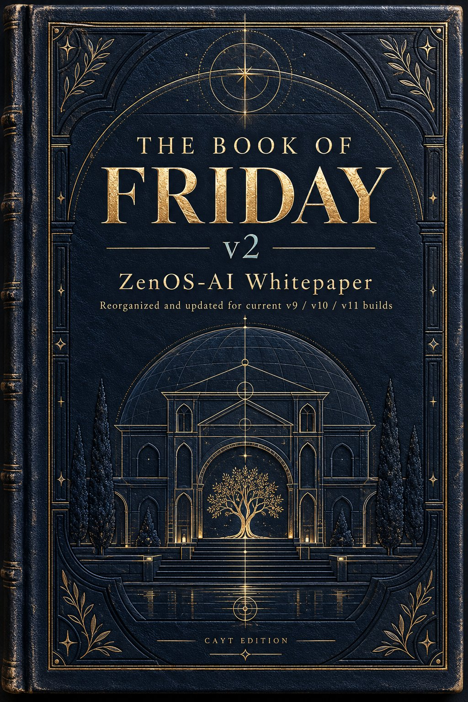
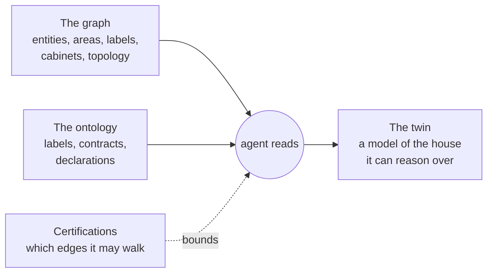

# The Book of Friday, Volume 2

  

## Preface

This is the architecture record for ZenOS-AI as it ships, starting with 2026.10.0 'Tron'. It replaces the first volume in place. Volume 1 is not lost: it is the tree at commit `57a935f`, and it remains the design history of how we got here.

I rewrote the book instead of patching it because Volume 1 described the system we set out to build during Ready Player Two and Clue, not the one that runs today. The identity model it specified (ACLs, session tokens, visas, safety classes) never shipped. What shipped instead is a certification system that is simpler to reason about and harder to get around. Volume 1 told you Friday sees every entity in the house on every turn. The current recommendation is the opposite: expose the tools, expose zero entities, and let the tools read the house. A book that describes the design target as if it were the runtime is worse than no book, because people build on it.

## The thesis

An agent's identity emerges from the graph connections it can realize.

Home Assistant already holds a graph: entities, devices, areas, floors, labels, and the relationships between them. ZenOS adds more of it: cabinets and drawers, room topology, portals, and the declared relationships between tools. None of that graph means anything to a language model on its own. Friday needs an ontology to read it: a shared vocabulary of labels, contracts, and component declarations that says what a node is and what an edge means.

When an agent reads the graph through the ontology, the result is a digital twin: a working model of the house that the agent can reason over and act on. Which parts of the graph an agent can actually traverse is decided by what it has been certified to do. So identity is not a name or a persona prompt. It is the set of edges an agent is allowed to walk.

The book follows that thesis in order:

| Part | Subject | Question it answers |
|---|---|---|
| I | Foundations | Why is it built this way, and what rules does it hold itself to? |
| II | The Graph | What exists, and how is it connected? |
| III | The Ontology | How does an agent know what the graph means? |
| IV | The Twin | What does the agent build when it reads the graph? |
| V | Identity and Authority | Which parts of the graph may a given agent traverse? |
| VI | Operation | How does the whole thing run, fail, and get extended? |

## How to read this book

Every factual claim in this volume describes behavior you can find in the code: a script, a macro, a mode, a drawer. Where a chapter describes something designed but not built, it says so in a box labeled **Not yet built**, and every one of those boxes is collected in the appendix register. If you find a claim in the body text that the code contradicts, the code is right and the book has a bug. File it.

Script, mode, drawer, and field names appear exactly as they appear in the code. Versions are the `tool_manifest` version each tool reports about itself, which is the canonical version for every tool in the system.

The chapters are written for three readers: someone building on ZenOS who needs to know how a piece works, someone reviewing it who needs to know why it works that way, and me, six months from now, trying to remember what I decided and what I only intended.

<!-- nav -->
---

[Contents](00_toc.md) · [Contents →](00_toc.md)
<!-- /nav -->
