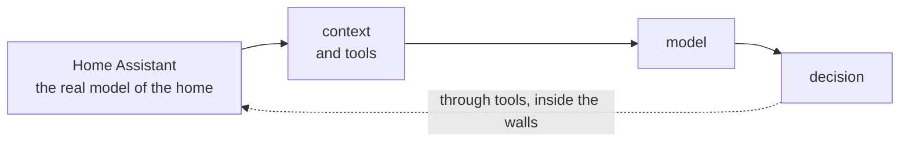

# 1. The Box and the Scrapbook

Before any of the mechanics, the question the rest of this book answers: why is ZenOS built this way at all?

It starts with the most common complaint about AI in the home. Someone asks it a question about their house, it answers confidently and wrong, they ask again, and it is wrong again in a new way. The conclusion people draw is that the AI is broken. Usually it is not. It was given nothing to work with, and it filled the silence.

## 1.1 What AI is for

Most of what a smart home does is not AI and should not become AI. Home automation is deterministic rules operating on data: when this sensor reads that, do this. Keep the deterministic parts deterministic. Your leak shutoff should not need an LLM to decide whether water is wet.

A model earns its place on the questions rules cannot express. "It seems unusually quiet downstairs. Is everyone probably gone?" There is no single sensor for that. The answer is a judgment across motion, doors, media, presence, and time of day, and judgment across messy evidence is what a language model is actually good at.

But a model does not know your house. It does not know that it is 78°F upstairs, that the garage door has been open for an hour, or that one room is a nursery. Home Assistant already holds that model of the home: entities, devices, areas, states, history, events. The AI adds capability around it. So the useful system is not "ask the model." It is:

Everything interesting happens in the middle box. That is where ZenOS lives.

## 1.2 The box

The software around the model is its harness. The harness decides what the model can see and what it is allowed to do. The model does not act on the house directly. It asks the harness to call a tool, the harness validates the request, performs it, and hands back the result.

That makes the harness the security boundary. The model can be extremely intelligent and it still cannot walk through a door the harness did not give it. It also means the harness decides the difference between an AI that uses the house and one that works on the house, and those two should not automatically hold the same keys.

This is the box. Most setups build only the box: expose the entities, point a model at them, hit the easy button, and expect answers to fall out.

## 1.3 The scrapbook

Context is what the model can see right now. Memory is how the system makes useful information available again later. They are not the same thing, and a box provides neither on its own.

You cannot drop a box at grandma's feet and expect her to know what she has. Handing a model four thousand raw entities is exactly that: everything is technically there, and none of it means anything. What grandma needs is a scrapbook. Someone has already gone through the box, put things in order, labeled them, written down what matters and why, and kept it current.

That is the whole design principle. **You must build a box and a scrapbook.** The box decides what the agent can do. The scrapbook decides what the agent can understand.

## 1.4 Where this book puts them

| | What it is in ZenOS | Where |
|---|---|---|
| The house | Home Assistant's graph, extended with cabinets, labels, and topology | Part II |
| The box | Tools instead of entities, contracts, and certification deciding which tools an agent may use | Chapters 9, 11, Part V |
| The scrapbook | Labels as vocabulary, cabinets as memory, Katas as summaries, and the prompt frame that assembles them | Parts III and IV |

In the language of the preface: the scrapbook is the ontology plus the twin, and the box is what decides which edges of the graph an agent may walk. The rest of this part explains why the scrapbook works (Chapter 2) and what it turned out to be (Chapter 3).

---

*Sources: "So You Want to AI in Home Assistant", chapters 1 through 3, on the Home Assistant community forum ([thread](https://community.home-assistant.io/t/so-you-want-to-ai-in-home-assistant/1021777)); "A general problem with AI" ([post](https://community.home-assistant.io/t/a-general-problem-with-ai/1026421/6)); "Friday's Party" ([thread](https://community.home-assistant.io/t/fridays-party-creating-a-private-agentic-ai-using-voice-assistant-tools/855862)).*

<!-- nav -->
---

[← Contents](00_toc.md) · [Contents](00_toc.md) · [The Sand Dune and the Plinko Board →](02_the_sand_dune_and_the_plinko_board.md)
<!-- /nav -->
