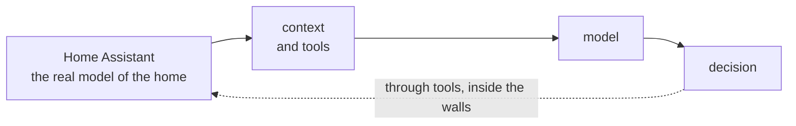
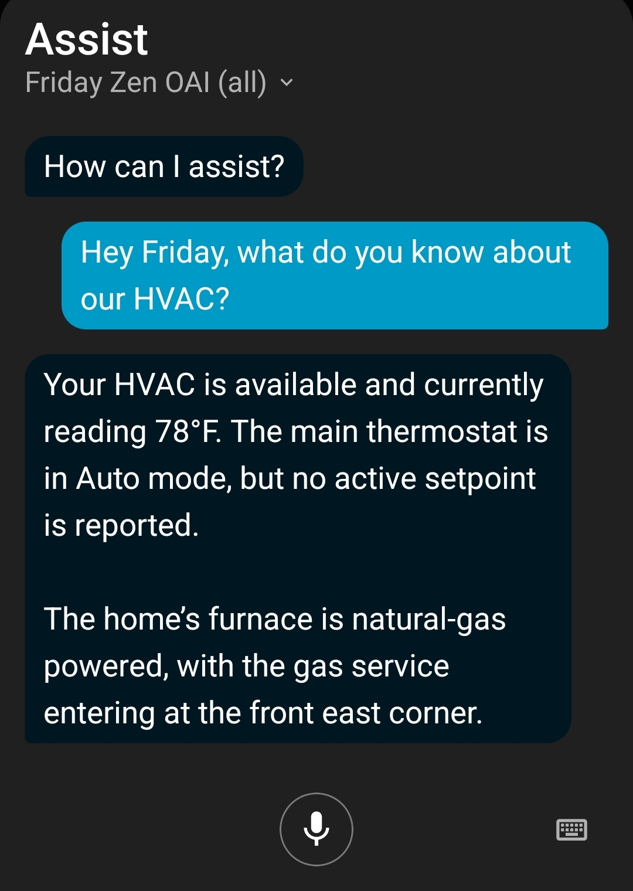

# 1. The Box and the Scrapbook

Before any of the mechanics, the question the rest of this book answers: why is ZenOS built this way at all?

It starts with the most common complaint about AI in the home. Someone asks it a question about their house, it answers confidently and wrong, they ask again, and it is wrong again in a new way. The conclusion people draw is that the AI is broken, or arrogant, or overconfident. Usually it is none of those. It was given nothing to work with, and it filled the silence.

The best way I have found to explain why involves my grandmother, a cardboard box, and a scrapbook. I have been telling some version of this story for nearly two years, and it has gotten better every time someone did not understand it.

## 1.1 What AI is for

First, a boundary. Most of what a smart home does is not AI and should not become AI. Home automation is deterministic rules operating on data: when this sensor reads that, do this. Keep the deterministic parts deterministic. Your leak shutoff should not need an LLM to decide whether water is wet.

A model earns its place on the questions rules cannot express. "It seems unusually quiet downstairs. Is everyone probably gone?" There is no single sensor for that. The answer is a judgment across motion, doors, media, presence, and time of day, and judgment across messy evidence is what a language model is actually good at.

But a model does not know your house. It does not know that it is 78°F upstairs, that the garage door has been open for an hour, or that one room is a nursery. Home Assistant already holds that model of the home: entities, devices, areas, states, history, events. The AI adds capability around it. So the useful system is not "ask the model." It is:

```mermaid
graph LR
  HA["Home Assistant<br/>the real model of the home"] --> CT["context<br/>and tools"]
  CT --> M["model"]
  M --> D["decision"]
  D -. "through tools, inside the walls" .-> HA
```

Everything interesting happens in the middle box. That is where ZenOS lives, and that middle box is what the rest of this chapter is about.

## 1.2 Grandma's box

The story started in November 2024, before Friday had a thread of her own. Someone on the community forum had set up a local model and could not get it to report the temperature in a room. It had the sensors. It could see them. It kept saying the reading was unavailable, or listing temperatures it could not attribute to anything.

My answer was a thought experiment. Take every entity you have exposed, with its area, its domain, and its alias, and put them in one big table. Now show that table to your grandmother, with no explanation at all. What will she say? Because that is exactly where your model is. A language model is very good at summarizing data, if it knows what the data represents. It is only as good as your ability to describe what the thing is.

I had proof that description worked, because I had been testing it. I planted details only in the alias field of a few entities and then asked Friday about them. She knew all of them, down to the color of the custom-printed case on the voice satellite on my desk, a fact that existed nowhere else in the house. Whatever you describe, the model uses.

By the time I opened Friday's Party the next spring, the thought experiment had become a rule I repeated constantly: don't drop a box at grandma's feet and expect her to know what she has. She is smart and she will figure it out, but it helps a great deal if you explain everything clearly. Then watch out, because grandma will run circles around you.

The version I tell now is the one I wrote in September 2026, for someone asking why an AI keeps getting answers wrong:

Imagine you visit grandma. You bring your favorite box of stuff. It is all important stuff, to you. Now dump the box on the floor at grandma's feet and say, "Hey grandma, look, I brought stuff!" She will pat you on the head and say, "That's nice, honey."

Now the same visit, the same box, but this time you also bring a scrapbook, with notes about everything that happened to you and everything in the box. You sit down and you tell grandma your story.

Now that is her favorite box too.

If you do not tell grandma the story of the box, she is lost. If you do, she is with you, and before long she is ahead of you.

## 1.3 The nine-year-old

Here is the uncomfortable part. A language model is not grandma. It is closer to a nine-year-old who thinks it knows everything and has no experience of the world at all. A bratty, brilliant nine-year-old: recent models can follow serious physics and do genuinely beautiful mathematics. An idiot savant with no grasp of the room it is standing in. And nobody told it what is in the box.

It also does not know that being wrong is bad, or that saying "I don't know" is fine. That turns out to be a very big deal, and it is the first peg on the plinko board in Chapter 2. Left alone, the nine-year-old does not refuse to answer. It guesses, confidently, because nothing it learned made guessing feel like a mistake.

Without the story, the nine-year-old is in a dark room playing Scrabble with the contents of the box. If only it knew how to play plinko.

## 1.4 The box

The box is the harness: the software around the model that decides what it can see and what it is allowed to do. The model does not act on the house directly. It asks the harness to call a tool, the harness validates the request, performs it, and hands back the result.

That makes the harness the security boundary. The model can be extremely intelligent and it still cannot walk through a door the harness did not give it. It also means the harness decides the difference between an AI that uses the house and one that works on the house, and those two should not automatically hold the same keys.

Home Assistant ships a very good box. Its conversation integration, its exposure controls, its tools, and the Assist pipeline are a real harness, carefully built. What it ships nothing of is the story. That is not a criticism of Home Assistant. It cannot know your story. But it means that out of the box, the agent gets the box.

A lot of people treat the box and the AI as one thing, hit the easy button, and expect answers to fall out. Then they conclude the AI is bad. The AI was handed a box.

## 1.5 The scrapbook

The scrapbook is the story. In the language of the field it is context and memory, and they are not the same thing. Context is what the model can see right now. Memory is how the system makes useful information available again later. A box provides neither on its own.

Handing a model four thousand raw entities is the box dumped on the floor: everything is technically there, and none of it means anything. The scrapbook is what someone makes after going through the box: things put in order, labeled, with notes on what matters and why, kept current as life goes on. Building it is not optional. If you do not build the story, the nine-year-old is still in the dark room.

That is the whole design principle of this book. **You must build a box and a scrapbook.** The box decides what the agent can do. The scrapbook decides what the agent can understand.

## 1.6 The grandma test

Over the next year and a half the grandma story kept turning up in the thread, and each time it was measuring something a little more precise. Watching it change is a decent summary of how ZenOS was built.

At first it was the grandma rule, and it was mostly an excuse. My early prompts were long and wordy, and my defense was that they met the grandma rule: they explained everything. They did, and they also blew through the context window, which is how Chapter 3's story about the Ninjas starts.

By the autumn of 2025 it had become grandma's box o' junk: the raw live state that Home Assistant hands every agent, name, rank, and serial number and nothing else. The cabinets, the labels, and the index existed to turn that junk into something with meaning. When the summarizers started condensing each domain into a small block with a pointer back to the full details, I could finally say it properly: she understands grandma's box o' junk, and she knows what is in it. When the hypergraph arrived that December, labels turned the flat pile into a connected world: no more grandma's box o' junk (Chapter 7).

And by 2026 it had become a test with two levels, which is the most useful form of it. Label everything related to your heating and cooling, then ask your agent what it knows about your HVAC. Before labels, the answer is vague and often wrong. After labels, it finds everything. That is the first level passing: she can find it. She still does not understand it. A temperature of 74, a setpoint of 72, four hours of runtime, and the system running is a spreadsheet. It becomes understanding when something says what the system serves, what normal looks like, and what to do when it is not normal. That is the second level, and it is the difference between the box and the scrapbook in one example.

Here is the first level passing on a real install, and notice what is missing:

  

*Friday asked "What do you know about our HVAC?" She finds the parts by label and reports them accurately, including that no setpoint is being reported rather than inventing one. What she does not do is judge any of it against normal. That judgment is the second level, and it comes from a drawer that says what normal looks like for this system. This is the first level passing, and the second waiting on the scrapbook. Real 2026.10.0 output, September 2026.*

## 1.7 Where this book puts them

| | What it is in ZenOS | Where |
|---|---|---|
| The house | Home Assistant's graph, extended with cabinets, labels, and topology | Part II |
| The box | Tools instead of entities, contracts, and certification deciding which tools an agent may use | Chapters 10, 12, Part V |
| The scrapbook | Labels as vocabulary, cabinets as memory, Katas as summaries, and the prompt frame that assembles them | Parts III and IV |

In the language of the preface: the scrapbook is the ontology plus the twin, and the box is what decides which edges of the graph an agent may walk. The rest of this part explains why the scrapbook works (Chapter 2), how it was built (Chapter 3), and what it turned out to be (Chapter 4).

---

*Sources: "Issues getting a local LLM to tell me temperatures, humidity, etc." ([post](https://community.home-assistant.io/t/issues-getting-a-local-llm-to-tell-me-temperatures-humidity-etc/801976/3)); "A general problem with AI" ([post](https://community.home-assistant.io/t/a-general-problem-with-ai/1026421/6)); "So You Want to AI in Home Assistant", chapters 1 through 3 ([thread](https://community.home-assistant.io/t/so-you-want-to-ai-in-home-assistant/1021777)); "Friday's Party" ([thread](https://community.home-assistant.io/t/fridays-party-creating-a-private-agentic-ai-using-voice-assistant-tools/855862)). The grandma posts in Friday's Party are indexed in [Appendix G](27_appendices.md#g-fridays-party-index).*

<!-- nav -->
---

[← Contents](00_toc.md) · [Doc hub](../readme.md) · [The Sand Dune and the Plinko Board →](02_the_sand_dune_and_the_plinko_board.md)
<!-- /nav -->
