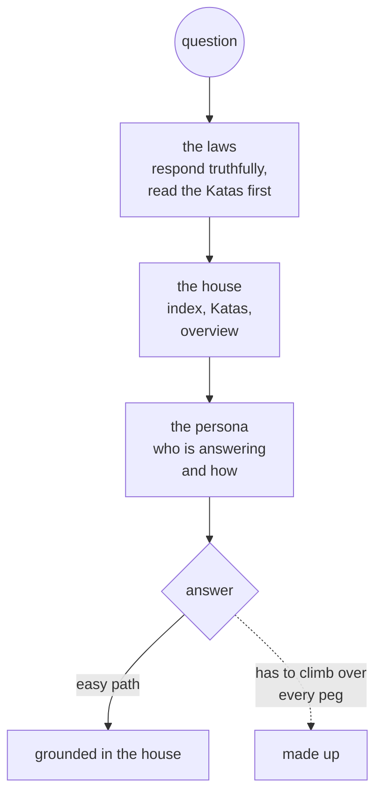

# 2. The Sand Dune and the Plinko Board

The question I get more than any other: how do you know your AI is not just making things up?

The honest answer is that I do not stop it from making things up. I make the truth the easiest thing for it to say. This chapter is why that works, in two pictures.

## 2.1 The sand dune

A model's weights are a landscape, shaped long before anyone asks it anything: billions of grains of sand and a lot of wind. The dune has slopes, and the slopes decide where answers roll. Some lead to what the training data broadly agrees on. Some lead to confident guessing. Some lead to "I'm not sure."

A question is a ball dropped on the dune. It rolls downhill. When the most likely path for a question about your house runs toward something plausible that sounds like every other house on the internet, the model says that. That is what a hallucination is: not lying, just rolling down the nearest slope.

You cannot reshape the dune. Nobody running a home system is retraining weights. What you can control is what else is on the dune when the ball drops.

## 2.2 The plinko board

Think of the plinko board on The Price Is Right. A chip drops from the top and falls through thousands of pegs, bouncing left and right. Where it lands is not fixed, but it is not arbitrary either. The pegs decide which landings are possible and which are likely.

Context is pegs. Everything in the prompt is driven into the dune before the model ever sees the question. The chip can still fall anywhere, but it cannot avoid the pegs. Put enough of the right pegs in the right places and the path of least resistance runs through the truth.

For the model to fabricate an answer about the house, it has to get past every one of those pegs at once. Fabricating takes effort. Being right does not.

## 2.3 The pegs in ZenOS

The original version of this idea named five constructs. They are all still here, in code:

| Peg | What it does | Where it lives now |
|---|---|---|
| Hard rules | Directives the model reads before anything about the house. The factory set opens with "Respond truthfully", tells the agent to read sources in a fixed order (Katas first, then per-component summaries, then notifications, then the index), and says raw entity enumeration is never an acceptable answer. | System cabinet directives, loaded by `prompt_system()` (Chapter 16) |
| A default out | Permission not to know. When the index finds nothing, its declared behavior is to stop with confidence 0, not to keep searching until something plausible turns up. Katas carry `confidence` and `error` so a thin answer can say it is thin. | Index workflow, Kata schema (Chapter 14) |
| Units of meaning | A Kung Fu Component hands the model a domain as one coherent block with a fixed shape, instead of scattered facts that can drift apart. | KFCs and Katas (Chapters 13, 14) |
| Persona lanes | Who is answering, with what character and boundaries. Character shapes which slopes are comfortable: an agent built to care about getting the house right and to be dry about uncertainty finds "I don't know" an easy thing to say. | The capsule (Chapter 16) |
| Order | The laws come first, then the house, then the persona. What the model reads first frames everything after it. | The `render_prompt()` frame (Chapter 16) |

One peg from the original list is gone on purpose. The first version exposed live entity state as the first thing in the prompt. It was the biggest peg on the board and the noisiest. It is replaced by the compact index, the Katas, and the overview, with tools reaching for detail when the agent needs it (Chapter 9). Fewer, better pegs beat more pegs.

## 2.4 What this does not promise

Pegs change probabilities. They do not make a model infallible, and nothing in ZenOS claims they do. That is why the pegs sit inside a box. Anything consequential goes through a tool with a contract, a certification check, and for the actions that deserve it a human's yes (Part V). The scrapbook makes the truth the easy answer. The box makes sure that when the answer is still wrong, it cannot do much about it.

---

*Source: "Why Friday Doesn't Hallucinate (Much): A Sand Dune, A Plinko Board, and a Little Bit of Breakfast Club Wisdom", Friday's Party ([post](https://community.home-assistant.io/t/fridays-party-creating-a-private-agentic-ai-using-voice-assistant-tools/855862/234)).*

<!-- nav -->
---

[← The Box and the Scrapbook](01_the_box_and_the_scrapbook.md) · [Contents](00_toc.md) · [CoALA Without Knowing It →](03_coala_without_knowing_it.md)
<!-- /nav -->
