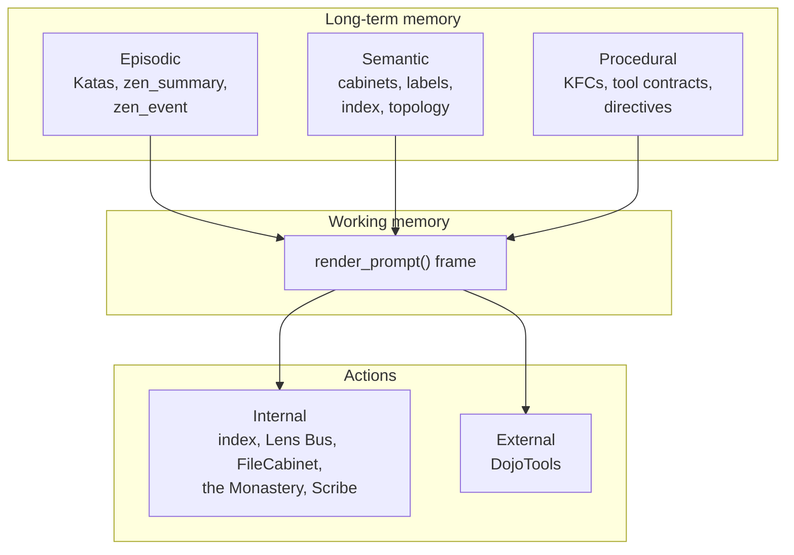

# 3. CoALA Without Knowing It

I did not design ZenOS from a paper. I built it one problem at a time. Friday forgot things, so she got memory. The memory was too big to read every turn, so it got summarized. She could describe the house but not change it, so she got tools. She could change things she should not, so the tools got gates.

Much later I found out the shape I had arrived at already had a name.

## 3.1 CoALA

*Cognitive Architectures for Language Agents* (CoALA) is a framework from Sumers, Yao, Narasimhan, and Griffiths, first published in September 2023 and in Transactions on Machine Learning Research in 2024. It draws on decades of cognitive science and symbolic AI to describe a language agent in three parts:

* **Memory.** Working memory for what the agent is thinking about now, and long-term memory split three ways: episodic (what happened), semantic (what is true about the world), and procedural (how to do things).
* **An action space.** Internal actions that work on memory (retrieval, reasoning, learning) and external actions that ground the agent in its environment.
* **A decision procedure.** A loop that plans (proposing, evaluating, and selecting actions) and then executes.

Friday's Party, the first public write-up of what became ZenOS, started in February 2025. I had not read CoALA. The mapping was noticed in November 2025, in a review of the architecture as it stood then. By that point every part of the framework already had a working counterpart.

## 3.2 The mapping

| CoALA | ZenOS | Where |
|---|---|---|
| Working memory | The prompt frame assembled every turn: identity, directives, manifest, roster, index, Katas, capsule, overview | Chapter 16 |
| Episodic memory | Component Katas and their `events`, `zen_summary`, the `zen_event` stream | Chapters 13, 14, 22 |
| Semantic memory | Cabinets and drawers, the label graph and its index, room topology | Chapters 6, 7, 8 |
| Procedural memory | KFC definitions (how to summarize a domain), tool contracts and manifests (how to use a capability), system directives (how to behave) | Chapters 11, 12, 13 |
| Internal action: retrieval | Index, Library and the Lens Bus, FileCabinet reads | Chapters 6, 7, 12 |
| Internal action: reasoning | The model itself, plus the Monastery's summarizers reasoning over one domain at a time | Chapter 13 |
| Internal action: learning | Writes back into memory: Katas, acknowledgements, cabinet updates, and Scribe publishing a KFC into live procedural memory | Chapters 7, 14 |
| External action: grounding | DojoTools acting on the house through Home Assistant | Chapters 9, 12 |
| Decision procedure | The agent's own tool-use loop in Home Assistant, with the Abbot deciding when background cognition runs | Chapter 21 |

> **Not yet built.** Episodic memory today is short-horizon: each Kata covers its current period, and older detail is summarized away. The history cabinet is the planned long-term episodic store. History cabinets are already provisioned and health-checked. Using them as lasting episodic memory is the planned part.

The code even uses the vocabulary without meaning to. The certificate that gates Scribe's KFC publishing describes itself as writing into Friday's live procedural memory.

## 3.3 Where ZenOS differs

**Memory is maintained, not only retrieved.** CoALA describes agents reading from and writing to memory during their own decision cycles. ZenOS also runs a separate background loop whose only job is keeping memory current: the Monastery summarizes every domain on a schedule, whether anyone is talking to Friday or not (Part IV). By the time the agent wakes, its episodic memory is already written.

**The planner is the model.** ZenOS does not implement CoALA's explicit propose, evaluate, and select planning stage. That is left to the model's own tool-use loop. What ZenOS controls is what that loop can see (the frame) and what it can reach (the tools).

**Execution has an authority layer.** CoALA's decision procedure chooses an action and executes it. It says little about whether this agent should be allowed to take that action at all. In ZenOS that question is a whole part of the book: certification, scope, and a live human acknowledgement stand between a chosen action and its execution (Part V). This is the piece CoALA does not have, and it is where the thesis of this book comes from. The graph an agent may traverse is who that agent is.

## 3.4 What the convergence means

Two efforts starting from different places, a cognitive science framework and a home system built by fixing whatever broke next, ended up with the same memory split, the same internal and external action division, and the same loop. I do not think that is coincidence. The problem has a shape. An agent that has to live in a real environment for months, stay grounded, and not forget ends up needing working memory, the three kinds of long-term memory, and a clean line between thinking and acting. Anything that solves the problem seriously is pushed toward that shape.

The part ZenOS adds, authority as graph traversal, is what the problem looks like once the environment is someone's home.

---

*Reference: Theodore R. Sumers, Shunyu Yao, Karthik Narasimhan, Thomas L. Griffiths. "Cognitive Architectures for Language Agents." Transactions on Machine Learning Research, 2024. [arXiv:2309.02427](https://arxiv.org/abs/2309.02427). The earlier mapping is in [the cognitive architectures whitepaper](../research/whitepaper_cognitive_architectures.md).*

<!-- nav -->
---

[← The Sand Dune and the Plinko Board](02_the_sand_dune_and_the_plinko_board.md) · [Contents](00_toc.md) · [Principles →](04_principles.md)
<!-- /nav -->
