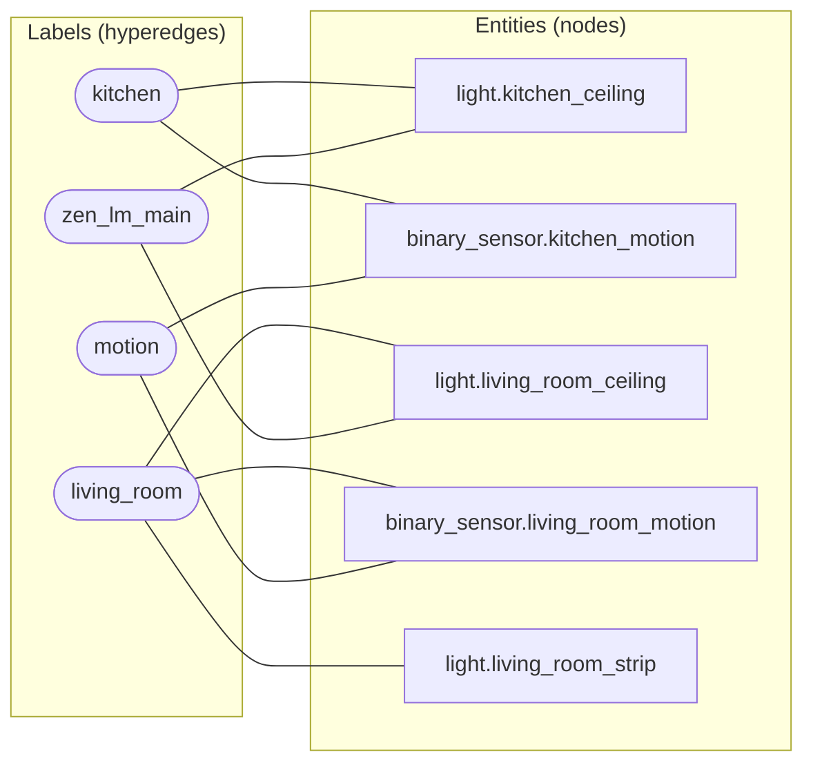
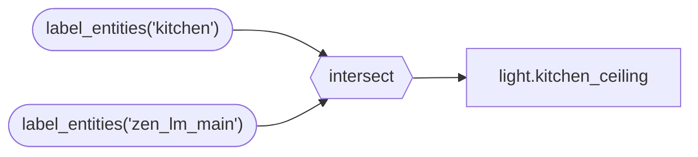

# 3. Labels and the Hypergraph

Chapter 7 describes labels as vocabulary. This chapter describes them as structure: how labels turn Home Assistant's flat list of entities into a graph that tools can query, and why that graph is a hypergraph rather than an ordinary one.

## 3.1 Why a hypergraph

In an ordinary graph an edge connects exactly two nodes. You could model the house that way: the kitchen light is in the kitchen, the kitchen motion sensor is in the kitchen, the kitchen light is a main light. Every fact is a pair.

The trouble is that the useful facts are not pairs. "Main light" is one fact about a set of entities spread across every room. "Kitchen" is one fact about a set of entities of every kind. To say it with pairwise edges you need one edge per member, and a question like "the main lights in rooms that are occupied" becomes a traversal across thousands of edges.

A label is a single edge that connects every entity carrying it, however many there are. That is a hyperedge, and a graph built from hyperedges is a hypergraph.

Four labels describe five entities, and every entity sits in more than one hyperedge. Each label is one fact, not one fact per member.

The payoff is that questions become set algebra. "The main light in the kitchen" is the intersection of two hyperedges. "Every motion sensor not in the kitchen" is a difference. Home Assistant's `label_entities()` returns a hyperedge as a set, and Jinja's `intersect`, `difference`, and `symmetric_difference` filters combine them.

## 3.2 Three tools over the graph

Three DojoTools read the graph, and all three live in `dojotools_index.yaml`. They share one file and one version, 5.1.0.

| Tool | Question it answers |
|---|---|
| `zen_dojotools_index` | Which entities does this combination of labels reach, and what surrounds them? |
| `zen_dojotools_query` (ZQ-1) | Which entities match these deterministic filters? |
| `zen_dojotools_inspect` | What exactly is this entity, area, floor, or device, right now? |

### Index

Index is the hypergraph reasoner. It takes two operands, each a label (`label_1`, `label_2`) or an explicit entity list (`entities_1`), and an `operator`: `AND`, `OR`, `NOT`, or `XOR`. It resolves each operand to a set, applies the operator, and returns the result along with its adjacency: the other labels that co-occur on the result. Adjacency is what makes Index a reasoner and not just a filter. Asking for the kitchen's entities also tells you what roles, signals, and systems live there.

With no operands, Index returns the whole label topology, a view of the graph itself. With `expand_entities: true`, it calls Inspect on the result for full detail.

Index protects the agent's context budget. Any call with no explicit `limit` that resolves more than 50 entities is capped at 50 and told to page with `limit` and `offset`. `dry_run` returns the count first, so an agent can size a query before running it. A request for recorder history without a `limit` is a hard error.

Index also reports the one blind spot of label resolution: a label applied to an area but not to any entity in it resolves to nothing, because Home Assistant does not propagate area labels to entities. Index says so instead of returning an empty set that looks like "nobody uses this label."

`mode=build_compact_index` writes `_compact_index`, a capped, ranked summary of the label registry, into the household cabinet. The prompt uses it as Friday's index of what labels exist (Chapter 13). It is rebuilt whenever labels change and on a schedule.

### Query (ZQ-1)

ZQ-1 is the deterministic selector underneath targeting. It takes explicit `target_entities`, or a domain, plus a `filter_json` of conditions (state, attributes, device class, labels, area) that combine with logical AND. The same input always selects the same entities. An unrecognized filter key is ignored by design, and ZQ-1 reports it, so a typo like `domains` for `domain` surfaces as a warning rather than a silent empty result.

### Inspect

Inspect turns identifiers into safe, complete records. For an entity it returns state, timestamps, friendly name, domain, labels, a sanitized attribute map (values reduced to scalars, mappings, or sequences, with stringified structures rehydrated), and whether the entity is eligible for long-term statistics. It also answers area, floor, device, person, and integration questions directly.

When the entity is a cabinet, Inspect returns only the cabinet's header: GUID, version, type flags, validation signature. Drawer contents stay behind FileCabinet (Chapter 4). Reading a cabinet's identity is harmless. Reading its memory is FileCabinet's job.

## 3.3 Resolution rules

Every tool that acts on the house follows the same order to find its targets:

1. An explicit entity ID from the caller, used as given. If it does not exist, the call fails with `not_found`. It is never silently replaced.
2. A role label intersected with a room label (Chapter 7).
3. A tool's own documented fallback chain, where it has one, for example ZenLux's role order within a room.

A tool never guesses an entity ID from a naming convention. The one entity every tool is most tempted to guess, a room's state sensor, is found by intersecting `zen_room_state` with the room's label.
