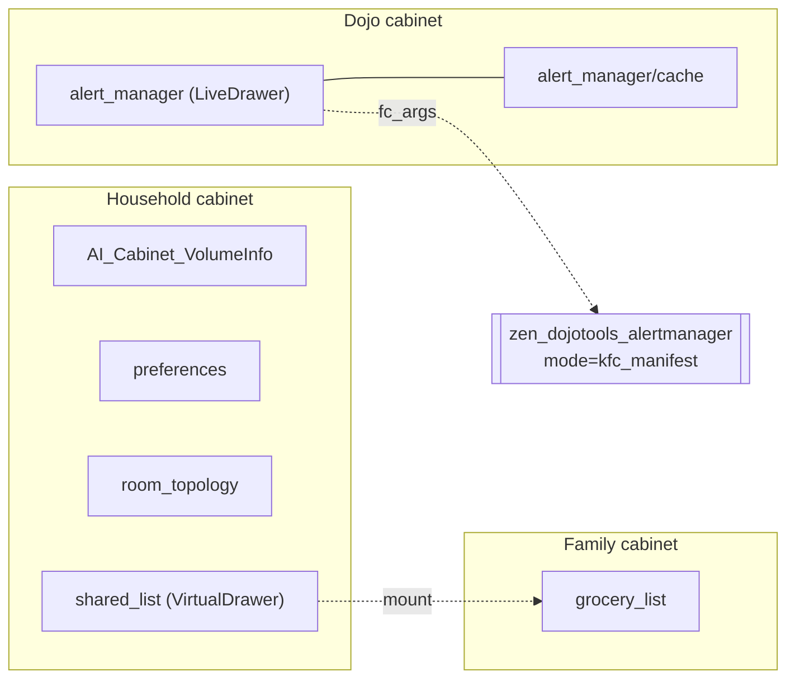

# 4. Cabinets as Graph

Labels describe the house. Cabinets hold what ZenOS itself knows and remembers: identities, preferences, component definitions, summaries, certifications, configuration. This chapter describes cabinets as the second half of the graph, and FileCabinet as the only way to read and write them.

## 4.1 What a cabinet is

A cabinet is a Home Assistant template sensor whose `variables` attribute holds a set of drawers. Each drawer is a key with a value:

```text
{ value: <anything: string, dict, list>, timestamp: <set automatically> }
```

Every cabinet carries a header drawer, `AI_Cabinet_VolumeInfo`: the cabinet's GUID, version, type flags, and a validation signature that marks the sensor as a genuine cabinet rather than any template sensor that happens to have a `variables` attribute. The header is protected. No garbage collector, summarizer, or ordinary write touches it.

Cabinets have types, and types are labels (Chapter 14): household, family, user, AI persona, plus system cabinets for the Dojo (component definitions), the Kata (summaries), and the system itself. Expansion cabinets provide overflow space.

## 4.2 Finding a cabinet: the Highlander resolvers

Code never looks up a cabinet by label at runtime. Each core cabinet (dojo, kata, system, household, family, user, AI persona) has a trigger-based resolver sensor, `sensor.zen_*_cabinet_resolved`, whose state is that cabinet's entity ID. The resolvers update on Home Assistant start, on label changes, and on an explicit `zen_resolver_refresh` event. Every piece of OS code reads cabinet entity IDs from these sensors. There can be only one source of truth per cabinet.

## 4.3 Drawers form a graph

Three things make a cabinet a graph rather than a key-value store.

**Nesting.** A drawer key may contain `/`, and FileCabinet treats it as a path. `recipes/weeknight/tacos` is a child of `recipes/weeknight`. Reading a drawer with children reports them. Moving or deleting a drawer cascades to its children, and a move verifies every child's write at the destination before deleting the source.

**Mounts.** A VirtualDrawer is a mount point: its value names a drawer in another cabinet, and reading it transparently returns the target's value. One drawer can therefore appear in many cabinets without being copied, the same way a filesystem link does.

**Live drawers.** A LiveDrawer is a mount whose target is a tool call. Its value carries `fc_args`: a tool, its parameters, and a cache policy. Reading it calls the tool and caches the result in a `cache` sub-drawer. When the cache is cold, it returns the cached value and marks the read stale. A live drawer is never empty. This is how a KFC definition can live in a tool and still appear in the Dojo cabinet (Chapter 9).



## 4.4 FileCabinet

There are exactly two licensed paths to cabinet data, and they never cross:

| Path | Who uses it | For |
|---|---|---|
| `script.zen_dojotools_filecabinet` | Scripts, automations, agents | Every read and write |
| The CABS macros in `zenos_cabinets.jinja` | Templates, and only inside `zen_sutra_filecabinet` | The terminus's own reads |

`zen_dojotools_filecabinet` is the agent-facing tool. `zen_sutra_filecabinet` is the internal terminus that does the work, and nothing outside it calls it directly. FileCabinet is also the surface for the wiki: `stack=wiki` routes to the Wiki.js sutra instead of a cabinet.

Every write goes through a health-aware pipeline. Before writing, FileCabinet checks that the cabinet is out of `init` (a cabinet with no identity cannot hold data), that the volume is healthy, that the GUID matches, that the cabinet or drawer is not read-only, and that the schema is compatible. Any failure blocks the write unless the caller passes `force_action: true`. The `init` check cannot be forced, and the system cabinet is permanently read-only.

A write reports `write_verified`: whether the value actually persisted when read back. This matters because Home Assistant can accept a write and not persist it, for example when a value exceeds the attribute size it will store. A caller that needs to know the write landed checks `write_verified`, not just `status`.

Reserved drawers (keys beginning with `_`, and the header) are protected from ordinary writes and from garbage collection. `zen_dojotools_filecabinet_gc` removes expired drawers on a schedule and leaves reserved ones alone.

> **Not yet built.** FileCabinet has no certification gate. Because every other part of ZenOS depends on it at boot, gating it needs its own security-class design rather than a bolt-on, and changes to it have to land without breaking a single running install. FileCabinet's single-exit pass, envelope, and certification gate are the scope of 2026.11.0 'This Is Spinal Tap'.
