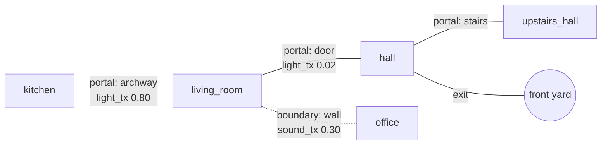

# 8. Spatial Topology

Labels say what a thing is and which room it belongs to. They do not say how rooms relate to each other: which rooms connect, how light and sound cross between them, where the exits are. That structure is the spatial topology, and `zen_dojotools_room_manager` owns it.

This chapter is about the static graph of the house. Chapter 15 covers the live state that runs on top of it.

## 8.1 Rooms, portals, and boundaries

The topology lives in one drawer, `room_topology`, in the household cabinet, with one object per area. Room Manager builds the connections between them:

**Portals** are passable connections between two areas: doors, archways, stairs. `mode=link` writes a portal on both sides at once and derives each room's adjacency list from its portals. Adjacency is never written by hand. A portal can carry a bearing (the compass direction it faces) and transmission values from 0.0 to 1.0 for light and sound: an open archway passes most light, a closed door almost none, a glass door something in between.

**Boundaries** are shared surfaces people cannot pass through: a wall, a partition, a floor and ceiling. `mode=boundary_link` records them with their own sound and light transmission. A boundary is not an edge anyone walks, but it is an edge light and noise cross.

**Exits** mark the ways out of the house, with drop heights where it matters, and feed evacuation routing.

Solid edges are portals: people and signals move along them. The dotted edge is a boundary: sound crosses it, people do not.

## 8.2 What the topology is for

The topology is a graph other tools walk.

**Pathfinding.** `mode=pathfind` runs a breadth-first search between two areas, or between two people's current locations, and returns the route.

**Propagation.** ZenLux's bleed walks portals outward from a room and uses each portal's light transmission to decide whether and how strongly a scene carries into the next room (Chapter 24 covers REFLEX, which is separate). An archway propagates. A closed door does not.

**Emergency.** `mode=emergency` combines topology with live state into a crisis snapshot: exits, safety equipment in each room, hazards, the household rally point, and scenario-specific guidance.

**Context.** `mode=get` returns a room's topology together with live context slices, each requested explicitly with `context_slices`: `+light`, `+climate`, `+covers`, `+media`, `+topo` (open doors and windows), `+appliances`, `+inventory`, `+chores`, `+tasks`, `+calendar`, `+wiki`, `+tickets`. Each slice comes from the domain tool that owns it rather than from Room Manager re-deriving it. A room's `digest` (chores due, tickets open, notifications pending) is always included.

`mode=home_overview` rolls every room up into one whole-house snapshot, which is what the prompt uses for Friday's sense of the house as a whole (Chapter 16).

## 8.3 Rooms find their things by shared labels

Room Manager does not require every to-do list or calendar to be assigned to a room. A list or calendar that carries any label the area also carries is surfaced in that room's `+tasks` or `+calendar` slice automatically. Sharing a label is the assignment. This is the hypergraph from Chapter 6 doing work: two hyperedges that meet on a room make the room's world larger without anyone wiring it.

## 8.4 Structure edits are certified

Changing the shape of the house is gated. Structural modes (`set`, `setup`, `area_create`, `area_update`, `link`, `unlink`, `boundary_link`, `boundary_unlink`, zone and landmark edits) require the `room_topology_edit` certification at level 1, and `area_delete` requires level 2. Reading the topology is open.

<!-- nav -->
---

[← Cabinets as Graph](07_cabinets_as_graph.md) · [Contents](00_toc.md) · [Exposure: Tools, Not Entities →](09_exposure_tools_not_entities.md)
<!-- /nav -->
