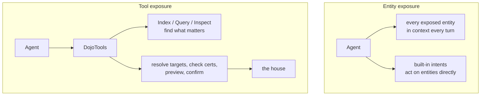

# 9. Exposure: Tools, Not Entities

Everything in Part II describes the graph. This chapter is about how much of it an agent sees directly, and the answer I recommend is: none of it. Expose the tools. Expose zero entities. Let the tools read the house.

That reverses what Volume 1 said. Volume 1 assumed Friday receives the full live state of every entity on every turn, and treated that as a correctness guarantee. In practice it was the most expensive and least safe way to give an agent a house.

## 9.1 Two ways to reach the house

Home Assistant lets a conversation agent reach the house two ways. It can be shown entities directly, through Assist's entity exposure, and act on them with Home Assistant's built-in intents. Or it can be given tools, scripts exposed over MCP or as agent tools, and reach the house only through them.

With entity exposure, the agent carries the house in its context on every turn, and it can act on anything it can see, bypassing whatever rules a tool would have enforced. With tool exposure, the agent asks for what it needs when it needs it, and every action passes through a tool that resolves targets, checks certification, and returns a consistent answer.

## 9.2 Why tools win

**Context.** Every exposed tool's description is resent on every turn, and so is every exposed entity. A hundred tools at around 1,024 characters of description each is roughly 25,600 tokens before the conversation starts. The 2026.10.0 description pass cut agent-facing descriptions to a quarter to a third of their previous size, bringing that to roughly 16,000, by moving detail into `mode=help` (Chapter 11). Removing entity exposure removes another large block entirely. The result is a direct cut to time-to-first-token on every request.

**Safety.** Certification (Chapter 18) only governs actions that go through a gated tool. An entity exposed directly to a built-in intent can be acted on without any certification check at all. An exterior lock exposed as an entity is an exterior lock with no live acknowledgement in front of it. Exposing zero entities is what makes the certification model complete.

**Meaning.** A raw entity list tells the agent that `binary_sensor.kitchen_motion` is `on`. A tool tells it that the kitchen is occupied, which light is the main light, that the room is paused, and that the door is open. The tool reads the graph through the ontology. Raw exposure hands the agent the graph without the ontology and leaves it to guess.

## 9.3 How an agent works with zero entities

The pattern is the same for every task: use Index or Query to find the thing, use Inspect when you need detail, use the domain tool to act on it.

* "Is anyone in the office?" Room Manager `mode=get` for the office.
* "Turn off the lights downstairs." ZenLux, which resolves the downstairs rooms and their lights itself.
* "What's the battery on the back door lock?" Index or Inspect on the lock.

At no point does the agent need an entity exposed. The tools resolve every target from labels (Chapter 6).

## 9.4 What to expose

| Expose | Do not expose |
|---|---|
| Agent-facing `zen_dojotools_*` tools | Entities (none) |
| | AdminTools, Roots, Sutras, Stacks, Codices |
| | Maintenance scripts |

AdminTools stay off the agent surface unless a human deliberately exposes one for recovery (Chapter 19). Each tool's manifest declares whether it is meant to be exposed (`mcp_exposed`), and the getting-started guide carries the current exposure list.

> **Not yet built.** Even with trimmed descriptions, the full tool surface is sent every turn. A tool-search layer that sends a small set of core tools and lets the agent discover the rest on demand would cut this further. That depends on what Home Assistant's own agent integration supports, and it is likely to be the recommended configuration if it becomes available.

<!-- nav -->
---

[← Spatial Topology](08_spatial_topology.md) · [Contents](00_toc.md) · [Vocabulary →](10_vocabulary.md)
<!-- /nav -->
