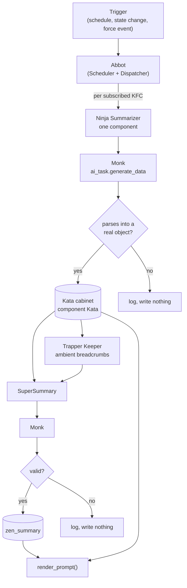

# 10. The Monastery

The twin is not built on every conversation turn. It is kept current in the background by the Monastery: a pipeline that reads each domain of the house through its labels, asks a model to summarize it into a fixed shape, validates the answer, and stores it. When Friday needs to know the state of the house, the summary is already there.

## 10.1 The pipeline

The pieces:

| Piece | What it is |
|---|---|
| Kung Fu Component (KFC) | A domain definition in the Dojo cabinet: what it reads, what triggers it, its tier, its instructions (Chapter 9) |
| Ninja Summarizer | `zen_dojotools_ninja_summarizer`. Produces one component's Kata. |
| Monk | The inference step inside every summarizer: one `ai_task.generate_data` call against the entity `input_text.zenos_ai_task_entity` names |
| Trapper Keeper | An ambient-tier pre-digest that compresses low-urgency components into one-line breadcrumbs |
| SuperSummary | `zen_dojotools_supersummary`. Consolidates everything into `zen_summary`. |
| Abbot | The Scheduler and Dispatcher, deciding when each of the above runs (Chapter 18) |

A Monk is not a separate agent or layer. It is the model call, made once per component and once for the whole-house summary.

## 10.2 Ninja: one component

For one KFC, the Ninja Summarizer:

1. Reads the component definition from the Dojo cabinet.
2. Gathers context. A component with a `seed` or `area_seed` calls a declared tool (for example Room Manager `mode=get` for an area) to get its context. Otherwise it runs an Index call over the component's declared labels. A seed tool must be on the component's whitelist. A call outside it is blocked and logged.
3. Loads the component Kata schema, `kata_template`, and the component's previous Kata for continuity.
4. Builds a prompt: instructions, the schema to fill, an example, the gathered context, and trigger notes.
5. Calls the Monk.
6. Validates the result and writes it to the Kata cabinet under the component's `kata_key` (Chapter 11).
7. Decides whether anything needs to escalate (10.4).

## 10.3 SuperSummary: the whole house

SuperSummary reads every active component's Kata and produces one whole-house summary, `zen_summary`. A component is active if its definition has a `kata_key`, its `meta.enabled` is true or absent, and its Kata exists.

Components are handled by tier:

| Tier | How SuperSummary sees it |
|---|---|
| `keeper` (the default) | Full Kata included |
| `ambient` | Pre-digested by Trapper Keeper into a breadcrumb. Urgency 4 or 5 adds it to the attention list. Urgency 6 or higher promotes it to full inclusion. |
| `system` | Never included as component data. Today the only system-tier component is Trapper Keeper itself, whose output reaches SuperSummary as the ambient index |

Trapper Keeper exists to keep SuperSummary's prompt small. Most components are quiet most of the time, and a quiet component does not need its full Kata in the whole-house prompt. Trapper Keeper hands SuperSummary an index of breadcrumbs with pointers back to the full Katas, and SuperSummary only pulls in what is urgent.

SuperSummary is bounded three ways: a run governor (`super_burnout_seconds`, default 600, so it runs at most once per window unless forced), a context budget (`max_context_tokens`, default 28,000, which drops ambient and system components before keeper ones), and a hard size guard (a prompt over 200,000 bytes aborts).

## 10.4 Escalation

A component Kata can say that something needs action: `action_required`, an `urgency` from 0 to 10, and optionally a `suggested_act_event` naming a tool call that would address it. The Ninja Summarizer routes that three ways.

**Refresh the whole house.** If urgency is at or above the component's `drift_threshold`, it fires `summary_force`, so `zen_summary` reflects the change now rather than at the next scheduled run.

**Act autonomously**, through a gated path. A suggested action is emitted only if all of these hold: the component asserted `action_required`, urgency is at or above the push floor (default 4) or the life-safety threshold, and then three layers pass in order:

1. **Infrastructure deny.** A suggested action that targets the dispatcher or tool router is refused outright and logged as critical. A summary cannot escalate into the routing layer.
2. **Master switch.** `input_boolean.zen_action_emission_enabled` must be on. It is off on a fresh install, and it is operator-only: no agent can write it.
3. **Whitelist.** The specific tool and mode must be on the action whitelist.

**Ask a human.** Anything that needs attention but has no automatable action goes to `zen_dojotools_urgency_handler`, which opens or updates a task (Chapter 18). Before escalating, the summarizer checks `zen_dojotools_alertmanager mode=check_ack` for the component. If a household member has acknowledged the condition, the escalation is suppressed until the acknowledgement expires or is revoked (Chapter 11).

A cooldown per component (`emission_cooldown_minutes`) stops the same condition from escalating repeatedly.

## 10.5 Kill switches

Three switches stop the pipeline, checked master first:

| Switch | Default |
|---|---|
| `input_boolean.zen_summarizers_enabled` (master) | Off on a fresh install |
| `input_boolean.zen_ninja_summarizer_enabled` | On |
| `input_boolean.zen_supersummarizer_enabled` | On |

The master ships off so a new install does not start continuous background inference before its owner has pointed `input_text.zenos_ai_task_entity` at something appropriate. The Ninja Summarizer runs several times an hour, and SuperSummary at least four times an hour, which is why the recommended target is a local model. Turning a switch off changes nothing else. Turning one back on fires the corresponding force event within seconds.
