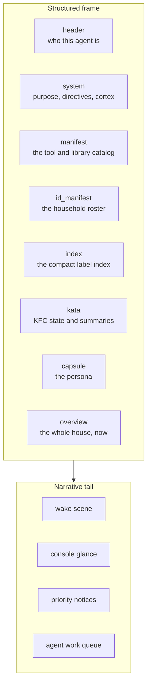

# 13. Context Construction

Everything in Parts II and IV comes together at one point: the moment an agent's prompt is built. This is where the graph, read through the ontology, becomes the twin the agent actually reasons over. It happens in one macro, `render_prompt()` in `custom_templates/zenos_ai/zen_os_1.jinja`, called by the conversation agent's prompt template on every turn.

## 13.1 What the agent receives

`render_prompt()` produces one structured frame, followed by a short narrative tail.

| Section | Source | What it gives the agent |
|---|---|---|
| `header` | `prompt_header()` | The agent's resolved identity |
| `system` | `prompt_system()` | Purpose, directives, and cortex, from the system cabinet |
| `manifest` | `manifest_loader()` | The library manifest: what tools and knowledge exist |
| `id_manifest` | `identity_manifest_loader()` | The household roster (Chapter 14), from the cached manifest drawer |
| `index` | `root_index()` | The compact label index (Chapter 3), with a fallback to the raw label list when the index is stale |
| `kata` | `dojo_loader()` | The mounted Kung Fu Components and their Katas, including `zen_summary` (Chapters 10 and 11) |
| `capsule` | the persona essence | Who the agent is as a persona |
| `overview` | `compact_overview()` | The house right now: presence, active components, home mode, quiet and work hours, room states |

The tail is narrative rather than data: a wake scene built from the persona's essence, a short "glance at the console" line that varies with alert and queue state, the priority-notice block, and the agent's work queue if tickets are waiting for it. The last two are silent, zero tokens, when there is nothing to say.

## 13.2 The twin, section by section

Map the sections back onto the thesis and each one is a different way of reading the graph:

* `index` is the vocabulary: what labels exist and how much they are used.
* `manifest` is the catalog of contracts: what the agent can call.
* `id_manifest` and `header` are the principals: who is here, and who the agent is.
* `kata` and `overview` are the twin itself: what the Monastery has summarized and what Room Manager knows right now.

None of it is raw entity state. The agent receives the house already read through the ontology, and reaches for detail through tools when it needs more (Chapter 6).

## 13.3 Flynn and the fallback

`render_prompt()` checks, before resolving anything, whether it should hand the agent to Flynn instead: the override boolean `input_boolean.zen_flynn_override` is on, the persona is blank, or the persona is explicitly Flynn. If identity resolution itself fails, it falls back the same way.

In Flynn mode, the system section comes from `prompt_system_flynn()`, a hardcoded prompt with no cabinet dependencies, and the expensive data sections are skipped entirely. The capsule carries Flynn's gate status and any active notification instead: which boot gate failed, and why. The agent always gets a working prompt, even on a bare or broken install. When things are broken, what it gets is the one it needs to help fix them.

A persona sensor that is unavailable (not blank, genuinely unavailable) is a different failure, and `render_prompt()` says so as an error instead of pretending it is Flynn.

## 13.4 Keeping it small

The frame is sent on every turn, so every section is built to be small. The index is capped and ranked. The roster is cached. SuperSummary works under a context budget (Chapter 10). Empty tail sections cost nothing. `sensor.zen_prompt_length` reports the size of each section, and `sensor.zen_prompt_health` reports whether the persona's identity is intact, so a prompt that is growing or degrading is visible before it becomes a problem.

For scale: in the reference household (Appendix F), one sampled frame was 49,868 characters. The system section and the Katas were about three quarters of it. The index describing more than a thousand labels was under 5,000.

> **Not yet built.** The frame carries a `session_token` field with a fixed placeholder value. It is not a real session credential and nothing validates it. Real session binding is covered in Chapter 14.
