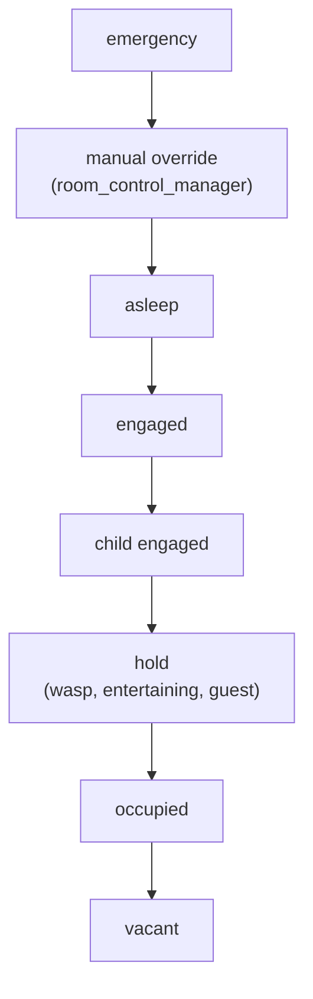
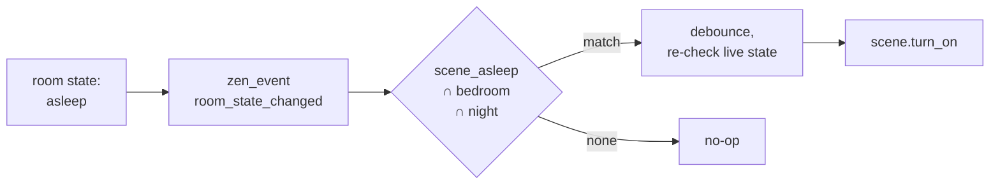

# 15. Live State

The Monastery gives the twin its memory: summaries that are minutes old. Some parts of the twin cannot wait minutes. Whether a room is occupied, whether someone is asleep in it, whether a door has opened: these have to be true now. That live layer is Room Manager v3, and its product is one state per room.

This chapter describes what a room's state means and how it is computed. Chapter 24 is the operational reference: every label, every construct, every edge case.

## 15.1 One state per room

Every deployed room has exactly one state sensor, built from the shared `room_state.yaml` blueprint and found by the `zen_room_state` label. Its state is the room's resolved tier. Its attributes explain it.

The tiers resolve as a cascade. The highest tier with an active source wins:

| Tier | Means |
|---|---|
| `emergency` | A smoke, carbon monoxide, moisture, or siren signal latched. Wins even over a paused room: life safety is never silenced. Cleared only by a human or agent acknowledgement. |
| manual override | Someone deliberately set the room (paused, automation, cleaning, or a specific state) through `room_control_manager`. |
| `asleep` | Someone is asleep here. A device staying active nearby never overrides a real asleep signal. |
| `engaged` | Someone is actively doing something: media playing, a desk in use. |
| `hold` | Presence that cannot be resolved yet, or a deliberate conservative hold. |
| `occupied` | Presence with no specific activity, or a child room that is not vacant. |
| `vacant` | Nothing is true. |

A room's state is what an agent means when it asks whether a room is occupied. It is also what REFLEX acts on (15.4).

## 15.2 Signals come from labels

Nothing is wired per room. The Signal Dispatcher listens for a fixed set of purpose triggers (motion, occupancy, door, lock, media, smoke, carbon monoxide, moisture, siren, button), each scoped to entities that carry the matching label. When one fires, it reads the firing entity's labels, finds the one that is a real area, and that is the room. It then does whatever that class of signal requires for that room: arm the emergency latch, start the room's timer in the right class, check the enclosed-room logic. A new room works the day it is labeled.

This is the hypergraph again (Chapter 6). A motion sensor carries `motion` and its room's label. The intersection of those two hyperedges is the whole routing table.

## 15.3 Time, children, and explanation

**One timer per room.** Presence decays: a room stays occupied for a while after the last motion. Each room that opts in has one `room_timer` and records which tier currently owns it (occupied, engaged, or asleep). A room is never decaying two tiers at once, so one timer is enough. A room without a timer uses live signals only, which is a simpler mode, not a broken one.

**Child rooms cascade up.** An ensuite or sub-room contributes to its parent. A child that is engaged makes the parent engaged. A child in any other active state holds the parent at occupied for as long as it stays active. The one exception: a parent's own direct asleep signal always wins.

**Every state explains itself.** Each tier that can be true carries a `*_last_trigger` attribute naming the entity that most recently caused it, or the timer keeping it alive. `last_trigger` does the same for whichever tier won. "Why does the office say engaged?" has an inspectable answer.

**Manual overrides release themselves.** An override wins over live evidence the moment it is set, and releases on its own when the room's underlying live state changes to something other than what it was when the override was set. Nothing needs to be cleared by hand later.

## 15.4 REFLEX: state becomes effect

REFLEX turns a room's state into action in two stages, deliberately decoupled.

**Stage 1** lives inside every room's state sensor. On a real transition it fires `zen_event` with `kind: room_state_changed`.

**Stage 2** listens for that event and resolves a scene by intersecting three hyperedges: `scene_<state>`, the room's label, and the current home-mode label. If nothing matches with the mode applied, it tries room and state alone. No match is a safe no-op, never a guess.

Scene firing is debounced. After a state change, Stage 2 waits for the transition to settle, re-reads the room's live state, and fires only if it still matches. A room flickering through several states fires one scene, not a burst of whole-room commands across the mesh. The state sensor itself is never debounced: it stays instant and truthful.

REFLEX has two master gates: `reflex_enable` (off by default) and `reflex_dry_run`, which, when REFLEX is enabled, logs what would have fired instead of firing it. A household can rehearse its scenes against real state changes before they touch a light.

A room's live state is the most current part of the twin. The Monastery summarizes the house. Room Manager v3 knows, right now, which rooms are occupied.

<!-- nav -->
---

[← Katas](14_katas.md) · [Contents](00_toc.md) · [Context Construction →](16_context_construction.md)
<!-- /nav -->
