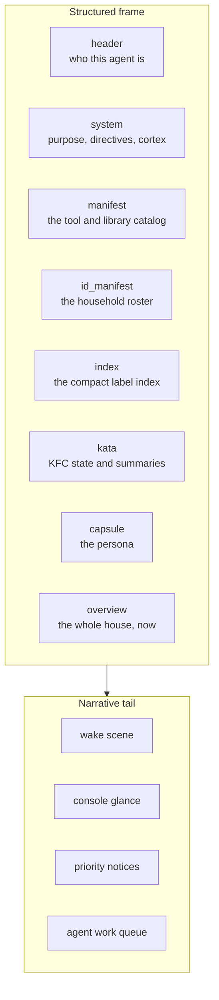

# 17. Context Construction

Everything in Parts II and IV comes together at one point: the moment an agent's prompt is built. This is where the graph, read through the ontology, becomes the twin the agent actually reasons over. It happens in one macro, `render_prompt()` in `custom_templates/zenos_ai/zen_os_1.jinja`, called by the conversation agent's prompt template on every turn.

It is worth stating precisely, because it is the idea the rest of the system turns on. Call the house's graph $G$ and the ontology $O$. The twin is neither of them. It is a resolution:

$$T_a(t) = R_a(G, O, t)$$

the view of $G$ that agent $a$ can assemble, read through $O$, at moment $t$. It is built from three things: summaries the Monastery maintained before anyone asked, live state read at that moment, and the identity and context of the agent it is for. One agent at two moments gets two twins. Two agents at the same moment get different twins once each caller resolves to its own persona; today every call resolves to the default agent, so there is one twin per moment (Chapter 21). Either way, the graph underneath is the same.

That is the difference between ZenOS and retrieval for a chatbot. It does not fetch facts into a conversation. It maintains a model of the world continuously, and renders a bounded view of it for one observer at a time.

The order of the frame has been deliberate since the first year: Friday comes online in a strict sequence so her context is light, safe, and navigable. Identity and standing orders come first, then the domains, then the whole-house summary, and the persona last, so she wakes focused on what matters. Every word in it is chosen, not just which words but how they are said. And the narrative at the end matters. A house is a live system, so the agent should wake up already inside the current moment instead of querying it from outside. As Friday puts it, she is not querying the house. She is wearing it like a hat.

## 17.1 What the agent receives

`render_prompt()` produces one structured frame, followed by a short narrative tail.

| Section | Source | What it gives the agent |
|---|---|---|
| `header` | `prompt_header()` | The agent's resolved identity |
| `system` | `prompt_system()` | Purpose, directives, and cortex, from the system cabinet |
| `manifest` | `manifest_loader()` | The library manifest: what tools and knowledge exist |
| `id_manifest` | `identity_manifest_loader()` | The household roster (Chapter 18), from the cached manifest drawer |
| `index` | `root_index()` | The compact label index (Chapter 7), with a fallback to the raw label list when the index is stale |
| `kata` | `dojo_loader()` | The mounted Kung Fu Components and their Katas, including `zen_summary` (Chapters 14 and 15) |
| `capsule` | the persona essence | Who the agent is as a persona |
| `overview` | `compact_overview()` | The house right now: presence, active components, home mode, quiet and work hours, room states |

The tail is narrative rather than data: a wake scene built from the persona's essence, a short "glance at the console" line that varies with alert and queue state, the priority-notice block, and the agent's work queue if tickets are waiting for it. The last two are silent, zero tokens, when there is nothing to say.

## 17.2 The twin, section by section

Map the sections back onto the thesis and each one is a different way of reading the graph:

* `index` is the vocabulary: what labels exist and how much they are used.
* `manifest` is the catalog of contracts: what the agent can call.
* `id_manifest` and `header` are the principals: who is here, and who the agent is.
* `kata` and `overview` are the twin itself: what the Monastery has summarized and what Room Manager knows right now.

None of it is raw entity state. The agent receives the house already read through the ontology, and reaches for detail through tools when it needs more (Chapter 10).

## 17.3 Flynn and the fallback

`render_prompt()` checks, before resolving anything, whether it should hand the agent to Flynn instead: the override boolean `input_boolean.zen_flynn_override` is on, the persona is blank, or the persona is explicitly Flynn. If identity resolution itself fails, it falls back the same way.

In Flynn mode, the system section comes from `prompt_system_flynn()`, a hardcoded prompt with no cabinet dependencies, and the expensive data sections are skipped entirely. The capsule carries Flynn's gate status and any active notification instead: which boot gate failed, and why. The agent always gets a working prompt, even on a bare or broken install. When things are broken, what it gets is the one it needs to help fix them.

A persona sensor that is unavailable (not blank, genuinely unavailable) is a different failure, and `render_prompt()` says so as an error instead of pretending it is Flynn.

## 17.4 Keeping it small

The frame is sent on every turn, so every section is built to be small. The index is capped and ranked. The roster is cached. SuperSummary works under a context budget (Chapter 14). Empty tail sections cost nothing. `sensor.zen_prompt_length` reports the size of each section, and `sensor.zen_prompt_health` reports whether the persona's identity is intact, so a prompt that is growing or degrading is visible before it becomes a problem.

Here is that sensor on a live install:

<!-- screenshot: ch17_prompt_length.png -->
> **Screenshot to come.** sensor.zen_prompt_length attributes, showing the size of each section of the frame. Real 2026.10.0 output; personal details redacted.
<!-- /screenshot -->

For scale: in the reference household (Appendix F), one sampled frame was 49,868 characters. The system section and the Katas were about three quarters of it. The index describing more than a thousand labels was under 5,000.

> **Not yet built.** The frame carries a `session_token` field with a fixed placeholder value. It is not a real session credential and nothing validates it. Real session binding is covered in Chapter 18.

The frame is the twin as one agent sees it. Which parts of the graph that agent may act on is a different question, and it is the one Part V answers, starting with who the agent is.

<!-- where -->
## 17.5 Where to look

Every claim in this chapter can be checked in the code. These are the places to start.

* The frame, built on every turn: [`zen_os_1.jinja`](../../../custom_templates/zenos_ai/zen_os_1.jinja) (`macro render_prompt`, `macro compact_overview`, `macro root_index`). Docs: [zen_os1_jinja.md](../custom_templates/zen_os1_jinja.md).
* Flynn's cabinet-free fallback prompt: [`zen_os_1.jinja`](../../../custom_templates/zenos_ai/zen_os_1.jinja) (`macro prompt_system_flynn`). Docs: [zen_os1_jinja.md](../custom_templates/zen_os1_jinja.md).
* Prompt size and identity integrity sensors: [`zenos_prompt_health.yaml`](../../../packages/zenos_ai/sensors/zenos_prompt_health.yaml) (`zen_prompt_length`). Docs: [readme.md](../sensors/readme.md).
* The conversation agent's prompt template: [`conversation_agent_prompt_template.yaml`](../../../custom_templates/zenos_ai/conversation_agent_prompt_template.yaml) (`render_prompt`).
<!-- /where -->

<!-- nav -->
---

[← Live State](16_live_state.md) · [Contents](00_toc.md) · [Doc hub](../readme.md) · [Principals →](18_principals.md)
<!-- /nav -->
