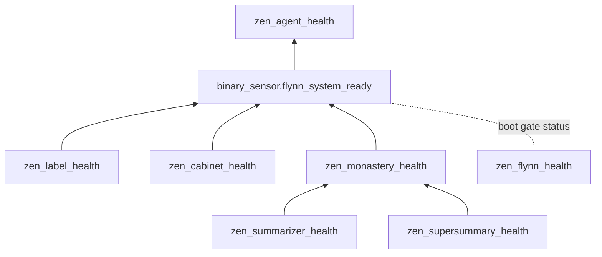

# 19. Resilience

ZenOS treats failure as a normal operating condition. Wi-Fi drops packets, devices reboot, integrations return malformed payloads, models time out, and Home Assistant restarts in the middle of things. A system that assumes ideal conditions misbehaves in real ones. The goal is not to never fail. It is to fail predictably, visibly, and without corrupting what the system knows.

## 19.1 Where failure comes from

| Surface | Typical failure |
|---|---|
| Entity state | `unknown`, `unavailable`, missing attributes |
| Events | Dropped during restarts, duplicated by chatty integrations, arriving out of order |
| Timing | Delayed triggers under load, bursts after a reconnect |
| External integrations | Timeouts, rate limits, malformed responses |
| Inference | Timeouts, malformed output, prose around the JSON, context overflow |
| Cabinets | Unhealthy volumes, headers stored in the wrong shape, oversized values that do not persist |

The rest of this chapter is how each is contained.

## 19.2 Never trust raw state

Every read of Home Assistant state is guarded. `unknown` and `unavailable` are treated as absent, not as values. Attributes are read with defaults. Anything that might be a string holding JSON is checked by type before it is parsed, because `from_json` raises on bad input and one bad string should never crash a tool. Inspect goes further for attributes: it reduces every value to a scalar, mapping, or sequence and rehydrates structures that arrived stringified (Chapter 3).

Cabinet lookups never race. Each core cabinet is resolved once by a Highlander resolver sensor, and every piece of code reads the resolver instead of searching labels at runtime (Chapter 4).

## 19.3 Never write garbage

**Summaries.** A Kata is written only when the model's output parses into a real, non-empty object. Otherwise the failure is logged and the previous Kata stays (Chapter 11). A timeout writes nothing and blocks nothing.

**Cabinets.** FileCabinet checks volume health, identity, read-only flags, and schema before every write, and reports `write_verified` after it, so a write Home Assistant accepted but did not persist is caught (Chapter 4). Moves verify the destination before deleting the source.

**Tools.** A tool with a single exit cannot leave along a path that skipped its checks, and a denial cannot be overwritten by the mode logic that would otherwise run next (Chapter 8).

## 19.4 Contain load

The Scheduler sheds summarizer work under queue pressure by tier and recovers it when the queue drains, and a starvation guard keeps any component from going stale indefinitely (Chapter 18). SuperSummary runs under a run governor, a context budget, and a hard size guard (Chapter 10). Every script declares its concurrency `mode` and `max`. A script that could be called in a burst is queued, never allowed to overlap unboundedly.

A queued script has one failure mode worth designing for: if one run wedges, everything behind it waits. Room Manager carries a watchdog for exactly this: if its queue makes no progress for three minutes, the watchdog cancels the stuck run and emits an event, instead of waiting for someone to notice the house has gone quiet. Its script-level timeout is twice the documented worst-case legitimate runtime, and it records real call durations so that bound can be revisited with evidence.

## 19.5 Degrade into advice

When the Monastery cannot produce fresh summaries (the model is unreachable, runs keep failing, the system just restarted), the previous Katas remain readable, and their own timestamps show how old they are (Chapter 11). Katas carry `confidence`, `urgency`, and `error`, so a degraded summary can be treated as advisory rather than authoritative. An agent that sees stale or low-confidence Katas should say so rather than speak with confidence it does not have.

When identity or boot checks fail, the agent is handed Flynn instead of a broken persona (Chapter 13). The system still answers, and the answer it gives is about what is wrong.

## 19.6 Make failure visible

Failure is only survivable if someone can see it.

**Health sensors are layered, and problems propagate upward:**

`sensor.zen_agent_health` names the blocking gate for each agent and is the first place to look when Friday will not start. Flynn's `current_gate` and `next_step` attributes name the exact boot failure in plain language. `sensor.zen_prompt_health` and `sensor.zen_prompt_length` watch the prompt itself.

**Events carry the rest.** Failures emit `zen_event` kinds (`ninja_failure`, `monk_failure`, `emission_suppressed`, and others). `zen_dojotools_systemtools` provides the health report, the log viewer, and log search, and `zen_dojotools_manifest mode=audit` reports drift between what tools declare and what they do.

**A human debugging path:**

1. Check `sensor.zen_agent_health` and Flynn's gate status.
2. Inspect the entity or tool involved.
3. Read the component's Kata and its `last_run_at`.
4. Search the log for the relevant `zen_event` kind.
5. Check the cabinet drawer for staleness or a failed write.

## 19.7 The rules

1. Never trust raw state without validating it.
2. Never write what failed to validate. Keep the last good value instead.
3. Bound every burst. Recover what was shed.
4. Degrade into advice, never into confident error.
5. Make every failure visible in a sensor, an event, or a response.
6. A human can always reconstruct what happened.
