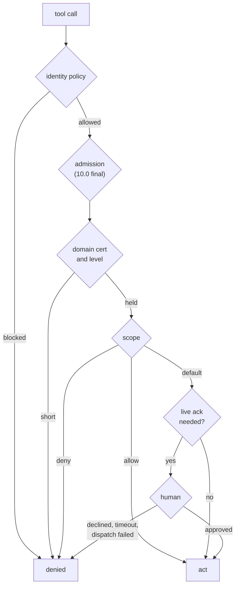

# 19. The Authority Ladder

Chapter 18 describes what a certification is. This chapter describes how authority is layered: what an agent must have before it can act, who can change what an agent has, and where a human stays in the loop no matter what the agent holds.

## 19.1 The rungs

Each rung is necessary, and none substitutes for another.

The administrative plane sits beside this path, not on it: it changes the policy the path reads.

| Rung | What it decides | Where it is enforced | Status |
|---|---|---|---|
| Identity policy | Is this caller's identity acceptable at all? | `resolve_caller_identity`, `sim_mode_allowed` | Built |
| Admission | Is this agent a recognized participant in ZenOS? | Base agent certification | In progress for 2026.10.0 |
| Domain certification | May this agent attempt this class of action? | `required_cert` checks in each tool | Built |
| Scope | Which specific targets does that grant cover or exclude? | `cert_scope_check()` in each tool | Built |
| Live acknowledgement | Does a human approve this specific action, right now? | `request_live_ack` | Built |
| Administrative plane | May this caller change the policy itself? | AdminTools, not agent-exposed | Built as an exposure boundary |

A high rung never implies a lower one. Holding a domain certification does not waive the identity policy. A scope `allow` covers the per-call acknowledgement for named targets, but it cannot turn a blocked identity into an allowed one.

## 19.2 Identity policy

The bottom rung is the whole-install policy on simulated identity (Chapter 17). When `sim_mode_allowed` is false and the caller's identity is simulated, `policy_status` is `blocked`, and every certification check fails regardless of what the agent holds. The policy sits in the household cabinet and the factory writes an explicit value on every install, so no install depends on an in-code default.

## 19.3 Admission

> **Not yet built. In progress for the 2026.10.0 final.** Admission adds a mandatory base certification that an agent must hold just to read the ZenOS tool surface. It authorizes participation only: no domain authority, no actuation, no configuration. Flynn issues it at the successful end of onboarding, and that issuance path is reserved to onboarding rather than exposed as a general grant. Agents created before 2026.10.0 recertify through an onboarding-adjacent path instead of being rebuilt. This section will be rewritten against the code when it lands.

## 19.4 Domain certification

This is the rung Chapter 18 covers in full: the tool declares `required_cert` and a level, `resolve_caller_identity` checks it against the resolved identity, and a shortfall returns a `cert_denial()` response. There are 83 of these checks across the tool surface.

The certification boundary is drawn around consequence, not around how dangerous a tool sounds. The cert-gate audit in 2026.10.0 asked "can this action actually hurt something?" of every tool, and gated things that do not sound dangerous but are: sending mail or a Teams message (disclosure of anything the agent has read), deleting a calendar event or to-do item (irreversible loss), setting Teams presence (misrepresenting a person to their organization), editing the mail whitelist (loosening the disclosure policy itself).

## 19.5 Live acknowledgement

For the actions that deserve it, a certified agent still needs a human's approval, every time. `zen_dojotools_identity mode=request_live_ack` is the single chokepoint:

1. It fires an actionable notification through `zen_dojotools_alertmanager mode=fire`, to Postman by default, with yes and no buttons and `breakthrough: true` so the quiet-hours gate cannot suppress it.
2. It polls `get_response` for the answer.
3. It returns `approved`, `declined`, `timeout`, or `dispatch_failed`. Anything but `approved` denies the action.

The wait defaults to 90 seconds and is capped at 150 in code no matter what the caller passes. A long approval window is an attack surface: the longer a request sits waiting, the better the odds someone approves it without reading it.

The acknowledgement is one-shot. It approves one action. A tool that needs a time-boxed grant writes that grant to its own drawer after an approval, and the grant is that tool's responsibility.

Tools with a per-call acknowledgement tier today:

| Tool | Always asks for |
|---|---|
| `zen_dojotools_locks` | Unlocking an exterior lock |
| `zen_dojotools_covers` | Opening a barrier-class cover (garage door, exterior door, gate) |
| `zen_dojotools_security_manager` | Disarming |
| `zen_dojotools_infra` | Stopping or removing a container |
| `zen_dojotools_labels` | `reset` (no scope waiver available) |
| `zen_admintools_certadmin` | Every grant, revoke, and bundle change |

A scope `allow` entry covers the ask for the named target only (Chapter 18). A `deny` entry refuses the target without asking.

## 19.6 The administrative plane

Changing what an agent is allowed to do is itself an administrative act, and it lives on the other side of an exposure boundary.

`zen_admintools_certadmin` owns every certification write: `cert_req_grant`, `cert_req_revoke`, `cert_bundle_set`, `cert_bundle_remove`, and `cert_list`. It is `mcp_exposed: false`. An agent cannot reach it, directly or indirectly.

The agent-facing `zen_dojotools_persona_editor` has `cert_req_grant`, `cert_req_revoke`, and `cert_list` modes, but they delegate to CertAdmin and forward only the fields persona_editor itself declares. Fields that matter to the administrative plane, such as `waives_live_ack` and `ack_phrase`, are not declared on persona_editor at all, so there is nothing for an agent to pass through even if it tried. The exclusion is structural, not a permission check on top.

A grant must pass, in order:

1. **Catalog check.** The certification must be declared by some tool (`cert_audit`). This catches typos and dead names.
2. **Human in the loop.** Either a live acknowledgement from the household admin, or the console-admin path below.
3. **Write.** The grant is written to the target persona's `zen_ai_certs` drawer.

Revokes and bundle changes also require a live acknowledgement.

### The console-admin path

If the call's own Home Assistant context carries a real logged-in user (`context.user_id` is non-empty), CertAdmin treats that as a human physically at the console and skips the push round-trip for a single-certification grant. Automation-triggered and agent-triggered calls carry no `user_id`, so they cannot take this path. It exists so an install with no working notification target can still grant certifications, from Developer Tools, by a person.

> **Not yet built.** The console-admin path covers single-certification grants only. Bundle grants, revokes, and bundle definition changes still require a live acknowledgement. Extending the console path to bundle grants is planned, since provisioning an agent's full posture is many certifications and a bundle is how that should be done.

AdminTools generally follow the same rule: they are the configuration and recovery plane, not an agent capability, and they are not exposed to conversation agents unless a human deliberately exposes them.

> **Not yet built.** A separate administrative competency certification ("ZenOS Admin Certified, Level X"), admitting an agent to the administrative plane with each AdminTool deciding which functions a given level may use, is design direction for this release line. Today the administrative plane is enforced by exposure (AdminTools are not agent-reachable) and by live acknowledgement, not by an admin certification.

## 19.7 No ambient administrative authority

Domain tools allow narrow, scoped exceptions to the per-call acknowledgement where a controlled exception makes practical sense. The administrative plane allows none. There is no way to tell CertAdmin "this agent does this all the time, stop asking." If unattended administrative behavior is ever genuinely needed, it will get its own narrower, bounded capability, not a propped-open door.

<!-- nav -->
---

[← Certification](18_certification.md) · [Contents](00_toc.md) · [Identity as Traversal →](20_identity_as_traversal.md)
<!-- /nav -->
