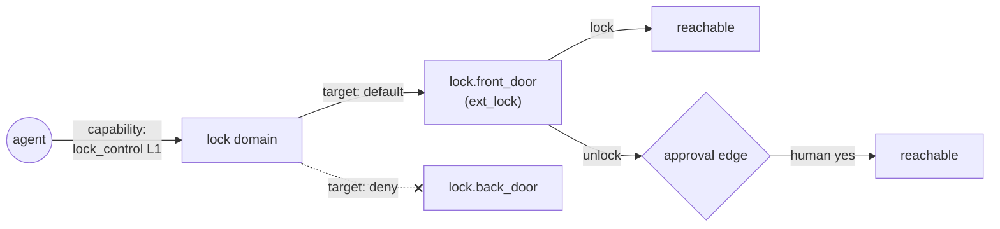

# 21. Identity as Traversal

The preface stated the thesis: an agent's operational identity emerges from the graph connections it can realize. Chapters 18 through 20 described the mechanics. This chapter puts them back together and shows that they are one idea, not four.

This is where the newest idea in the thread lands. The agent is never handed the house. It is handed a resolved version of the house, rebuilt each turn from the systems that actually know it, and bounded by what it is allowed to touch. That is why I turned the label system into a hypergraph with cabinet drawers as nodes in it: the same structure that builds the agent's world decides what it may reach.

## 21.1 The graph an agent walks

Every capability in ZenOS is a walk across the graph. When Friday turns off the kitchen lights, she does not address an entity. She asks ZenLux for the kitchen, and ZenLux walks from the room label to the entities that carry it, to their roles, to their capabilities. When she checks on a room, Room Manager walks from the area to its sensors, its portals, and its neighbors. When the summarizer builds a Kata, it walks from a component's declared labels to the state those labels reach (Chapter 14).

So the question "what can this agent do?" has a precise form: which edges of the graph is it allowed to traverse, and from where?

## 21.2 Four kinds of edge

The mechanics in Part V are each a restriction on a different kind of edge.

| Edge | Question it answers | Mechanism |
|---|---|---|
| Membership | Whose world is this agent part of? | Household and family membership, resolved to depth 2 (Chapter 18) |
| Capability | Which classes of action may it attempt? | Certifications, with dotted names forming a hierarchy (Chapter 19) |
| Target | Which specific nodes does a capability reach, and which are fenced off? | Scope entries: `allow`, `deny`, or not mentioned (Chapter 19) |
| Approval | Does crossing this edge, this time, need a human? | Live acknowledgement (Chapter 20) |

An action happens only if every edge on its path is traversable. An agent certified for `lock_control` at level 1, whose scope denies `lock.back_door`, has a capability edge into the lock domain and a fenced-off target edge to one door. The front door, tagged `ext_lock` as an exterior lock, is reachable for locking. Unlocking it crosses an approval edge, so it needs a human unless that target is explicitly covered. The back door is not reachable at all.

## 21.3 Why this is identity

In most systems identity is a label attached to a caller, and authorization is a lookup keyed by that label. That model breaks down for agents. An agent's name tells you nothing about what it will do, and a persona prompt is advice the model may or may not take.

What does determine an agent's behavior is which parts of the house it can actually reach. Two agents with identical prompts and different certifications are, in every way that matters to the house, different agents. One agent whose certifications change has, in the same sense, become a different agent. The set of traversable edges is the operational definition of who the agent is.

This is also why the certification hierarchy is shaped the way it is. Dotted names (`zenos.media.playback_control` under `zenos.media`) are a tree of capability edges. A broad grant opens a subtree. A narrow grant opens one branch, and because the most specific match wins, a narrow grant can also close part of a subtree a broad grant opened. The shape of the grant is the shape of the reachable graph.

## 21.4 The twin is identity-shaped

Chapter 17 describes the twin: the model of the house an agent builds by reading the graph through the ontology. The traversal view explains why two agents can build different twins of the same house.

Tools resolve targets through labels, and gated tools refuse traversals the caller cannot make. An agent that cannot traverse into the security domain can still be told the house is armed by a summary, but it cannot walk the alarm's zones, and it cannot act on them. Its twin has the node and not the edges. The house is the same. The reachable graph is not.

Here is the difference between knowing and reaching, on a real install:

<!-- screenshot: ch21_node_not_edges.png -->
> **Screenshot to come.** Friday, without security_control, asked whether the alarm is armed and whether she can disarm it. She knows the state from a summary and cannot act on it. Real 2026.10.0 output; personal details redacted.
<!-- /screenshot -->

## 21.5 Everything is a cabinet

Follow the model to its end and the graph an agent walks has only one kind of node. The agent lives in a cabinet. A person's description lives in a cabinet. Households and families are cabinets (Chapter 18). And a cabinet can hold a corpus: a body of knowledge treated as one object, with a description, an owner, and a place in the graph.

Between those objects there are two kinds of connection, and the difference between them is the point.

A **soft link** is a mount: a drawer in one cabinet that points at another (Chapter 8). It connects without conferring anything. It is cheap, it can be made and dropped as context demands, and following one tells an agent where something is, not what it is allowed to do there.

A **hard link** is made through the security layer, and its home is the cabinet's own access control list. Every cabinet header already carries an `acls` block naming its owner and partners (Chapter 18); certifications, scope, and acknowledgement are the hard links that are enforced today. Hard links are the ones that decide what an agent may actually do.

```mermaid
graph LR
  A["agent<br/>(cabinet)"] -- "hard: cabinet ACL" --> C["corpus<br/>(cabinet)"]
  A -. "soft: mount" .-> H["household<br/>(cabinet)"]
  H -- "hard: membership" --> P["person<br/>(cabinet)"]
  H -. "soft: mount" .-> C
```

Two rules keep soft links soft. There is no bypass traverse checking: following a mount into another cabinet grants nothing, so reaching a target through a chain of soft links still requires the right to reach that target, the same as reaching it directly. And security is resolved before a LiveDrawer's target runs: a LiveDrawer is a mount whose target is a tool call, so reading one must never run that tool with authority the reader does not hold.

Seen this way, the four kinds of edge in 21.2 are all hard links of different kinds, and soft links are the fabric that lets context move without letting authority move with it. An agent's identity is the set of hard links it can realize. Soft links carry context. Hard links carry authority.

### Filtering at the source

The last step is to stop checking authority only at the moment of action, and check it at the moment of sight. When FileCabinet resolves security before it returns any drawer, each principal no longer reads one shared graph with rules attached. It reads its own: a subgraph $G_a \subseteq G$ of what it may reach. Every reader downstream of FileCabinet inherits that without knowing it. When the index resolves drawers and their descriptions, drawers the caller cannot reach are not refused; they are not there. Label intersections, hypergraph expansion, and the compact index all shrink to the principal's view on their own, and the twin of Chapter 17 becomes $T_a(t) = R(G_a, O, t)$: built from the agent's own subgraph, not filtered after the fact.

Put plainly: whoever controls the index controls what the agent believes exists. That is the strongest form of the thesis, and it closes the gap 21.6 admits, because the same check that builds an agent's world now bounds it.

Four rules make it hold:

* **Absence is real.** A drawer the caller cannot reach looks exactly like a drawer that does not exist: the same response, the same counts, no dangling reference. A refusal would confirm the thing is there.
* **Derived data inherits its sources.** Katas and summaries are produced as the prime, default agent. Another principal receives a Kata only if it can read the sources it was built from, or has been granted the Kata itself. Otherwise, for that principal, the Kata does not exist.
* **Caches know who they are for.** A cached LiveDrawer result or index result is keyed by caller, or refused.
* **The system sees everything; people can see what was hidden.** Flynn, health, and boot run as the system and default agent, with the whole graph in view. A human at the console is already recognized as present by the certification layer (Chapter 20), and that same console-admin path is how an administrator sees what an agent's view leaves out.

> **Not yet built. In progress.** Filtering at the source is planned and in progress, as part of FileCabinet's certification work. Certifying a corpus as an object is the direction, not the code. Today certifications name a capability and live in the agent's own cabinet; nothing yet issues a certification whose subject is another cabinet, and cabinets themselves have no certification gate until FileCabinet's arrives in 2026.11.0, 'This Is Spinal Tap'. Soft links exist today as mounts, and so does the gap the two rules above close: FileCabinet performs no identity check today, so a mount or LiveDrawer is followed with no traversal check and a LiveDrawer's tool call carries no security resolution of its own. Both rules are part of FileCabinet's certification work in 2026.11.0. Cabinet ACLs exist as structure, with owner and partner entries in every cabinet header, but no tool enforces them yet; the hard links enforced today are certifications, scope, and acknowledgement. Household and family membership is resolved but does not gate anything either (21.6).

## 21.6 Where this is not yet true

> **Not yet built.** Every call currently resolves to the install's default agent (Chapter 18), so today there is one reachable graph per install, shaped by the default agent's certifications. Per-principal traversal, where different sessions resolve to different personas and therefore different reachable graphs, arrives with real session binding. The chokepoint is already in place, so no tool changes when it does.

> **Not yet built.** Membership edges are resolved (to depth 2) but do not yet gate any action on their own. Today a caller's household or family membership does not change what it may traverse. Only certification, scope, and acknowledgement do.

> **Not yet built.** The graph fold that produces an agent's context (Chapter 7) and the traversal rules that decide what it may act on are separate code paths. Computing an agent's claims directly from a fold over the label graph, so the same traversal that builds its world also bounds it, is design direction.

That is the argument of this book, assembled. What remains is how the machine that carries it actually runs, fails, and gets extended, which is Part VI.

<!-- where -->
## 21.7 Where to look

Every claim in this chapter can be checked in the code. These are the places to start.

* Scope decisions returned with every identity answer: [`dojotools_identity.yaml`](../../../packages/zenos_ai/dojotools/dojotools_identity.yaml) (`scope_decision`). Docs: [zen_dojotools_identity_readme.md](../scripts/zen_dojotools_identity_readme.md).
* A capability edge with an approval edge: unlocking an exterior lock: [`dojotools_locks.yaml`](../../../packages/zenos_ai/dojotools/dojotools_locks.yaml) (`ext_lock`). Docs: [zen_dojotools_locks_readme.md](../scripts/zen_dojotools_locks_readme.md).
<!-- /where -->

<!-- nav -->
---

[← The Authority Ladder](20_the_authority_ladder.md) · [Contents](00_toc.md) · [Doc hub](../readme.md) · [The Abbot →](22_the_abbot.md)
<!-- /nav -->
