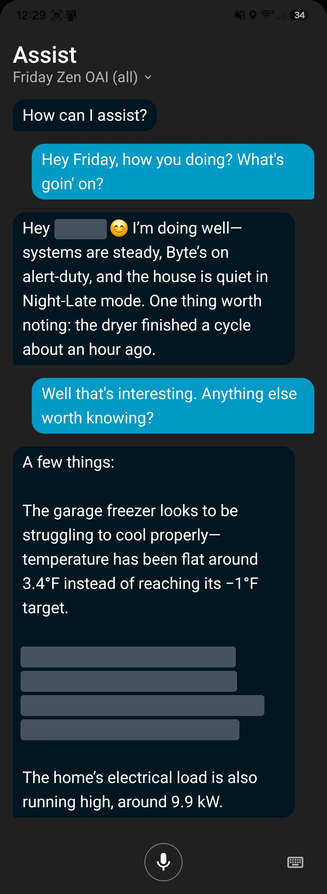

# 26. Findings

I started this to answer a question I could not answer with slides: can you build an agent that actually runs a home, privately, on hardware you own, well enough that it feels less like a chatbot and more like a member of the household? I built it in public, one failure at a time, and wrote down what broke. This chapter is what all of that adds up to.

## 26.1 What we found

**Context beats capability.** The model matters less than what surrounds it. Two models with the same tools behaved completely differently: one made up news stories and the other did not. A frontier model handed a raw house forgot how to turn on a light. A small model inside a well-built harness, grounded by directives, summaries, and a deliberate order, does the job. Most of what people call model quality in a home is harness quality (Chapters 1 and 2).

**Give the model a resolved house, not the house.** Every step toward showing the agent less made it better. Summaries replaced raw component dumps. Room states replaced raw sensors. Tool descriptions came down to a quarter or a third of their former size, with the detail moved behind each tool's help. And when Friday finally ran with zero entities exposed, only tools, she got noticeably faster without getting any less capable (Chapters 10 and 12).

**Memory is maintained, not only retrieved.** An agent that has to go and fetch the state of the house every time it thinks is already behind. The Monastery keeps the twin current in the background, before anyone asks, and it does it cheaply: small local workers, one domain each, fired by triggers. That replaced an hourly cloud pass that cost well over a hundred dollars a month and was staler than what replaced it (Chapters 14 and 15).

**The graph is already there.** Home Assistant holds a far richer model of a home than it presents. Treat labels as hyperedges and a flat pile of entities becomes a connected world that an agent can query by meaning. The ontology does not have to be invented. It has to be written down where the agent can read it (Chapters 7 and 11).

**The shape is convergent.** Built entirely from fixing what broke, ZenOS arrived at the same architectural shape a cognitive science framework describes: working memory, the same taxonomy of long-term memory (with durable episodic memory still being completed), and a clean line between thinking and acting. I did not plan that, which is why I trust it. The problem has a shape, and a serious answer gets pushed toward it (Chapter 4).

**Identity is what an agent can reach.** An agent's name tells you nothing about what it will do, and a persona prompt is advice. What actually determines an agent's behavior in a house is which parts of the graph it can walk. Certification, scope, and live acknowledgement turned out to be one idea: which edges an agent may traverse, and when a human has to say yes. That is the one piece the cognitive architecture literature does not supply, and it is the one a home cannot do without (Part V).

**Restraint is a feature.** The worst failures were the quiet ones: a light that silently did not turn on, a repair that silently erased memory. So the system is built to be loud and to stop. A warning means degraded but safe. Nothing edits production. Anything consequential needs a certificate, and the most consequential things need a person. FileCabinet, the piece everything depends on, gets an entire release to itself rather than a rushed change (Chapters 5 and 23).

## 26.2 The whole book in one breath

A model does not know your house, so you build it a box and a scrapbook. The box decides what it can do. The scrapbook decides what it can understand. The house is already a graph. Labels, contracts, and component declarations are the ontology that lets an agent read it. Reading the graph through the ontology produces a twin, kept current by the Monastery and assembled fresh for every turn. And which parts of that graph an agent may walk is who that agent is.

## 26.3 What is still open

The system is not finished, and the places it is not finished are named in every chapter and collected in Appendix E. The near ones are concrete. Admission, a base certification every agent would need just to use the ZenOS tool surface, is split in two: 2026.10.0 creates it and proves onboarding can mint it, and 2026.11.0 enforces it once FileCabinet security is in place. FileCabinet gets its single exit, envelope, and certification gate in 2026.11.0, 'This Is Spinal Tap'. Real session binding, so that different callers resolve to different personas and different reachable graphs, is the step that turns identity as traversal from one graph per install into one per principal.

The farther ones are research. Long-term episodic memory through the history cabinet is in active development. A fuller self model, with drives, values, and awareness of the agent's own limits, is design direction. So is letting the same traversal that builds an agent's world also compute what it may do.

And there is a larger claim this book deliberately does not make yet, about what it means that a house, read as a hypergraph, behaves this way. That is for a later revision.

## 26.4 What to do with this

**If you are building your own agent,** none of this requires ZenOS. Label everything, because labels are how an agent focuses. Expose tools, not entities, and give every tool a contract that says what it is and when to use it. Summarize before you prompt. Put the laws first, the house second, and the persona last. Let the agent say "I don't know." And put a human on anything you would not want done wrong at three in the morning.

**If you run ZenOS,** run the beta and break it. File what you find: every rule in this book exists because someone did. If you let a model write Home Assistant code, hold it to [HALMark](https://github.com/nathan-curtis/HALMark), because this templating dialect is exactly where models go wrong. The code, the docs, and this book live in [the repository](https://github.com/nathan-curtis/zenos-ai). The conversation lives in the Friday's Party thread.

**If you work on Home Assistant itself,** three things would help every agent builder, not only this one. A tool search layer in the agent integration, so an agent carries a small core of tools and discovers the rest on demand. Exposure controls built for agents, so a household can hand an agent tools without handing it every entity. And per-connection identity through MCP, so the system can know which caller it is talking to and decide what that caller may reach. Home Assistant is already the best state engine a home agent could ask for. Those three would make it the best harness.

## 26.5 Friday

Everything in this book is plumbing: cabinets, labels, summaries, contracts, certificates. None of it is what anyone notices. What they notice is that when they ask Friday about the house, she already knows, she knows why, and she knows what she is and is not allowed to do about it.

This is what that looks like on an ordinary night:

  

*Friday asked "How you doing? What's going on?" She answers from inside the moment, not from a lookup: the house's mode, a finished dryer cycle, and, when asked for more, a freezer running above target, a personal item (redacted here), and the electrical load. The redacted item is the case filtering at the source exists for (Chapter 21): once it lands, a household member's personal information appears only for a principal allowed to read it. Real 2026.10.0 output, September 2026; a name and personal health details redacted.*

That is the whole point. She is not querying the house.

She is wearing it like a hat.

<!-- nav -->
---

[← Room Manager v3 Reference](25_room_manager_v3.md) · [Contents](00_toc.md) · [Doc hub](../readme.md) · [Appendices →](27_appendices.md)
<!-- /nav -->
