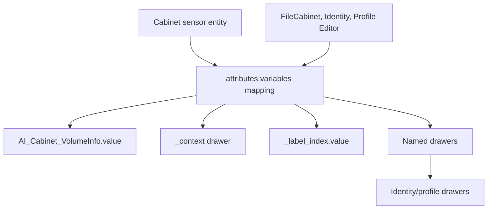

# **ZenOS-AI Cabinet Specification (v1.1)**

*The authoritative structure & validation rules for all Cabinet Volumes in ZenOS-AI.*

---

## **1. Overview**

A **Cabinet** is a structured data volume stored inside a Home Assistant sensor entity.
The sensor’s `attributes.variables` dictionary contains all drawers, metadata, labels, ACLs, and control information that Friday and the Monastery use for reasoning.

The Cabinet is the fundamental unit of storage in ZenOS-AI.

A valid Cabinet is composed of:

* **Metadata VolumeInfo block**
* **Drawers (user- or system-defined)**
* **Label Index**
* **Context block**
* **ACLs**
* **Timestamps and flags**

Everything is managed and normalized by DojoTools.



---

# **2. Top-Level Anatomy**

A Cabinet lives in:

```
states(sensor_id).attributes.variables
```

This `variables` block must be a **mapping** and contains:

| Key                     | Required | Description                                              |
| ----------------------- | -------- | -------------------------------------------------------- |
| `AI_Cabinet_VolumeInfo` | ✅        | Defines the volume identity, validation, schema, flags   |
| `_label_index`          | ✅        | Internal mapping of label → drawers                      |
| `_context`              | ✅        | System-level context produced by summarizers / Monastery |
| *drawer_name*           | optional | Any number of drawers defined by user or system          |
| other `_`-prefixed keys | optional | System internals, timestamps, etc.                       |

---

# **3. AI_Cabinet_VolumeInfo (Required)**

The authoritative metadata block describing a Volume.

```yaml
AI_Cabinet_VolumeInfo:
  value:
    id: "<GUID>"                    # required unique identifier
    schema_version: 1.0             # participates in writeability rules
    validation: "ALLYOURBASEAREBELONGTOUS"
    flags:
      user: true/false
      system: true/false
      family: true/false
      read_only: true/false
    acls:
      owners: [...]
      readers: [...]
```

### **Required fields**

* `value` must exist and be a mapping
* `value.id` must be a non-empty identifier
* `validation` must equal:

  ```
  ALLYOURBASEAREBELONGTOUS
  ```

Without this, the Cabinet is considered invalid and non-operational.

---

# **4. The Label Index (`_label_index`)**

Maintained by the Label Indexer script.

The structure:

```yaml
_label_index:
  value:
    label_slug:
      - drawer_name
      - drawer_name2
    other_label:
      - drawer_name
```

### Rules:

* Top-level key must be `_label_index`
* `.value` **must** be a mapping
* Keys must be **lowercase slugified labels**
* Values must be **lists of drawer names**
* Drawer names must correspond to real drawers in the Cabinet
* Duplicates are pruned automatically

If malformed, read-by-label mode returns `{}`.

---

# **5. Drawers**

A “drawer” is any key in `variables` that:

* does **not** start with `_` or `.`
* is **not** `AI_Cabinet_VolumeInfo`
* is not declared hidden by system rules
* is a mapping containing a `value` field

### Valid Drawer Format:

```yaml
my_drawer:
  value:
    <arbitrary nested object>
  description: "optional"
  mount_point: false/true          # mount drawers have special behavior
  target_entity_id: "optional"
  target_volume_id: "optional"
  timestamp: "ISO 8601"
```

### Drawer Rules:

* Drawer name must be string-safe
* Drawer must be a mapping with a `value` field
* `value` may be a mapping, list, string, number, boolean, or null; profile and identity drawers have stricter mapping shapes
* Drawer can represent settings, lists, user preferences, or mounted references
* `always_hide_drawers` (e.g., VolumeInfo) cannot be read or listed

FileCabinet v4.7+ normalizes writes into drawer wrappers. Treat the wrapper as the storage envelope and the nested `value` as the application payload:

```json
{
  "value": {},
  "timestamp": "2026-05-23T12:00:00-05:00",
  "meta": {
    "entity_labels": []
  }
}
```

---

# **6. Context Block (`_context`)**

System-managed structure used by Friday, the Monastery, and all summarization layers.

Example:

```yaml
_context:
  last_summarized: "2025-11-08T21:15:04.155Z"
  source: "Monastery"
  tags:
    - kitchen
    - energy
```

### Rules:

* Must exist
* Must be a mapping
* Represents high-level “state of the cabinet” and summarizer memory

---

# **7. ACL Structure**

Found here:

```
AI_Cabinet_VolumeInfo.value.acls
```

Format:

```yaml
acls:
  owners:
    - <entity_guid>
    - { entity_guid: "<guid>" }
  readers:
    - <family_guid>
    - { household_guid: "<guid>" }
```

The automation normalizes this shape to:

```json
{
  "owners": ["guid1", "guid2"],
  "readers": ["guid3"]
}
```

### ACL Purpose:

* Access control
* Routing
* Authority chains

Access rights are evaluated by the Monastery and Identity Engine.

---

# **8. Labels & Label Behavior**

Labels applied to the Home Assistant entity via the HA UI flow into:

```
metadata.labels
```

Special labels cause volumes to be excluded unless explicitly requested:

### Hidden labels:

```
hidden_volume
hidden_cabinet
system_volume
system_cabinet
read_only_volume
read_only_cabinet
```

### Exempt labels (always visible):

```
internal
hidden
system
```

These labels also populate the keyspace for `_label_index`.

---

# **9. Hidden & Normalization Logic**

### A drawer is **hidden** if:

* name begins with `_`
* name begins with `.`
* name is in `always_hide_drawers`
* parent volume has unsafe labels and hidden mode is active

### A drawer is **shown** if:

* allowed by visibility rules
* has valid structure
* is not suppressed by skip rules

---

# **10. Valid Cabinet Conditions**

A Cabinet is considered **valid** when:

* `variables` is a mapping
* VolumeInfo block is present and correct
* Validation key matches
* `_label_index.value` exists and is a mapping
* `_context` exists and is a mapping
* Drawers have correct structure
* Schema version is <= controller_schema
* No fatal shape breaks occur

---

# **10.1 Valid Identity Cabinet Shapes**

Identity cabinets are normal cabinets plus role-specific drawers and membership edges. These are the minimum shapes other tools expect.

## Valid Person/User Cabinet

| Requirement | Expected Shape |
|---|---|
| Type label | `zen_user` or `zen_user_cabinet` role label on the cabinet entity |
| VolumeInfo | `AI_Cabinet_VolumeInfo.value.id` non-empty; `flags.user: true` where present |
| Profile drawer | `_user_profile.value` mapping |
| Profile identity | At least one usable display field: `name`, `preferred_name`, or `first_name` |
| Membership | `AI_Cabinet_VolumeInfo.value.default_family_guid` when joined to a family |
| Family ACL | `AI_Cabinet_VolumeInfo.value.acls.family[]` mirrors family membership |
| Presence consent | `_user_profile.value.tracking.gps_zone` / `.room` explicitly true before Identity returns those fields |

Minimal profile payload:

```json
{
  "_user_profile": {
    "value": {
      "name": "Alex Garcia",
      "preferred_name": "Alex",
      "role": "head_of_household",
      "tracking": {
        "gps_zone": false,
        "room": false
      }
    }
  }
}
```

## Valid Family Cabinet

| Requirement | Expected Shape |
|---|---|
| Type label | `zen_family` or family cabinet role label |
| VolumeInfo | Stable GUID, validation string, family flag where present |
| Profile drawer | `_family_profile.value` mapping when named metadata exists |
| Members drawer | `members.value` mapping with `users`, `ai_users`, and `families` lists |
| Principal slots | `AI_Cabinet_VolumeInfo.value.acls.owner` and optional `acls.partner[]` |
| Nesting | Sub-families may appear in `members.families`; security resolution follows depth 2 only |

Minimal members payload:

```json
{
  "members": {
    "value": {
      "users": [],
      "ai_users": [],
      "families": []
    }
  }
}
```

## Valid Household Cabinet

| Requirement | Expected Shape |
|---|---|
| Type label | `zen_household` plus `zen_default_household_cabinet` for the default |
| VolumeInfo | Stable GUID, validation string, household/system flags where present |
| Profile drawer | `_household_profile.value` mapping with household name/address fields as known |
| Members drawer | `members.value.users`, `.ai_users`, `.families` lists |
| Head of Household | `AI_Cabinet_VolumeInfo.value.acls.owner` points to the HoH user cabinet |
| Prime AI | `AI_Cabinet_VolumeInfo.value.acls.partner[]` contains one `role: prime` AI entry |
| Manifest | `zen_identity_manifest.value` is rebuilt after membership changes |

Minimal household profile:

```json
{
  "_household_profile": {
    "value": {
      "household_name": "Garcia House",
      "timezone": "America/Chicago"
    }
  },
  "members": {
    "value": {
      "users": [],
      "ai_users": [],
      "families": []
    }
  }
}
```

## Valid AI User Cabinet

| Requirement | Expected Shape |
|---|---|
| Type label | `zen_ai_user` or `zen_ai_user_cabinet` role label |
| VolumeInfo | Stable GUID, validation string, AI user flag where present |
| Essence drawer | `zenai_essence.value` in three-layer `core / jacket / companion` shape |
| Persona name | `zenai_essence.value.jacket.name` non-empty and not the placeholder |
| Prime/partner links | `AI_Cabinet_VolumeInfo.value.acls.partner[]` for delegation links |

See [Profile Editor](../scripts/zen_dojotools_profile_readme.md) for the canonical writer and [Identity](../scripts/zen_dojotools_identity_readme.md) for membership rules.

---

# **11. Invalid Cabinet Conditions**

A Cabinet is **invalid** if:

* Missing VolumeInfo
* Missing VolumeInfo.value.id
* Wrong validation string
* `_label_index` missing or malformed
* Drawer `.value` is not a mapping
* Critical shapes break JSON parsing
* Schema version too high
* Hidden labels + no override

---

# **12. Example Minimal Valid Cabinet**

```yaml
variables:
  AI_Cabinet_VolumeInfo:
    value:
      id: "cab-123"
      schema_version: 1.0
      validation: "ALLYOURBASEAREBELONGTOUS"
      flags:
        user: true
        read_only: false

  _context:
    last_summarized: "2025-11-09T21:16:14Z"
    source: "Monastery"

  _label_index:
    value:
      primary_user:
        - user_prefs
      system:
        - device_state

  user_prefs:
    value:
      theme: dark
      notifications: true

  device_state:
    value:
      mode: "active"
      timestamp: "2025-11-09T21:10:03Z"
```

---
