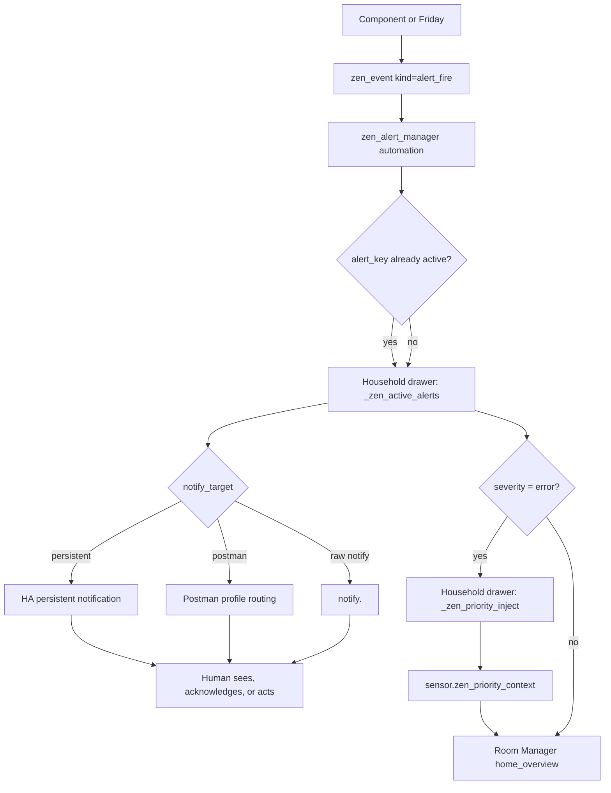
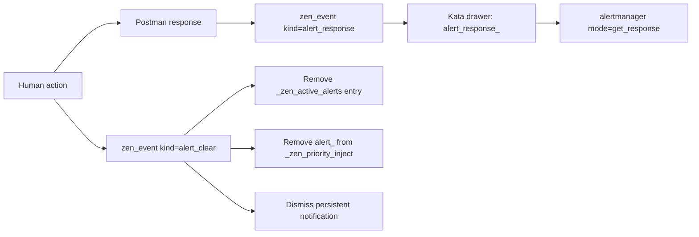

# ZenOS-AI AlertManager

**Version:** 5.1.0
**File:** `dojotools/dojotools_alertmanager.yaml`

**Entities:**
- `automation.zen_alert_manager` — fire/clear handler
- `automation.zen_priority_inject_handler` — priority slot write/clear handler
- `sensor.zen_priority_context` — live priority status sensor
- `script.zen_dojotools_alertmanager` — MCP-exposed CRUD tool (**MCP-exposed**)

---

## Overview

AlertManager is a fire-once alert deduplication and routing system. It prevents notification fatigue by suppressing repeat notifications for the same condition until it clears and recurs, routes alerts by severity to the appropriate channel, and surfaces error-level alerts into the Room Manager `home_overview` priority context.

Key capabilities:

* Fire-once dedup — same `alert_key` never fires twice while active
* Severity tiers: `info` / `warn` / `error` → mapped to urgency and routing
* Auto-escalation of `error` alerts to Room Manager priority inject slot
* Flexible dispatch: persistent HA notification, Postman, or any `notify.*` service
* No setup required — self-bootstrapping on first event

---

## Alert Surface Flow



Fire-once dedup happens before dispatch. A repeated `alert_fire` with the same active `alert_key` updates nothing and sends nothing until the alert clears or expires.

---

## Clear And Acknowledge Flow



Acknowledging a Postman button response and clearing an alert are separate operations. A response records what the human said. A clear removes the active alert and any priority inject provider.

---

## How to Fire an Alert

Emit a `zen_event` HA event:

```yaml
event: zen_event
event_data:
  event:
    kind: alert_fire
    alert_key: unique_slug        # required — used as dedup key and cabinet key
    message: "Human-readable description"   # optional, defaults to alert_key
    severity: warn                # optional — info | warn | error, defaults to warn
    notify_target: persistent     # optional — persistent | mobile | postman
```

### Postman-specific fields

```yaml
    notify_target: postman
    channel_hint: push            # push | tts | teams
    title: "Override Title"       # defaults to severity label (Warning / Error / Notice)
    image_entity: camera.front    # attaches snapshot
    response_type: yes_no         # none | yes_no | yes_no_ignore | ok_cancel | acknowledge
```

---

## How to Clear an Alert

```yaml
event: zen_event
event_data:
  event:
    kind: alert_clear
    alert_key: unique_slug        # must match the fired alert_key
```

Clearing removes the entry from `_zen_active_alerts`, dismisses the persistent notification if one was created, and removes the alert from the priority inject slot.

---

## Severity Levels

| Severity | Postman Urgency | Priority Inject | Default Title |
|----------|----------------|-----------------|---------------|
| `info` | 3 (low) | No | "Notice" |
| `warn` | 5 (medium) | No | "Warning" |
| `error` | 8 (critical) | Yes → `urgency: critical` | "Error" |

Only `error`-severity alerts are auto-wired to the Room Manager priority inject slot. `warn` and `info` appear in `active_alerts[]` in `home_overview` but do not set `priority_context=active`.

---

## Notify Targets

| Value | Behavior |
|-------|---------|
| `persistent` (default) | Creates HA persistent notification |
| `mobile` | Sends via HA mobile app notify service |
| `postman` | Routes via `zen_dojotools_postman` with authority-stack routing. Household/family `postman_profile` policy applied. |

Use `persistent` for first tests and `postman` when profile-based routing is configured.

---

## Dedup Mechanism

State stored in household cabinet drawer `_zen_active_alerts`:

```json
{
  "unique_slug": {
    "fired_at": "2026-05-16T12:00:00",
    "message": "Description",
    "severity": "warn",
    "expires_at": "2026-05-17T12:00:00"
  }
}
```

**Fire:** If `alert_key` already present in drawer → silent no-op. If absent → send notification + write entry.

**Clear:** If `alert_key` present → remove entry + dismiss notification + remove from priority slot. If absent → silent no-op.

This means the same condition can re-alert after it clears. The dedup window is "while the alert is active." By default, `alert_fire` stamps `expires_at` 24 hours in the future; pass `clear_after_minutes: 0` for a permanent alert that requires explicit clear.

---

## Priority Inject Slot

`error`-severity alerts write to household cabinet drawer `_zen_priority_inject`:

```json
{
  "alert_<alert_key>": {
    "summary": "message text",
    "urgency": "critical",
    "expires": "ISO timestamp (60 min from fire)",
    "since": "ISO timestamp",
    "entities": ["up to 3 related entity IDs"]
  }
}
```

Clearing an `error` alert removes it from this drawer.

For alerts, the internal priority provider ID is `alert_<alert_key>`. Users normally do not pass this value to `zen_dojotools_alertmanager`; it is generated when an `error` alert fires and cleared when the alert clears.

### `sensor.zen_priority_context`

Live rollup sensor reading `_zen_priority_inject`:

| Attribute | Description |
|-----------|-------------|
| state | `active` or `clear` |
| `count` | Number of non-expired priority entries |
| `providers` | List of active provider IDs |
| `highest_urgency` | `critical`, `urgent`, or `""` |
| `oldest_since` | ISO timestamp of oldest active entry |

This sensor is the integration point for Room Manager `home_overview`. Its state feeds `signal.all_quiet` and `alerts.priority_context`.

---

## Room Manager Integration

`home_overview` reads AlertManager state and includes:

```json
{
  "alerts": {
    "priority_context": "active|clear",
    "priority_count": 2,
    "highest_urgency": "critical",
    "priority_providers": ["alert_key1"],
    "oldest_since": "2026-05-16T10:00:00",
    "active_alerts": [
      { "key": "alert_key", "message": "...", "severity": "warn", "fired_at": "..." }
    ],
    "active_alert_count": 3
  },
  "signal": {
    "attention": [...],      // fresh alerts < 4h old
    "stale_alerts": [...],   // alerts >= 4h old
    "all_quiet": false       // true only when no fresh alerts AND priority_context=clear
  }
}
```

---

## Cabinet Drawers

| Drawer | Format | Auto-Expire |
|--------|--------|------------|
| `_zen_active_alerts` | `{alert_key: {fired_at, message, severity, expires_at}}` | Default 24h; `clear_after_minutes: 0` disables expiry |
| `_zen_priority_inject` | `{alert_<alert_key>: {summary, urgency, expires, since, entities}}` | Provider expiry, usually 60 minutes for error alerts |

Both drawers are created automatically on first write. The `_` prefix marks them hidden and protected from generic FileCabinet expiry. AlertManager/Core still perform purpose-built TTL cleanup by emitting `alert_clear` for expired alert entries.

---

## Setup Requirements

None. AlertManager is self-bootstrapping.

**Dependencies (must already exist):**
- `sensor.zen_default_household_cabinet_resolved` — household cabinet entity
- `script.zen_dojotools_filecabinet` — drawer read/write
- `script.zen_dojotools_postman` — required only if using `notify_target: postman`

No HA labels, helpers, or input entities required.

---

## Emitting Alerts from Components

Any KFC component can emit alerts. Pattern:

```yaml
- event: zen_event
  event_data:
    event:
      kind: alert_fire
      alert_key: my_component_condition_name
      message: "Describe what went wrong"
      severity: error
      notify_target: persistent
```

And when the condition resolves:

```yaml
- event: zen_event
  event_data:
    event:
      kind: alert_clear
      alert_key: my_component_condition_name
```

Keep `alert_key` stable and unique across all components — it is the dedup key and appears in `home_overview` output.

---

## `zen_dojotools_alertmanager` — MCP Tool

Agent-accessible CRUD interface for AlertManager. Friday can query active alerts, fire, clear, and manage notify policy directly without emitting raw `zen_event` calls.

**MCP-exposed.** Requires a full HA restart to appear in the tool schema on first install (script reload is not sufficient for new script entities).

### Modes

| Mode | What It Does |
|------|-------------|
| `list` | Return all entries in `_zen_active_alerts`: key, message, severity, fired_at, expires_at. |
| `fire` | Fire an alert by key. Queues `alert_fire` event. No-op if key already active (dedup). Returns immediately; state change is async. |
| `clear` | Clear a specific alert by key. Queues `alert_clear` event. Returns immediately. |
| `clear_all` | Clear all active alerts. Returns count of keys cleared. |
| `get_response` | Read the cached ack for a fired alert. Returns `{status: pending}` if the response hasn't arrived yet, or `{status: captured, ack_action, ack_timed_out, ack_device_id}` once captured. |
| `get_policy` | Read the current notify policy from the household cabinet. |
| `set_policy` | Write a new notify policy entry to the household cabinet. |
| `help` | Return full tool contract and field reference. |

**Default:** No input → `mode: help`.

### Inputs

| Field | Required For | Type | Description |
|-------|-------------|------|-------------|
| `mode` | — | string | Operation mode. Default: `help`. |
| `alert_key` | `fire`, `clear` | string | Alert dedup key — must match the key used at fire time. |
| `message` | `fire` | string | Human-readable description of the alert condition. |
| `severity` | `fire` | string | `info` \| `warn` \| `error`. Default: `warn`. |
| `notify_target` | `fire` | string | `persistent` \| `mobile` \| `postman`. Default: `persistent`. |
| `clear_after_minutes` | `fire` | number | TTL in minutes. Default: 1440 (24h). Pass `0` for no auto-expiry. |
| `channel_hint` | `fire` (postman) | string | `push` \| `tts` \| `teams` — used when `notify_target: postman`. |
| `image_entity` | `fire` (postman) | string | Camera or image entity to attach a snapshot. Used when `notify_target: postman`. |
| `response_type` | `fire` (postman) | string | Actionable button preset: `none` \| `yes_no` \| `yes_no_ignore` \| `ok_cancel` \| `acknowledge`. Default: `none`. Used when `notify_target: postman`. Response cached to kata cabinet and emitted as `zen_event(kind: alert_response)`. |
| `label` | `get_policy`, `set_policy` | string | HA label slug. Targets all entities returned by `label_entities()`. |
| `target_entity` | `get_policy`, `set_policy` | string | Single entity ID. Overrides `label`. |
| `policy_json` | `set_policy` | JSON string | Routing override shape: `{notify_target, channel_hint, suppress_minutes}`. |

### Response

All modes return a structured response via `response_variable`. Shape varies by mode.

**`list` response:**
```json
{
  "mode": "list",
  "active_alerts": [
    {"alert_key": "slug", "message": "...", "severity": "warn", "fired_at": "...", "expires_at": "..."}
  ],
  "alert_count": 1
}
```

**`fire` / `clear` response:**
```json
{
  "mode": "fire",
  "alert_key": "slug",
  "severity": "warn",
  "queued": true
}
```

`queued: true` means the event was fired — state change is asynchronous. Call `list` after a moment to confirm.

**`clear_all` response:**
```json
{
  "mode": "clear_all",
  "cleared_count": 3,
  "cleared_keys": ["key1", "key2", "key3"]
}
```

**`get_response` response — pending:**
```json
{
  "mode": "get_response",
  "alert_key": "slug",
  "status": "pending"
}
```

**`get_response` response — captured:**
```json
{
  "mode": "get_response",
  "alert_key": "slug",
  "status": "captured",
  "ack_action": "YES",
  "ack_timed_out": false,
  "ack_device_id": "abc123"
}
```

The response is read from the kata cabinet drawer `alert_response_<alert_key>`. It is written there when `zen_alert_manager` processes the `alert_response` event from Postman. Call `get_response` after firing with `response_type` set — poll until `status: captured` or until `ack_timed_out: true`.

### Notes

- `fire` and `clear` return immediately after queuing the event. The actual `_zen_active_alerts` drawer update happens when the `zen_alert_manager` automation processes the event.
- Policy reads/writes target the household cabinet `_alert_policy` drawer.
- **HA restart required on first install** — `zen_dojotools_alertmanager` is a new script entity that does not appear in the MCP schema after a script reload alone.

---

## Postman Integration

### Ack Lifecycle

When `notify_target: postman` is used with `response_type` set, AlertManager routes the notification through Postman with action buttons and waits for a human response.

Fire the interactive alert:

```yaml
event: zen_event
event_data:
  event:
    kind: alert_fire
    alert_key: freezer_door_open
    message: "Freezer door has been open for 10 minutes"
    severity: warn
    notify_target: postman
    channel_hint: push
    response_type: yes_no
```

AlertManager dispatches via Postman. Postman generates a `pm_tag`, sends the push notification with Yes / No buttons, and logs the dispatch to the kata cabinet `zen_postman_log` drawer (keyed by `pm_tag`).

When the user taps a button, `zen_postman_response_router` processes the ack and emits `zen_event(kind: postman_response)`. AlertManager catches this and writes the response to the kata cabinet drawer `alert_response_<alert_key>`, then emits `zen_event(kind: alert_response)`.

**Poll for the response:**

```yaml
zen_dojotools_alertmanager:
  mode: get_response
  alert_key: freezer_door_open
```

Returns `{status: pending}` while waiting. Once the user responds:

```json
{
  "status": "captured",
  "ack_action": "YES",
  "ack_timed_out": false,
  "ack_device_id": "abc123"
}
```

`ack_timed_out: true` means Postman's `response_timeout_s` elapsed with no tap.

**Remove the log entry after consuming:**

After reading the response, clear the Postman log entry:

```yaml
zen_dojotools_postman:
  mode: clear_tag
  tag: <pm_tag>
```

The `pm_tag` is in the `zen_postman_log` drawer in the kata cabinet. Read it from there after `get_response` returns `status: captured`.

This is the caller's responsibility. GC sweeps clean up orphaned log entries over time, but `clear_tag` is the correct primary path — call it explicitly after consuming.

### open_dashboard Pattern

`open_dashboard: true` on a Postman push injects `homeassistant://navigate/<assist_path>` as the notification's tap target. When the user taps the notification, the companion app opens directly to Friday's dashboard.

`assist_path` is stored in the user's `postman_profile` in their user cabinet. If `assist_path` is not set, the field is omitted and tap behavior falls back to the app default.

This is useful as a follow-up after an alert resolves — send a push that lands the user on the dashboard rather than just a notification:

```yaml
zen_dojotools_postman:
  # ... routing fields ...
  message: "Freezer door is closed. All clear."
  open_dashboard: true
```

`open_dashboard` is a Postman-level field, not an AlertManager field. Fire it as a separate Postman call alongside or after the alert, not as part of `alert_fire`.
