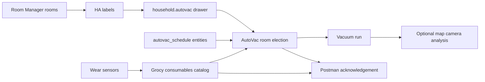
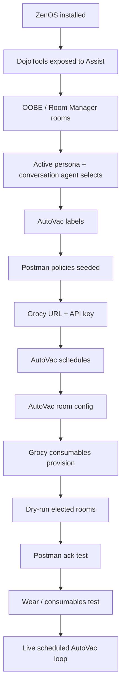

# AutoVac First Setup

*The big integrated example: rooms, labels, schedules, inventory, alerts, and human acknowledgement*

---

## What This Builds

AutoVac is a good first "beast mode" component because it touches almost every part of ZenOS-AI in a visible way:

* Room Manager decides what rooms exist and where the vacuum can operate.
* Labels identify the vacuum, schedules, sensors, and optional map camera.
* AutoVac elects rooms based on readiness, frequency, skip flags, battery, DnD, and water state.
* Camera can analyze the map after the robot docks.
* Grocy tracks bags, filters, brushes, pads, and spare stock.
* Postman asks for human acknowledgement when a run or maintenance decision needs a person.

The goal is not "the AI randomly runs the vacuum." The goal is a configured, inspectable loop where you can ask what will happen, why a room was skipped, what part needs replacing, and whether a human already said yes or cancel.



---

## Commissioning Checklist

When this doc is complete, the whole chain should work:



Do not skip the middle. AutoVac depends on room truth, labels, Postman policy, and inventory bindings being in place before it feels polished.

---

## Before You Start

Complete the normal first-run path first:

1. [Install Guide](install.md)
2. [First Run Guide](first_run.md)
3. [Your First Alert](first_alert.md)
4. [Entity Exposure](entity_exposure.md)

Your conversation agent should have the normal DojoTools exposed. Do not expose AdminTools for this.

Recommended but optional:

* [Grocy Inventory Component](../plugins/grocy.md), if you want consumables and shopping list automation.
* A map camera entity for the vacuum, if your integration provides one.
* Wear sensors for brushes, filters, pads, or dock supplies.

---

## Step 1: Confirm The Agent Can Operate

In your conversation agent exposure list, include:

| Expose | Why |
|--------|-----|
| `script.zen_dojotools_*` | The governed tool surface Friday uses to configure labels, rooms, alerts, Postman, Grocy, and AutoVac |
| `input_text.zenos_conversation_agent` | Conversation self-reference |
| `input_select.zen_home_mode` | Sleep/work/home mode context for Postman gates |

Do not expose:

| Do not expose | Why |
|---------------|-----|
| `script.zen_admintools_*` | Operator repair/reset tools |
| Cabinet sensors | Use resolver sensors and FileCabinet tools instead |

`script.zen_dojotools_grocy_advanced` is the internal Grocy REST dispatcher. It may be present in the DojoTools surface, but normal inventory work should go through `zen_dojotools_inventory` unless the inventory tool explicitly tells you to use the advanced path.

Recommended dashboard controls:

| Entity | Use |
|--------|-----|
| `select.zenos_conversation_agent` | Pick the HA conversation agent from a dropdown |
| `select.zenos_active_persona` | Pick the active AI persona from registered AI users |

Acceptance check:

```text
Ask Friday: "What AutoVac tools and Postman tools can you use?"
```

She should be able to identify `zen_dojotools_autovac`, `zen_dojotools_postman`, `zen_dojotools_inventory`, `zen_dojotools_labels`, and Room Manager access.

---

## Step 2: Confirm Room Manager Truth

AutoVac room names should line up with your HA areas and Room Manager room topology.

Run or ask Friday to run:

```yaml
zen_dojotools_room_manager:
  mode: home_overview
```

Confirm:

* The rooms that the vacuum can clean exist as HA areas or Room Manager rooms.
* Room slugs are stable and human-readable (`kitchen`, `living_room`, `hallway`).
* Any room that needs human readiness has a reason: toys, cords, chairs, pet bowls, or privacy.
* Exterior/security rooms are mapped correctly if camera analysis or alerts will mention boundaries.

If a room is wrong, fix Room Manager first. AutoVac should not become a parallel room registry.

---

## Step 3: Seed Postman Policies

AutoVac uses Postman for pre-run briefings, cancel actions, maintenance nudges, and image/question flows. Seed Postman before testing live runs.

### House Ceiling

```yaml
- action: script.zen_dojotools_postman
  data:
    mode: author_policy
    scope_id: sensor.zen_default_household_cabinet_resolved
    policy_key: postman_profile
    policy_type: update_existing
    channel_definition:
      life_safety_bypass: 9
      sleep_gate: { block_below_urgency: 9 }
      work_gate: { block_tts: false }
```

### User Preference

For "joeuser with quiet hours off and work hours on" as an example, the important part is that push remains allowed, while TTS follows the house/work gate.

```yaml
- action: script.zen_dojotools_postman
  data:
    mode: author_policy
    scope_id: sensor.zen_default_user_cabinet_resolved
    policy_key: postman_profile
    policy_type: update_existing
    channel_definition:
      push_targets: [Default User Phone]
      urgency_tiers:
        low:      { channels: [push] }
        medium:   { channels: [push] }
        high:     { channels: [push, tts] }
        critical: { channels: [push, tts] }
      away_policy: { push: allow, tts: block }
```

### Family Floor

```yaml
- action: script.zen_dojotools_postman
  data:
    mode: author_policy
    scope_id: sensor.zen_default_family_cabinet_resolved
    policy_key: postman_profile
    policy_type: update_existing
    channel_definition: {}
```

Acceptance check:

```yaml
zen_dojotools_postman:
  mode: resolve
  target: person.joeuser
  urgency: 5
  channel_hint: push
```

Expected: `would_dispatch: true`, `channels: [push]`, and no sleep/work blocker for push.

Then test the AutoVac briefing button flow specifically — this is the exact shape AutoVac sends at briefing time:

```yaml
zen_dojotools_postman:
  mode: resolve_and_dispatch
  target: person.joeuser
  urgency: 5
  title: "AutoVac briefing test"
  message: "Test: morning run starts in 28 minutes. Rooms: kitchen, living_room."
  response_type: custom
  response_timeout_s: 60
  ack_owner: autovac
  ack_context: "prerun_test|none"
  notification_data:
    actions:
      - action: go_now
        title: "Go now!"
      - action: cancel_run
        title: "Skip this run"
      - action: pause_day
        title: "Pause all day"
```

Expected: push notification arrives with all three buttons visible. Tap one and verify the ack fires (check the Postman log or watch `zen_dojotools_autovac mode=status` for `pause_today` if you tapped "Pause all day"). If buttons don't appear, the push integration doesn't support actionable notifications — check your HA mobile app version and notification channel settings.

See [Postman](../scripts/zen_dojotools_postman_readme.md).

---

## Step 4: Configure Grocy Inventory

Grocy is required for the full consumables loop: bags, filters, brushes, pads, stock, shopping, and chores.

1. Add the API key to `secrets.yaml`:

```yaml
grocy_api_key: <your_api_key>
```

2. Set `input_text.grocy_url` in HA:

```text
https://<your-grocy-host>
```

Use HTTPS directly. Do not use an HTTP URL that redirects to HTTPS.

3. Confirm inventory responds:

```yaml
zen_dojotools_inventory:
  mode: help
```

4. Optional but recommended: create or tag Grocy storage locations for robot supplies. If you already have storage areas, bind them with `locations_metadata_set` so room and inventory views agree.

Acceptance check:

```yaml
zen_dojotools_inventory:
  mode: locations_list
```

See [Grocy Inventory Component](../plugins/grocy.md).

---

## Step 5: Label The Vacuum Surface

Apply these labels in Home Assistant:

| Label | Entity | Required |
|-------|--------|----------|
| `autovac` | `vacuum.*` robot entity | Yes |
| `autovac` | `camera.*` map camera | Optional |
| `autovac_schedule` | Schedule entities for run windows | Yes for scheduled runs |
| `autovac_dnd` | DnD binary sensor | Optional |
| `autovac_water_low` | Water tank low sensor | Optional |
| `autovac_wear` | Wear or remaining-life sensors | Optional, recommended for inventory loop |
| `autovac_current_room` | Current room sensor | Optional |

You can ask Friday to help tag these once OOBE and label tools are working:

```text
Tag my downstairs robot vacuum for AutoVac.
Tag this vacuum map camera for AutoVac.
Tag these brush and filter sensors as AutoVac wear sensors.
```

---

## Step 6: Configure Rooms

AutoVac stores room settings in the `autovac` drawer of the Zen Household Cabinet. Each room points back to your Room Manager/HA area model.

Use `mode=configure` for each room:

```yaml
zen_dojotools_autovac:
  mode: configure
  room: kitchen
  config: '{"enabled": true, "area_id": "kitchen", "days_between": 2, "requires_ready": false}'
```

Common room fields:

| Field | Meaning |
|-------|---------|
| `enabled` | Room can be elected |
| `area_id` | HA area slug, important for Roborock native room cleaning |
| `segment` | Legacy Xiaomi segment ID, if needed |
| `days_between` | Minimum days between scheduled cleanings |
| `requires_ready` | Human must mark room ready before scheduled run |
| `requires_mop` | Water-low guard applies |
| `notes` | Human-readable context |

Useful conversational prompts:

```text
Configure the kitchen for AutoVac every two days.
Make the playroom require ready before it can be vacuumed.
Skip the guest room on the next run.
What rooms are elected for the next AutoVac run?
```

---

## Step 7: Add Schedules and Wire the Controller

Create schedule entities in HA for the run windows you want, then label them `autovac_schedule`.

AutoVac discovers schedule entities by label — no hardcoded list, no per-schedule automations to maintain.

**Schedule entity naming:** AutoVac discovers schedule entities by label only — the entity name doesn't matter to the script. But name them clearly for your own sanity: `schedule.autovac_weekday_morning`, `schedule.autovac_weekday_evening`, `schedule.autovac_weekend_morning`. One schedule per run window. Create them in HA at Settings → Helpers → + Create Helper → Schedule, configure the time window, then label them `autovac_schedule`.

**The controller automation is included in the package.** `zen_autovac_controller` in `dojotools_autovac.yaml` handles all label-based and event-based triggers automatically: dock events, schedule turns-on, the 30-min briefing template trigger, midnight reset, Postman acks, and HA restart catch-up. After loading the package you only need a personal KFC file for named-entity triggers (install-specific entity IDs):

```yaml
# kfc_trigger_autovac.yaml — personal file, do not commit to repo
automation:
  # Error state → analyze (install-specific entity ID)
  - id: 'autovac_analyze_on_error'
    triggers:
      - trigger: state
        entity_id: vacuum.your_robot
        to: error
    actions:
      - action: script.zen_dojotools_autovac
        data:
          mode: analyze
          trigger_id: error
```

Any other named-entity hooks your install needs — camera blueprints, integration-specific state triggers — go here by the same pattern. The rule is: if it requires a hardcoded entity ID, it's personal and lives in your KFC file, not in the package.

## Step 7a: Pre-Run Briefing and Postman Ack

The controller automatically fires `mode=briefing` ~30 minutes before any `autovac_schedule` entity is about to turn on. The briefing sends a TTS announcement + push notification with three action buttons:

| Button | What it does |
|--------|-------------|
| **"Go now!"** | Fires the vacuum immediately using the current elected list; marks this schedule slot done so it won't double-fire when the scheduled time arrives |
| **"Skip this run"** | Marks this schedule slot done only — other scheduled runs today still fire normally |
| **"Pause all day"** | Pauses all scheduled runs until midnight; stops an in-progress run and returns to dock |

For the briefing to reach you, Postman must be seeded (Step 3) and your push target must resolve. Test with:

```yaml
zen_dojotools_postman:
  mode: resolve
  target: person.yourname
  urgency: 4
  channel_hint: push
```

Expected: `would_dispatch: true`. If not, check your `postman_profile` in the user cabinet.

---

## Step 8: Verify The Decision Engine

Run:

```yaml
zen_dojotools_autovac:
  mode: status
```

Look for:

* `vacuum_state`
* `schedule_entities`
* `room_decisions`
* `run_readiness`
* `elected` / `queued` / `skipped` rooms

If you want to preview without starting the vacuum:

```yaml
zen_dojotools_autovac:
  mode: run_elected
  dry_run: true
```

---

## Step 9: Provision Consumables With Grocy

This is the special part. AutoVac can create and maintain a robot consumables catalog in Grocy, then store the resulting bindings in `household.autovac.grocy_catalog`.

Provision:

```yaml
zen_dojotools_autovac:
  mode: consumables
  action: provision
  model_preset: roborock_s8_pro_ultra
```

Provisioning creates or resolves:

* Robot machine asset
* Dock, robot, bin, and spare storage locations
* Product records for consumable parts
* Maintenance chores where the preset defines them
* Wear sensor mappings where `autovac_wear` labels are available

After provisioning:

```yaml
zen_dojotools_autovac:
  mode: consumables
  action: status
```

To log a replacement:

```yaml
zen_dojotools_autovac:
  mode: consumables
  action: log_replaced
  part: hepa_filter
```

To log a purchase:

```yaml
zen_dojotools_autovac:
  mode: consumables
  action: log_purchased
  part: dust_bags
  amount: 3
```

See [Grocy Inventory Component](../plugins/grocy.md) for the shared inventory contract.

---

## Step 10: Verify Wear Checks Work

If wear sensors are labeled `autovac_wear` and consumables are provisioned, wear checking is automatic — the controller calls `mode=check_wear` after every dock. You don't turn it on; you just confirm it's wired correctly.

Run a manual check:

```yaml
zen_dojotools_autovac:
  mode: check_wear
```

Expected: `result: ok` with per-part wear percentages, or `result: alert` if something is worn. If you get `not_provisioned`, go back to Step 9 — the catalog hasn't been built yet.

When a part is worn:

* If a spare exists: Postman pushes an alert — replace it, then run `action=log_replaced part=<key>` to update stock and mark the maintenance chore.
* If no spare exists: AutoVac adds the part to the Grocy shopping list automatically and sends a higher-urgency push.
* After you physically install the replacement: `action=log_replaced` records the swap and consumes one unit from your spare stock.

---

## Step 11: Test AlertManager And Human Ack

AutoVac can use Postman directly, and it also fits the broader AlertManager pattern. Test the attention path before relying on it.

Fire a non-critical persistent test:

```yaml
zen_dojotools_alertmanager:
  mode: fire
  alert_key: autovac_setup_test
  message: "AutoVac alert path is connected."
  severity: warn
  notify_target: persistent
```

List it:

```yaml
zen_dojotools_alertmanager:
  mode: list
```

Clear it:

```yaml
zen_dojotools_alertmanager:
  mode: clear
  alert_key: autovac_setup_test
```

Then test a Postman-backed question:

```yaml
zen_dojotools_alertmanager:
  mode: fire
  alert_key: autovac_human_ack_test
  message: "AutoVac sees a setup test condition. Is this okay?"
  severity: warn
  notify_target: postman
  channel_hint: push
  response_type: ok_cancel
```

After tapping, read the response:

```yaml
zen_dojotools_alertmanager:
  mode: get_response
  alert_key: autovac_human_ack_test
```

See [AlertManager](../alertmanager.md).

---

## Step 12: Close The Human Loop

AutoVac uses Postman for the moments where a human should decide:

* Pre-run briefing: rooms elected, time until run, three buttons — Go now / Skip this run / Pause all day
* Wear alert: "Filter is worn, spare is on hand — run `log_replaced` when you've swapped it"
* Out-of-stock alert: "No spare filter. Added to shopping list."
* Post-run map analysis: "Cleaning finished, but obstacle/coverage needs attention."

That is the healthy version of automation: the robot can act, explain blockers, and ask for judgement without hiding the chain of authority.

---

## Final Acceptance Test

Before calling AutoVac "done", verify all of these:

| Check | Expected |
|-------|----------|
| `zen_dojotools_autovac mode=setup` | Finds vacuum and reports label wiring |
| `zen_dojotools_autovac mode=status` | Shows room decisions and run readiness |
| `zen_dojotools_autovac mode=run_elected dry_run=true` | Previews selected rooms without starting |
| Postman `mode=resolve target=person.joeuser urgency=5` | Would dispatch push |
| Postman test with `response_type=acknowledge` | Button tap returns or times out cleanly |
| Inventory `mode=help` | Returns Grocy tool contract |
| AutoVac `mode=consumables action=status` | Shows cataloged parts after provision |
| AutoVac `mode=check_wear` | Returns `ok`, `alerts`, or useful not-provisioned guidance |
| AlertManager `mode=fire/list/clear` | Alert appears, dedups, and clears |

When those pass, the full chain is ready: schedule -> room election -> guarded run -> post-dock analysis -> consumables/wear -> Postman/AlertManager human loop.

---

## Troubleshooting

| Problem | Check |
|---------|-------|
| AutoVac cannot find the robot | Confirm the `vacuum.*` entity has the `autovac` label |
| No scheduled run happens | Confirm schedule entities are labeled `autovac_schedule` and are turning on |
| Room never runs | Check `room_decisions` in `mode=status` for `skip_next`, `requires_ready`, `days_between`, water, DnD, and battery blockers |
| Consumables says not provisioned | Run `mode=consumables action=provision` |
| Wear checks do nothing | Confirm `autovac_wear` labels and `grocy_catalog.parts[].wear_entity` bindings |
| Shopping list does not update | Check Grocy URL, API key, and `zen_dojotools_inventory mode=help` |

---

## Related

* [AutoVac Reference](../autovac.md)
* [Grocy Inventory Component](../plugins/grocy.md)
* [Postman](../scripts/zen_dojotools_postman_readme.md)
* [Entity Exposure](entity_exposure.md)
