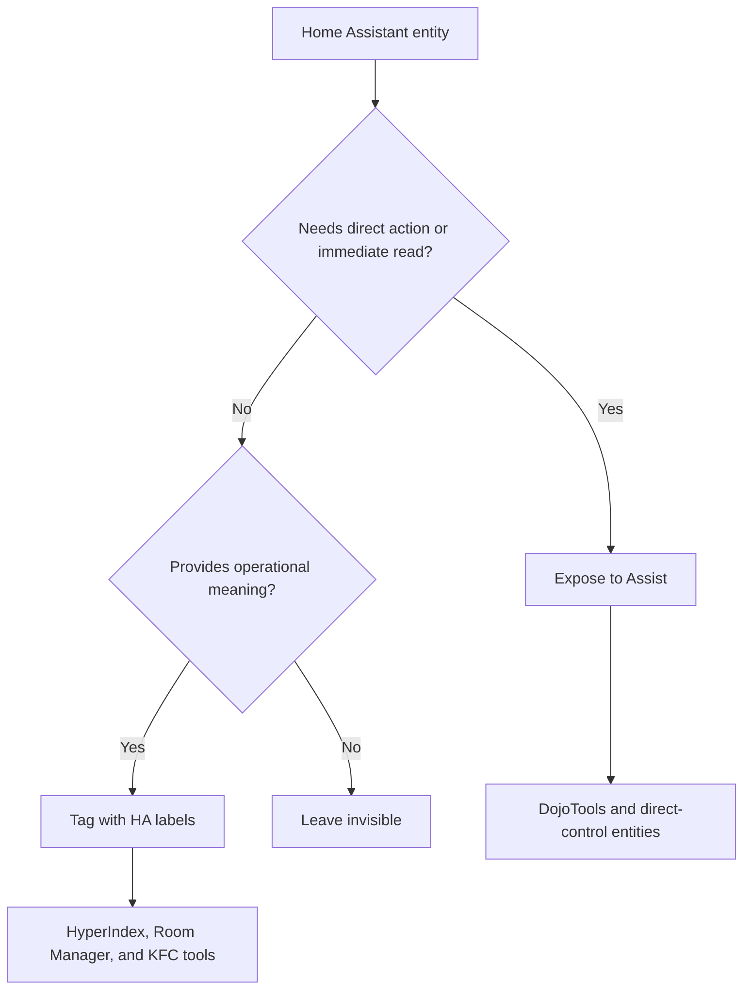

# What to Expose to Your Conversation Agent

> **Version:** 2026.9.0 'Steel Magnolia' | **Last Updated:** Sep 2026

*How to decide which entities your AI can see, which it finds automatically through labels, and which stay invisible.*

---

Your Home Assistant install probably has hundreds of entities — lights, sensors, switches, helpers. Your AI doesn't need direct access to all of them, and giving it access to all of them would actually make it worse at its job (a longer tool list is a slower, less reliable one). This doc is about drawing that line deliberately instead of by accident.

## The Three-Tier Model

Every entity in your Home Assistant install falls into one of three tiers:

| Tier | What It Means | How Your AI Sees It |
|---|---|---|
| **Actionable** | your AI needs to control it or read it immediately | Exposed directly to the conversation agent |
| **Contextable** | your AI benefits from knowing about it | Tagged with labels — the HyperIndex finds it |
| **Invisible** | your AI never needs it | Neither exposed nor labeled |

The goal is a **small, curated exposed set** and a **large, richly labeled contextable set**. The HyperIndex is designed to handle thousands of labeled entities efficiently. Your conversation agent's tool list is not.

Labels also connect entities to the Room Manager map and to operational tools. A camera with a room label and `security_camera` is not just searchable; it can participate in room security views. A vacuum labeled `autovac` can become an AutoVac actor. A person entity tied to an identity profile can receive Postman questions under that user's quiet/work-hour policy.

Use this rule of thumb:

```text
Expose tools for action.
Label entities for meaning.
Keep internals invisible unless a tool needs them.
```

This is also the privacy/comfort boundary. Direct exposure is permission to act or read immediately. Labels are permission to understand an entity in context. Invisible means ZenOS-AI should not see or reason about it.



---

## Tier 1: Actionable — Expose to Assist

Expose an entity to the conversation agent when your AI needs to:

* **Control it directly** — run a script, toggle a switch, call a service
* **Read it immediately** — check a value that isn't worth summarizing or indexing

Keep this list as short as possible. Every entity exposed to Assist is a token in your AI's context window and a potential action surface. The vast majority of your home does not belong here.

### Always Expose

**All ZenOS-AI DojoTools scripts** — these are your AI's hands. Every `script.zen_dojotools_*` belongs in the exposed set.

If you skip this, important things simply will not work. OOBE needs DojoTools to create rooms, tag entities, write profile data, resolve identity, call Room Manager, fire alerts, and talk through Postman.

This is the minimum line for a functional first run: expose DojoTools to Assist. Without them, the AI can talk about setup but cannot reliably perform setup.

> `zen_admintools_*` scripts are admin-only and should NOT be exposed to the conversation agent by default. See [AdminTools](../scripts/zen_dojotools_admintools_readme.md). (`zen_dojotools_scribe` is the MCP-exposed KFC registration tool — it is a DojoTools script and is already covered by the "always expose all `zen_dojotools_*`" rule.)

Minimum default exposure:

| Expose | Reason |
|---|---|
| `script.zen_dojotools_*` | Normal governed tool surface |
| `input_text.zenos_conversation_agent` | Conversation agent self-reference |
| `input_select.zen_home_mode` | Home mode context and preference application |

Friendly dashboard controls:

| Add to dashboard | Writes to |
|---|---|
| `select.zenos_conversation_agent` | `input_text.zenos_conversation_agent` |
| `select.zenos_active_persona` | `input_text.zenos_persona_name` |

These selects are not a separate source of truth. They make the canonical helpers usable as dropdowns, which is much less error-prone for a new installer.

Default deny:

| Do not expose by default | Reason |
|---|---|
| `script.zen_admintools_*` | Repair/reset/admin functions |
| Cabinet sensors | Use resolver + FileCabinet tools instead |
| Secrets/debug/internal helpers | Not needed for normal operation |

**Conversation agent helper** — `input_text.zenos_conversation_agent` (your AI needs to know its own entity ID for self-reference)

Use `select.zenos_conversation_agent` on a dashboard when available; it writes the same helper with a valid `conversation.*` entity.

**Home mode** — `input_select.zen_home_mode` or equivalent (your AI actively sets this based on presence and context)

### Expose When Needed

* **Controllable devices** where your AI acts on user request — lights you ask it to dim, locks you ask it to check, thermostats you ask it to adjust
* **Sensors with immediate operational meaning** — door/lock state when you're asking "is the front door locked right now?" is a valid direct read. But if it's summarized by a Kata every 15 minutes, skip the direct exposure and let the Kata answer.

### Do Not Expose

* Every sensor in your home
* Historical or telemetry sensors
* Media player attributes
* Energy/power monitors
* Cabinet sensors (`sensor.zenos_*_cabinet`)
* Health sensors — these are for your eyes, not your AI's tool list
* Anything that HyperIndex can find better than a direct read

---

## Tier 2: Contextable — Tag with Labels

If your AI should *know about* an entity but not necessarily control it on demand, tag it with labels instead of exposing it.

The HyperIndex traverses the label graph and assembles a structured entity snapshot for the Ninja Summarizer. This means a single label on 50 entities produces a rich, token-efficient context block — far better than 50 individual direct reads.

### How It Works

1. Create a label in HA (e.g., `water`, `security`, `energy`)
2. Tag all relevant entities with that label
3. Reference the label in your KFC drawer (`label: water`)
4. The Ninja Summarizer runs HyperIndex against that label, finds all tagged entities, and builds the Kata

Your AI gets a compressed, timestamped summary of everything tagged — without those entities ever appearing in its tool list.

### What Belongs Here

* All sensors you want summarized — water, energy, temperature, humidity, air quality
* Media state sensors and media players that should be resolved by Media Manager
* Security sensors — motion, contact, cameras, locks, and areas they protect
* Device status sensors — appliances, pool/spa, irrigation
* Anything feeding a KFC component
* Room-aware actors such as vacuums, covers, lights, and cameras that tools should resolve by label rather than hardcoded entity ID

### The Rule

> If it provides operational meaning, it belongs in a label — not in the exposed tool list.

Some labels feed summaries. Others feed immediate tools. Both are contextable.

**Labels now connect entities to operational context, not just summaries.** When an entity carries a room or area label, Room Manager can surface not just its live state but the full operational picture for that space: inventory held there, chores due there, and pre-built action sequences (`replace_action`, `chore_actions`) for acting on what's found. A wear sensor labeled `autovac_wear` doesn't just feed a Kata — it feeds a live catalog lookup that tells your AI exactly which spare to pull and how to log the replacement. The label is the permission slip; the operational context is what gets built from it.

The best camera example is a fence or driveway camera. Do not expose every camera attribute directly just because it exists. Label the camera with its room/area and role, then let the camera/security tools resolve it when a component needs perception.

Examples:

| Entity kind | Useful labels | Why |
|---|---|---|
| Fence or yard camera | Room/area label + `security_camera` | Camera, Security Manager, and Room Manager can agree where the image came from |
| Robot vacuum | `autovac` + covered room labels/config | AutoVac can elect rooms and report blockers |
| Mobile/person tracker | Person/identity labels | Postman and Identity can route to the right human |
| Exterior lock/contact | Room label + `security` | Alerts can include which portal or boundary is involved |
| Utility meter | `utility_main`, `utility_billing`, or `zen_plant_*` | Plant Manager can resolve infrastructure state |

---

## Tier 3: Invisible — Neither

Some entities should never reach your AI at all:

* Internal automation helpers not intended for AI use
* Debug/test entities
* Infrastructure sensors (network, server load) unless you have a specific reason
* Duplicate or legacy entities you haven't cleaned up yet
* Anything containing credentials, tokens, or sensitive config

If an entity isn't tagged and isn't exposed, your AI cannot see it. That's the correct outcome for most of your install.

---

## Practical Setup

### Step 1 — Build your exposed tool list

In your conversation agent configuration, add:

* All `script.zen_dojotools_*` (except admin-only scripts)
* `input_text.zenos_conversation_agent`
* Home mode entity
* Any entities your AI needs to directly control on user request

### Step 2 — Tag everything contextable

Create labels for each KFC domain you run. Tag every sensor that feeds those domains. The KFC drawer's `label` field connects the label to the Ninja Summarizer — from there, HyperIndex does the work.

You do not need to maintain entity lists anywhere. Labels are the only list that matters.

For room-aware tools, include the room or area label too. Domain labels say what the thing is; room labels say where it lives.

```text
camera.back_fence
  labels: security_camera, back_yard, fence_line

vacuum.downstairs_robot
  labels: autovac

lock.side_gate
  labels: security, side_yard
```

### Step 3 — Leave everything else alone

Anything not tagged and not exposed is invisible. That is the correct default.

---

## Summary

```
Actionable  →  Expose to conversation agent
               (DojoTools scripts + direct-control entities only)

Contextable →  Tag with labels
               (HyperIndex + Ninja Summarizer does the rest)

Invisible   →  Do nothing
               (correct default for most of your install)
```

The system is designed so that the labeled+indexed path handles the overwhelming majority of your home. The exposed path handles commands. Keep the boundary clean and your AI stays fast, accurate, and predictable.

---

## Related

* [Cabinet Placement Guide](cabinet_placement.md) — where to store things once you've decided what to expose
* [Understanding KF4](../kung_fu/understanding_kf4.md) — how labels connect to KFC components
* [Zen HyperIndex](../zen_hyperindex/zen_hyperindex_overview.md) — how the index traverses labels
* [DojoTools AdminTools](../scripts/zen_dojotools_admintools_readme.md) — what not to expose
* [Install Guide](install.md) — conversation agent configuration
