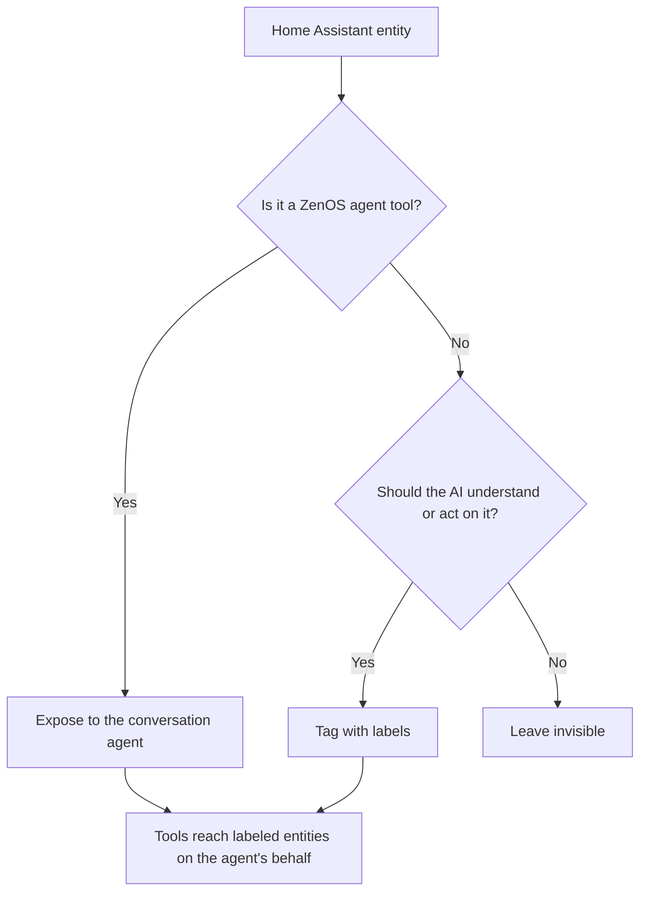

# What to Expose to Your Conversation Agent

> **Version:** 2026.10.0 'Tron' | **Last Updated:** Sep 2026

*Expose the tools. Expose zero entities. Label everything the tools need to understand.*

---

This changed in 2026.10.0. Earlier releases recommended exposing the DojoTools plus a short list of entities your AI controls directly (lights, locks, thermostats) and a couple of helpers. The recommendation now is simpler and faster: **expose the ZenOS tools and nothing else.** Every entity stays unexposed. The tools reach the house on the agent's behalf, through labels.

Why: everything exposed to your conversation agent is sent to the model on every turn. Exposed entities cost context and slow the time to the first word of every answer, and a model handed a long list of raw entities gets worse at finding the right one, not better. With zero entities exposed and tool descriptions trimmed in the same release, the reference install got noticeably faster immediately. [The Book of Friday, Chapter 10](../architecture/10_exposure_tools_not_entities.md) explains the reasoning, and [Chapter 2](../architecture/02_the_sand_dune_and_the_plinko_board.md) the research behind it.

## The model

Every entity in your install falls into one of three groups:

| Group | What it means | How your AI reaches it |
|---|---|---|
| **Tools** | The ZenOS scripts your AI calls | Exposed to the conversation agent |
| **Contextable** | Anything your AI should understand or act on | Labeled; found and acted on through the tools |
| **Invisible** | Anything your AI never needs | Neither exposed nor labeled |

The rule of thumb:

```text
Expose tools for action.
Label entities for meaning.
Keep internals invisible unless a tool needs them.
```

A light you want your AI to dim is not exposed. It carries its room label and a role label (`zen_lm_main`, for example), and ZenLux finds it and dims it. A lock you want checked is not exposed. The locks tool finds it by label and reads it. The difference from the old model is that "actionable" now means "reachable by a tool", not "exposed to the agent".


```mermaid
flowchart TB
  Entity["Home Assistant entity"]
  IsTool{"Is it a ZenOS agent tool?"}
  Contextable{"Should the AI understand or act on it?"}
  Expose["Expose to the conversation agent"]
  Label["Tag with labels"]
  Invisible["Leave invisible"]
  Tools["Tools reach labeled entities on the agent's behalf"]

  Entity --> IsTool
  IsTool -- "Yes" --> Expose
  IsTool -- "No" --> Contextable
  Contextable -- "Yes" --> Label --> Tools
  Contextable -- "No" --> Invisible
  Expose --> Tools
```

---

## Group 1: Tools, exposed

Expose the agent-facing ZenOS tools. These are your AI's hands. Without them OOBE can talk about setup but cannot perform it: it needs them to create rooms, tag entities, write profiles, resolve identity, fire alerts, and talk through Postman.

| Expose | Why |
|---|---|
| `script.zen_dojotools_*` | The agent-facing tool surface: Room Manager, Labels, Identity, FileCabinet, AlertManager, Postman, ZenLux, Locks, and the rest |

Two DojoTools declare themselves internal in their own manifests (`mcp_exposed: false`) and stay unexposed by default. `zen_dojotools_lens_dispatch` is called by Library on the agent's behalf. `zen_dojotools_filecabinet_gc` runs on the Scheduler's own schedule; expose it only if you want your agent able to force a garbage-collection run.

Never expose:

| Do not expose | Why |
|---|---|
| `script.zen_admintools_*` | The repair, reset, and certification plane. Operator-only. An agent that can reach CertAdmin can try to certify itself. |
| `script.zen_sutra_*`, `script.zen_stack_*`, `script.zen_codex_*`, `script.zen_root_*` | Internal layers. DojoTools and Library call them; the agent never should. |

You can leave DojoTools unexposed for domains you do not run. Every exposed tool's description is sent on every turn, so a household with no finance or printing setup has no reason to spend context on those tools.

## Group 2: Contextable, labeled

If your AI should understand an entity, or act on it through a tool, label it. Do not expose it.

The HyperIndex traverses the label graph, the Ninja Summarizer turns labeled domains into Katas, and domain tools resolve their targets by label. One label on fifty entities produces a compact, meaningful context block, far better than fifty raw entities in the agent's view.

### How it works

1. Create a label in HA (for example `water`, `security`, `energy`).
2. Tag every relevant entity with it, and with its room or area label.
3. Reference the label in your KFC drawer (`label: water`).
4. The summarizer runs the index against that label, finds everything tagged, and builds the Kata. Tools resolve their targets the same way.

### What belongs here

* Everything your AI controls through a tool: lights (with `zen_lm_*` roles), covers (`zen_cv_*`), media players (`zen_mm_*`), locks, climate, vacuums
* Everything you want summarized: water, energy, temperature, humidity, air quality
* Security sensors: motion, contact, cameras, and the areas they protect
* Device status: appliances, pool or spa, irrigation
* Anything feeding a KFC component

Labels do more than feed summaries. When an entity carries a room or area label, Room Manager can surface the whole operational picture for that space: its live state, inventory held there, chores due there, and the actions for acting on what it finds. A wear sensor labeled `autovac_wear` does not just feed a Kata; it feeds a catalog lookup that tells your AI which spare to pull and how to log the replacement. The label is the permission slip.

| Entity kind | Useful labels | Why |
|---|---|---|
| Fence or yard camera | Room/area label + `security_camera` | Camera, Security Manager, and Room Manager agree where the image came from |
| Main light in a room | Room label + `zen_lm_main` | ZenLux resolves "the kitchen lights" without an entity ID |
| Robot vacuum | `autovac` + covered room labels | AutoVac can elect rooms and report blockers |
| Person or tracker | Person/identity labels | Postman and Identity can route to the right human |
| Exterior lock or contact | Room label + `security` (+ `ext_lock` for exterior locks) | Alerts know which boundary is involved; unlocking an exterior lock requires a live acknowledgement |
| Utility meter | `utility_main`, `utility_billing`, or `zen_plant_*` | Plant Manager can resolve infrastructure state |

## Group 3: Invisible

Some entities should never reach your AI at all:

* Internal automation helpers not intended for AI use
* Debug and test entities
* Infrastructure sensors (network, server load) unless a tool needs them
* Duplicate or legacy entities you have not cleaned up
* Anything containing credentials, tokens, or sensitive configuration
* Cabinet sensors and health sensors: the tools read these; your AI does not need them directly

If an entity is neither labeled nor exposed, your AI cannot see it. That is the correct outcome for most of your install.

---

## Practical setup

### Step 0: Turn off the global default

In Settings → Voice assistants → Expose, turn off "expose new entities by default". This is a Home Assistant setting that no ZenOS package can enforce. If it is left on, every new entity and helper you create becomes visible to your agent, whatever you curate afterward.

### Step 1: Expose the tools, unexpose everything else

In the Expose list:

* Expose `script.zen_dojotools_*`, apart from the two internal ones above and any domain tools you do not use.
* Unexpose every other entity, including lights, locks, thermostats, and helpers you exposed under an earlier release.

The ZenOS helpers (`input_text.zenos_conversation_agent`, `input_select.zen_home_mode`) no longer need to be exposed. The prompt layer reads them directly, and your AI reads or sets home mode through `zen_dojotools_systemtools mode=home_mode`. Put `select.zenos_conversation_agent` and `select.zenos_active_persona` on a dashboard for yourself; they write the same helpers as dropdowns.

### Step 2: Label everything contextable

Create labels for each KFC domain you run and tag everything that feeds them. Give every entity a tool should act on its room label and its role label. You do not maintain entity lists anywhere. Labels are the only list that matters.

```text
camera.back_fence
  labels: security_camera, back_yard, fence_line

light.kitchen_ceiling
  labels: kitchen, zen_lm_main

lock.side_gate
  labels: security, side_yard
```

### Step 3: Check it

Ask your AI something it can only answer through the tools: "What do you know about my HVAC?" or "Turn off the kitchen lights." If it cannot find something, the fix is almost always a missing label, not a missing exposure.

This is what a working tools-only setup looks like:

<!-- screenshot: setup_zero_entities_check.png -->
> **Screenshot to come.** The Expose list with only the ZenOS tools exposed, and Friday answering a question she can only answer through them. Real 2026.10.0 output; personal details redacted.
<!-- /screenshot -->

`zen_dojotools_manifest mode=mcp_sync` compares a list of the tools your agent reports it can see against the DojoTools installed, and lists any that are missing. It cannot yet detect exposed AdminTools on its own, so check the Expose list for those by eye.

### If you keep some entities exposed

Zero is the recommendation, not a requirement. If you keep a few entities exposed for a reason of your own, keep the list as short as you can, and know that Home Assistant's built-in intents will act on those entities directly, outside ZenOS's tools and their certification checks.

---

## Summary

```text
Tools       →  Expose to the conversation agent
               (agent-facing DojoTools only)

Contextable →  Label
               (the tools, the index, and the summarizers do the rest)

Invisible   →  Do nothing
               (the correct default for most of your install)
```

---

## Related

* [The Book of Friday, Chapter 10: Exposure](../architecture/10_exposure_tools_not_entities.md): why tools, not entities
* [Cabinet Placement Guide](cabinet_placement.md): where things go once you have decided what to label
* [Understanding KF4](../kung_fu/understanding_kf4.md): how labels connect to KFC components
* [Zen HyperIndex](../zen_hyperindex/zen_hyperindex_overview.md): how the index traverses labels
* [DojoTools AdminTools](../scripts/zen_dojotools_admintools_readme.md): what never to expose
* [Install Guide](install.md): conversation agent configuration
