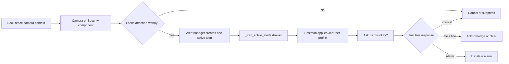

# Your First Alert

> **Version:** 2026.6.0 'Clue' | **Last Updated:** May 2026

*The fastest way to prove ZenOS-AI can get your attention.*

---

You've finished first-run setup. Your AI knows the home, Flynn has brought the cabinets online, and now you want one simple thing: make ZenOS-AI raise an alert, show you where it lives, and clear it again.

This walkthrough uses the current AlertManager path in 2026.6.0:

```
alert_fire event -> Zen Alert Manager -> _zen_active_alerts -> notification
```

No `notify.admin_devices` group is required. No Ninja summary is required for this first test. The AlertManager automation is always listening for `zen_event` events, and the MCP-facing tool `zen_dojotools_alertmanager` gives your AI a simple way to fire, list, and clear alerts.

This is the smallest version of the larger ZenOS loop:

```text
something happens -> decide if it matters -> surface attention -> ask a human if needed -> clear, suppress, or escalate
```

Later, "something happens" might be a camera analysis, an AutoVac blocker, a water leak, or a utility fault. The same attention layer handles dedup and priority so the system does not shout twice about the same active condition.

The ideal first real-world version feels like this:

```text
camera/tool sees context
  -> component decides it may matter
  -> AlertManager creates one active alert
  -> Postman routes it using the person's profile
  -> the person answers: acknowledge, alarm/escalate, cancel, or "he's fine"
  -> the alert clears or becomes higher priority
```

For example: the back fence camera sees someone in a hat riding a lawn mower near the fence. The system should not jump straight to panic. A good governed alert is closer to: "I do not think this is an issue, but is this okay?" If JoeUser has quiet hours off and work-hours routing on, Postman can ask JoeUser through the configured channel. When JoeUser says "he's fine," the alert can be acknowledged or cleared instead of escalating.



---

## What AlertManager Does

AlertManager is a fire-once alert system.

When an alert fires, it stores the alert key in the household cabinet drawer `_zen_active_alerts`. If the same key fires again while it is still active, AlertManager suppresses the duplicate. When the condition clears, the key is removed and that same alert can fire again later.

Severity controls how much attention the alert gets:

| Severity | Notification | Priority context |
|---|---|---|
| `info` | Sent to the chosen target | No |
| `warn` | Sent to the chosen target | No |
| `error` | Sent to the chosen target | Yes — writes priority context for the AI |

By default, alerts expire after 24 hours. Use `clear_after_minutes: 0` only for alerts that should stay active until someone explicitly clears them.

---

## Step 1 — Confirm AlertManager Exists

After installing or upgrading to 2026.6.0, AlertManager should be present as:

- `automation.zen_alert_manager`
- `script.zen_dojotools_alertmanager`
- `sensor.zen_priority_context`

Ask your AI:

> "List active alerts."

It should call `zen_dojotools_alertmanager` with `mode=list`. A clean system returns zero active alerts. If the tool is missing after first install, fully restart Home Assistant once. New script entities do not always appear in the conversation agent tool schema after a script reload.

You can also check directly in HA:

1. Open **Developer Tools -> States**
2. Search for `sensor.zen_priority_context`
3. It should usually read `clear`

---

## Step 2 — Fire a Test Alert

The easiest path is conversational:

> "Fire a test ZenOS alert called first_alert_test. Make it a warning and send it as a persistent notification."

Your AI should call `script.zen_dojotools_alertmanager` with these fields:

```yaml
mode: fire
alert_key: first_alert_test
message: "ZenOS first alert test."
severity: warn
notify_target: persistent
clear_after_minutes: 30
```

If you are calling it yourself from **Developer Tools -> Actions**, use:

```yaml
action: script.zen_dojotools_alertmanager
data:
  mode: fire
  alert_key: first_alert_test
  message: "ZenOS first alert test."
  severity: warn
  notify_target: persistent
  clear_after_minutes: 30
```

What should happen:

- HA shows a persistent notification
- `_zen_active_alerts` gets a `first_alert_test` entry
- `sensor.zen_priority_context` stays `clear` because this is only a warning

If you prefer Developer Tools, fire the event directly:

```yaml
event: zen_event
event_data:
  event:
    kind: alert_fire
    alert_key: first_alert_test
    message: "ZenOS first alert test."
    severity: warn
    notify_target: persistent
    clear_after_minutes: 30
```

---

## Step 3 — Prove Dedup Works

Fire the exact same alert again:

> "Fire first_alert_test again."

You should not get a second notification. That is the point. AlertManager treats `alert_key` as the dedup key, so a still-active key is a no-op.

This behavior is what keeps a noisy sensor from sending the same alert over and over while the underlying condition remains true.

---

## Step 4 — List Active Alerts

Ask:

> "List active alerts."

The result should include:

- `alert_key: first_alert_test`
- `message`
- `severity: warn`
- `fired_at`
- `expires_at`
- `age_min`
- `in_priority_inject: false`

This comes from the household cabinet drawer `_zen_active_alerts`. You normally do not need to read that drawer yourself; the tool is the safer front door.

---

## Step 5 — Try an Error Alert

Now test the priority context path:

> "Fire a test error alert called first_error_test. Use persistent notification."

Expected tool fields:

```yaml
mode: fire
alert_key: first_error_test
message: "ZenOS first error alert test."
severity: error
notify_target: persistent
clear_after_minutes: 30
```

Developer Tools -> Actions form:

```yaml
action: script.zen_dojotools_alertmanager
data:
  mode: fire
  alert_key: first_error_test
  message: "ZenOS first error alert test."
  severity: error
  notify_target: persistent
  clear_after_minutes: 30
```

What should change:

- HA shows a persistent notification
- `_zen_active_alerts` gets `first_error_test`
- `_zen_priority_inject` gets a matching priority entry
- `sensor.zen_priority_context` changes to `active`

This is the part your AI sees in its context frame. Error alerts are not just notifications; they become situational awareness.

---

## Step 6 — Clear the Alerts

Clear each test alert:

> "Clear first_alert_test and first_error_test."

Expected tool fields:

```yaml
mode: clear
alert_key: first_alert_test
```

```yaml
mode: clear
alert_key: first_error_test
```

Then ask:

> "List active alerts."

You should see no active alerts, and `sensor.zen_priority_context` should return to `clear`.

If you are testing and want to wipe all active alerts:

```yaml
action: script.zen_dojotools_alertmanager
data:
  mode: clear_all
```

Use `clear_all` carefully on a live home, since it clears real alerts too.

---

## Notification Targets

For a first test, use `notify_target: persistent`. It works without extra setup and proves the AlertManager pipeline.

Other targets:

| Target | Use when |
|---|---|
| `persistent` | You want an HA persistent notification. Best first test. |
| `postman` | You have Postman profiles configured and want push, TTS, or Teams routing. |
| `mobile` | Legacy/simple mobile path if supported by your install. |

For Postman routing, include `channel_hint`:

```yaml
action: script.zen_dojotools_alertmanager
data:
  mode: fire
  alert_key: first_postman_test
  message: "Testing Postman alert routing."
  severity: warn
  notify_target: postman
  channel_hint: push
```

If the persistent test works but Postman does not, the problem is in Postman/profile routing, not AlertManager.

---

## Turning Real Conditions Into Alerts

The test above proves the alert pipeline. Real sensors still need an automation, KFC, or tool to decide when to fire and clear alerts.

For a simple smoke detector example:

```yaml
automation:
  - id: zenos_smoke_alert_example
    alias: ZenOS Smoke Alert Example
    triggers:
      - trigger: state
        entity_id: binary_sensor.your_smoke_detector
        to: "on"
        for:
          seconds: 5
    actions:
      - event: zen_event
        event_data:
          event:
            kind: alert_fire
            alert_key: smoke_detector_alarm
            message: "Smoke detector is alarming."
            severity: error
            notify_target: persistent
            clear_after_minutes: 0

  - id: zenos_smoke_clear_example
    alias: ZenOS Smoke Clear Example
    triggers:
      - trigger: state
        entity_id: binary_sensor.your_smoke_detector
        to: "off"
        for:
          seconds: 10
    actions:
      - event: zen_event
        event_data:
          event:
            kind: alert_clear
            alert_key: smoke_detector_alarm
```

Replace the entity ID before using this. Do not copy a safety automation blindly; test it with a harmless binary sensor first.

The older `alert_manager` KFC and `alert_when_*` labels still describe one summarizer-driven monitoring pattern, but they are not required for the direct AlertManager test in this guide.

---

## Troubleshooting

**I fired the same alert twice and only got one notification.**
Good. That means dedup is working. Clear the alert before firing it again.

**`sensor.zen_priority_context` did not change for a warning.**
Correct. Only `severity: error` writes priority context.

**The tool says queued but I do not see the alert immediately.**
The tool emits an event, and the automation handles the event asynchronously. Wait a moment, then run `mode=list`.

**The tool is missing from my AI's tool list.**
Fully restart Home Assistant once. New script entities may not appear in MCP/tool schemas after script reload alone.

**Persistent notification works, but phone push does not.**
AlertManager is working. Check Postman routing, mobile app notify services, and any sleep/away gates.

---

## What's Next

You've just seen the current 2026.6.0 alert path:

```
event or tool -> AlertManager -> active alert drawer -> notification -> optional AI priority context
```

Next reads:

- **[AlertManager reference](../components/alertmanager.md)** — full current behavior, TTL, priority context, and tool modes
- **[Understanding KF4](../kung_fu/understanding_kf4.md)** — how summarizer-driven components fit beside direct event alerts
- **[Entity Exposure](entity_exposure.md)** — what to expose to your AI and what to keep behind tools

---

-> **[Back to Getting Started](readme.md)**
