# ZenOS-AI: First Run Guide

> **Version:** 2026.8.0 'Chef' | **Last Updated:** Jul 2026

---

## Before You Start

You'll need:

- Home Assistant running with the ZenOS-AI packages installed (`packages/zenos_ai/` and `custom_templates/zenos_ai/`)
- A conversation agent configured in HA and pointed at a compatible AI model (tool-calling support required; models smaller than ~8B parameters or with short context windows are not recommended)
- The conversation agent prompt template loaded from `custom_templates/zenos_ai/conversation_agent_prompt_template.yaml`
- The normal DojoTools scripts exposed to Assist: `script.zen_dojotools_*`

If you haven't done those steps yet, see the **[Install Guide](install.md)** first.

Do not expose `script.zen_admintools_*` for normal first run. AdminTools are for operator repair and recovery, not the default conversational surface.

Recommended dashboard controls after the package loads:

| Entity | Use |
|---|---|
| `select.zenos_conversation_agent` | Pick the HA conversation agent from a dropdown. |
| `select.zenos_active_persona` | Pick the active ZenOS persona from registered AI users. |

Both are friendlier wrappers around the canonical `input_text` helpers, so first-time users do not have to type raw entity IDs.

---

## What Happens on First Boot

The moment HA starts with ZenOS-AI installed, an automation called **Flynn Stepgate Sentinel** runs. You don't trigger it — it fires automatically. Flynn works through a sequence of setup gates:

1. **Labels** — Creates any missing Zen system labels in HA
2. **Assign** — Attaches those labels to the right cabinet entities
3. **Cabinets** — Initializes your four core storage cabinets (AI user, household, family, user)
4. **Bootstrap** — Writes default starting values so the system has something to work with

If everything passes you'll see a **"ZenOS-AI: System Ready"** notification. If the AI persona isn't configured yet you'll see this instead:

> *ZenOS-AI: Welcome — Let's name your AI*
> *Flynn here. Your system is ready but your AI doesn't have a name yet...*

That notification means setup completed successfully. The OOBE (onboarding) step is next.

---

## What OOBE Is Building

OOBE is not just a profile wizard. It builds the first version of the graph ZenOS uses to operate safely:

```text
rooms -> areas -> labels -> devices -> people -> tools -> alerts -> acknowledgement
```

Room Manager gives the system a physical map. Labels attach devices to that map. Cameras become perception, vacuums become room-aware actors, locks and presence become security context, AlertManager decides what needs attention, and Postman asks the right human when the system needs judgment.

You can skip parts of OOBE and fill them in later. The important thing is that every answer should either place something in the home, attach meaning to an entity, or define who should be asked when ZenOS is not sure.

Think of first run as moving from zero to the first governed "is this okay?" moment:

```text
Blank install
  -> Assist can call DojoTools
  -> OOBE maps rooms and people
  -> labels connect devices to places
  -> a camera/vacuum/lock/tool reports something meaningful
  -> AlertManager dedups it
  -> Postman asks the right person
  -> the person acknowledges, clears, cancels, or escalates
```

That is the goal of first run: ZenOS-AI should become useful in visible steps. You decide which tools it can call, which entities have meaning, which components are active, and when a person should be asked before an alert escalates.

```mermaid
flowchart LR
  Blank["Blank install"]
  Tools["DojoTools exposed to Assist"]
  OOBE["OOBE conversation"]
  Rooms["Room Manager map"]
  Labels["Labels give entities meaning"]
  Components["Opted-in components notice events"]
  Alert["AlertManager dedups attention"]
  Postman["Postman routes by profile"]
  Human["Human acknowledges or escalates"]

  Blank --> Tools --> OOBE --> Rooms --> Labels --> Components --> Alert --> Postman --> Human
```



---

## Naming Your AI — The OOBE Conversation

OOBE stands for Out-of-Box Experience. It's a one-time conversation where your AI learns your home.

**To start:** Open the Assist panel in HA — the chat bubble icon in the top-right of the UI, or via the sidebar if you've added it — and say something like:

> "Set up my profile"
> "Let's do first-time setup"
> "Flynn, walk me through onboarding"

Your AI will call the onboarding protocol and begin asking questions. It already knows your HA areas and entities — it'll confirm what it sees rather than asking you to describe everything from scratch.

### What it will cover

**1. Your household**
Name and address. Timezone is detected automatically.

> *"What would you like to call your home?"*

**2. Rooms**
Your AI reads your HA areas and confirms the list with you. It then registers each room in the **Room Manager** — the spatial layer that stores how your rooms connect. Any rooms that don't exist in HA yet are created automatically.

For each room it asks:
- What rooms connect to it directly?
- Are there any exterior doors or emergency exits?
- Any safety equipment on this floor? (fire extinguisher, first aid kit, AED)

It also collects a household rally point — where people meet outside in an emergency.

Room connections are stored as a navigable spatial map: adjacency, portal types, and exit priority. This is what powers room-aware lighting, climate, emergency guidance, and the Security Manager.

It writes as it goes — not at the end.

**3. People**
Who lives in the home, with their name and role. It checks HA for matching person entities. It'll also ask about family who matter but don't live there (parents, siblings) and keep those separately.

**4. Devices**
For each category it finds in your system it'll confirm placement before tagging anything:
- Cameras -> confirmed to a room, tagged `security_camera` (powers room-level security views and camera context)
- Vacuums -> confirmed cleaning coverage, ready for AutoVac room election and post-run analysis
- Locks -> confirmed to a door or exterior portal
- Presence sensors -> mapped to a person or room so routing and occupancy are grounded

It will never label a device without asking first.

For example, a fence camera is not useful just because it exists. It becomes useful after you confirm where it is, what boundary it observes, and whether camera/security flows should use it. Then a future event can be phrased like: "The back fence camera saw a person near the fence. I do not think this is an issue, but is this okay?" The answer can be acknowledgement, alarm/escalation, cancellation, or a note for future suppression.

**5. Components (optional)**
A quick opt-in for features relevant to your setup — security alerts, vacuum scheduling, spa manager, trash reminders, energy monitoring. If the hardware isn't there the option won't be offered.

These opt-ins do not make the AI "magically automate everything." They turn on governed loops. For example, AutoVac can elect rooms based on schedule/readiness, Camera can provide perception, AlertManager can dedup attention-worthy states, and Postman can ask a person for an acknowledgement before a questionable event escalates.

### Rules your AI follows during OOBE

- Never asks more than two questions at once
- Writes as it goes — nothing is batched
- "Skip" or "later" always works — nothing is blocking
- If a write fails, it logs it and moves on

---

## When OOBE Finishes

Your AI writes an `_oobe_complete` flag to its cabinet and the setup notification is dismissed automatically. You won't see it again.

**To activate your named AI:** At the end of OOBE, use the dashboard dropdown **ZenOS: Active Persona** (`select.zenos_active_persona`) and choose the name just configured, then start a fresh conversation. That fresh conversation hands off to the real persona — the one you just built.

Under the hood, the select writes to `input_text.zenos_persona_name`. If the select has not appeared yet, the manual fallback is to set `input_text.zenos_persona_name` directly.

---

## Editing Your Profile Later

You don't need to re-run OOBE to change anything. Just ask your AI directly:

> "Change your familiar's name to Pip"
> "Update our household name to The Garcia House"
> "Add Alex as my partner"
> "What's your current profile?"

Your AI uses `zen_dojotools_profile_editor` under the hood. It reads before it writes, patches only what you specify, and never overwrites existing values unless you explicitly ask it to.

Fields you can update any time:

| Cabinet | Examples |
|---|---|
| AI persona | Name, pronouns, voice tone, selfie, familiar, room, motif |
| Household | Name, address, city, state, phone |
| User | Display name, preferred name, role, birthday, email, preferences |
| Family | Same as user |

---

## If Something Goes Wrong

**"cabinet online, unmounted — cannot reinitialize dirty state"**
You may see this message in HA logs or in a Flynn notification during startup, especially in 2026.7.0. It is **not catastrophic** and does not mean data loss.

What it means: Flynn is testing a core CabCeption feature — activating history cabinets that were previously put in the `online_unmounted` (stacks) state. A cabinet in this state has uncommitted mount activation in progress. Flynn sees it as dirty and blocks re-initialization to protect it.

What to do: nothing, immediately. Wait for the next Flynn health cycle (a minute or two) and it will either resolve the mount activation or surface a more specific advisory. If the message persists beyond 5 minutes, ask your AI: `"Flynn, show me cabinet health"` — it will tell you which cabinet is involved and what state it's in.

This is expected behavior while CabCeption mount activation of history cabinets is being tested. If you see it, it means the feature is working as designed.

**The welcome notification keeps appearing after setup**
Your AI's name may still be the default ("your AI"). Ask your AI what its name is — if it says it doesn't have one yet, run OOBE again.

**Only one persona in the selector**
The selector builds from AI user cabinets that have a named persona. Complete OOBE or ask your AI to set its name directly.

**A room or device wasn't set up correctly**
Just ask your AI to fix it. "The motion sensor in the hallway is actually in the bedroom." It can relabel entities and update room topology without re-running the full flow.

**OOBE can be re-run**
Ask your AI: "Run OOBE again" or "Re-do first-time setup." It will walk through the protocol again. Existing values are skipped unless you ask it to overwrite.

---

## What's Next

Once your home is set up, your AI has full context to be useful. The fastest next step is **[Your First Alert](first_alert.md)** — it walks you through firing, listing, and clearing a real AlertManager notification, which is the quickest way to prove the attention pipeline is working.

After that, work through entity exposure and cabinet placement to finish configuring what your AI can see directly, what it should discover through labels, and where operational memory belongs. If you want the first full end-to-end component setup, use **[AutoVac First Setup](autovac_first_setup.md)** next; it commissions rooms, labels, schedules, Postman policies, Grocy inventory, wear checks, and AlertManager tests as one chain.
