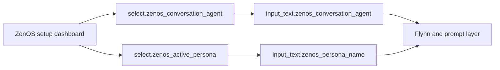

# ZenOS-AI: Install Guide

> **Version:** 2026.9.0 'Steel Magnolia' | **Last Updated:** Sep 2026

*What this covers: getting the ZenOS-AI files into your Home Assistant install and confirming it started up correctly. By the end, Flynn (the system's own startup checker — see [Concepts](concepts.md)) will confirm everything loaded, and you'll be ready to talk to your AI for the first time in [First Run](first_run.md).*

**Time:** ~15 minutes on a clean install.

---

## Prerequisites

- **Home Assistant** 2025.x or newer
- **Spook Integration** Installable through HACS. [Spook Install instructions](https://spook.boo/installation/)
  > **No Microsoft 365 Teams?** Spook will flag a ghost warning about `script.zen_dojotools_teams` referencing `sensor.homeassistant_chat` and `sensor.homeassistant_status`. These entities only exist with the M365 Teams integration. The warning is harmless — ignore it, or suppress it by assigning a `watchman_ignore` label to those entities.
- **A conversation agent** configured in HA with a tool-calling capable model. Models smaller than ~8B parameters or with short context windows are not recommended — ZenOS-AI prompts are large and tool use is required.
- SSH or filesystem access to your HA config directory

---

## Step 1 — Copy the Files

Copy two directories into your HA config:

**Packages:**
```
packages/zenos_ai/  →  <ha_config>/packages/zenos_ai/
```

**Jinja templates:**
```
custom_templates/zenos_ai/  →  <ha_config>/custom_templates/zenos_ai/
```

**Blueprints** (required for Room Manager v3):
```
blueprints/template/zenos/room_state.yaml  →  <ha_config>/blueprints/template/zenos/room_state.yaml
```

If `packages/`, `custom_templates/`, or `blueprints/template/zenos/` directories don't exist in your HA config yet, create them.

---

## Step 2 — Enable Packages in configuration.yaml

Add this to your `configuration.yaml` if it isn't already there:

```yaml
homeassistant:
  packages: !include_dir_named packages
```

This tells HA to load all YAML files under `packages/` as configuration packages.

> **It must be `!include_dir_named`, not `!include_dir_merge_named`.** If you already have a `packages:` line from an earlier HA setup, it's easy to already be on `!include_dir_merge_named` — that's the more common directive in general HA package tutorials, but it is not compatible with how ZenOS-AI's own package files are structured (each file is a complete, self-contained package, not a fragment meant to be merged with others under shared top-level keys). Using `merge_named` here doesn't fail loudly with one clear error — it cascades: duplicate-key warnings, missing-integration errors for entities that do exist, and invalid package definitions across `templates`, `automation`, and `rest`, all at once. The one symptom that actually points back to this: **no `zen_*` scripts show up in the assist/conversation pipeline after restart**, with no single error explaining why. If you hit that wall, check this line first before anything else.
>
> *(Doc bug credit: [gazoodle](https://community.home-assistant.io/t/fridays-party-creating-a-private-agentic-ai-using-voice-assistant-tools/855862/651) — root-caused this exact failure on a fresh install and reported back with the fix.)*

If you already have a `homeassistant:` block, add the `packages:` line under it — don't create a second `homeassistant:` key. Example:

```yaml
homeassistant:
  customize: !include customize.yaml   # existing line — keep it
  packages: !include_dir_named packages  # add this
```

---

## Step 3 — Add Required Secrets

ZenOS-AI requires a HA long-lived access token for its system tools. Add this to your `secrets.yaml`:

```yaml
ha_bearer: "Bearer <your-long-lived-token>"
```

Generate a token at **Profile → Security → Long-Lived Access Tokens** in your HA UI.

> **Plugin secrets:** If you install any plugins, add the corresponding secrets. Add all keys for any plugin you install — HA will fail to load if a secret key is referenced but missing:
> ```yaml
> # Core plugins (Mealie + Grocy)
> mealie_bearer: "Bearer <mealie-api-token>"
> grocy_api_key: "<grocy-api-key>"
>
> # Neo plugins (2026.7.0)
> zammad_token: "Token token=<your-zammad-api-token>"
> wikijs_token_bearer: "Bearer <wikijs-api-token>"
> paperless_ngx_token: "Token <paperless-ngx-api-token>"
> twenty_bearer: "Bearer <twenty-crm-api-token>"
> firefly_iii_bearer: "Bearer <firefly-iii-personal-access-token>"
> ```
> **Not using a plugin?** Add a dummy value anyway (`"unused"`) — HA will fail to load if the key is referenced but absent.
>
> *(Doc bug credit: [lucianoj](https://community.home-assistant.io/t/fridays-party-creating-a-private-agentic-ai-using-voice-assistant-tools/855862/481) — caught `Secret mealie_bearer not defined` on a fresh install.)*

---

## Step 4 — Configure the Conversation Agent Prompt

ZenOS-AI uses a custom prompt template to build its context. You need to paste this into your conversation agent's system prompt.

1. Open `custom_templates/zenos_ai/conversation_agent_prompt_template.yaml`
2. Copy everything between the marked lines (the file is clearly annotated)
3. Paste it into your conversation agent's system prompt in HA

You can test the template output in **Developer Tools → Templates** before pasting.

---

## Step 4.5 — Expose the Required Tools to Assist

Your conversation agent must be allowed to call the ZenOS DojoTools scripts. If these tools are not exposed to Assist, OOBE may start but it will not be able to write rooms, labels, profiles, alerts, or cabinet-backed setup state.

Expose at minimum:

| Entity pattern | Required? | Why |
|---|---|---|
| `script.zen_dojotools_*` | Yes | The normal tool surface: Room Manager, Labels, Identity, FileCabinet, AlertManager, Camera, Postman, AutoVac, etc. |
| `input_text.zenos_conversation_agent` | Yes | Lets Flynn and the prompt layer know which conversation agent is active. |
| `input_select.zen_home_mode` | Recommended | Lets the AI read/apply home mode context. |

Once the package has loaded, add these friendly selector entities to a ZenOS setup dashboard:

| Dashboard entity | Why it is friendlier |
|---|---|
| `select.zenos_conversation_agent` | Dropdown of available `conversation.*` agents; writes back to `input_text.zenos_conversation_agent`. |
| `select.zenos_active_persona` | Dropdown of registered AI personas; writes back to `input_text.zenos_persona_name`. |

These selects are UI overlays. The underlying `input_text` helpers remain the source of truth, but the selects prevent first-time users from typing entity IDs or persona names by hand.



Do **not** expose by default:

| Entity pattern | Why not |
|---|---|
| `script.zen_admintools_*` | Admin/recovery surface. Keep this operator-only unless you are deliberately repairing the system. |
| Cabinet sensors such as `sensor.zenos_*_cabinet` | The AI should use FileCabinet and resolver tools, not direct cabinet entities. |
| Secrets, debug helpers, broad internal sensors | Not needed for first run and increases risk/noise. |

Rule of thumb: **DojoTools are the default Assist tool surface. AdminTools are not.**

---

## Step 5 — Point Flynn at Your Conversation Agent

One input_text needs to be set for Flynn to bootstrap correctly. Do this **before** restarting so Flynn sees it on the first boot pass and completes all gates in one shot.

Preferred after the ZenOS package has loaded:

**Dashboard dropdown:** `select.zenos_conversation_agent`

This select lists the available `conversation.*` entities and writes your choice into `input_text.zenos_conversation_agent`.

Manual fallback:

**Settings → Helpers → ZenOS: Conversation Agent** (`input_text.zenos_conversation_agent`)

Set this to the entity ID of your HA conversation agent, for example:
```
conversation.claude
```

> **Fresh install?** If neither `select.zenos_conversation_agent` nor `input_text.zenos_conversation_agent` exists yet, the packages have not loaded. Skip to Step 6 (restart), wait for HA to come back up, then return here and choose the conversation agent from the dashboard dropdown before continuing. Flynn completes its full boot pass on the second restart.

> **Note:** Flynn confirms the entity exists and is reachable but does not perform a live inference test at boot. If your model is misconfigured or offline it will pass this gate — the failure surfaces at runtime when the summarizer first calls it.

> **⚠️ WARNING — Background Summarization Costs:**
> ZenOS-AI ships with the background summarizers **disabled by default** (`input_boolean.zen_summarizers_enabled` = `off`). This is intentional — you should configure your AI task entity and verify your setup before enabling them.
>
> When you are ready to enable background summarization, turn on the master switch and the individual switches in **Settings → Helpers**:
> - `input_boolean.zen_summarizers_enabled` (master)
> - `input_boolean.zen_ninja_summarizer_enabled`
> - `input_boolean.zen_supersummarizer_enabled`
>
> Once enabled, ZenOS-AI runs two AI agents in the background on a continuous schedule: the Ninja Summarizer (fires multiple times per hour) and the SuperSummary (minimum 4 times per hour). The entity set in `input_text.zenos_ai_task_entity` — which Flynn auto-configures from your conversation agent — is what drives these background jobs.
>
> **Do NOT point your AI task entity at a paid inference API** (OpenAI, Anthropic, Google, etc.) unless you have explicitly budgeted for continuous automated inference. The token volume will generate a significant bill.
>
> Use a **locally-hosted model** (e.g. Ollama, LocalAI, llama.cpp via the HA Local AI integration) for background summarization. Your frontline conversation agent — the one you chat with — operates on demand only and does not carry this risk.
>
> **Model selection guidance for background summarization:**
> - The summarizer does **not** require a tool-calling capable model — it needs strong summarization and JSON authoring skills
> - Models under ~4B parameters do not perform reliably here
> - **Context window is critical.** Each summarizer run ingests a supplemental prompt, the component's prior Kata drawers, and a full entity state snapshot. Your inference server must have enough context headroom to hold all of this in a single pass. If your model is silently truncating or your inference server is throwing context errors, your summaries will degrade or fail — check your inference server logs for context length warnings
> - Better instrumentation for context size diagnostics is planned for a future build

**Optional pre-seeds** (can also be set conversationally via OOBE):

| Helper | Entity | Purpose |
|---|---|---|
| ZenOS: Household Name | `input_text.zenos_household_name` | Your home's name |
| ZenOS: Primary User | `input_text.zenos_primary_user` | Your name |
| ZenOS: Persona Name | `input_text.zenos_persona_name` | Your AI's name |

If you leave these blank, OOBE will collect them conversationally. Once personas exist, use `select.zenos_active_persona` on your dashboard to switch the active persona instead of editing `input_text.zenos_persona_name` directly. Only `zenos_conversation_agent` is required before first boot.

---

## Step 6 — Restart Home Assistant

A full restart is required for packages and templates to load. A configuration reload is not sufficient.

After restart, watch the **Notifications** panel. Within a minute you should see one of:

- **"ZenOS-AI: System Ready"** — all gates passed, system initialized
- **"ZenOS-AI: Welcome — Let's name your AI"** — system initialized, OOBE pending (this is normal on first install)
- Nothing visible yet — check `sensor.zen_agent_health` and `sensor.zen_cabinet_health` in Developer Tools → States

If you see errors in the HA logs related to missing labels or cabinets, wait for Flynn to finish — it runs automatically and is self-correcting.

---

## Step 7 — Verify

Check these sensors in **Developer Tools → States**:

| Sensor | Expected state |
|---|---|
| `sensor.zen_label_health` | `ok` |
| `sensor.zen_cabinet_health` | `ok` |
| `sensor.zen_agent_health` | `ok` after OOBE + summarizers enabled — `warn` is normal on first boot |

If `sensor.zen_agent_health` shows `warn` with `reason: Summarizers disabled` — that's intentional, they ship off. Continue to [first_run.md](first_run.md) to complete OOBE and enable the pipeline.

If any other sensor shows `warn` or `error`, check its attributes for detail. Flynn will attempt self-repair on the next HA restart or health sensor change.

---

## Plugins (Optional)

Plugins live under `packages/zenos_ai/plugins/`. Install only the integrations you need — each is independent.

Plugins compound. Tier 1 (Mealie + Grocy) gives food and inventory. Tier 2 (2026.7.0 Neo) connects external knowledge: tickets, documents, wiki, contacts, and finance. Each is independent — install only what you have running.

| Plugin | File | Requires | Secret Key(s) |
|---|---|---|---|
| Mealie | `plugins/mealie/mealie.yaml` | Mealie instance + `input_text.mealie_url` | `mealie_bearer` |
| Grocy | `plugins/grocy/grocy.yaml` | Grocy instance + `input_text.grocy_url` | `grocy_api_key` |
| Kitchen Sync | `plugins/mealie/kitchen_sync.yaml` | Mealie + Grocy both installed | — |
| Zammad | `plugins/zammad/zammad.yaml` | Zammad instance + `input_text.zammad_url` | `zammad_token` |
| Wiki.js | `plugins/wiki_js/dojotools_wikijs.yaml` | Wiki.js instance + `input_text.wikijs_url` | `wikijs_token_bearer` |
| Paperless-NGX | `plugins/paperless_ngx/paperless_ngx.yaml` | Paperless-NGX instance + `input_text.paperless_url` | `paperless_ngx_token` |
| Twenty CRM | `plugins/twenty/twenty.yaml` | Twenty instance + `input_text.twenty_url` | `twenty_bearer` |
| Firefly III | `plugins/firefly_iii/firefly_iii.yaml` | Firefly III instance + `input_text.firefly_iii_url` | `firefly_iii_bearer` |

Two more plugins exist but don't follow the `input_text.*_url` + secret pattern above — they're configured differently:

| Plugin | File | Configured via | Secret Key(s) |
|---|---|---|---|
| Portainer | `plugins/portainer/portainer.yaml` | A tool call — `zen_dojotools_portainer mode=configure config_json='{"url":"https://your-portainer-host:9443"}'` (admin-only) | `portainer_token` |
| Authentik | `plugins/authentik/authentik.yaml` | Nothing yet — this is an internal **placeholder/stub** with no real network call. It exists so identity checks have a stable call-site to swap in real OIDC login later. Nothing to install or configure today. |

SpaMaster is no longer an optional plugin. It ships as the core DojoTool `dojotools/dojotools_spa_manager.yaml` and discovers ESPHome spa hardware through `spa_*` labels.

---

## Next Step

Once sensors are green and the conversation agent is configured, continue to the **[First Run Guide](first_run.md)** to complete OOBE and name your AI.
