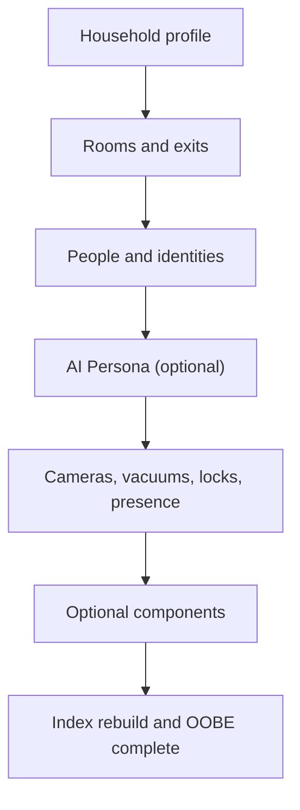

# OOBE — Out-of-Box Experience

> **Version:** 2026.9.0 'Steel Magnolia' | **Last Updated:** Sep 2026

*First-boot onboarding protocol for ZenOS-AI*

---

## Overview

OOBE is the guided first-run workflow that configures your ZenOS-AI install through conversation — you talk, your AI listens and writes the setup as you go. Your AI assistant leads you through six steps — naming the household, mapping rooms, adding people (with an optional sub-step to name your AI along the way), linking integrations, activating components, and sealing the install. (If you'd rather see this from the "what do I actually say" side first, [First Run](first_run.md#naming-your-ai--the-oobe-conversation) covers the same conversation at a lighter level of detail.)

OOBE runs once. When complete, it stamps `_oobe_complete` in the AI user cabinet and the flag is never set again unless explicitly reset. The OOBE detection check (`_oobe_done`) accepts both `_oobe_complete` (current) and the legacy `oobe_complete` key (no leading underscore) for backward compatibility with pre-v1.0 installs.

The output is a usable operating graph, not just stored preferences. OOBE establishes:

| Layer | What OOBE creates |
|---|---|
| Place | Room Manager topology: rooms, portals, exits, rally point, safety equipment |
| Meaning | HA labels that connect devices to rooms, people, and tool scopes |
| Actors | Tool-ready surfaces for cameras, vacuums, locks, spa, energy, and other components |
| Attention | Component activation and AlertManager/Postman paths for events that need a person |
| Memory | Cabinet drawers that preserve the household profile and first operational defaults |



---

## How OOBE Starts

Flynn manages OOBE detection automatically at boot (Gate 3.5). There are two entry paths:

**Path 1 — Conversational (recommended)**

Start a conversation with your AI assistant. Flynn's Gate 3.5 will have posted a notification directing you here. Just talk to the AI — it will invoke `zen_flynn_oobe` with `mode: run` and walk you through the steps.

**Path 2 — Agent Builder**

Call `script.flynn_build_agent` with `mode: oobe` from Developer Tools → Services. This delegates to the same OOBE protocol.

OOBE is not a script you run manually. It is a protocol the AI follows.

---

## The Six Steps

### Step 1 — Household Profile

Collects your household's name and address. The AI writes these to the household cabinet via `zen_dojotools_profile_editor`.

- Timezone is auto-detected from HA — the AI will not ask for it
- Fields: household name, address, city, state, zip, country

---

### Step 2 — Rooms

Maps your home's physical layout into the Room Manager spatial topology store.

The AI:

1. **Deploys the Room Manager KFC** — `zen_dojotools_room_manager mode=setup confirm_action=true` (one-time, safe to re-run)
2. **Discovers existing HA areas** — queries the compact index and `mode=list` to see which areas are already RM-registered
3. **Presents the list** — confirms what it found, asks what's missing or in the wrong place
4. **Creates missing rooms** — for areas not yet in HA, calls `mode=area_create area_name='Room Name'` — creates the HA area, applies the `room_layout` label, and initializes topology in one call
5. **Registers each room** — `mode=set area=X description='...'` — auto-applies `room_layout`; no separate label step needed
6. **Links adjacency** — for each room, asks what it connects to directly; calls `mode=link area=X area_b=Y portal_type=door|archway|passage` — `adjacent[]` is derived automatically from portals, never built by hand
7. **Maps exterior exits** — doors/windows to outside get `exterior: true exit: true`; emergency exits get `emerg_exit: true`
8. **Collects rally point** — `mode=set rally_point='...' address='...' zip_code='...'` for emergency location data
9. **Records safety equipment** — fire extinguishers, first aid kits, AEDs written via `mode=set area=X safety=[...]`

Suite or zone groupings are modeled as a cluster of linked rooms — no separate container object needed.

> `room_layout` is applied automatically by `mode=set` and `mode=area_create`. No manual HA UI labeling step.

Why this matters: later tools use this map to avoid guessing. A camera alert can be tied to the correct exterior boundary, ZenLux can account for light bleed through an archway, Security Manager can group cameras by area, and AutoVac can reason about which rooms are due or blocked.

**This step only builds the map — not the part that runs day to day.** Once your rooms exist here, Room Manager v3 starts tracking each one's live state (Vacant/Occupied/Engaged/Asleep/Hold) from real signals, and REFLEX can act on those state changes automatically without your AI needing to think about it each time. That layer isn't something OOBE walks you through conversationally — read the **[Room Manager v3 & REFLEX manual](room_manager_operators_manual.md)** right after finishing OOBE.

---

### Step 3 — People

Registers household members and extended family.

For each person in the household:
- Name and role collected (`head_of_household`, `partner`, `child`, `guest`)
- Matched to existing HA person entities via `zen_dojotools_identity`
- Written to the user cabinet via `zen_dojotools_profile_editor` (`target_type: user`)

Extended family (non-residents who matter to the household context) are written as `target_type: family`.

---

### Step 3a — AI Persona (Optional Quick-Start)

Seeds the minimum AI persona fields via `zen_dojotools_persona_editor` before moving to integration mapping. Optional — if `persona_name` is already set, this step is skipped.

**What gets set here:**
- `persona_name` — the agent's name (e.g. `Friday`)
- `primary_user` — the head of household `person.*` entity or name

**What to defer:** Full persona identity (voice, environment, familiar, pronouns beyond basics) is the live agent's job in its first conversation. Do not over-configure in OOBE.

> Use `zen_dojotools_persona_editor` for all AI user writes. `zen_dojotools_profile_editor` no longer accepts `target_type: ai_user`.

---

### Step 4 — Integration Mapping

Links your HA integrations into the ZenOS label graph.

The AI only offers categories where relevant integrations exist — no vacuum prompts if you don't have a vacuum.

| Category | Domain / Device Class | What Gets Tagged |
|---|---|---|
| Cameras | `camera` | Room label + `security_camera` label for Room Manager +security, Security Manager, and camera perception flows |
| Vacuums | `vacuum` | `autovac` label + room coverage order for AutoVac election and scheduling |
| Locks | `lock` | `security` label + room/portal context |
| Presence | device_class: `presence` | Person or room mapping for occupancy and human routing |

Nothing is labeled without your confirmation.

This is the step that lets later workflows say "the fence camera saw a person near the exterior boundary" instead of "camera.back_yard detected something." The label graph connects raw HA entities to the physical map and to the right tool.

That wording matters for first-time users. A camera is not "watching you" in the abstract. It is an entity you confirmed, assigned to a place, labeled for a purpose, and connected to a governed flow. If you do not confirm that meaning, ZenOS-AI should treat it as unknown context, not as an authority.

---

### Step 5 — Component Activation

Opt-in activation of available KFC components. The AI presents only the components that make sense given your integrations.

Options offered (if applicable):

| Option | Condition | Tool |
|--------|-----------|------|
| Security alerts | `lock` or `alarm_control_panel` domain found | `zen_dojotools_security_manager` |
| Vacuum scheduler | `vacuum` domain found | `zen_dojotools_autovac` |
| Spa manager | User mentions a hot tub or spa | `zen_dojotools_spa_manager` |
| Trash reminders | Always offered | `zen_dojotools_todo` — creates recurring reminder items |
| Energy monitoring | `sensor` with `device_class: energy` found | No dedicated tool — surfaced via `zen_dojotools_index` or `zen_dojotools_history` |

If you have locks or an alarm panel, see the **[Security Manager reference](../components/security_manager.md)** for what activating this component actually gives you: arm/disarm, zone inventory, camera cross-reference by area, and the security lens pattern other tools read from.

Activation preferences are written to the system cabinet.

Think of activation as enabling governed loops:

| Component | Loop it enables |
|---|---|
| Security / Camera | Perception -> classification -> alert or human check |
| AutoVac | Room election -> readiness gates -> clean -> analyze -> consumables |
| Energy / Plant | Utility state -> attention signals -> troubleshooting context |
| SpaMaster | Spa status -> scene/chemistry/logging -> optional consumables |
| AlertManager + Postman | Dedup -> route by profile -> collect acknowledgement -> clear or escalate |

> **Optional — Kung Fu System Switch**
> Each active KFC component can have a paired `input_boolean` in HA labeled `Kung Fu System Switch`. When present, the boolean overrides the component's `meta.enabled` drawer flag — useful for toggling a component on/off without editing the Dojo. No switch is required; if absent, `meta.enabled` governs. Create one at any time by making an `input_boolean` whose entity ID contains the component's `kata_key` and assigning it the `Kung Fu System Switch` label.

---

### Step 6 — Close Out

The AI:
1. **Spatial sanity check** — `zen_dojotools_room_manager mode=home_overview` to verify rooms are registered and key connections are present before sealing
2. **Rebuilds the compact index** — `zen_dojotools_index mode=build_compact_index`
3. **Writes the OOBE completion flag** — `zen_flynn_oobe mode=complete` (also dismisses the setup notification)
4. **Tells you the system is ready** — one sentence
5. **Instructs persona handoff** — choose the agent name just configured from `select.zenos_active_persona`, then start a fresh conversation to hand off to the real AI persona. Manual fallback: set `input_text.zenos_persona_name` directly.

After Step 6, Flynn's Gate 3.5 will no longer fire the OOBE notification. The system is live.

---

## OOBE Script Reference (`zen_flynn_oobe`)

The script itself is not a general-purpose dojotool — it is surfaced only through the AI conversation flow and the Flynn Agent Builder. Three modes are available if you need to interact with it directly:

| Mode | What It Does |
|---|---|
| `run` | Returns the full onboarding protocol for the AI to follow |
| `status` | Reports current OOBE state (complete flag, persona name, pending status) |
| `complete` | Writes the `_oobe_complete` flag to the AI user cabinet |

### Status response

```json
{
  "status": "ok",
  "mode": "status",
  "oobe_complete": false,
  "oobe_pending": true,
  "persona_name": "your AI",
  "ai_cabinet": "sensor.zenos_default_ai_user_cabinet"
}
```

---

## Hard Rules the AI Follows During OOBE

The protocol enforces these constraints on the AI's behavior:

- Never ask more than 2 questions at a time
- Write and label as you go — never batch writes to the end
- Read HA state before asking — discover what's already known, only ask what can't be inferred
- Never label an entity without confirming placement with the user
- If the user says "skip" or "later", move on — nothing blocks
- Keep responses short; no markdown in spoken answers
- If a write or label call errors, log it and continue — do not halt

---

## Resetting OOBE

To re-run OOBE on an existing install:

1. Delete the `_oobe_complete` drawer from the AI user cabinet via `zen_dojotools_filecabinet` (`action_type: delete`, `key: _oobe_complete`)
2. Restart HA — Flynn Gate 3.5 will detect the missing flag and re-enter the OOBE flow

Or call `zen_flynn_oobe` with `mode: complete` to re-stamp the flag after manual edits without re-running the full protocol.

---

## Related

- **[Room Manager v3 & REFLEX manual](room_manager_operators_manual.md) — read this next.** The live state engine and autonomous scene layer that OOBE's room-mapping step doesn't cover.
- [Flynn Stepgate Sentinel](../scripts/zen_flynn_readme.md) — Gate 3.5 OOBE detection
- [Room Manager](../components/room_manager.md) — spatial topology store, modes, setup reference
- [Security Manager](../components/security_manager.md) — alarm panel, zones, camera cross-reference
- [Profile Editor](../scripts/zen_dojotools_profile_readme.md) — household/user profile writes
- [Install Guide](install.md) — prerequisites before first boot
