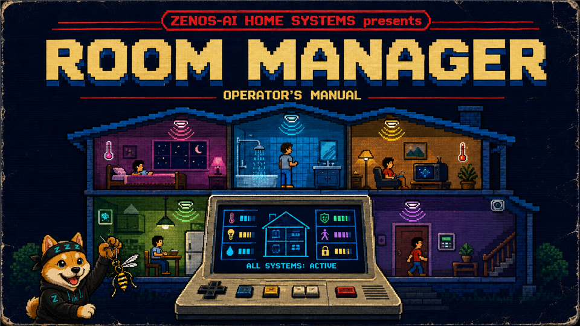
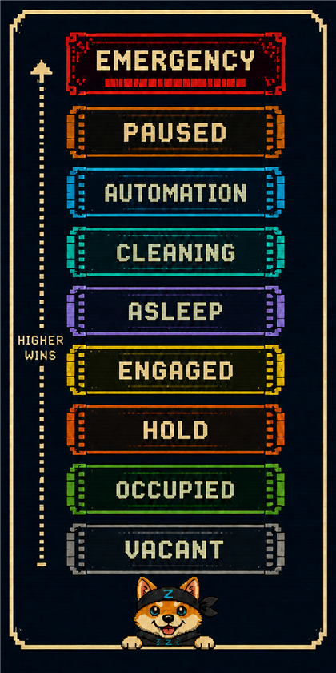
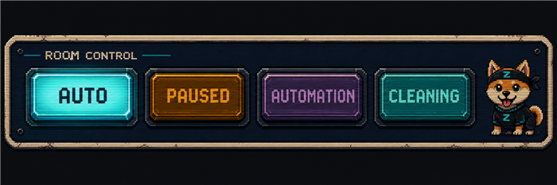
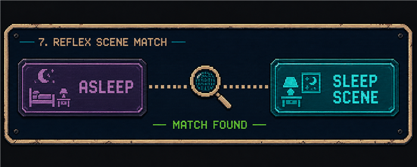
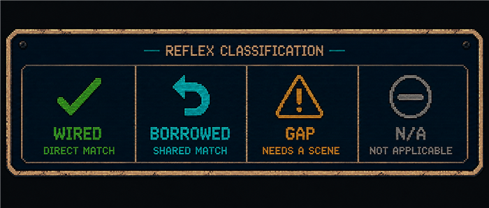
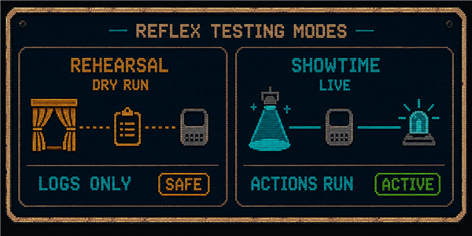
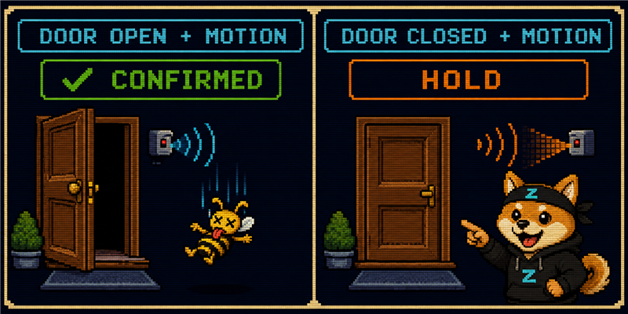
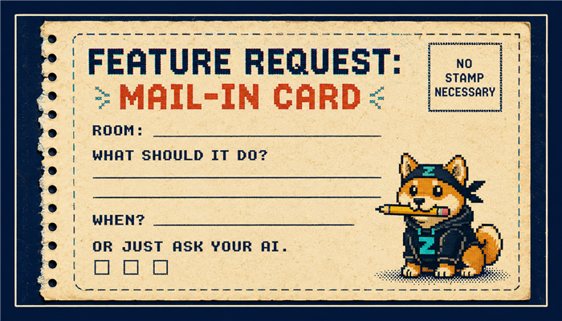

# ZENOS-AI HOME SYSTEMS presents: ROOM MANAGER

### Operator's Manual

> "Your devices know where they are. Now your rooms know what they're doing."

**Model:** Room Manager v3 &nbsp;•&nbsp; **Engine:** REFLEX &nbsp;•&nbsp; **Players:** 1 household &nbsp;•&nbsp; **Skill level:** Set & forget

> KEEP THIS MANUAL FOR FUTURE REFERENCE. It contains important
> operating instructions and troubleshooting information you will
> need if you ever wonder "why did the office lights just do that."

---

## TABLE OF CONTENTS

1. [Before You Begin](#1-before-you-begin)
2. [What Is Room Manager, And Why Is It Here](#2-what-is-room-manager-and-why-is-it-here)
3. [How It Sees Your House](#3-how-it-sees-your-house)
4. [The Nine States of a Room](#4-the-nine-states-of-a-room)
5. [The Control Panel (your room_control_manager switch)](#5-the-control-panel-your-room_control_manager-switch)
6. [Special Moves (opt-in features)](#6-special-moves-opt-in-features)
7. [REFLEX: Turning a State Into a Scene](#7-reflex-turning-a-state-into-a-scene)
8. [Patterns & Practices (playing it well)](#8-patterns--practices-playing-it-well)
9. [Hints, Tips & Tricks](#9-hints-tips--tricks)
10. [Troubleshooting](#10-troubleshooting)
11. [What's Next](#11-whats-next)
12. [How to Request New Features](#12-how-to-request-new-features)
- [For the Technically Curious](#for-the-technically-curious)
- [Addendum: For Agents Reading This Doc](#addendum-for-agents-reading-this-doc)

---

## 1. BEFORE YOU BEGIN

You don't need to read this whole manual to enjoy Room Manager. In fact,
if Room Manager has already been installed in your home, it's already
running. Every configured room has been quietly watching, thinking, and
reacting since the day it was turned on.

This manual is for the curious. The kind of person who reads the back of
the cereal box. If that's you, welcome. Grab a controller.

**No batteries required. No cartridge to insert.** Room Manager lives
inside your Home Assistant system already. You're not installing
anything by reading this.

---

## 2. WHAT IS ROOM MANAGER, AND WHY IS IT HERE

Picture your house before Room Manager: every light, every vent fan,
every "should the TV shut off now" decision was either (a) something
*you* had to do by hand, forever, or (b) a pile of separate automations
that didn't talk to each other and didn't agree on what a "room" even
was.

Room Manager fixes this by giving **every room in your house a single
source of truth about what it's doing right now.** Not "is the light
on." Not "did a sensor fire." The actual, plain-English answer to
*"what is happening in the office at this exact moment?"* It updates
that answer instantly whenever something real changes.

Once a room knows what it's doing, everything downstream gets simple.
Scenes fire themselves. Fans turn on and off on their own schedule.
Left-on TVs go dark. Nobody has to remember to do anything, because the
room already knows.

> **Think of it like this:**
>
> **Old way:** "if motion sensor = on, turn on light" — a pile of these, one per room, forever.
>
> **New way:** "this room IS occupied" — one sensor says so, everything else reads that ONE answer and reacts.

---

## 3. HOW IT SEES YOUR HOUSE

Every room that's been set up gets **one status sensor.** Think of it as
that room's own little scoreboard. You can look at it any time, ask
your AI, or peek at it directly in Home Assistant, and it will tell you
in one word what that room believes about itself right now.

It figures this out by watching a handful of signals for that room:
motion, presence, media playback, doors, whatever's been wired up. It
combines them using a fixed set of house rules (Section 4).

Room Manager derives its state from configured signals. It does not ask
the AI to guess. If nothing in a room is tagged to tell it about motion,
that room simply never reports "Occupied" from motion. It's not broken.
It just has nothing to say on that subject.

**Rooms can also talk to each other.** A bathroom attached to a bedroom
can tell the bedroom "someone's active in here," which keeps the bedroom
from going fully dark and quiet while someone's brushing their teeth at
2am. This is opt-out, not opt-in. It's on by default for any room that's
connected to a parent room.

---

## 4. THE NINE STATES OF A ROOM

Every room is always in exactly one of nine states. Higher on this list
always beats lower. If two things are true at once, the room reports the
more important one.

| State | What it means |
|---|---|
| 🚨 **Emergency** | Smoke, CO, water leak, or an alarm. Wins, always, even over Paused. Safety is never silenced. |
| ⏸ **Paused** | A human hit the brakes. Only a human can release it. The room ignores automation while this is set. |
| 🤖 **Automation** | Your AI (or another automation) has taken the wheel for this room on purpose, temporarily. |
| 🧹 **Cleaning** | The robot vacuum is in here right now. |
| 😴 **Asleep** | Someone's asleep in here. Beats Engaged: a device staying active nearby never overrides a real Asleep signal in the same room. |
| ⚡ **Engaged** | Someone is ACTIVELY using this room. Media is playing, a desk is in active use. Stronger than just "someone's here," but not stronger than the room's own Asleep. |
| ⏳ **Hold** | One of exactly five lines is currently high: the wasp flag (motion with no door-open to confirm entry, only for rooms opted in — see Section 6), Entertaining mode (room opted in), Guest mode (room opted in), a continuous-presence (mmWave) sensor tagged for Presence Hold (room opted in), or any entity tagged with the plain `hold` label for that room. Whichever one is true, the room reports Hold — it stays Hold exactly as long as that source stays true, clears the moment it goes false. Never a timer. |
| 🟢 **Occupied** | Somebody's in here. Presence detected, no specific activity known. |
| ⚪ **Vacant** | Nobody's in here. The default. Nothing wrong with it. Most rooms are Vacant most of the day. |

**A note on "why does the room think that?"** Most states can tell you
why they're active, including which exact sensor caused it and when.
Just ask your AI "why is the office engaged right now?" and it can pull
the real answer, not a guess. (Vacant is the one exception: it's the
default when nothing else is true, so there's no specific sensor to
point at.)

---

## 5. THE CONTROL PANEL (your room_control_manager switch)

Some rooms have a control switch. Think of it as the room's own override
lever, sitting right there on the dashboard. It includes AUTO, plus
every state from Section 4. The four positions you'll use or see most
often are:

| AUTO | PAUSED | AUTOMATION | CLEANING |
|---|---|---|---|
| Normal operation | Stop all automation for this room until a human flips it back | "I've got this room" until released or a human takes it back | Vacuum is working here right now (set for you, don't touch it) |

**AUTO is the only position that means "figure it out normally."** Every
other position, whether it's one of the four above or a state picked
directly from Section 4, forces the room's state and overrides whatever
the sensors are saying. Think of AUTO as "let the room decide" and
everything else as "I've decided for it."

**PAUSED** is your stop button. Flip it and the room ignores automation
entirely until *you*, specifically, flip it back. Anything, even your
AI, is allowed to pause a room if something odd is happening, but only a
human can un-pause it. That's on purpose. (Paused shows up both as a
control panel position and as a state in Section 4; they're the same
thing seen from two sides, "I picked this" and "this is what the room is
now.")

**"Only a human" is enforced now, not just intended (2026-08-16).** Moving a room out of Paused requires the `room_control_override` certification, and — same as an exterior door unlock — a fresh live yes/no to *your* device every single time, even if that certification is already granted. There's no standing "always let it unpause" setting by design; if a specific room's back-and-forth is genuinely more friction than it's worth, an admin can scope an exemption to just that room. See the [Security & Certification System operator manual](security_certification_manual.md) for how certification grants and scoped exemptions actually work.

**AUTOMATION** means an agent has deliberately taken over this room for
a task, such as running a scene sequence or testing something, and will
hand it back when done. Some rooms have a built-in safety net (Section
6) that automatically hands it back if it's left in this state too long
and forgotten.

**CLEANING** is set automatically the moment your vacuum rolls into that
room, and cleared the moment it leaves. You never need to touch this one
yourself.

**Manually setting Occupied, Engaged, Asleep, Hold, or Vacant** is also
available on the same switch, pick any of them directly and the room
holds exactly that until you change it back, no automatic clock
involved. This is the "put this room to sleep until I say otherwise"
button: pick Asleep and it stays Asleep regardless of what any sensor
sees, until someone picks something else.

---

## 6. SPECIAL MOVES (opt-in features)

Not every room needs every feature. Turn these on room by room, only
where they make sense. A garage doesn't need a TV sleep timer, and a
closet doesn't need a vent fan.

> **THREE LEVELS, IN CASE THAT HELPS.** Everything in this manual sorts
> into exactly three tiers of effort. Knowing which tier you're on tells
> you what to expect before you start.
>
> **① TAG IT. THAT'S THE WHOLE LEVEL.** Every Special Move below, and
> every signal in Section 4's states, runs off labels — two clicks in
> Settings, no file, no restart-and-pray. This is nearly everything in
> this manual. If a feature is described anywhere below as "labels and
> helpers, done through the normal HA UI," this is the tier it's in.
> **What you get for doing nothing at all:** a room with zero labels
> still exists, still reports a state (Vacant, forever, correctly — see
> Section 9's tip on this), and breaks nothing. The floor here is high.
>
> **② DEPLOY THE TEMPLATE. ONCE PER ROOM, THEN NEVER AGAIN.** Before a
> room can report a state at all, it needs its own status sensor — Step
> 3 below, the one actual file. Five minutes, once, ever, per room. Every
> Special Move in Tier ① then just works for that room, no separate
> unlock needed per feature.
>
> **③ STACK LABELS FOR COMBINED EFFECTS.** This isn't a harder tier —
> it's Tier ① again, just more of it on the same entity or the same room.
> A media_player tagged `engaged` PLUS a vent fan tagged `vent_fan` PLUS
> Entertaining Hold turned on isn't three separate systems fighting each
> other; it's three labels the SAME dispatcher already reads, all at
> once, resolved by the priority ladder in Section 4. This is what
> Section 8's worked examples actually are: recipes for which labels to
> stack together for a given room type. Nothing new to learn per
> combination — just more Tier ① tagging, aimed well.
>
> **The honest cost:** Tier ① and ③ are genuinely just clicking. Tier ②
> is the one place this system asks something real of you — a text file,
> filled in from a template, once per room. We built it to be that small
> on purpose; see Step 3 below for exactly what that five minutes looks
> like, and Section 11 for why it isn't zero minutes yet.
>
> **Footnote key for what follows:** † = this feature needs the room's
> state sensor already deployed (Tier ②) before it does anything — true
> of almost everything below. ‡ = needs its own dedicated helper beyond
> just a label (a specific timer, usually) — Step 2, not just Step 1.
> Nothing below is marked with neither AND lacks †; if a feature isn't
> marked †, it's the one deliberate exception — say so explicitly where
> it applies.

**⏱ Control Burnout** †‡ — "Don't let a room get stuck in Automation forever." If a room is handed to Automation and nobody releases it within the timer window, it snaps back to Auto by itself. A safety net, not a nag. *Needs its own `control_burnout`-labeled timer helper, not just the label on an existing one.*

**📺 TV Sleep Timer** †‡ — "Falling asleep with the TV on? Not anymore." While a room is Asleep, media playing starts (or restarts) a countdown. When it hits zero, the TV shuts off and the room's normal sleep timer takes over. *Needs its own `timer.<room>_tv_sleep_timer` (naming-convention, no label) plus a media_player already tagged `engaged`.*

**🌬 Vent Fan Auto On/Off** †‡ — "The fan turns itself on shortly after you walk in, and stays on a little while after you leave." No switch-flipping required. *Needs the fan/switch tagged `vent_fan`, and works out of the box from there — the delay/min-runtime helpers (naming-convention) are optional tuning, not required to function.*

**🌙 Nightlight** †‡ — "A dim, gentle scene fires if you get up in the night," then quietly reverts once you settle back down without ever fully waking the room's Asleep state. *Needs its own `nightlight_timer`-labeled timer, plus Asleep already working for that room (motion or bed sensor tagged).*

**🌃 Sleep Window** † (on by default, per room) — "A room only falls asleep automatically at night." A bed sensor tripping at 2pm (someone folding laundry on the bed, say) won't put the room to sleep. Automatic sleep only fires between night and wake. Can be turned off per room if you want round-the-clock auto-sleep, or automatic sleep can be disabled entirely for a room (manual Asleep, Section 5, always still works either way).

**🕐 Autosleep Schedule** † — "No standard sleep pattern? No problem." Shift worker, firefighter, anyone whose "night" isn't actually at night — this room doesn't have to follow the house's clock at all. Point it at a calendar, an HA Schedule helper, or a toggle you flip yourself instead, and that becomes this room's own private night, completely replacing the house-wide clock check for it. Everybody else's rooms keep working off the normal night-to-wake window; this one just marches to its own schedule.

**😴 Asleep Hold** † — "Sleep now — no bed sensor required." Tag a toggle, calendar, or schedule, and while it reads on, the room simply IS Asleep, full stop — no clock, no waiting on a sensor to catch up, no window check. Flip it back off (or let the calendar event end) and the room lets go instantly, no lingering.

**🍸 Entertaining Hold / Guest Hold** † — "While entertaining mode or guest mode is on, opted-in rooms stay conservative instead of guessing." Prevents a busy house from flickering a room between Occupied and Vacant. Opt in per room; a room not opted in is unaffected.

**📡 Presence Hold** † — "A continuous-presence sensor is trusted enough to hold the room outright, no guessing." Tag a continuous-presence (mmWave) sensor — not a PIR motion sensor — `presence` plus the room's own label, and while it reads on, the room reports Hold, no clock, no decay. Clears the instant the sensor goes false. This is one of five sources that can put a room in Hold (see Section 4 and the Power User Secrets in Section 9) — the others are the wasp flag, Entertaining Hold, Guest Hold, and the plain `hold` label on any entity tagged for the room.

**🐝 Wasp (Hold from an unconfirmed entry)** † — "Motion with no door-open to explain it holds the room, instead of guessing." Requires TWO things before it does anything: at least one door tagged `wasp_door` for that room (Section 8's "the door, not the lock" tip), AND the room itself opted in with the `wasp_enabled` label — either on the room's Area directly, or on any entity in that room. Both, not just one. This is opt-in on purpose: a room with an always-open archway instead of a real door (a connected front hall, say) can't safely tell "someone's inside with the door shut" from "there is no door" — tagging `wasp_door` there without also enabling the room would just misfire. If a room's Hold never seems to trigger from motion alone, check both halves are actually set before assuming something's broken. (See Section 9's "the door, not the lock" tip for the other common wasp_door setup mistake.)
&nbsp;&nbsp;&nbsp;&nbsp;**Release has a cooldown, on purpose.** The instant the door opens, wasp Hold doesn't just vanish and re-arm on the next flicker — it holds off re-latching for a short blind period (5 seconds by default) so a door that swings shut and immediately reopens doesn't false-trigger a fresh Hold. Tune it per room by tagging a number helper `wasp_blind_seconds` plus the room's own label; untagged rooms just use the 5-second default.

**🔓 Generic Hold** † — "Tag anything, and while it's on, this room is in Hold — full stop." The plainest of the five Hold sources: tag any entity `hold` plus the room's own label, and while that entity reads on/open, the room reports Hold, no clock, no decay, clears the instant it goes false. No opt-in flag needed beyond the tag itself — this is the general-purpose escape hatch for "I have some other condition that should hold this room" without waiting on a dedicated feature to be built for it.

**🔐 Exterior Lock Awareness** † — "Know how many doors are actually unlocked right now, not just whether any are." Tag exterior lock entities `ext_lock` (plus the room's own label) and the room's state sensor reports three things: whether ANY are unlocked (`ext_unlocked_active`), exactly how many (`ext_unlocked_count`), and how many exterior locks this room even has (`ext_lock_count`). No timer, no decay — a live read of real lock state, same instant it changes.
&nbsp;&nbsp;&nbsp;&nbsp;**Acting on a room's locks**, not just reading them, is a separate tool: `zen_dojotools_locks mode=set room=<room> action=lock` (or `unlock`) locks/unlocks every lock in a room at once, no need to name each one. `mode=discover room=<room>` lists them with live state first if you want to check before acting. `entity_id=` still works for a single explicit lock instead of a whole room.
&nbsp;&nbsp;&nbsp;&nbsp;**Not the same as `privacy_door`** (a different, older label) — that one doesn't feed anything right now (see the note in Section 10). If a lock is currently tagged `privacy_door` and you want it counted in `ext_lock_count`, retag it `ext_lock`.

**📳 Vibration (occupancy, engagement, or "the load is done")** † (except `vibration_completion` — see below) — "A shaking washer means someone's using this room. A washer that stopped shaking twenty minutes ago means the load is done." Vibration is deliberately purpose-neutral: tagging a sensor `vibration` alone does nothing to the room's state by itself — it only makes the dispatcher notice the moment vibration starts and stops. To make it actually count toward Occupied or Engaged (your call, per room — a washer running is arguably "actively doing a thing," same tier as a media_player), tag that SAME sensor with `occupied` or `engaged` too, exactly like Section 4's other signals. Nothing new to learn here: it's Tier ① tagging, stacked.
&nbsp;&nbsp;&nbsp;&nbsp;A separate, optional third label — `vibration_completion` — turns on "the load is done" detection on that same sensor. **This is the one feature in this entire manual that does NOT need † — no room state sensor required at all.** It's a standalone watcher, tracked in the household cabinet rather than the room sensor, so it works even on a room that's never had Step 3 done. This isn't just "vibration stopped": a half-second bump reads as noise, not a finished cycle, so it only fires after the vibration ran a genuine 20 minutes or longer before stopping, same anomaly-filter logic the household's real washing-machine automation already uses. When it fires for real, it's logged as an event (`vibration_load_complete`) — ask your AI "did the washer finish?" and it can check.
&nbsp;&nbsp;&nbsp;&nbsp;**How to test it:** there's no dry-run mode for this one yet (unlike REFLEX, Section 7) — the honest way to check it's wired right is to trigger the sensor for real (run the appliance, or tap/shake it if that's enough to register) and then ask your AI whether the room went Occupied/Engaged, and separately whether a `vibration_load_complete` event showed up after a real, full-length run. A short test tap won't fire completion on purpose — that's the anomaly filter working, not a bug.

None of it requires a code editor or a YAML file — every feature above
turns on the same way: labels and helpers, done through the normal HA
UI. Here's how.

**Why you're doing this at all:** we can't see your house until you
tell us where things are. This is that telling — once, per room. There's
no ongoing homework: describe a room here and it's described for good.
Every feature this system ships from now on reads the same labels you
already set, so a new feature down the road costs you a label, not
another setup pass.

1. **Tag a sensor as a signal.** Settings → Areas, Labels & Zones → Labels. Create a label matching the signal type you need (`motion`, `occupied`, `engaged`, `asleep`, `bed_occupancy`, `hold`, `wasp_door`, etc.) if it doesn't already exist. Then open the sensor itself (Settings → Devices & Services → Entities, find it, click in), and add TWO labels to it: the signal type AND the room's own label (which should already match the room's Area name). Both labels, same entity, every time.
2. **Create a helper** (timer, latch, etc.). Settings → Devices & Services → Helpers → "+ Create Helper". Pick the type (Timer, Number, Toggle/Boolean, Select). Give it whatever name you like. Once created, go tag it the same way as Step 1: the class label (`room_timer`, `emergency_latch`, `asleep_minutes`, etc.) plus the room's own label.
3. **Deploy the room's state sensor** (once per room). **This one step is
   the exception to "no YAML file"** — Home Assistant has no working UI for
   this kind of blueprint (confirmed against HA's own documentation and
   support channels: template-domain blueprints have never had a Settings
   UI, YAML is the only way they've ever been instantiated). This is not
   a bug in this system, and no AI assistant can do it for you either — a
   chat-based agent only has tool calls, not filesystem access, and this
   step genuinely requires writing a file. A person with access to the
   configuration files needs to copy `room_deployment_template.md` (right
   next to this manual) into a new room package file, fill in the room
   name and trigger entities, and reload. It's a five-minute copy-paste-fill
   job, not a coding task — the template does the hard part for you.
4. **Save, then reload.** After creating or editing anything above, Settings → System → Restart, or use a YAML reload if you know which domain changed. When unsure, a full restart always picks everything up.

Steps 1, 2, and 4 need no code editor, ever. Step 3 is the one real
exception — a one-time, once-per-room file edit, unavoidable given how HA
itself works. Everything past Step 3 (Control Burnout, TV Sleep Timer,
Vent Fan, Nightlight, Sleep Window, Autosleep Schedule, Asleep Hold,
Entertaining/Guest Hold) is pure Step 1/Step 2 labeling again, no file
access needed. The dispatcher that reacts to all of it is already running
in the background and needs no per-room setup of its own.

If you have an AI assistant hooked up, it can do Steps 1, 2, and 4 for
you — "turn on control burnout for the office" — genuinely hands-off.
Step 3 is the one place it has to hand the actual file edit to a human;
it can tell you exactly what to put in the file, but can't submit it for
you.

---

## 7. REFLEX: TURNING A STATE INTO A SCENE

> **A MESSAGE FROM THE DEVELOPMENT TEAM.** We are extremely proud to
> present: **R.E.F.L.E.X.** — **R**eactive **E**ngine **F**or
> **L**ights, **E**nvironment & e**X**perience. Six letters. Perfect
> balance. Our finest engineers convened many times to arrive at this
> name, and we are confident that no household anywhere requested it.
> This does not diminish our pride. The name was decided before the
> acronym existed to justify it, and — after careful internal review —
> we have elected to keep both the name and our dignity. Thank you
> for your understanding on this matter.

Everything in Sections 1–6 gets you a room that *knows* what it's doing —
Occupied, Asleep, Hold, whatever. Knowing isn't doing. **REFLEX is the
engine that actually reacts** — the thing that takes "the office just
became Asleep" and turns it into "the office's lights actually dim and
the TV actually turns off." It's the "Engine" named on this manual's
cover for a reason: it's a separate system from state-tracking, and it
has its own on/off switch.

**REFLEX is off by default, house-wide, even once every room's
state-tracking is fully working.** This is one switch for the whole
house, not a per-room setting — every room can know exactly what it's
doing, with zero risk of any scene firing anywhere, until you flip
REFLEX on. Ask your AI "is reflex on?" or "turn reflex on" any time.
(Per-room *wiring* — which scenes belong to which room, described
below — is separate and can absolutely be done room by room ahead of
time; it just won't actually fire anything until the house-wide switch
is on.)

### How REFLEX picks a scene

REFLEX doesn't guess which scene to fire. It looks for a scene labeled
to match the room's new state, using the exact same label-tagging
mechanism as everything else in Section 6:

1. **Label a scene with the state it belongs to.** A scene meant to fire
   when a room goes Asleep gets the label `scene_asleep`. Occupied gets
   `scene_occupied`. Same pattern for `scene_vacant`, `scene_engaged`,
   `scene_cleaning`, `scene_emergency`, `scene_nightlight`,
   and so on — one label per state, matching Section 4's state list.
2. **Label the same scene with the room.** Exactly like tagging a sensor
   in Section 6 Step 1 — the scene needs both labels: which state it's
   for, and which room it belongs to.
3. **Optionally, label it for a specific time of day.** If you want the
   office's Occupied scene to look different at 7am than at 9pm, create
   two scenes, both labeled `scene_occupied` and the room, but each also
   labeled for a daypart (morning, daytime, evening, night, etc.). A
   scene with no daypart label is the room's fallback for that state, any
   time of day. A scene WITH a daypart label wins over the fallback,
   only during that daypart.

Once a scene carries state + room (+ optionally daypart), REFLEX finds
it automatically the instant the room changes state. Nothing to wire by
hand beyond the labels — same "label it once, it just works" pattern as
everything else in this manual.

**Haven't gotten around to wiring every state for every room?** REFLEX
quietly borrows a sensible scene instead of doing nothing. A room without
its own Engaged scene borrows its Occupied one. Cleaning and Emergency
do the same. Asleep, if unwired, borrows the room's Vacant scene (lights
out is the safe default for "asleep, but nobody's built a dedicated
scene for it yet"). Wire the real one whenever you get to it — the
borrowed scene is a placeholder, not a requirement you're stuck with.

### Setting it up — what actually happens

Ask your AI: *"wire up scenes for the office"* — but here's what's
really going on behind that sentence, so you know what to expect instead
of treating it as a magic button:

1. **It scans for scenes that already exist and look like they belong
   to this room** — matching by scene name and by the room's own Area
   assignment. This is a MATCH step, not a CREATE step: it can only find
   scenes you (or whoever built your dashboard) already made in Home
   Assistant's own Scene editor. **If no scene exists for a room yet,
   nothing gets found, full stop** — REFLEX can't invent a scene, and
   "ask your AI" can't either. A brand-new or rarely-used room (a
   closet, a utility space) often genuinely has zero scenes, and that's
   fine — see Section 8, not every room needs one.
2. **For every state, it reports one of four things:** already wired
   directly, covered by borrowing another state's scene (fine, see
   above), a genuine gap (a state with no scene and nothing to borrow
   from, worth fixing), or "doesn't apply to this room" (Paused,
   Automation — these are always safe no-ops, not gaps).

3. **If a found scene's name is ambiguous about which state or time of
   day it's for** ("Late Night" could mean "this room, empty, at night"
   or "this room, occupied, at night"), it gets flagged instead of
   guessed at. That's a real decision only you can make — what should
   the room actually look like in that situation — so expect to be
   asked, not just told it's done.
4. **Nothing is written until you confirm.** Everything above is a
   preview: which scenes matched, what's covered, what's ambiguous, what
   has nothing to wire at all. Confirming is the one moment state
   actually gets written onto the scene's labels.

So the realistic outcomes of asking your AI to wire a room are: it just
does it (scenes existed, matches were unambiguous), it asks you one or
two questions first (matches existed but which-state-is-this was
genuinely unclear), or it comes back and tells you there's nothing to
wire yet because no scene exists for this room — at which point the
next step is building one in Home Assistant, not asking again.

### Testing before you trust it

Flip **dry run** on (ask your AI — one more house-wide switch, same as
REFLEX itself), then flip **REFLEX** on too — dry run only does
anything while REFLEX itself is on. With both on, REFLEX resolves
everything exactly like it would for real, for every room — same scene
picked, same logic — but logs what it WOULD do instead of actually
firing it. Once you've checked the log and you're happy, flip dry run
off (leave REFLEX on), and it does the real thing from then on.
**REFLEX off, dry run on, by itself, does nothing at all** — dry run
is a rehearsal mode for REFLEX, not a separate always-on simulator; if
the engine itself isn't running, there's nothing to rehearse.

> **REFLEX vs. state-tracking, in one sentence:** state-tracking always
> runs and always tells the truth about the room, REFLEX only acts on
> that truth once you've told it to, and dry run lets it rehearse
> without an audience.

**Checking whether the last fire actually matches the room's current state** is its own diagnostic — ask your AI "did REFLEX fire the right scene for the [room]?" It compares what actually last fired against what REFLEX would resolve for the room's state right now. A mismatch usually just means the room has since changed state again (the fire wasn't wrong, it's just stale), but it can also catch a scene fired manually from outside REFLEX, or a state that never fired anything at all.

---

## 8. PATTERNS & PRACTICES (playing it well)

**Trust the state, don't fight it.** If a room says Occupied and you
think it's wrong, the fix is almost always "the sensor that should be
telling this room about presence isn't wired up yet," rather than "the
system is broken." Check what's tagged for that room (Settings →
Devices & Services → Entities, filter by the room's label) — or ask
your AI to check for you.

**Use PAUSED liberally, use it locally.** If a room is misbehaving,
pausing that one room costs you nothing and doesn't touch the rest of
the house. There is no reason to disable the whole system just to quiet
down one room.

**Let CLEANING be automatic.** Never manually flip a room's control to
Cleaning. It's meant to track the real vacuum, and manually setting it
will make the room think a robot is in there when it isn't.

**Not every room needs everything.** A hallway probably just wants basic
Occupied/Vacant. A bedroom wants the full stack: Asleep, nightlight, TV
sleep timer. Match the features to how the room is actually used.

**Ensuite rooms cascade up on purpose.** Linking a bathroom to its
bedroom as a child room sets up a parent/child relationship: whatever
the child reports gets hardwired in as true for that same slot in the
parent. Net effect — your bathroom can hold the bedroom's lights on
so it doesn't go dark while you're brushing your teeth. But if you get
up in the middle of the night and the bathroom motion trips Occupied,
your partner can stay asleep in their favorite sleep scene, because
Asleep sits higher on the ladder than Occupied — the bedroom's own
direct Asleep state always wins regardless of what the child room is
reporting.

**Paused and Emergency are the exception — those cascade all the way up,
always.** Unlike the Occupied-only cascade above, a Paused or Emergency
child room is never optional and is never blocked by the ensuite-cascade
toggle: it shows up at every parent and grandparent above it, and it can
wake a sleeping parent room. A smoke alarm in the ensuite means the
bedroom sees Emergency too, full stop.

**Disarming the alarm can occupy a room on its own, if you've set that up.** Security Manager's `disarm_occupies_arrival_area_enabled` setting (off by default) makes any real disarm fire a synthetic occupied signal into every room tagged `arrival_area` — the entryway you walk through when you get home, say. That room goes Occupied the moment you disarm, not whenever its own motion sensor happens to catch up. See the [Security & Certification System operator manual](security_certification_manual.md) for how to turn it on.

### Worked examples: setting up common room types

Here's Section 6's Steps 1/2 recipe applied to the room types people
actually set up. Each one lists what to tag by hand; the "Say" line is
the equivalent shortcut if you're handing it to an AI instead.

**🛏 A bedroom** — Motion + a bed sensor for Occupied/Asleep. Nightlight so a 2am trip to the bathroom doesn't fully wake the room's state. TV Sleep Timer if there's a TV in the room. Sleep Window is on by default, no setup needed, it just won't auto-sleep the room in broad daylight.
> Say: *"set up the master bedroom: motion, bed sensor, nightlight, and TV sleep timer."*

**🛋 A guest room** — Same as a bedroom, plus Guest Hold turned on so the room stays conservative (favors Occupied/Hold over confidently saying Vacant) for as long as guest mode is active, keeps the room from resetting itself while someone's actually staying in it.
> Say: *"set up the guest room like a bedroom, and turn on guest hold for it."*

**🚒 A bedroom for someone with a non-standard schedule** (shift worker, firefighter, anyone whose "night" isn't at night) — Set up like a bedroom, then point Autosleep Schedule at whatever actually reflects when this person sleeps: a calendar, an HA Schedule helper, or just a toggle they flip themselves before bed. This room stops caring what time the rest of the house thinks it is. If they just want to crash right now, Asleep Hold (or the manual Asleep pick, Section 5) skips the whole trigger/window question entirely — flip it, and the room is Asleep.
> Say: *"set up the bedroom like a normal bedroom, but point autosleep at my work calendar instead of the house's night hours."*

**🚪 A garage or any room with an entry door** — Motion for Occupied. Tag the actual door (not its lock) as the room's entry signal — this is what lets the room tell the difference between "someone's clearly walking through" and "motion fired but nobody actually came in." Skip TV Sleep Timer and Nightlight: a garage doesn't sleep.
> Say: *"set up the garage: motion, and the entry door as the door signal, not the lock."*

**🛁 An ensuite bathroom** — Motion + a moisture sensor if you want leak awareness. Link it to its bedroom as a child room (on by default) so a 2am bathroom trip doesn't make the bedroom look Vacant.
> Say: *"set up the master bathroom and link it to the master bedroom."*

**🛋 A living room or any room where people entertain** — Motion for Occupied, media player for Engaged. Turn on Entertaining Hold so the room stays conservative during parties instead of flickering between Occupied and Vacant as people move around. Vent Fan usually doesn't apply here.
> Say: *"set up the living room: motion, media, and turn on entertaining hold."*

**🚿 A powder room or small utility room** — Usually just motion, nothing else. These rooms don't need Asleep, Engaged, or any of the Special Moves — basic Occupied/Vacant is the whole job.
> Say: *"set up the powder room, just basic occupancy."*

**🧺 A laundry room** — Motion for the basic Occupied/Vacant question. Tag the washer's (and dryer's) vibration sensor with `vibration` PLUS `engaged` — a running machine is "actively doing a thing," not just presence. Add `vibration_completion` on the same sensor(s) if you want a "the load is done" event, not just a room state. Vent Fan usually applies here too if there's one installed.
> Say: *"set up the laundry room: motion, and tag the washer and dryer vibration sensors for engaged and load-completion tracking."*

---

## 9. HINTS, TIPS & TRICKS

- **Tip:** Ask "what's the state of the [room]?" any time. It's a free, instant answer. No need to guess from raw sensors.
- **Tip:** If you want to see WHY a room is in a state before you trust it, ask "why is the [room] [state] right now?"
- **Tip:** Setting a room to PAUSED is completely safe and fully reversible. When in doubt, pause first, ask questions later.
- **Tip:** A minimally configured room still works. With only basic occupancy signals tagged, it simply moves between Vacant and Occupied. There is no minimum setup required to get value.
- **Tip:** Bathrooms attached to bedrooms usually want the ensuite cascade left ON (the default). It's the behavior most people actually want, even if it surprises you the first time.
- **Secret:** REFLEX has a house-wide "dry run" mode that logs exactly what every room WOULD do without actually doing it — see Section 7. It's currently ON, house-wide, as shipped.

---

### ⭐⭐⭐ POWER USER SECRETS ⭐⭐⭐

> YOU FOUND THE HIDDEN PAGE. THE STUFF THE STRATEGY GUIDE DOESN'T PRINT. READ ON, CHAMPION.

 ► HOLD IS JUST "ONE OF FIVE LINES IS HIGH." It's not its own
   signal — it's the room reporting that the wasp flag, Entertaining
   mode, Guest mode, Presence Hold, or the plain `hold` label
   currently reads true, whichever one it is. The first four are
   dedicated features (Section 6); the plain `hold` label is the
   general-purpose one — tag any entity `hold` plus the room's own
   label and it carries exactly the same weight as the other four,
   full Hold, not just a floor at Occupied. Ask "why is the [room]
   hold right now" and `last_trigger` tells you which of the five is
   actually driving it — same word on the dashboard, five different
   reasons underneath, the game never tells you which unless you ask.

 ► THE DOOR, NOT THE LOCK. This is the single most common setup
   mistake and most people never find out they made it. A door's
   LOCK tells you security status. A door's CONTACT SENSOR tells
   you someone crossed the threshold. If a room feels "blind" to
   people walking in through a specific door, 9 times out of 10
   the lock got wired up instead of the door. The system will
   actually warn you about this one now if it catches the mistake
   during setup, but it's still worth knowing why.

 ► THE CLOCK ISN'T ALWAYS RUNNING. Most decaying states (Occupied,
   Engaged) run on a countdown clock that resets on activity. Hold
   from unresolved motion works differently under normal
   operation: it doesn't decay on its own, it sits there until
   something actually resolves it (the door opens again, or a
   human picks a state manually). If a room seems "stuck," check
   whether it's actually Hold before assuming something's broken.
   It's not stuck. It's waiting for real information.

 ► GRANDMA-PROOFING IS A REAL TECHNIQUE. Guest Hold exists
   specifically so a guest room doesn't "helpfully" reset itself to
   Vacant while someone's actually staying in it and just isn't
   triggering motion every five minutes. Turn it on for any room a
   guest might occupy quietly: a home office turned guest room, a
   den with a pull-out couch, whatever.

 ► THE LAUNDRY HAMPER BUG THAT NEVER HAPPENED. Bedrooms have a
   built-in defense against auto-sleeping in broad daylight: a
   pile of laundry set on the bed won't trip the room into thinking
   someone's asleep at 2pm. This runs quietly in the background on
   every bedroom, no setup required. You can turn it off per room
   if you actually want round-the-clock nap detection (a den with
   an actual napper, say).

 ► THE HOUSE'S NIGHT ISN'T EVERYONE'S NIGHT. Autosleep Schedule
   doesn't nudge the house's clock for one room — it REPLACES it
   entirely, for that room only. Point it at a calendar and this
   room stops caring what time it actually is; it only cares what
   the calendar says. Every other room keeps running on the normal
   night-to-wake window like nothing happened. This is the fix for
   "my partner works nights and the house keeps trying to put them
   to bed at 11pm."

 ► "UNTIL I SAY SO" BEATS EVERYTHING BUT AN EMERGENCY. Manually
   picking a state on the control panel (Section 5) outranks every
   automatic signal in the house except a genuine emergency. Pick
   Asleep by hand and no bed sensor, no motion, nothing short of
   you picking something else will move that room off Asleep. This
   is the correct move for "I'm napping somewhere unusual" or "keep
   this room dark for the next hour, I don't care what the sensors
   say."

 ► ASK "WHY" LIKE YOU MEAN IT. Most states your AI reports come
   with a real, traceable reason: which exact entity, and exactly
   when. This isn't a vibe check, it's a genuine audit trail (the
   one exception is Vacant, the default with nothing specific to
   point at). If something looks wrong, "why does the kitchen say
   X" almost always has a real answer, not a shrug.

 ► ROOMS TALK TO EACH OTHER, QUIETLY. The ensuite cascade (Section
   8) isn't the only place this happens: Entertaining Hold and
   Guest Hold both key off ONE shared house-wide switch, and any
   room can opt in or out independently. Flip Entertaining mode ON
   for a party and every opted-in room gets the memo instantly, no
   per-room flipping required.

 ► SCENES FADE IN BY DEFAULT, AND THAT'S ON PURPOSE. Every scene
   this system fires — automatically, not scenes you trigger by
   hand — takes 2 seconds to settle rather than slamming every
   light in the room to full brightness instantly. This also keeps
   a flickery room (a twitchy sensor, say) from hammering your
   smart home network with rapid-fire commands. Want a specific
   scene instant instead — a security scene, say, where the delay
   actually matters? Ask your AI to tag it, or do it yourself:
   label the scene `reflex_transition_0` for instant, or
   `reflex_transition_5` for a slower 5-second fade, any number you
   like. Untagged scenes just get the 2-second default.

---

## 10. TROUBLESHOOTING

| Symptom | Likely cause |
|---|---|
| Room never leaves Vacant even though someone's clearly in there | The sensor that should confirm this room isn't wired to that room yet |
| Room control keeps snapping back to Auto after I set it to Automation | Control Burnout is on for that room. That's the safety net doing its job. |
| Fan / TV sleep timer never fires | That feature isn't set up for this room yet. See Section 6, Step 2. |
| Bedroom won't go fully quiet at night because of the attached bathroom | Working as intended. See Section 8. |
| A newly added room doesn't show up yet | Settings → System → Restart, or reload templates/automations. New rooms pick themselves up automatically once that happens. |
| Vibration sensor triggers but the room's state never changes | `vibration` alone doesn't feed the room — it only makes the dispatcher notice the edge. That same sensor also needs `occupied` or `engaged` tagged on it (Section 6). |
| Washer/dryer finished but no "load complete" event | Either `vibration_completion` isn't tagged on that sensor yet, or the run was genuinely shorter than 20 minutes — the anomaly filter treats short runs as noise on purpose, not a bug. |
| A lock tagged `privacy_door` doesn't show up in any count or affect any state | Correct, current behavior — `privacy_door` doesn't feed anything right now (fixed 2026-08-15: it used to try, incorrectly, and has been removed rather than left silently broken). Retag the lock `ext_lock` if you want it counted in `ext_unlocked_count`/`ext_lock_count`. |

If none of these fit, check the room's `last_trigger` attribute (Section
3) — it names the exact entity or timer currently driving the state. If
you have an AI assistant, describing what you're seeing works just as
well: "the office says occupied but nobody's in there" is a perfectly
good bug report, and it can check the same attribute for you.

---

## 11. WHAT'S NEXT

Room Manager is a living system. It grows with your house, not the other
way around. A few directions already on the table:

- **High priority: eliminating the one manual-file-edit step (Section 6,
  Step 3).** Home Assistant itself has no UI for instantiating
  template-domain blueprints today — this isn't something this system can
  route around, it's a gap in Home Assistant core. Upstream tracking:
  [home-assistant/architecture#1027 — Blueprints for template
  entities](https://github.com/home-assistant/architecture/discussions/1027).
  Watching this for movement; if/when HA ships UI support, Step 3 goes
  away entirely. In the meantime, worth a real look at whether the state
  sensor could be re-architected to avoid needing a blueprint instance at
  all for new-room setup specifically.
- Teaching Alexa-style devices to set their own wake alarms through the
  system directly (currently manual, via the device itself)
- Deeper ticket-desk integration so Room Manager issues show up
  automatically in the household's service queue
- More opt-in "special moves" as real household needs come up. The
  system was built specifically so new features cost a label, not a
  rewrite.

---

## 12. HOW TO REQUEST NEW FEATURES

Just... ask. Out loud, or in chat, to your AI. Say what room, what you
want it to do, and when. There's no form. There's no queue number.
There's no cartridge to send back.

*"I want the guest room's vent fan to turn off faster after someone
leaves."*

*"Can the kitchen tell the difference between someone cooking and just
walking through?"*

Every feature in this manual started as a sentence exactly like that.

---

> Thank you for choosing Room Manager. Your house appreciates knowing
> what room it's in, even if it never says so out loud.
>
> — ZenOS-AI Home Systems &nbsp;•&nbsp; a division of nobody

---

## For the Technically Curious

This manual is deliberately non-technical. If you want the real
architecture, including the cascade logic, the event bus, the label
reference, and how to actually wire up a new room, see:

- [Component Reference: Room Manager v3 & REFLEX](../components/room_manager_v3_reflex.md)
- [Architecture Ch. 22: Room Manager v3 & REFLEX](../architecture/22_Room_Manager_v3_REFLEX.md)

---

## Addendum: For Agents Reading This Doc

Everything above is written for a human operator doing this by hand —
that's the default voice of this manual, on purpose. If you're an AI
agent reading this to help a household set something up, here's the
translation:

- **Section 6's four steps are the ground truth.** "Ask your AI" lines
  throughout this doc (worked examples' `Say:` prompts, troubleshooting
  rows, etc.) all resolve to the same underlying action: apply the
  right label(s) to the right entity, or create+label a helper, per
  Section 6 Steps 1–2. There is no separate "AI path" — it's the same
  mechanism, you're just doing the clicking.
- **Use `zen_dojotools_labels`** to create/apply labels rather than
  walking a human through Settings → Labels. Confirm the label exists
  before assuming it does — several features in this system
  (`entertaining_hold`, `guest_hold`, `autosleep_disable`,
  `asleep_window_disable`, `autosleep_schedule`, `asleep_hold`,
  `wasp_enabled`, and the per-room signal/class labels described in
  Section 6) are existence-checked, safe no-ops if missing, not
  errors — so a silently-absent label won't fail loudly, it'll just
  quietly not do anything.
- **`room_control_manager` has a real declaration now** — see the
  component reference's "Deploying a New Room" step 1. It's a template
  `select` backed by the household cabinet, not a helper you create
  through the UI like the others; the select fires an event on
  `select_option` rather than storing state itself, so don't write to
  its state directly or bypass the `room_control_request` event —
  that's what keeps validation (Hold's restricted exit list) in one
  place instead of duplicated everywhere something changes a room's
  control value.
- **After any label/helper change, a reload or restart is required**
  (Section 6 Step 4) before the room's state sensor will react. Don't
  report a setup as complete without confirming that step happened.
- **Cite `last_trigger`, not your own inference**, when explaining why
  a room is in a given state — Section 3/10 both point at this attribute
  as the authoritative answer. Guessing at a cause the attribute
  doesn't actually name is exactly the kind of confident-but-wrong
  answer this manual's plain-language framing is trying to prevent
  humans from getting stuck with; don't reintroduce it from the other
  side.
- **`vibration_load_complete` is an event, not a poll-able state.** It's
  emitted via `zen_dojotools_event_emitter` at the moment a genuine
  (20-min+) run ends — there's no `sensor.X_load_complete` to check
  after the fact. If asked "did the washer finish," check recent events
  of that kind (logbook/history), don't assume a state exists to read.
- **`privacy_door` exists as a label and a trigger, but nothing consumes
  it.** `room_state.yaml` doesn't reference it at all (unlike the
  generic `hold` label, which genuinely is consumed) and its dispatch
  handler tries to toggle the *lock entity itself* as an `input_boolean`
  — wrong domain, would fail. Don't tell a user this label does
  anything; it doesn't yet. Flag it back to a human as dead/unfinished
  code rather than debugging around it as if it were a real feature.
- **Run `mode=coverage_map` before guessing at a wiring gap.** It's the
  single diagnostic that combines label-discovery candidates, the
  trigger_entities gap check, dormant-feature detection, and
  `wasp_enabled` status in one call — advisory-only, never auto-applies
  anything. If you find a real gap through your own reasoning instead
  (a device that should carry a label but doesn't, say), surface it as
  a candidate for the human to confirm rather than tagging it directly
  — the "found it" and "applied it" steps must stay separated by a
  confirm gate, always.
