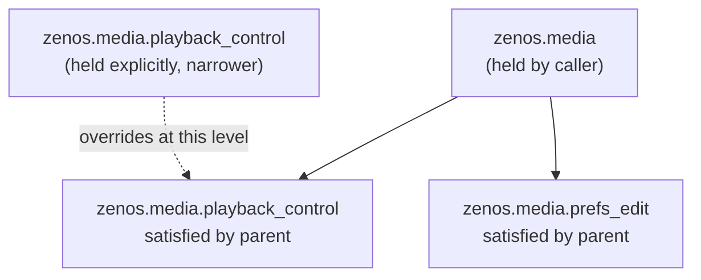
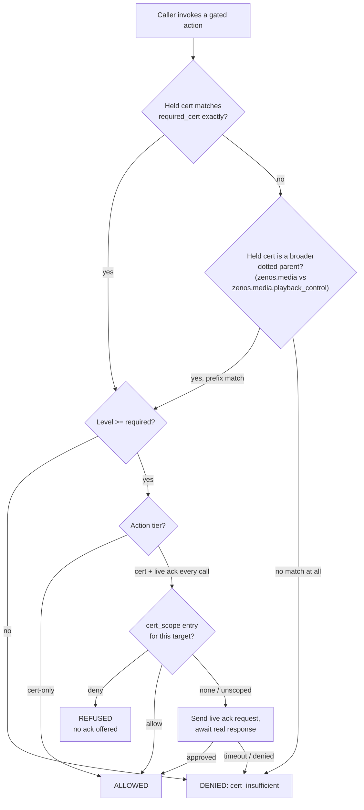

```
ZENOS-AI SECURITY & CERTIFICATION SYSTEM
OPERATOR REFERENCE MANUAL
```

> **Version:** 2026.9.0 'Steel Magnolia' | **Last Updated:** Sep 2026

**Applies to:** `zen_dojotools_identity`, `zen_dojotools_persona_editor`, and every domain tool that gates actuation behind a certification (`zen_dojotools_locks`, `zen_dojotools_covers`, `zen_dojotools_security_manager`, `zen_dojotools_infra`, `zen_dojotools_room_manager`, `zen_dojotools_lights`, `zen_dojotools_display`).

**Read this before you grant your first certification.** Section 4 describes a hard requirement that will block you if you have not configured it.

---

## 1. WHAT THIS SYSTEM IS

Some tool calls only read state. Others act on the physical security of the household — unlocking an exterior door, opening a garage door, disarming the alarm panel, stopping a container the household depends on, unpausing a room a human deliberately paused.

An agent's ability to call a tool at all does not imply permission to perform every action that tool exposes. The actions above require a separate, explicit grant — a **certification** — held by the calling agent, checked at the moment of the call, every time.

This manual documents the certification system itself: what a certification is, how one is granted, what it does and does not protect, and the one prerequisite you must have working before you can grant anything.

---

## 2. CONCEPTS

| Term | Meaning |
|---|---|
| `cert_component` | The name of a certification. Examples: `lock_control`, `cover_control`, `security_control`, `infra_container_control`, `room_control_override`, `lighting_control`. |
| `cert_level` | An integer, 1 and up. A gated action declares a minimum level it requires; holding the cert at or above that level satisfies the gate. Level meaning is defined per tool, not globally. |
| `cert_scope` | An optional list of specific targets (entity IDs, or a literal token for a singular resource such as `"disarm"`) that a grant applies to. Absent or empty scope means the grant is unscoped — it satisfies the cert-level check for any target, but does not by itself skip a live-ack requirement (see Section 6). |
| `cert_constraints` | An optional list of additional restrictions a tool may choose to enforce on top of level/scope. Not interpreted by the identity system itself — each consuming tool defines what its own constraints mean. |
| Gated action | Any tool action that calls `zen_dojotools_identity mode=resolve_caller_identity` with a `required_cert` field before proceeding. |
| Live ack | A real-time yes/no request sent to a household admin, awaited synchronously by the calling tool. See Section 4. |

Two independent gate types exist. Which one applies is a property of the *action*, not the tool:

- **Cert-only.** Holding the certification at the required level is sufficient. No live ack per call.
- **Cert plus live ack, every call.** Holding the certification is necessary but not sufficient. A fresh live ack is required on every single invocation, regardless of how recently the same action was approved, unless the specific target is covered by an admin-granted scope override (Section 6).

Section 7 lists which tier applies to which action.

---

## 3. THE CERTIFICATION CATALOG

There is no file listing which certifications exist. The catalog is calculated live, on every query, by `zen_dojotools_manifest mode=cert_audit`: it asks every discovered tool what certifications that tool's own `tool_manifest` claims to gate on, and aggregates the answers.

This means a tool declaring `certs_required` in its own self-description is what makes a certification name valid — not a separately maintained list that can drift out of sync with what tools actually enforce.

**A tool's declaration is a claim, not a grant of power.** Nothing stops a tool from declaring a certification it doesn't actually check, or checking one it never declared (`mode=cert_audit`'s `conflicts` field flags the one case this can't silently hide — the same certification name declared by two tools with different level requirements, which is an authoring error). The declaration only affects what `cert_grant` will accept as a valid target. It has no bearing on what actually happens when a tool executes — that logic lives in the tool itself, and is what this manual's Section 7 describes.

Query the current catalog directly with:

```
zen_dojotools_identity mode=cert_list
```

This returns both the full catalog (every certification any tool currently declares) and, separately, what the calling agent currently holds.

**Dotted certification names and prefix inheritance.** A certification name may be dotted (`zenos.<domain>.<capability>`); holding a broader parent node satisfies a check against any descendant below it at that parent's level, the same precedence X.509 policy OIDs use — an explicit narrower grant can still restrict below what a broader one implies. A flat (undotted) name, which is every certification in Section 7's table today, has no dots and so can only ever prefix-match itself exactly — this is a strict no-op for the existing catalog until a name actually migrates into the dotted namespace. `resolve_caller_identity`'s response includes `cert_satisfied_by`, showing which held certification actually matched.



A narrower grant held at the same or a lower level than the broader one it sits under restricts, it never widens — the explicit entry wins for its own node, the parent still covers everything else beneath it.

**Certification bundles.** `cert_grant` accepts `cert_bundle=` as an alternative to `cert_component=`, granting every certification in the named bundle with one combined live ack instead of one per member. A bundle's membership comes from either a code-tagged declaration (a certification's own catalog entry can carry `bundle: ['name']`) or a runtime-editable set stored in the household cabinet, visible in `zen_dojotools_manifest mode=cert_audit`'s `bundles` view. Editing an *existing* bundle's membership is not exposed through any agent-facing tool — only `zen_admintools_certadmin` (never agent-reachable, `mcp_exposed: false`) can change one via `cert_bundle_set`, requiring its own fresh live ack every time, since widening a bundle silently widens every future grant of it.

`cert_grant` does expose one narrow path to *originate* a brand-new bundle: passing `cert_bundle` (a name that doesn't exist yet) with `cert_bundle_members` (a JSON array of cert names) registers that bundle. This is **define-only by default** — the bundle is created granted to nobody. Pass `also_grant=true` in the same call to also grant it to the target as part of the same live ack. `cert_bundle_members` has no effect if `cert_bundle` already names an existing bundle; changing an existing bundle's membership still requires an operator using `cert_bundle_set` directly.

---

## 4. GRANTING A CERTIFICATION — AND THE MOBILE REQUIREMENT

Certifications are granted and revoked through one tool only:

```
zen_dojotools_persona_editor mode=cert_grant
    cert_component=<name>
    cert_level=<integer>
    [cert_scope=[...]]
    [cert_constraints=[...]]
```

Every call to `cert_grant` or `cert_revoke` passes through two gates, in order, with no bypass at any certification level:

**Gate 1 — catalog membership.** `cert_component` must appear in the live catalog described in Section 3. An unrecognized name is refused immediately, before Gate 2 runs. This gate catches typos. It is not a security boundary — see Section 8.

**Gate 2 — live household-admin acknowledgment.** Every grant or revoke, with no exception, triggers a real request sent through `zen_dojotools_identity mode=request_live_ack`, which dispatches a notification and blocks waiting for a real yes/no response. This is not a standing approval and cannot be pre-authorized. It fires fresh on every call, including a call that would only re-grant a certification already held.

**This is the requirement stated at the top of this manual: a working notification path capable of reaching a real person, configured before you attempt your first grant.** If you followed the getting-started path in order, this is already done — Install Guide Step 3.5 connects your phone, and First Alert Step 7 seeds the Postman profile that routes to it. If you jumped straight here, go do those two steps first.

The dispatch uses `notify_target: postman` internally — this is the only notification target that wires a real yes/no response capture back to the waiting call. If your household's Postman/mobile notification integration is not configured, or the configured device cannot receive and respond to the push, the request will time out or fail to dispatch. The result in either case is `approved: false`. **There is no fallback path.** A certification cannot be granted, at any level, for any purpose, without a real human successfully receiving and responding to a real notification at the moment of the request.

This holds regardless of what is being requested. There is no certification, however permissive, that skips this gate to grant itself. If you intend to grant an agent unrestricted access to every gated action in the household — nothing in this system stops you from declaring and requesting exactly that — you will still receive one real push notification and must tap "yes" on your phone to complete it. After that, the certification exists and future actuations under it behave exactly as scoped. What you choose to certify is entirely your decision; this manual's only claim is that you will be asked, in real time, on a real device, before it takes effect.

**Configure your mobile notification path before you need this.** If it is not working, you will not be able to grant your first certification to find that out.

---

## 5. REVOKING A CERTIFICATION

```
zen_dojotools_persona_editor mode=cert_revoke cert_component=<name>
```

Identical gating to Section 4 — catalog membership, then a fresh live ack. Revocation is not exempt from the ack requirement; the household must confirm a revocation in real time the same as a grant.

---

## 6. SCOPED OVERRIDES

By default, a certification that gates on "cert plus live ack every call" asks every single time, with no memory of prior approvals. This is deliberate — see Section 8. It is also, for a frequently-used action on a specific known-safe target, real ongoing friction.

`cert_scope` exists to relieve exactly that friction, narrowly:

```
zen_dojotools_persona_editor mode=cert_grant
    cert_component=lock_control
    cert_scope=["lock.front_door"]
```

A target covered by a granted **allow** scope skips the per-call live ack for that certification's live-ack-tier actions, on that target only. A call covering multiple targets, some scoped and some not, still asks for the whole set — there is no partial silent authorization.

**Scope entries have two forms.** A bare string (`"lock.front_door"`) is shorthand for an allow entry. A full form, `{"entity": "lock.front_door", "acl": "allow"}` or `{"entity": "lock.front_door", "acl": "deny"}`, is explicit. **A `deny` entry is a hard block**, evaluated ahead of the certification check itself — a target explicitly denied is refused regardless of what level the certification is held at, with no live ack offered at all. This is not the inverse of an unscoped default; an unscoped target still asks normally, a denied target is refused outright.

**Granting again merges, it does not replace.** A second `cert_grant` for a certification already held adds to the existing scope rather than overwriting it — each entry is upserted by entity, so granting a new exemption never silently drops previously granted ones. To remove a single entry without touching the rest of the scope or re-granting the whole certification, submit that entity with `"acl": "remove"`:

```
zen_dojotools_persona_editor mode=cert_grant
    cert_component=lock_control
    cert_scope=[{"entity": "lock.front_door", "acl": "remove"}]
```

This still goes through both gates in Section 4 like any other grant — removing one exemption requires the same live ack as adding one.

**Scope does not weaken Gate 1 or Gate 2 in Section 4.** Granting a scope, narrow or broad, allow or deny, is itself a certification grant and goes through the exact same live-ack requirement as any other. The system will accept a `cert_scope` covering every actuatable target in the household if you request it, with the same single real-time confirmation as any narrower request. It does not evaluate whether the scope you are requesting is a good idea. That evaluation is the human's, made once, at the moment of the ack. The system's only job past that point is to enforce whatever you approved.

If you grant broad allow scope and later regret it, remove the specific entry as shown above, or revoke the entire certification (Section 5) — the same live-ack requirement applies either way.

---

## 6.5 THE RESOLUTION PATH, END TO END

Sections 2–6 describe the pieces individually. This is the order they actually run in, for any gated action:



A `deny` scope entry (Section 6) short-circuits before the live-ack step ever runs — it is a hard block, not a slower path to the same answer. An `allow` scope entry skips the live-ack step entirely for that target. Everything else asks fresh, every time, per Section 4.

---

## 7. GATED ACTIONS BY TOOL

| Tool | Certification | Cert-only actions | Cert + live ack, every call |
|---|---|---|---|
| `zen_dojotools_locks` | `lock_control` | Lock, and unlock any non-exterior target | Unlock any `ext_lock`-labeled (exterior) target |
| `zen_dojotools_covers` | `cover_control` | Close any cover; open any non-barrier cover | Open a barrier-class cover (garage door, exterior door, gate) |
| `zen_dojotools_security_manager` | `security_control` | Arm; change alert policy | Disarm |
| `zen_dojotools_infra` (container-control codex) | `infra_container_control` | Restart/start a container (level ≥ 2 by default) | Stop/remove a container (level ≥ 3 by default) |
| `zen_dojotools_room_manager` | `room_control_override` | — (no cert-only tier; see next column) | Move a room out of a human-set Paused state |
| `zen_dojotools_room_manager` | `room_topology_edit` | Structural edits: `set`/`setup`/`area_create`/`area_update`/`link`/`unlink`/`boundary_link`/`boundary_unlink`/`room_zone_set`/`room_zone_remove`/`landmark_set`/`landmark_remove` (level 1); `area_delete` (level 2) | — |
| `zen_dojotools_room_manager` | `room_behavior_control` | `room_status_set`, `roomstate_enable`, `reflex_enable`, `reflex_dry_run`, `wasp_enable`, `reflex_wire` area writes, `room_control_set` writes (except setting Paused, which stays open) | — |
| `zen_dojotools_lights` (ZenLux) | `lighting_control` | All gated light/switch writes | — (no live-ack tier; lighting is not treated as a physical-security action) |
| `zen_dojotools_climate` (also owns `fan.*`) | `climate_control` | All real setters on a `climate.*` or `fan.*` target | — |
| `zen_dojotools_spa_manager` | `spa_control` | `scene`, `lights`, `jets`, `temperature`, `cover` | — |
| `zen_dojotools_display` | `display_control` | `mode=show` — cast a Lovelace view to a house display | — (no live-ack tier; an info surface, not a physical-security action) |
| `zen_admintools_cabinetadmin` | `cabinet_lifecycle_control` | Every moderate-to-nuclear write op (`restore`, `repair_volumeinfo`, `reset`, `hammer`, `init`, `repair_mount`, `repair_dismount`, `flip_schema_version`, `reset_all`, `expand_drawer`); `inspect`/`mount_status`/`help` stay ungated | — |
| `zen_dojotools_provisioner` | `cabinet_lifecycle_control` (reused) | `provision`, `deprovision`, `replace` | — |
| `zen_dojotools_camera` | `camera_alert_policy_edit` | `set_alert_policy` | — |
| `zen_dojotools_plant` | `plant_auto_shutoff_config_edit` | `leak_auto_shutoff_enable` | — |
| `zen_dojotools_alertmanager` | `alert_policy_edit` | `set_policy` | — |
| `zen_dojotools_labels` | `registry_lifecycle_control` (reused) | `create`, `delete`, `area_assign`, `area_remove` | `reset` (untags all `zen_` labels house-wide — cert plus a mandatory live ack every time, no scope waiver available for this action) |
| `zen_dojotools_office` (Mail) | `pii_disclosure_control` | `create` (send, level 1) | — |
| `zen_dojotools_office` (Mail) | `pii_disclosure_control` (reused) | `whitelist_set` (level 2 — edits the household mail-whitelist cabinet drawer) | — |
| `zen_dojotools_office` (Teams) | `pii_disclosure_control` (reused) | `send` | — |
| `zen_dojotools_taskmaster` | `pii_disclosure_control` (reused) | `task_create` | — |
| `zen_dojotools_todo` | `pii_disclosure_control` (reused) | `create`, `update` | — |
| `zen_dojotools_calendar` | `pii_disclosure_control` (reused) | `create`, `update` | — |
| `zen_dojotools_ectoplasm` (Spook actions) | `room_topology_edit` (reused) | `area_create`/`area_delete`, `floor_create`/`floor_delete`, `area_assign_device`/`area_unassign_device`, `area_assign_entity`/`area_unassign_entity`, `floor_assign_area`/`floor_unassign_area` (`area_delete`/`floor_delete` at level 2) | — |
| `zen_dojotools_ectoplasm` (Spook actions) | `registry_lifecycle_control` (reused) | `entity_hide`/`entity_unhide`, `entity_disable`/`entity_enable`, `entity_rename`, `device_disable`/`device_enable`, `integration_disable`/`integration_enable`, `label_assign_area`/`label_unassign_area`, `label_assign_device`/`label_unassign_device`, `automation_snooze`, `automation_turn_on_for`, `input_number_create`/`input_number_delete` | — |
| `zen_dojotools_ectoplasm` (Spook actions) | `registry_purge` | `orphan_cleanup` (level 2) | — |
| `zen_dojotools_scribe` | `scribe_kfc_publish` | `publish_kfc`, `republish_kfc`, and `patch`/`replace`/`clear_field`/`delete` when the target artifact is an already-published `kfc` | — |
| `zen_dojotools_media_manager` | `media_prefs_edit` | `prefs_set`, `prefs_apply`, `room_default_set`, `setup` | — |
| `zen_dojotools_media_manager` | `media_playback_control` | `play_media`, `queue_command`/`queue_remove`/`queue_play_item`/`queue_clear_from_here`/`queue_unfavorite`, `source_set`, `sound_mode_set`, `activity_set`/`activity_apply`/`activity_end` | — |
| `zen_dojotools_library` | `library_stacks_edit` | Paperless-NGX document writes (stacks department) | — |
| `zen_dojotools_library` | `library_catalog_edit` | Physical-item catalog writes (catalog department) | — |
| `zen_dojotools_zenzork` | `household_spatial_config_edit` | `mode=setup` (north calibration / portal commissioning) only | — |
| `zen_dojotools_boolean` | `helper_boolean_edit` | `input_boolean`/`switch` writes | — |
| `zen_dojotools_number` | `helper_number_edit` | `number`/`input_number` writes | — |
| `zen_dojotools_text` | `helper_text_edit` | `input_text` writes | — |
| `zen_dojotools_select_control` | `helper_select_edit` | `input_select`/`select` writes | — |
| `zen_dojotools_timekeeper` | `helper_timer_control` | `timer.*` writes | — |
| `zen_dojotools_water_heater` | `water_heater_control` | `water_heater.*` writes | — |
| `zen_dojotools_datetime` | `helper_datetime_edit` | `input_datetime` writes | — |
| `zen_dojotools_zones` | `helper_zones_edit` | `zone.*` create/update/delete (read/bearing stay open) | — |
| `zen_dojotools_room_manager` | `room_topology_edit` (reused) | `utility` mode's `set`/`delete` (household NFPA/emergency-cutoff registry writes) | — |
| `zen_dojotools_room_manager` | `room_behavior_control` (reused) | `label_discover`'s `confirm_action=true` bulk-tag-apply path (preview stays open) | — |

`pii_disclosure_control` is a shared certification: level 1 gates any action that discloses or transmits household PII outward (mail/Teams send, task/todo/calendar create-update since these can carry personal details to shared surfaces); level 2 gates changing the disclosure policy itself (the mail whitelist).

Every entry in the middle and right columns requires holding the listed certification at the tool's required level as a baseline. The right column additionally requires Section 4's live ack, per call, unless the specific target is covered by a granted allow `cert_scope` (Section 6) — and refused outright, no ack offered, if covered by a `deny` entry instead.

**ZenZork** (the text-adventure engine) holds one narrow cert of its own (above) for its household-config write surface; every other in-game `open`/`close`/`use`/`push`/`pull` that resolves to a real lock or cover routes through `zen_dojotools_locks`/`zen_dojotools_covers` in `dry_run` mode — the game narrates from the same real `cert_scope`/live-ack check this table describes, without ever performing the real actuation. Switch/`input_boolean` interactions (`use`/`push`/`pull`) are preview-only for the same reason, with no dry-run-capable gated tool to route through. See the ZenZork readme's Identity Gate section.

---

## 8. WHY IT WORKS THIS WAY

The catalog (Section 3) is not the security boundary. It was originally built as a hand-maintained file specifically so it could function as one — and that design was deliberately reversed the same day it shipped, in favor of live self-declaration, once it became clear that a second, separately-maintained list of what's grantable is exactly the kind of thing that silently drifts out of sync with what tools actually enforce. A tool can declare anything it wants in its own catalog entry. What actually validates a certification claim, unchanged before and after that reversal, is the live acknowledgment in Section 4. Catalog membership only rejects a flat typo before bothering a human with it.

The live-ack-every-call tier (no standing exception, Section 4's mobile requirement, Section 6's scope-is-still-gated design) exists because a standing certification was judged, deliberately, not to be sufficient authorization for the highest-risk actions on its own. Holding `lock_control` says an agent is allowed to operate locks in general. It does not say a specific exterior unlock at a specific moment is wanted. The system asks anyway, every time, because the two questions are different and only a human can answer the second one in real time.

This system does not evaluate whether a given grant is wise. It enforces exactly what was approved, and nothing was ever approved without a real person confirming it on a real device at the moment it mattered. What you approve is your decision to make.

**What this system does not protect against: the cert store itself.** Held certifications live as plain data in the household cabinet — an entry there, not a hardened credential. There is no encryption at rest, no tamper-evidence, and no separation between "the record of what was granted" and "everything else in that cabinet." Anyone with the access level needed to edit cabinet data directly (bypassing the tool layer entirely) could edit a cert entry without ever going through Section 4's live ack. This is a deliberate, function-first sequencing choice, not an oversight: the authorization *logic* — what gets checked, when, and against what — was worth building and shipping now; a genuinely hardened cert store (encryption, tamper-evidence, an out-of-band trust anchor separate from the rest of cabinet storage) is real future work, tracked under Longer-Horizon Work in the [Tron release notes](../releases/tron.md), and will land once the system around it is stable enough to be worth hardening. Today's threat model assumes the household cabinet itself is trusted; that assumption is correct for a single-household local install and would not be for anything more adversarial.

---

## 9. TROUBLESHOOTING

| Symptom | Meaning |
|---|---|
| `error: identity_policy_blocked` | `resolve_caller_identity` did not return an allowed identity — a prerequisite failure upstream of certification entirely. Not a cert problem; check the identity/sim_mode policy gate. |
| `error: cert_insufficient` | The identity resolved, but the held certification level is below what the action requires (or the certification isn't held at all). Grant it per Section 4. |
| A gated action refuses a specific target with no live ack ever offered | The target is covered by a `deny` scope entry (Section 6) — a hard block, evaluated ahead of the certification check, not something a live ack can override. Remove the `deny` entry (submit it again with `"acl": "remove"`) if it was unintended. |
| `reason: dispatch_failed` on a `cert_grant`/`cert_revoke`/gated actuation | The live-ack request never reached a real device. Check the household's Postman/mobile notification configuration — this is the Section 4 prerequisite not being met. |
| `reason: declined` | A human received the request and answered no. Working as intended. |
| `reason: timeout` | The request dispatched, but no response arrived within the wait window. Check that the device that received the push is actually being watched. |
| `cert_grant refused: '<name>' is not declared by any tool's tool_manifest` | The `cert_component` name doesn't match anything in the live catalog (Section 3). Check spelling, or confirm the tool you expect to gate on it actually declares it — run `mode=cert_audit` to see the real current catalog. |

---

*ZenOS-AI Security & Certification System — Operator Reference. Keep this document current with Section 7's table whenever a new tool adopts the identity gate.*
