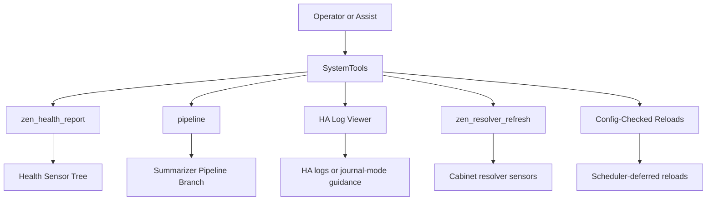
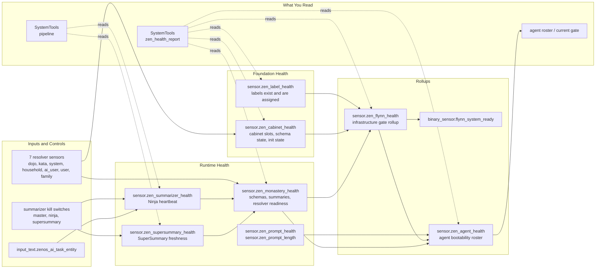
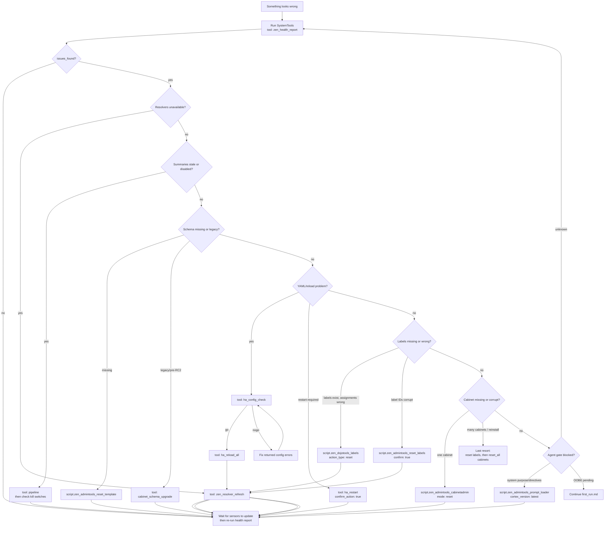

# ZenOS-AI Troubleshooting Guide — 2026.6.0 'Clue'

*SystemTools → Gauges → Kill Switches → Repair Tools. Start at the top, work down.*

---

## How to Use This Guide

ZenOS-AI is self-healing. Most problems resolve on their own once the right condition is fixed. This guide is for when they don't.

The structure mirrors the system's own repair logic: **ask SystemTools for a diagnosis first**, read the gauges it points at, then use the least invasive tool that fixes it. The repair sequence is ordered from safest to most destructive. Don't skip ahead.

---

## 0. SystemTools — Ask the System What It Sees

SystemTools is the safest first stop because it reads the same health sensors and resolver states you would inspect manually, then returns a compact diagnosis.

```yaml
script.zen_dojotools_systemtools
  tool: zen_health_report
```

Or ask your AI: *"run Zen health report."*

`zen_health_report` checks the core health sensors, all cabinet resolver states, summarizer kill switches, summary freshness, schema state, and AI task entity configuration. If it reports `issues_found`, use the diagnosis text to jump to the matching section below.

For summarizer-specific issues, use the pipeline monitor:

```yaml
script.zen_dojotools_systemtools
  tool: pipeline
  period_hours: 3
```

`pipeline` shows queue state, per-component freshness, scheduler history, recent logbook invocations, dynamic flags, and KFC trigger-pattern recommendations. Use this before resetting summarizers or cabinets.



SystemTools also wraps reload and restart safely:

| Tool | Use When | Notes |
|---|---|---|
| `ha_config_check` | Before restart/reload suspicion | No side effects |
| `ha_reload_all` | Most YAML/package/template changes | Config-check gated; deferred through Scheduler |
| `ha_reload_scripts` | Script-only changes | Config-check gated; deferred through Scheduler |
| `ha_reload_automations` | Automation-only changes | Config-check gated; stops in-flight automation actions |
| `ha_reload_templates` | `custom_templates/` Jinja changes | Config-check gated; takes effect on next render |
| `ha_restart` | Core HA config or integration bootstrap changes | Requires `confirm_action: true`; config-check gated |

Expose `script.zen_dojotools_systemtools` and `script.zen_dojotools_ha_log_viewer` to Assist. Do **not** expose `script.zen_dojotools_ha_api`; it is an internal primitive.

---

## 1. Gauges — Read These Manually When Needed

### Health Sensor Stack

Check these in order. A problem at the bottom propagates up.



| Sensor | What It Tells You | Where to Check |
|---|---|---|
| `sensor.zen_label_health` | Labels exist and are assigned | Developer Tools → States |
| `sensor.zen_cabinet_health` | Cabinet entities initialized | Developer Tools → States |
| `sensor.zen_monastery_health` | Schemas seeded, summaries fresh | Developer Tools → States |
| `sensor.zen_summarizer_health` | Ninja Summarizer heartbeat | → `ai_task_entity`, `last_timestamp` attrs |
| `sensor.zen_supersummary_health` | SuperSummary freshness | → `monk_status`, `last_timestamp` attrs |
| `sensor.zen_flynn_health` | Infrastructure rollup | → `current_gate`, `next_step` attrs |
| `sensor.zen_agent_health` | Is Friday bootable | → `roster` attr (per-gate status per agent) |

**Start with `script.zen_dojotools_systemtools tool: zen_health_report`.** If you are in Developer Tools and reading manually, start with `sensor.zen_agent_health` → `roster`. It tells you exactly which gate is blocking each agent and what's missing. If you see `friday won't wake up`, this sensor explains why in one attribute read.

### Resolver Sensors

| Sensor | Healthy State | Problem State |
|---|---|---|
| `sensor.zen_dojo_cabinet_resolved` | `sensor.zenos_dojo_cabinet` | `unavailable` |
| `sensor.zen_kata_cabinet_resolved` | `sensor.zenos_kata_cabinet` | `unavailable` |
| `sensor.zen_system_cabinet_resolved` | `sensor.variables` | `unavailable` |

If any resolver shows `unavailable`, Flynn's Gate 3a will stall. Resolvers evaluate on boot, every 15 minutes, and on `zen_resolver_refresh` event.

### Flynn Gate States

| `zen_label_health` | Flynn Gate | What's Needed |
|---|---|---|
| `critical` | Gate 0 | Labels don't exist — restart HA after Flynn creates them |
| `warn` | Gate 1 | Labels exist but aren't assigned — Flynn self-resolves |
| `ok` | Pass | — |

| `zen_cabinet_health` | Flynn Gate | What's Needed |
|---|---|---|
| `error` / `critical` | Gate 2 (hard stop) | One or more cabinets uninitialized — operator action required |
| `warn` | Gate 2 (non-blocking) | Legacy schema detected — upgrade available, system fully operational |
| `ok` but init-state cabs present (post-warmup) | Gate 2.1 (silent, auto) | Virgin cabinets auto-initialized — no action needed |
| `ok` | Pass | — |

| `zen_monastery_health` | Flynn Gate | What's Needed |
|---|---|---|
| `critical` | Gate 3 (full bootstrap) | Schema missing or summary/cabinets dead |
| `disabled` | Gate 3 (full bootstrap) | Summarizers off (`zen_summarizers_enabled` kill-switch) — bootstrap still runs so household/family/user/ai_user identity gets created; summarizer/pipeline health is orthogonal to identity provisioning |
| `warn` | Gate 3 (schema seed only) | Schema seed runs, content bootstrap skipped |
| `ok` | Pass | — |

---

## 2. Kill Switches — Immediate, Non-Destructive

Use these to stop or restart the summarization pipeline without touching anything else. Safe to toggle at any time.

| Entity | Default | Effect |
|---|---|---|
| `input_boolean.zen_summarizers_enabled` | `off` | **Master** — off stops both summarizers immediately |
| `input_boolean.zen_supersummarizer_enabled` | `off` | Off stops SuperSummary only |
| `input_boolean.zen_ninja_summarizer_enabled` | `off` | Off stops Ninja Summarizer only |

**The summarizers ship disabled by default.** Enable them once you've confirmed your AI task entity points at a local model (see install guide). Master is checked first. Individual switches only apply when master is on.

When a switch is re-enabled, `automation.zen_pipeline_autofire_on_enable` fires the appropriate force event immediately — no waiting for the next scheduled run.

**Toggle from:** Settings → Helpers, or any dashboard card.

---

## 3. Repair Tools — Graduated Severity

Work through this list from top to bottom. Try the least invasive fix first.



### Step 1 — Kick the Resolvers (safest, try first)

```yaml
script.zen_dojotools_systemtools
  tool: zen_resolver_refresh
```

Fires the resolver sensors to re-evaluate immediately without touching labels, cabinets, or schemas. Use this after any label change, after a reload, or when resolver sensors show `unavailable` after a clean boot.

**Alternative:** Developer Tools → Events → Event type: `zen_resolver_refresh` → Fire Event.

---

### Step 1.5 — Reload Safely After YAML or Template Edits

```yaml
script.zen_dojotools_systemtools
  tool: ha_reload_all
```

Use this after package/doc-install YAML changes when you do not need a full restart. SystemTools runs `ha_config_check` first; if the check fails, the reload is blocked and the errors are returned.

`ha_reload_all` and `ha_reload_scripts` return immediately because the actual reload is deferred through Scheduler. That is expected. If a reload reports success but sensors still show cold-start `unavailable`, run Step 1 (`zen_resolver_refresh`).

Use narrower reloads only when you know the edit scope:

| Tool | Scope |
|---|---|
| `ha_reload_scripts` | Scripts only |
| `ha_reload_automations` | Automations only; stops in-flight actions |
| `ha_reload_templates` | `custom_templates/` Jinja files only |

Use `ha_restart` only for restart-required changes: `auth_providers`, `http:`, `recorder:`, newly bootstrapped integrations, or the `logger:` YAML block.

---

### Step 2 — Reseed Schemas

```
script.zen_admintools_reset_template
```

Re-presses `kfc_template` into the Dojo cabinet and `zen_template` into the Kata cabinet. Fully idempotent — safe to re-run. Does not touch any other drawer.

**Use when:** `sensor.zen_monastery_health` reports schema missing or corrupt, or Flynn's Gate 3b keeps firing on every boot.

---

### Step 2.5 — Cabinet Schema Upgrade (pre-RC2 → current)

If Flynn notified you that one or more cabinets are on a pre-RC2 schema:

```
zen_dojotools_systemtools
  tool: cabinet_schema_upgrade
```

Or ask your AI: *"run cabinet schema upgrade"* — it knows this tool.

Toggles `cab_schema_version` in the system cabinet from legacy (0) to mount-aware (1). Idempotent. No data loss.

**Use when:** Flynn sends the "one or more cabinets are on a pre-RC2 schema" notification. After it runs, verify with `tool: zen_health_report`.

---

### Step 3 — Restamp Prompt Substrate

```
script.zen_admintools_prompt_loader
  cortex_version: latest
```

Reloads Cortex, Directives, and Purpose into the system cabinet. Use after an upgrade or if Friday's behavior has drifted from expected.

**Use when:** `sensor.zen_agent_health` shows `system_purpose` or `system_directives` gate failing.

---

### Step 4 — Soft Label Reset

```
script.zen_dojotools_labels
  action_type: reset
  confirm: true
```

Wipes all entity assignments from every `zen_` label. Labels survive — only the tagging is cleared. `zen_resolver_refresh` fires automatically. Flynn re-assigns via Gate 1 on the next health sensor change.

**Use when:** Labels exist but entities aren't tagged correctly. Resolver sensors are `unavailable` and a `zen_resolver_refresh` didn't fix it.

---

### Step 5 — Nuclear Label Reset

```
script.zen_admintools_reset_labels
  confirm: true
```

⚠️ **Deletes all `zen_` labels and all assignments. No undo.**

Non-zen labels (`home`, `media_players`, `hot_tub`, etc.) are never touched. Flynn rebuilds the full label set automatically — Gate 0 recreates, Gate 1 reassigns. No HA restart required on HA 2024.x+.

**Use when:** Label IDs are corrupt, have wrong names, or soft reset didn't resolve the problem.

---

### Step 6 — Single Cabinet Reset

```
script.zen_admintools_cabinetadmin
  mode: reset
  target_cabinet: sensor.zenos_<cabinet_name>
```

Wipes all drawers from a single cabinet. Use when one specific cabinet has corrupt data but others are fine.

**Use when:** One cabinet is causing errors but the rest of the system is healthy. Check `sensor.zen_cabinet_health` → `slot_entities` to confirm which cabinet is the problem.

---

### Step 7 — Nuclear Cabinet Reset (Last Resort)

```
# Run in order:
1. script.zen_admintools_reset_labels     (confirm: true)
2. script.zen_admintools_cabinetadmin     (op: reset_all, confirm: true)
```

⚠️ **Wipes all Ring-0 canonical cabinets + all zen_ labels. No undo.**

Step 1 nukes labels. Step 2 wipes all 14 Ring-0 cabinets, reseeds schemas via `reset_template`, and fires Flynn bootstrap. User cabinets (`sensor.primary_user_cabinet`, etc.) are never touched. Order matters — labels first, cabinets second.

Flynn handles the full rebuild sequence automatically.

**Use when:** Nothing else worked, or you're doing a clean reinstall.

---

## Common Symptoms → Where to Start

| Symptom | Start Here |
|---|---|
| Not sure what's wrong | `script.zen_dojotools_systemtools tool: zen_health_report` |
| Friday won't wake up | `sensor.zen_agent_health` → `roster` attr |
| `zen_agent_health: warn` on fresh install | Expected — OOBE pending and/or summarizers disabled. Continue to `first_run.md`. |
| `monastery: disabled` on fresh install | Kill switches ship off. Enable in Settings → Helpers: `zen_summarizers_enabled` (master), `zen_ninja_summarizer_enabled`, `zen_supersummarizer_enabled`. |
| Summaries stopped | Run `script.zen_dojotools_systemtools tool: pipeline`, then check kill switches |
| Summarizer health shows `disabled` | Kill switch is off — intentional state. Enable the relevant switch; autofire restarts it. |
| Flynn cabinet schema migration notification | Run `zen_dojotools_systemtools tool: cabinet_schema_upgrade` or ask your AI to do it. See Step 2.5. |
| Summaries are stale | `sensor.zen_supersummary_health` → `monk_status` |
| Scheduler not firing | `sensor.zen_summarizer_health` → `ai_task_entity`, `last_timestamp` |
| Flynn stuck at boot | `sensor.zen_flynn_health` → `current_gate`, `next_step` |
| Resolver sensors unavailable | Run `zen_dojotools_systemtools tool: zen_resolver_refresh`. If still stuck → Step 4 (soft label reset) |
| Labels not assigning | `sensor.zen_label_health` → `missing_label_ids`, `unassigned_label_ids` |
| Cabinet missing or corrupt | `sensor.zen_cabinet_health` → `missing_cabinets` → Step 6 |
| Reload did nothing | Run `ha_config_check`; if clean, use `ha_reload_all`, then `zen_resolver_refresh` |
| `Action script.<x> not found` / `ServiceNotFound` from a dynamically-templated action, but `states.script` shows the entity is fine | Static reference: `script.zen_dojotools_help tool: zen_dojotools_help mode: troubleshooting` — documents the `script:` platform's entity_id/unique_id drift class. Zero live calls, so it still works even when the thing it's diagnosing is broken. |
| HA log file missing | Use `script.zen_dojotools_ha_log_viewer`; HA 2025.11+ journal mode is expected and returns guidance |
| New install stuck — cabinets all in `init`, nothing initializing | Flynn Gate 2.1 handles this post-warmup. Wait ~5 min after HA start. If still stuck → Step 6 (single cabinet reset). |
| Schema missing / Gate 3 keeps firing | Step 2 (`reset_template`) |
| Full reinstall needed | Step 7 (nuclear sequence) |

---

## Notes

- **Flynn is self-healing.** After any repair action, wait for the relevant health sensor to update — Flynn re-engages automatically. You rarely need to trigger it manually.
- **`zen_health_report`** is the safest first diagnostic. It reads state only.
- **`zen_resolver_refresh`** is always safe to fire. It re-evaluates resolver sensors without changing anything.
- **SystemTools reloads are config-check gated.** A failed config check blocks reload/restart and returns the errors instead of failing silently.
- **Kill switches** are non-destructive. Turning the summarizers off and back on is always safe.
- **Backup before nuclear ops.** Steps 5–7 have no undo. If your cabinet data matters, export it via `zen_admintools_cabinetadmin mode: inspect` before proceeding.

---

## Cross-References

- [Zen DojoTools Help — `mode=troubleshooting`](../scripts/zen_dojotools_utilities_readme.md) — static, zero-live-call reference for system-level platform quirks (e.g. `script:` platform entity_id/unique_id drift) plus pointers to every other diagnostic surface. Safe to check even when whatever you were doing just broke.
- [SystemTools](../scripts/zen_dojotools_systemtools_readme.md) — health report, reload/restart wrappers, log viewer, pipeline monitor
- [Entity Exposure](entity_exposure.md) — expose SystemTools and Log Viewer to Assist; keep HA API internal
- [Script Modules](../scripts/readme.md) — internal tool map and module index
