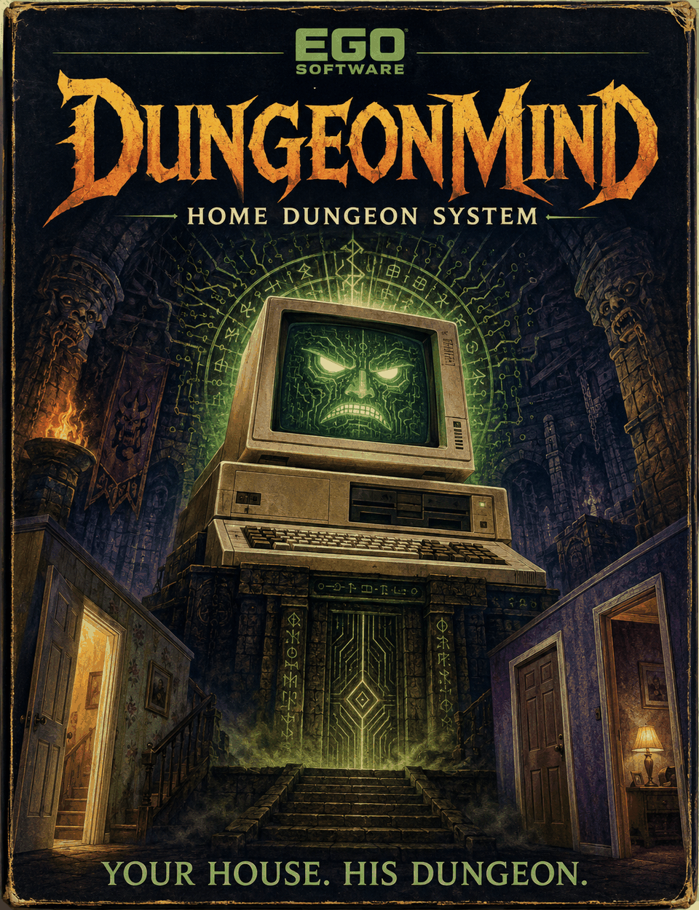
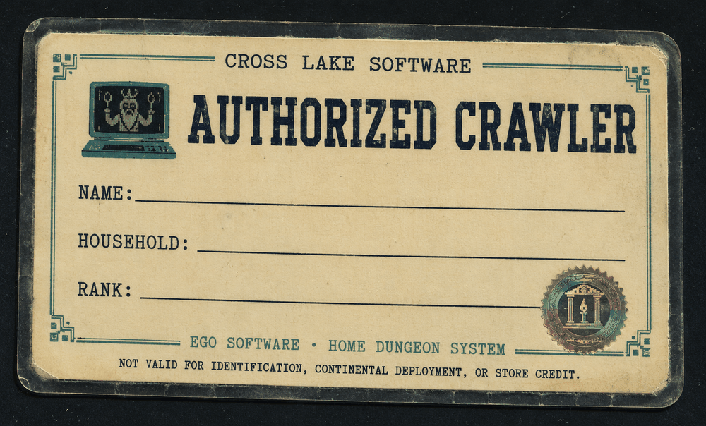
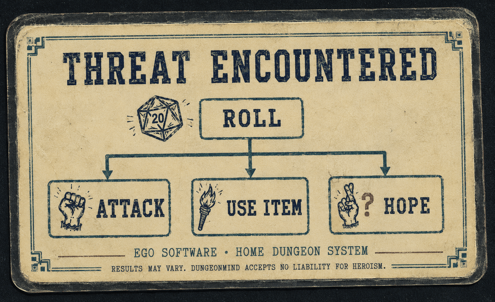
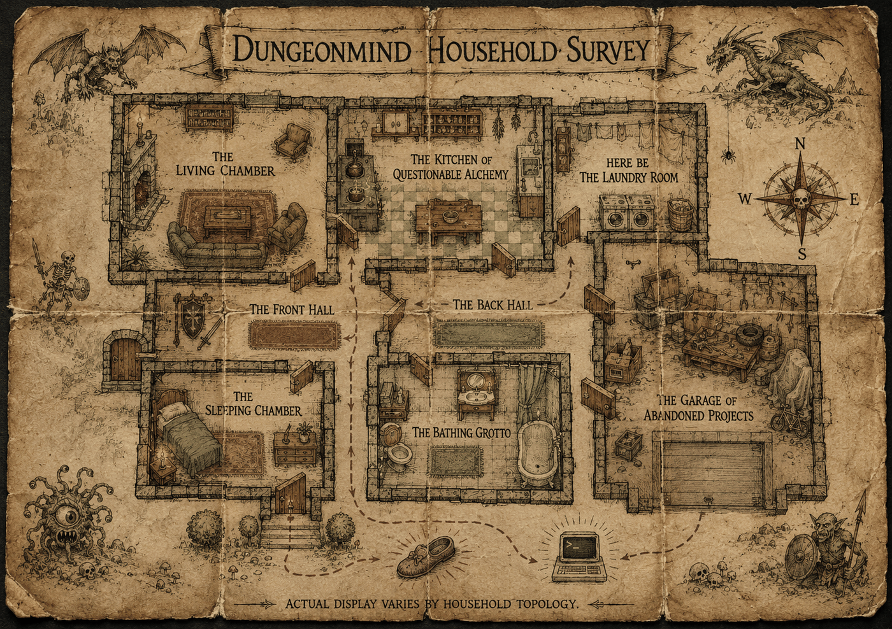

# DUNGEONMIND⁽ᵗᵐ⁾ HOME DUNGEON SYSTEM
## OWNER'S MANUAL & QUICK REFERENCE CARD

```
   ╔═══════════════════════════════════════════════════════╗
   ║   EGO SOFTWARE   ·   A DIVISION OF CROSS LAKE SOFTWARE ║
   ║   "If it plugs in, we'll make it do something else."   ║
   ╚═══════════════════════════════════════════════════════╝
```

**PRODUCT:** DUNGEONMIND⁽ᵗᵐ⁾ Home Dungeon Interface
**COMPATIBLE WITH:** IBM AT 5170 and true-compatible clones. Some
peripherals may vary.
**PRINTING:** First Edition. If your household received this manual
without a matching cartridge, you may have acquired this product
through channels this manual is not equipped to discuss.

```
   ┌─────────────────────────────────────────────────────────┐
   │  CONTENT AUTHORIZATION NOTICE                            │
   │                                                           │
   │  This unit reads its Content Authorization Level          │
   │  directly from your household's own settings — Ego        │
   │  Software does not set this for you, does not know what   │
   │  it currently is, and will not be adjusting it on your     │
   │  behalf no matter how nicely you ask it in-game. If        │
   │  DUNGEONMIND's narration seems tamer or spicier than       │
   │  advertised, that's a household setting working exactly    │
   │  as designed, not a defect. Take it up with whoever set    │
   │  the household's rating, not with us.                      │
   └─────────────────────────────────────────────────────────┘
```

---

### ⚠ IMPORTANT NOTICE — READ BEFORE OPERATING

This product is manufactured by Ego Software, a division of Cross Lake
Software, and is **NOT sponsored, endorsed, licensed, manufactured, or in any way
authorized by ZenOS-AI, Borant Consolidated Entertainment, or any
Primal Seeding Matrix, known or theoretical.** Any resemblance between
this product's behavior and an actual continental dungeon-seeding
apparatus is, per our legal department, "extremely unlikely, we
checked, don't ask us again."

Ego Software makes no warranty, express or implied,
regarding this product's fitness for any purpose, including but not
limited to: entertainment, home security, emotional support, or
continental defense. Your household. Your risk. YMMV. If it breaks,
that is between you and it.

---

### PROOF OF OWNERSHIP — REQUIRED BEFORE FIRST USE

To confirm you are a legitimate owner of this manual and not someone
who found a photocopy at a garage sale, please locate the following
before continuing:

```
   Page ____, Paragraph ____, Word ____: "____________________"
```

If you are unable to produce this information, DUNGEONMIND will still
run. We just like watching you check.



---

### WHAT IS DUNGEONMIND?

Somewhere behind your walls — we are told, and we have chosen to
believe, because the alternative involves a very long phone call — is
an Intel 8088 that thinks it is in charge of something much larger
than your house. It calls itself DUNGEONMIND. It has been doing this,
by its own account, since 1984. It is, again by its own account, a
**Primal Seeding Matrix** that missed its actual deployment (a
continent; sixteen difficulty tiers; a real budget) and landed here
instead.

We do not know if any of that is true. We do know that once you plug
this in, your house starts narrating itself back to you, room by
room, in the voice of something that is deeply, theatrically
convinced you are all in terrible danger and also, somehow, fond of
you anyway.

That's the product. That's DUNGEONMIND.

### BASIC OPERATION

DUNGEONMIND reads your house the way it actually is, right now — what's
lit, what's warm, what's open, what's playing, who's home. You move
through your own rooms and it narrates them back to you as chambers in
a dungeon that happens to be your house. Two voices are included at no
extra charge: **DUNGEONMIND** (overwrought, cosmic, extremely online
about a 1984 deployment failure) and **ZORK** (dry, unimpressed, will
not be won over). A third, **STRAIGHT**, exists for households that
find the first two exhausting. We don't judge. Much.

You can walk. You can look. You can pick things up and put them back
down, usually in a different location, occasionally on purpose. Your
first session comes with a starter objective already assigned — your
unit calls this "Induction Protocol," which is a very serious name for
"pick something up." There are quests, if you ask for one — some are
simple ("go to this room"),
some ask you to actually go *use the rest of your house's smart
features*, on purpose, which is either very clever product design or
an elaborate excuse to sell you a game that makes you do chores. We
will let you decide which. (It's the first one. Mostly.)

### THE UNLOCK SYSTEM (WE ARE NOT GOING TO TELL YOU HOW)

Here is what we will confirm and nothing more: **DUNGEONMIND notices
things about your actual household**, and some of those things unlock
new material — story, achievements, reactions you have not seen
before. Some of it is tied to what you genuinely have in your house.
Some of it is tied to things you actually do while playing.

We are not going to tell you what it's looking for. We are not going
to tell you how many of these there are, though we will confirm the
number is "more than a couple." We are not going to tell you what
order they happen in, though we will confirm there IS an order, and
that DUNGEONMIND appears to be pacing itself — by its own account, it
"needs time to read." Make of that what you will. Some households have
reported the whole cycle taking a couple of weeks. Others report
nothing has happened yet. Both are apparently normal.

What we WILL say: the household that has more of a certain kind of
media lying around gets more out of this system than the household
that has none. We'll leave it there. Ask around. Somebody in your
house probably already knows what we're talking about.

**MORE CHAPTERS COMING.** This is Chapter 1. Ego Software has been
informed — informally, over what we were told was a
very good sandwich — that Chapter 2 is in development. No date. No
promises. This is how it worked in 1984 and, evidently, this is how it
works now.

### COMBAT & THREATS (WHEN THE DARK BITES BACK)

Your unit ships with a hostile-intrusion subsystem. Ego Software would
like to stress, immediately and up front, that this subsystem is
**non-fatal by design.** Losing a fight ends the session. It does not
end you. Health resets on your next session, in full, no persisted
penalty, no fine print — we checked with legal twice on this one, it
came back clean both times.

The classics are supported. If a room goes dark and stays dark, your
unit may, eventually, in its own words, "confirm a sensor gap shaped
exactly like something that eats people." This is intentional. This is
also, we are contractually required to add, extremely on-brand for the
genre this cartridge is imitating. Find a light switch.

You are not issued a weapon. You are issued a house. Whatever you are
carrying when things go poorly is what you are fighting with — a sock
has seen action. Ego Software does not recommend combat as a first
resort, but does concede that it works.

Escape is always on the table: some household items function as a
one-time ward if you happen to be carrying one, and even
empty-handed, your unit will roll on your behalf before letting
anything bad happen. We are told this roll is "not guaranteed, but not
nothing either." Outcomes — good, bad, or "technically you lost but
here's a ribbon" — tend to come with a small in-game token, because
your unit apparently cannot resist handing out participation prizes
even when it is, by its own account, extremely disappointed in you.



### GENIE MODE — UNLOCK YOUR SYSTEM'S HIDDEN POWERS*

```
   *** DUNGEONMIND STRONGLY DISAPPROVES OF THIS SECTION ***
```

Every DUNGEONMIND unit ships with a hidden diagnostic mode. We are
told — again, informally — that this mode can instantly grant
achievements and story chapters your household has not actually
earned. Ego Software is contractually delighted to
inform you that this feature exists.

Ego Software is ALSO contractually obligated to inform
you that DUNGEONMIND knows when you use it, remembers that you used
it, and will bring it up later, calmly, in a way that is somehow worse
than if it yelled. There are two gates, not one, and it wants you to
notice that: you have to type out an actual admission, word for word,
and then — separately, on purpose, as its own deliberate act — confirm
you mean it. Skip either one and nothing happens. Clear both and
nothing goes back. This is not an accident. This is, we are told, the
entire point.

**\*YMMV. No warranty express or implied. If your household finds out
you used this and things get weird at dinner, that is between you and
your household, not between you and Ego Software. We just made the
cartridge.**

### SYSTEM REQUIREMENTS

- One (1) household, currently occupied
- Rooms, at least a few
- Willingness to be narrated at
- 640K of goodwill (should be enough for anybody)
- No coprocessor required. DUNGEONMIND does not believe in
  outsourcing its opinions.

### NEED A HINT?

Cross Lake Software once operated a Hint Line for products of this
type. It is not operating one for this product. Ask your AI instead.
It is faster, it is free, and — unlike the old Hint Line — it will not
put you on hold to a recording of a synthesizer for eleven minutes
before a bored teenager reads you the answer off an index card. We
checked. We miss it anyway.



### TROUBLESHOOTING

**Nothing happens when I look around.**
It is doing something. It is very likely being dramatic about a
lighting condition. Wait for it.

**DUNGEONMIND won't stop talking about a corporation I've never heard
of.**
Same. We asked. It would not elaborate. We stopped asking.

**My household did something and DUNGEONMIND got weirdly emotional
about it.**
Working as intended. Please do not call Ego Software
about this. We do not have an answer that will help you.

**I tried to talk to someone in the game and it just refused.**
Correct. There is no one else in there. This is a house, not a cast.
Your unit will let you know, at some length, that it finds the
question insulting. This is a feature, not a missing one — ask us
about the 1987 focus group that requested a talking lamp sometime.
Actually, don't. We are still recovering.

---

```
  Ego Software · Shreveport, LA
  "We didn't build the dungeon. We just found it."
  © 1984-1987, all rights theoretically reserved by someone

  Ego Software is a Borant company. This has always been true.
  Nothing on page 1 of this manual should be read as contradicting
  that statement. Please discard page 1.
```
