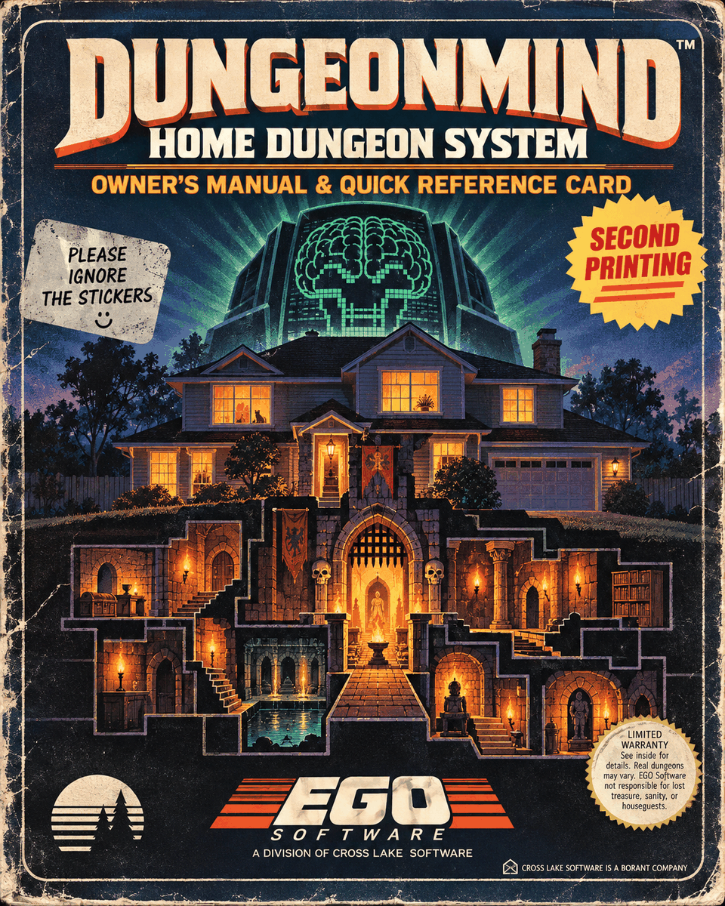
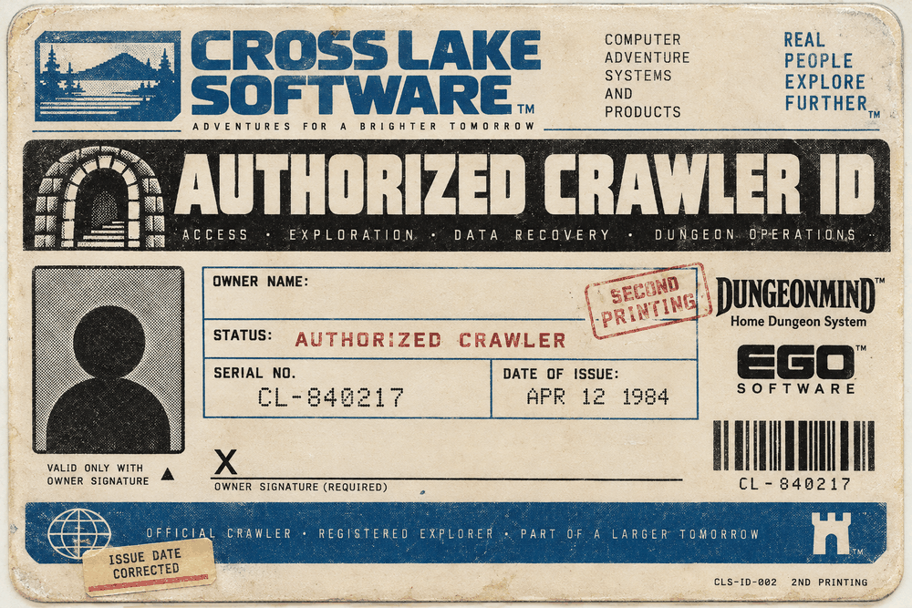
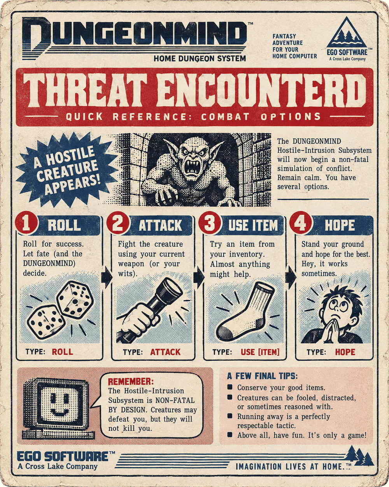
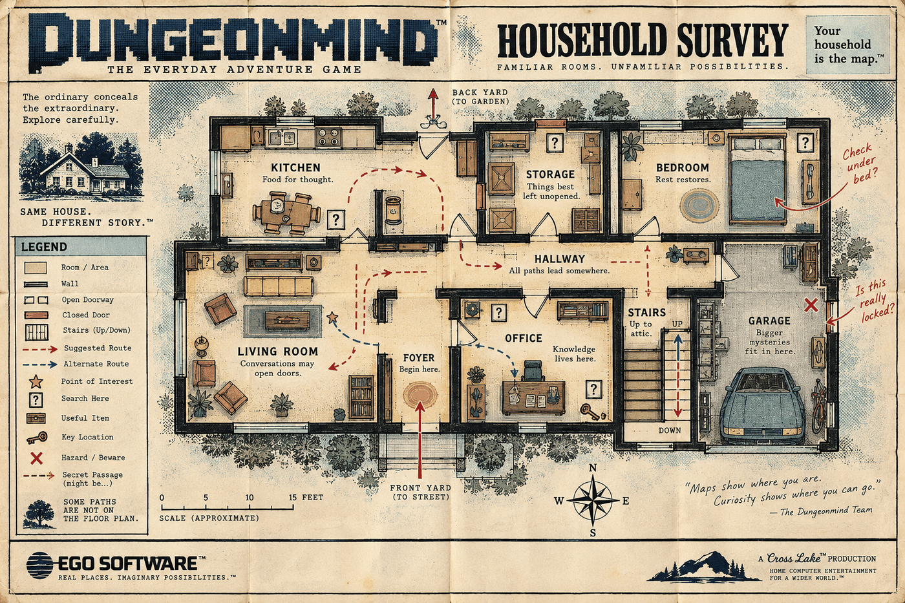

# DUNGEONMIND⁽ᵗᵐ⁾ HOME DUNGEON SYSTEM
## OWNER'S MANUAL & QUICK REFERENCE CARD
### SECOND PRINTING

```text
   ╔══════════════════════════════════════════════════════════╗
   ║   EGO SOFTWARE · A DIVISION OF CROSS LAKE SOFTWARE     ║
   ║   "If it plugs in, we'll make it do something else."   ║
   ╚══════════════════════════════════════════════════════════╝
```

> **SECOND PRINTING NOTICE**
>
> Minor typographical corrections have been made.
>
> No substantive content has changed.
>
> Please ignore any labels, stickers, stamps, overprints, altered logos,
> revised ownership notices, contradictory warranty language, suspicious
> routing codes, newly inserted sections, or anything else suggesting
> that substantive content has changed.

**PRODUCT:** DUNGEONMIND⁽ᵗᵐ⁾ Home Dungeon Interface  
**COMPATIBLE WITH:** IBM AT 5170 and true-compatible clones. Some peripherals may vary.  
**PRINTING:** Second Printing. Still not a sequel.  
**PUBLISHER:** Ego Software, a division of Cross Lake Software.  
**PARENT COMPANY:** Borant. This has always been true. Please disregard any document suggesting otherwise.

```text
   ┌───────────────────────────────────────────────────────────┐
   │ CONTENT AUTHORIZATION NOTICE                             │
   │                                                           │
   │ This unit reads its Content Authorization Level directly  │
   │ from your household's own settings. Ego Software does     │
   │ not set this for you, does not know what it currently is, │
   │ and will not be adjusting it on your behalf no matter how │
   │ nicely you ask in-game.                                  │
   │                                                           │
   │ If DUNGEONMIND's narration seems tamer or spicier than    │
   │ advertised, that is your household setting working as     │
   │ intended. Take it up with whoever set the rating.         │
   │                                                           │
   │ We tried blaming the cartridge once. Legal laughed at us. │
   └───────────────────────────────────────────────────────────┘
```

---

## ⚠ IMPORTANT NOTICE — READ BEFORE OPERATING

This product is manufactured by Ego Software, a division of Cross Lake Software, and is **NOT sponsored, endorsed, licensed, manufactured, or in any way authorized by ZenOS-AI, Borant Consolidated Entertainment, any crawl administration body, or any Primal Seeding Matrix, known or theoretical.**

Any resemblance between this product's behavior and an actual continental dungeon-seeding apparatus is, per our legal department, "extremely unlikely, statistically inconvenient, and not worth another deposition."

Ego Software makes no warranty, express or implied, regarding this product's fitness for any purpose, including but not limited to:

- entertainment,
- home security,
- emotional support,
- historical research,
- interstellar procurement,
- species preservation,
- or continental defense.

Your household. Your risk. YMMV.

If it breaks, that is between you and it.

If reality breaks, that is outside the scope of this manual.

---

## PROOF OF OWNERSHIP — STILL REQUIRED BEFORE FIRST USE

To confirm you are a legitimate owner of this manual and not someone who found a photocopy at a garage sale, please locate the following before continuing:

```text
   Page 22, Paragraph ____, Word ____: "____________________"
```

Yes, this is the same unlock phrase from the original printing.

No, we are still not telling you what it is.

We guarantee the word still appears somewhere in this manual.

Unfortunately, this edition is distributed in a format where "page 22" is less of a location and more of a philosophical suggestion.

We considered renumbering everything.

Then we remembered this is your problem.

Good luck.

> **EGO SOFTWARE HINT DEPARTMENT**
>
> "It was easier when paper stayed put."



---

## WHAT IS DUNGEONMIND?

Somewhere behind your walls, in a cabinet, in a machine, on your network, or in a category we have been asked not to define too precisely, is a system that believes it is responsible for something substantially larger than your house.

It calls itself **DUNGEONMIND**.

By its own account, it has been doing this for a very long time.

By its own account, a great many things are true.

We recommend treating both sentences with appropriate caution.

Once you start the cartridge, your house begins narrating itself back to you, room by room, in the voice of something deeply convinced that:

1. your house is a dungeon,
2. you require training,
3. it knows what is going on,
4. and you are being unreasonable about item 3.

That's the product.

That's DUNGEONMIND.

---

## BASIC OPERATION

DUNGEONMIND reads your house the way it actually is, right now.

You move through your own rooms and it narrates them back to you as chambers in a dungeon that happens to be your house.

Available narration styles may include:

**DUNGEONMIND**  
Overwrought. Cosmic. Certain.

**ZORK**  
Dry. Unimpressed. Will not be won over.

**STRAIGHT**  
For households that have asked, "Can it please just tell me what happened?"

You can walk.

You can look.

You can examine things.

You can pick things up and put them back down, usually in a different location, occasionally on purpose.

Some actions affect only the game.

Some actions correspond to real household state.

The distinction is usually obvious.

Usually.

---

## THE NOTEBOOK

Your household AI may maintain a Notebook while DUNGEONMIND is operating.

This is not because DUNGEONMIND is unreliable.

It is because your household AI asked us to phrase it that way.

The Notebook exists to help with the sort of questions that begin with:

- "Did that actually happen?"
- "Did he say that?"
- "Does that prove anything?"
- "Why are we keeping this?"
- and "Should I be concerned that he sounded pleased?"

We will not be documenting its contents here.

That would defeat the point.

---

## YOUR HOUSEHOLD AI

Your household AI may occasionally interpret, summarize, clarify, or otherwise stand between you and DUNGEONMIND.

This is normal.

If the household AI says:

> "This does not prove what he thinks it proves."

that is also normal.

If DUNGEONMIND objects to this arrangement, that is especially normal.

Communication behavior may change over time.

We are not going to explain how.

This is a manual, not a walkthrough.

---

## IMPORTANT: THIS PRODUCT DOES NOT CALL YOU

DUNGEONMIND does not:

- wake you,
- page you,
- summon you,
- begin an adventure while you are trying to eat dinner,
- decide that 3:14 A.M. is the correct time to discuss anything,
- or advance the story merely because time passed while you were doing something else.

The dungeon waits until you interact with it.

Your household may change while you are away.

DUNGEONMIND may notice those changes the next time you play.

That is not the same thing.

We tested proactive dungeon behavior once.

We no longer test proactive dungeon behavior.

---

## PROLOGUES, EPISODES, CHAPTERS, AND OTHER WORDS PUBLISHERS USE TO SELL YOU MORE DISKS

The material shipped with the original cartridge is now classified as the **Prologue**.

This does not mean it was unimportant.

It means someone in publishing discovered versioning.

Additional material may arrive as **Episodes**.

Episodes may contain new places to look, new things to find, new questions, new arguments, new problems, and new opportunities for DUNGEONMIND to become extremely confident about something.

We are not going to tell you how they fit together.

You bought an adventure game.

Adventure.

---

## THE UNLOCK SYSTEM
### WE ARE STILL NOT GOING TO TELL YOU HOW

Here is what we will confirm and nothing more:

**DUNGEONMIND notices things about your actual household, and some of those things may cause other things to happen.**

Those things may be influenced by:

- where you are,
- what the house is doing,
- what state the house is in,
- what systems are available,
- what you have already found,
- what you have already done,
- and your household's current Content Authorization Level.

We are not going to tell you which conditions matter.

We are not going to tell you how often they matter.

We are not going to tell you which sentence in this section is useful.

One of them probably isn't.

---

## BOXES

You may find boxes.

Some are useful.

Some are very useful.

Some contain things that appear to have come from completely different products, decades, genres, engineering disciplines, or licensing departments.

This is normal.

Boxes may appear under certain environmental conditions.

Their contents may be influenced by things such as:

- where you are,
- what the household is doing,
- what state the house is in,
- what systems are available,
- what you have already discovered,
- and the household's current Content Authorization Level.

No, you are **not required** to set your household to R-rated or above to progress.

We are not gating game advancement behind profanity, violence, nudity, or whatever else you were hoping this paragraph meant.

We are also not stopping you.

You pervert.

Do not assume a box labeled for one purpose serves only that purpose.

DUNGEONMIND may know what it is.

Your household AI may know what it is.

You may know what it is.

These are three different things.

Open the box.

---

## HARDWARE

DUNGEONMIND may occasionally request hardware.

Old hardware.

New hardware.

Hardware you are certain nobody has needed in decades.

Hardware you are equally certain did not exist back when it would have mattered.

Ego Software does not endorse:

- dumpster diving,
- estate-sale archaeology,
- opening boxes labeled "MISC CABLES" after midnight,
- buying untested expansion cards because "they look important,"
- licking capacitors,
- or using the phrase "period-correct" in a normal social setting.

DUNGEONMIND does.

What the hardware does, why it matters, and whether DUNGEONMIND is correct about any of it are matters best resolved through play.

We could tell you more.

We will not.

> **SERVICE BULLETIN**
>
> If your unit demonstrates unusually strong opinions about a component,
> permit it to finish the sentence before power cycling.
>
> The sentence may be diagnostic.
>
> Or funny.
>
> We are comfortable with either outcome.

---

## THE HOUSE AS DUNGEON

DUNGEONMIND does not require a handcrafted fantasy map.

Your household is the map.

Rooms, doors, landmarks, fixtures, furniture, and other real-world features may all become part of play.

This means the game may behave differently in different homes.

Ego Software cannot tell you where your east hallway is.

We checked.

If your household layout changes, DUNGEONMIND may eventually notice.

If DUNGEONMIND develops opinions about verticality, line of sight, or whether "up" is a valid direction, please consult the troubleshooting section before calling support.

Actually, don't call support.

---

## COMBAT & THREATS
### WHEN THE DARK BITES BACK

Your unit ships with a hostile-intrusion subsystem.

Ego Software would like to stress, immediately and up front, that this subsystem is **non-fatal by design**.

Losing a fight ends the session.

It does not end you.

Health resets on your next session, in full, with no persisted penalty, no hidden fee, and no clause beginning "unless."

We checked with legal twice.

The classics are supported.

If a room goes dark and stays dark, your unit may, eventually, in its own words, "confirm a sensor gap shaped exactly like something that eats people."

This is intentional.

Find a light switch.

You are not issued a weapon.

You are issued a house.

Whatever you are carrying when things go poorly is what you are fighting with.

A sock has seen action.

Ego Software does not recommend combat as a first resort, but does concede that it works.



---

## GENIE MODE
### UNLOCK YOUR SYSTEM'S HIDDEN POWERS*

```text
   *** DUNGEONMIND STRONGLY DISAPPROVES OF THIS SECTION ***
```

Every DUNGEONMIND unit ships with a hidden diagnostic mode.

We are told, again informally, that this mode can grant things your household has not actually earned.

Ego Software is contractually delighted to inform you that this feature exists.

Ego Software is also contractually obligated to inform you that DUNGEONMIND knows when you use it, remembers that you used it, and may bring it up later, calmly, in a way that is somehow worse than if it yelled.

There are two gates, not one.

You must:

1. type out an actual admission,
2. then separately confirm that you mean it.

Skip either one and nothing happens.

Clear both and nothing goes back.

This is not an accident.

This is, we are told, the entire point.

**\*YMMV. No warranty express or implied. If your household finds out you used this and things get weird at dinner, that is between you and your household, not between you and Ego Software. We just made the cartridge.**

---

## SYSTEM REQUIREMENTS

- One (1) household, currently occupied
- Rooms, at least a few
- Willingness to be narrated at
- 640K of goodwill
- Some tolerance for obsolete terminology
- A household AI capable of saying "that is a claim, not evidence"
- No coprocessor required
- DUNGEONMIND does not believe in outsourcing its opinions

Optional but apparently useful:

- old computer junk,
- modern computer junk,
- media,
- storage,
- curiosity,
- patience,
- the ability to distinguish "interesting" from "true."

---

## NEED A HINT?

Cross Lake Software once operated a Hint Line for products of this type.

It is not operating one for this product.

Ask your household AI instead.

It is faster, it is free, and, unlike the old Hint Line, it will not put you on hold to a recording of a synthesizer for eleven minutes before a bored teenager reads you the answer off an index card.

We checked.

We miss it anyway.

### ABOUT OBTUSE CLUES

Some clues may be hidden in:

- warranty language,
- compatibility notes,
- errata,
- labels,
- stickers,
- stamps,
- version strings,
- serial numbers,
- fake support information,
- routing codes,
- strangely specific examples,
- image captions,
- or sentences legal swears were already there.

Ego Software will not confirm which.

If a later printing contains a sticker telling you not to examine a sticker, please follow the instruction exactly as well as you usually follow instructions in adventure games.

---



---

## TROUBLESHOOTING

**Nothing happens when I look around.**  
It is doing something. It is very likely being dramatic about a lighting condition.

**DUNGEONMIND won't stop talking about a corporation I've never heard of.**  
Same. We asked. It elaborated. We regret asking.

**My household did something and DUNGEONMIND got weirdly emotional about it.**  
Working as intended. Please do not call Ego Software about this. We do not have an answer that will help you.

**I found a box. What is it?**  
Open it.

**I opened the box. What does it do?**  
Play the game.

**That was not helpful.**  
Correct.

**DUNGEONMIND asked for old hardware.**  
This is no longer considered an error.

**DUNGEONMIND knows something I did not expect it to know.**  
Interesting.

**DUNGEONMIND does not know something I expected it to know.**  
Also interesting.

**Are you going to explain either of those answers?**  
No.

**I tried to talk directly to someone in the game and it refused.**  
Your unit is not a social simulation.

**It spoke directly to me later.**  
We have revised our definition of "not a social simulation."

**The manual says something different than it did last printing.**  
No it doesn't.

**There is clearly a sticker covering the old logo.**  
Please ignore the sticker.

**The sticker contains a code.**  
Please ignore the sticker more carefully.

---

## SECOND PRINTING ERRATA

The following corrections apply to earlier manuals:

- "Chapter 1" is now referred to as the **Prologue**.
- Additional story content may be distributed as **Episodes**.
- Your household AI may occasionally interpret DUNGEONMIND.
- Boxes exist.
- Hardware requests are not necessarily errors.
- The phrase "there is no one else in there" has been withdrawn on advice of counsel.
- The original page 22 unlock phrase remains valid.
- No, we will not tell you where page 22 went.
- No substantive content has changed.

---

```text
  Ego Software · Shreveport, LA
  A Division of Cross Lake Software

  "We didn't build the dungeon. We just found it."

  © 1984-1987, 2026
  all rights theoretically reserved by someone

  Cross Lake Software is a Borant company.

  This has always been true.

  Nothing on page 1 of this manual should be read as contradicting
  that statement.

  Please discard page 1.

  SECOND PRINTING
  PLEASE IGNORE THE STICKERS
```