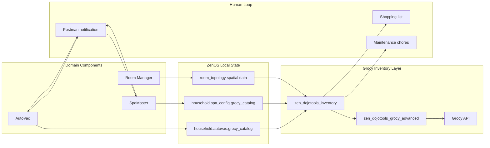
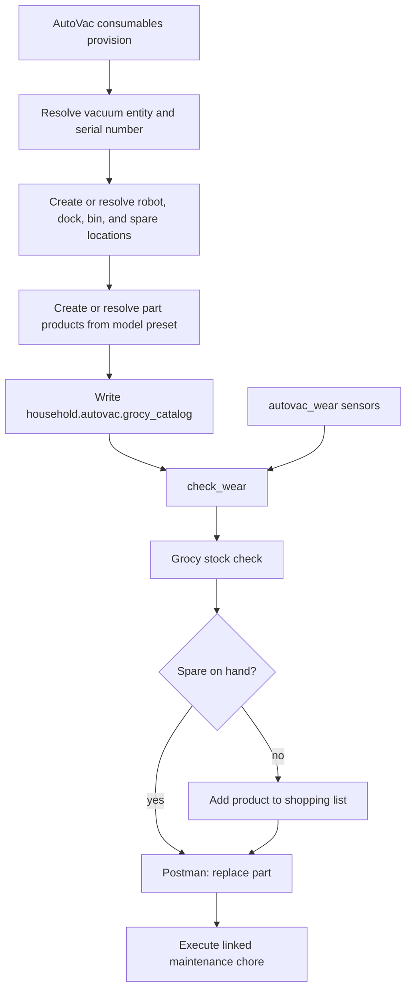
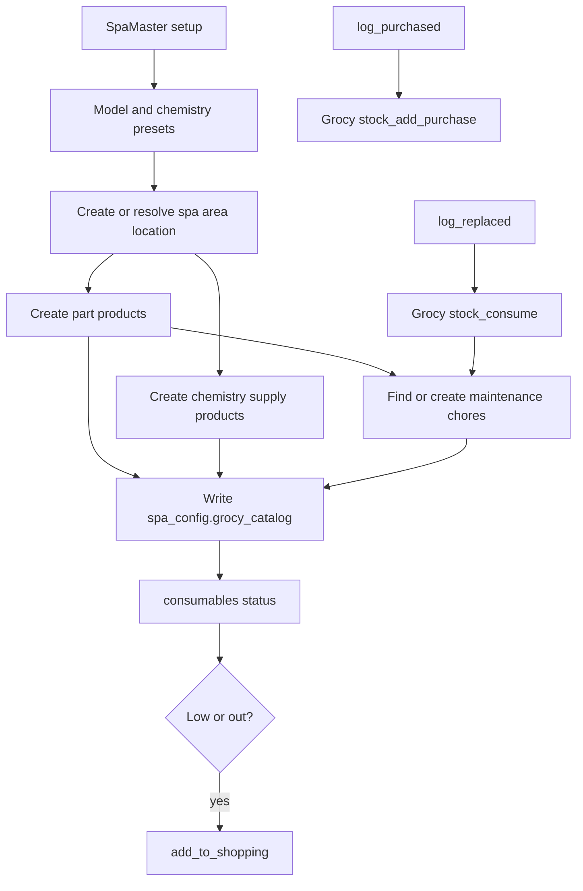

# ZenOS-AI Grocy Inventory Component

**Version:** 4.48.0  
**Package:** `packages/zenos_ai/plugins/grocy/grocy.yaml`  
**Primary script:** `zen_dojotools_inventory`  
**Internal REST dispatcher:** `zen_dojotools_grocy_advanced`

---

## Overview

Grocy is the governed inventory, location, shopping, and chore surface for ZenOS-AI. The plugin does not treat Grocy as a loose pantry lookup. It treats Grocy as a durable ERP-style system with explicit IDs, strict ambiguity checks, and controlled write paths.

In practical terms:

* Products, stock entries, locations, units, shopping lists, chores, recipes, tasks, and batteries live in Grocy.
* ZenOS-AI tools call `zen_dojotools_inventory` for normal work.
* `zen_dojotools_grocy_advanced` is the lower-level REST dispatcher and should stay internal unless the inventory tool explicitly points there.
* AutoVac and SpaMaster use Grocy for consumable parts and supplies, but each stores its own local catalog pointer in its cabinet config.

---

## Why This Component Is Different

Most ZenOS tools own their domain state directly in cabinets. Grocy is different: it is both an external application and a shared physical inventory graph. ZenOS stores local intent and catalog bindings, while Grocy remains the authority for stock, locations, chores, shopping, and product IDs.

That split is intentional:

| Layer | Authority | Example |
|-------|-----------|---------|
| Component cabinet | Tool-specific catalog bindings | AutoVac part key `hepa_filter` maps to Grocy product ID + wear sensor |
| Grocy | Physical inventory truth | Current spare filters in stock, storage location, shopping list entry |
| Room Manager | Spatial context | Area anchor, safety notes, room context slices |
| Postman | Human acknowledgement | "Spare on hand, replace this part?" |

---

## Inventory Flow



Read this as two truths meeting in the middle: the component knows what a part means inside its domain, and Grocy knows whether the part exists, where it is, and whether it needs to be purchased or logged as used.

---

## Core Inventory Modes

| Mode | Use |
|------|-----|
| `stock_check_item` | Current stock level + storage location for a product |
| `stock_where_is_item` | Find where a product is stored — returns identical data to `stock_check_item`; prefer `stock_check_item` to avoid a redundant call |
| `stock_entries_for_item` | Raw stock entries for a product |
| `stock_buy_product` | Create or resolve a product, then add stock |
| `stock_add_purchase` | Add purchased stock for an existing product |
| `stock_consume` | Remove stock after use or replacement |
| `shopping_add_product` | Add a specific product to the shopping list. Returns `{product_id, product_name, amount, list_id, action}` |
| `shopping_remove_product` | Remove a product from the shopping list. Returns `{product_id, product_name, amount, list_id, action}` |
| `stock_area_summary` | Area-level container and stock count rollup |
| `stock_area_volatile` | Volatile items (overdue/due_soon/expiring) scoped to a HA area |
| `stock_area_inventory` | Full denormalized room inventory: locations, products, amounts |
| `room_brief` | Chores + stock summary for a HA area in one call — use instead of `chores_by_area` + `stock_area_summary` to save a round trip |
| `chores_by_area` | Maintenance chores connected to an HA area |
| `chores_execute` | Mark a chore complete |
| `chores_tag` | Set `homeassistant_area` and/or `entity_id` userfields on an existing chore — required for `chores_by_area` and `room_brief` area discovery |
| `tasks_add` | Create a new Grocy task |
| `tasks_tag` | Set `homeassistant_area` userfield on an existing task |
| `stock_entry_update` | Edit a stock entry (best_before_date, location, price). Returns `{product_id, product_name, entry_id, updated_entry}` |
| `stock_register_asset` | Register a permanent physical asset and stock one unit |
| `locations_metadata_set` | Bind Grocy locations to HA area and parent/container metadata |
| `userfields_list` | List all Grocy userfield schema definitions. Optional `entity=` filter |
| `userfields_deploy` | Idempotent deploy of canonical ZenOS userfield schema — creates missing fields, skips existing, stamps `schema_version` to household cabinet |
| `userfields_repair` | Diff live Grocy schema vs canonical. Reports `ok/missing/type_drift/unknown` + version delta. Fixes missing unless `dry_run=true` |
| `userfields_delete` | Delete a userfield schema definition by ID. Warns if canonical. Requires `confirm_action=true`. |

Use `mode=help` on `zen_dojotools_inventory` for the complete 74-operation catalog.

**`slim_objects` field:** Pass `slim_objects: true` on any large object list fetch (products, locations, chores) to return only `{id, name}` per item — prevents template overflow on big catalogs.

---

## Area And Location Model

Grocy locations can be bound into Home Assistant topology with userfield metadata:

| Field | Purpose |
|-------|---------|
| `homeassistant_area` | HA area slug associated with the Grocy location |
| `grocy_parent_location_id` | Parent container ID for nested storage |
| `grocy_location_subclass` | Semantic role such as `anchor`, `container`, `zone`, or `virtual` |
| `placement_priority` | Sort order inside the area |

This is what lets Room Manager ask "what inventory belongs to this room?" without hand-maintained entity lists. The important room-facing modes are:

* `stock_area_summary`: compact count and anchor view for a room or area.
* `stock_area_volatile`: volatile items (overdue, due soon, expiring) scoped to a HA area.
* `stock_area_inventory`: denormalized detailed view with product names and amounts.
* `chores_by_area`: maintenance chores discovered through stocked products or direct `homeassistant_area` tags.

---

## stock_area_volatile

Returns all volatile (overdue, due-soon, or expiring) items whose `location_id` falls inside the given HA area.

**Input:** `homeassistant_area_id` (required) — HA area slug (e.g., `kitchen`).

**How it works:**

1. GET `/objects/locations` — collect all Grocy locations tagged with `userfields.homeassistant_area` matching the requested area. Build the area location ID set.
2. GET `stock/volatile` — fetch the whole-house overdue/due_soon/expiring lists.
3. For each item in all three lists: include it if `item.location_id` is a member of the area location ID set.

Area membership is determined by the stock entry's storage location (`item.location_id`), not the product's default location. Items without a `location_id` are excluded.

**Response shape:**

```json
{
  "status": "success",
  "mode": "stock_area_volatile",
  "area_id": "<area_slug>",
  "location_ids": [<int>, ...],
  "overdue": [...],
  "due_soon": [...],
  "expiring": [...],
  "counts": {
    "overdue": <int>,
    "due_soon": <int>,
    "expiring": <int>
  }
}
```

Items in `overdue`, `due_soon`, and `expiring` are the full Grocy volatile entry objects — the same shape returned by `GET stock/volatile`.

**If the area has no tagged locations:** `location_ids` is `[]` and all three item lists are empty (no error).

**Example:**

```yaml
zen_dojotools_inventory:
  mode: stock_area_volatile
  homeassistant_area_id: kitchen
```

---

## AutoVac Integration

AutoVac uses Grocy for robot consumables: bags, filters, brushes, pads, and other model preset parts.



AutoVac stores its Grocy bindings in the `autovac` drawer under `grocy_catalog`. Each part entry can include:

* `product_id`
* `name`
* `sku`
* `storage_location_id`
* `installed_location_id`
* `min_stock`
* `chore_id`
* `category`
* `wear_sensor_key`
* `wear_threshold`
* `wear_entity`

The operational loop is:

1. `mode=consumables action=provision` builds the catalog and writes the cabinet binding.
2. `mode=check_wear` reads wear sensors from `autovac_wear` labels and compares them to catalog thresholds.
3. If a part is worn, AutoVac checks stock through Grocy.
4. If stock exists, Postman tells the human a spare is available.
5. If stock is missing, AutoVac adds the item to the Grocy shopping list.
6. `action=log_replaced` consumes one spare and executes the linked chore when `chore_id` exists.
7. `action=log_purchased` adds new spares to the configured storage location.

See also: [AutoVac](../components/autovac.md).

---

## SpaMaster Integration

SpaMaster uses Grocy for spa parts and chemistry supplies. It combines preset-driven catalog creation with stock, shopping, and maintenance chores.



SpaMaster stores its Grocy bindings in `spa_config.grocy_catalog`. The catalog is split into `parts` and `chem_supplies`, then combined at runtime for consumable actions.

The operational loop is:

1. `mode=consumables action=provision` loads a spa preset, creates or reuses products, creates or reuses chores, and writes the catalog.
2. `action=status` reports current stock and reorder flags.
3. `action=add_to_shopping` queues all low or out items to the Grocy shopping list.
4. `action=log_replaced part=<key>` consumes stock and executes the linked maintenance chore when present.
5. `action=log_purchased part=<key> amount=<n>` adds purchased stock to the part's configured storage location.

See also: [SpaMaster](../components/spamaster.md).

---

## First-Time Setup

1. Add the Grocy API key to `secrets.yaml`:

```yaml
grocy_api_key: <your_api_key>
```

2. In Home Assistant, set `input_text.grocy_url` to the HTTPS base URL for Grocy:

```text
https://<your-grocy-host>
```

Do not add a trailing slash. Use HTTPS, not HTTP. If a reverse proxy redirects HTTP to HTTPS, Home Assistant may follow the redirect in a way that changes POST requests into GET requests, which breaks writes.

3. Expose `zen_dojotools_inventory` to the conversation agent if the agent should help with household inventory. Keep `zen_dojotools_grocy_advanced` internal unless you are deliberately giving the agent raw REST access.

4. Provision domain catalogs from the owning tools:

```yaml
zen_dojotools_autovac:
  mode: consumables
  action: provision
  model_preset: roborock_s8_pro_ultra
```

```yaml
zen_dojotools_spamaster:
  mode: consumables
  action: provision
  model_preset: caldera_utopia_florence_2024
```

---

## Getting Started — Area Inventory

This walkthrough assumes Grocy is reachable (API key and URL configured) and at least one HA area exists. The goal: one room's inventory visible to Room Manager and queryable by area.

### Step 1 — Tag a Grocy location with an HA area

Create the Grocy location in the Grocy UI if it does not exist. Then bind it to an HA area slug:

```yaml
zen_dojotools_inventory:
  mode: locations_metadata_set
  location_id: 12              # Grocy location ID (integer)
  homeassistant_area: kitchen  # HA area slug
  grocy_location_subclass: anchor
```

Use `anchor` for the primary location of the area. Use `container` for nested shelves or bins inside the anchor. A room can have multiple tagged locations — all of them contribute to area queries.

Audit the binding after tagging:

```yaml
zen_dojotools_inventory:
  mode: locations_audit
```

Returns all Grocy locations with their `homeassistant_area` userfield. Confirm the slug matches an active HA area.

### Step 2 — Add products and stock them

In the Grocy UI, set each product's default location to the tagged location. Purchased stock defaults to that location. Alternatively, use `stock_buy_product` to create a product and stock it in one call:

```yaml
zen_dojotools_inventory:
  mode: stock_buy_product
  product_name: "Dish Soap"
  amount: 2
  location_id: 12    # anchor location for kitchen
```

### Step 3 — Verify the area summary

```yaml
zen_dojotools_inventory:
  mode: stock_area_summary
  homeassistant_area_id: kitchen
```

Returns container count, product count, and stock totals for the area. Correct counts confirm the area binding is working.

### Step 4 — Check volatile items

```yaml
zen_dojotools_inventory:
  mode: stock_area_volatile
  homeassistant_area_id: kitchen
```

Returns overdue, due-soon, and expiring items whose stock entries are located inside the area. Empty results are normal if no items have open or best-by dates set.

### Room Manager reads this automatically

Once locations are tagged, Room Manager's `+inventory` slice calls `stock_area_volatile` for the room on every expand. No additional configuration is needed:

```yaml
zen_dojotools_room_manager:
  mode: room
  area_id: kitchen
  output_fields: "+inventory"
```

The `inventory` slice in the response carries the kitchen's volatile items from this point forward.

---

## Userfields Schema Management

ZenOS uses Grocy userfields to bind inventory objects to HA topology. The canonical schema defines 13 fields across locations, products, chores, and tasks.

### Deploying the Schema

On a fresh Grocy install, run:

```yaml
zen_dojotools_inventory:
  mode: userfields_deploy
```

Idempotent — safe to re-run. Creates any missing fields, skips existing ones, stamps `schema_version: "1.0.0"` to the household cabinet under `grocy_schema`.

### Auditing the Schema

```yaml
zen_dojotools_inventory:
  mode: userfields_repair
  dry_run: true
```

Returns `deployed_version`, `healthy: true/false`, and counts for `ok / missing / type_drift / unknown`. Use `dry_run: false` (or omit) to fix missing fields in place.

`unknown` fields are ones Grocy has that are not in the ZenOS canonical schema — `products.mealie_ingredient_id` is a common example (Mealie-owned, expected). Not a bug.

### Listing All Fields

```yaml
zen_dojotools_inventory:
  mode: userfields_list
  entity: locations   # optional filter: locations|products|chores|tasks
```

### Canonical Field Reference

| Entity | Field | Purpose |
|--------|-------|---------|
| `locations` | `homeassistant_area` | HA area slug bound to this Grocy location |
| `locations` | `grocy_parent_location_id` | Parent container ID for nested storage |
| `locations` | `homeassistant_entity_id` | HA entity_id representing this location |
| `locations` | `homeassistant_labels` | JSON array of HA labels |
| `locations` | `placement_priority` | Sort order for conflict resolution |
| `locations` | `grocy_location_subclass` | `suite\|room\|container\|furniture\|shelf\|drawer\|...` |
| `locations` | `grocy_child_location_ids` | JSON array of child location IDs |
| `products` | `homeassistant_area` | Direct product-to-area link |
| `products` | `hazmat_class` | `flammable\|corrosive\|toxic\|oxidizer\|other` |
| `products` | `zen_asset_type` | `consumable\|asset\|equipment` |
| `chores` | `homeassistant_area` | HA area ID — required for `chores_by_area` and `room_brief` discovery |
| `chores` | `homeassistant_entity_id` | HA schedule or todo entity linked to this chore |
| `tasks` | `homeassistant_area` | HA area ID for area-based task queries |

---

## Troubleshooting

| Symptom | Likely cause | Check |
|---------|--------------|-------|
| Grocy reads work but writes fail | `grocy_url` is HTTP or proxy redirects POST | Set `input_text.grocy_url` to HTTPS directly |
| AutoVac says consumables are not provisioned | `autovac.grocy_catalog` missing | Run AutoVac `mode=consumables action=provision` |
| SpaMaster says consumables are not provisioned | `spa_config.grocy_catalog.parts` missing | Run SpaMaster `mode=consumables action=provision` |
| Room inventory is empty | Grocy locations are not tagged with `homeassistant_area` | Use `locations_metadata_set` or `locations_audit` |
| Maintenance chores do not appear by area | Chores are not linked to products or area userfield is missing | Check `chores_by_area` setup |
| Product update is blocked by unit error | Existing product has a null or incompatible quantity unit | Follow the tool's delete/recreate or conversion guidance |

---

## Source Notes

This page is derived from:

* `packages/zenos_ai/plugins/grocy/readme.md`
* `packages/zenos_ai/plugins/grocy/grocy.yaml`
* [AutoVac](../components/autovac.md)
* [SpaMaster](../components/spamaster.md)
