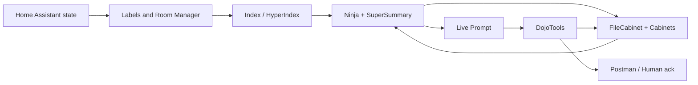

# 📘 **ZenOS-AI Documentation Hub**

> **Version:** 2026.9.0 'Steel Magnolia' | Previous: 2026.8.1 'Chef' | **Last Updated:** Sep 2026 | **License:** MIT
>
> *Public releases follow Home Assistant's `YYYY.M.patch` convention — `2026.7.0` is the July release 'Neo'. A new month resets to `.0`.*

→ [Project Overview & Install](../../README.md)

---

> ### 2026.9.0 'Steel Magnolia' — Stable
>
> Room Manager v3's live state engine and REFLEX (autonomous scene-firing) reach their fullest form yet, plus the hospitality lifecycle (guest arrival/checkout) and cert-gated permission tightening. See root **[README](../../README.md)** (the "What's in Steel Magnolia" section near the top) and the **[Room Manager v3 & REFLEX operator's manual](getting_started/room_manager_operators_manual.md)** for the full picture — this hub's own body below this banner had drifted behind the top-line version; treat the root README and the getting_started docs as the current source of truth for anything not yet reflected here.
>
> → [Full Release Notes — Steel Magnolia](releases/steel_magnolia.md)

---

> ### 2026.8.1 'Chef'
>
> Taskmaster, the SP1 identity gate, Portainer container control, Kitchen's fulfillment/costing layer, Twenty CRM, Room Manager's guest/occupant-prefs lookup, full Reset Test hardening pass.
>
> → [Full Release Notes — Chef](releases/chef.md)

---

> ### 2026.7.1 — Patch
>
> **1. KF5 — Self-Registering Tools.** Tools declare their own KFC dojo-drawer contract via `mode=kfc_manifest`; `zen_dojotools_manifest mode=bootstrap_kfc` discovers and mounts them automatically. 5 dojotools files adopted it (Room Manager, AlertManager, Camera, Security Manager, SystemTools).
>
> **2. Firefly III — Codex Tier.** `zen_dojotools_finance` v2.3.0 gains sibling codex modules: `zen_codex_finance_depreciation` (asset depreciation) and `zen_codex_finance_cogs` (COGS auto-posting from Grocy).
>
> **3. Grocy v5.3.1.** `stock_entry_update` fix (was silently sending empty PUT payloads on entry-id-only calls). Perishable Storage Coaching, COGS Coaching, battery-stock tracking, tax/depreciable-asset userfields.
>
> **4. Battery Notes — new Lens Bus provider.** `zen_stack_battery` v1.2.1, HALMark PASS — first stack provider sourced from a HACS integration (`ha-battery-notes`) rather than a self-hosted backend.
>
> **5. Postman `direct_dispatch`.** Authority-stack bypass mode, migration path for the retired `zen_dojotools_notification_router`.
>
> → [Full Patch Notes — 2026.7.1](releases/neo.md#20267-1-patch)

---

> ### 2026.7.0 'Neo' — Released 2026-06-27
>
> **1. CabCeption — FileCabinet v6.2.0.** Nested drawer trees via `/` path separator. VirtualDrawer (softlink), LiveDrawer (KF4 schema absorbed into a drawer — fires a tool call on read, warm/cold cache, never empty). Every drawer is a node with meta, labels, and children.
>
> **2. Cortex 43 — Rule Zero.** DojoTools supersede all HA built-ins. Not preference — authority. Domain routing table in directives. Successor to v42 'The Answer'.
>
> **3. Tool Manifest + Lens Bus.** `zenos_manifest.jinja` + `MF.tool_manifest()`. Manifest broker v6.0.0 discovers tools by namespace. Library v5.5.0 `stack=` routing. `zen_stack_radar` v1.0.0 wires Zammad as a Lens provider.
>
> **4. ZenZork v1.6.0.** Text adventure engine on live RM topology. Narrator styles (zork/dungeon/straight). DUNGEONMIND — "Primal AI, IBM AT 5170, binding active since 1984." Item commands (take/drop/inventory/put/push/pull/open/close/use). Navigation additions (face/turn, again/g). Character sheet in AI user cabinet. Landmark survey wizard. `game_mode`, `harassment_freq`, `difficulty` session fields. Post-game RM quality report on stop. Quest system. Portal disambiguation.
>
> **5. Media Manager v6.0.0 (NyxMau5) — Lens provider surface.** `stacks_by_anchor` maps anchors (label/person/area/mood/activity) to ranked evidence leaves with `playback_hint`. `now_playing` mode feeds Room Manager `+media` context slice with full playback fidelity (provider, search_metadata, lyrics_hint). `media_source_prefs` — preferred sources float, excluded sources stripped — applied on every Lens call automatically. `discovered_sources` returned on every search. Set once, use many: discover sources with `health`, save prefs in Profile Editor, done. Area anchors inject `room_context` only — semantic anchors drive the query. `zen_stack_media` proxy. Profile Editor v5.3.0 adds `media_prefs` to all three profile targets.
>
> → [Full Release Notes — Neo](releases/neo.md) | [ZenZork](scripts/zen_dojotools_zenzork_readme.md)

---

Welcome to the **ZenOS-AI Documentation** — the full map of the architecture, tools, cognitive model, and operational philosophy behind *Friday’s Party*.

ZenOS-AI turns **Home Assistant** into a real agentic, persona-aware operating system. This documentation explains how the pieces fit together: the **Cabinet System** for identity and memory, the **Monastery** for reasoning, the **KF4 action pipeline** for awareness and action, and the **HyperIndex** for graph-based attention and discovery.

If you're building an AI construct, designing a DojoTool, wiring the action pipeline, or just trying to understand how Friday thinks, this directory is your guide.

---

# 📚 **Included Documentation**

This directory contains **12 documentation suites**, each aligned with a major subsystem in ZenOS-AI.

---

## 🚀 **0. Getting Started**

**Folder:** `docs/getting_started/`

New to ZenOS-AI? Start here.

* `install.md` — File copy, configuration.yaml setup, conversation agent prompt, set conversation agent before restart, restart, health verification
* `first_run.md` — First boot walkthrough, OOBE conversation, persona selector, editing profiles, troubleshooting
* `entity_exposure.md` — What to expose to your conversation agent: actionable vs contextable vs invisible, the three-tier model
* `autovac_first_setup.md` — Full AutoVac commissioning: rooms, labels, schedules, Postman policy, Grocy inventory, consumables, wear checks, AlertManager
* `autovac_quick_start.md` — New user 5-step overview: schedule setup, model preset selection, 3-button briefing walkthrough, first run
* `cabinet_placement.md` — Where things go and why: Dojo vs Kata, drawer vs KFC, the quick-reference placement table. Read after entity_exposure.
* `oobe.md` — OOBE walkthrough: the six-step first-boot configuration protocol to your conversation agent: actionable vs contextable vs invisible, the three-tier model
* `troubleshooting.md` — Gauges → Kill Switches → Repair Tools. Health sensor quick-reads, summarizer kill switches, and a seven-step graduated repair sequence (resolver refresh → reseed → label reset → nuclear cabinet reset)
* `user_management.md` — Add/remove/move AI users and human users. Provision new identity cabinets, deprovision or swap existing ones, transfer default labels, and perform targeted identity-layer repairs or full nukes.
* `room_manager_operators_manual.md` — Room Manager v3 in plain language: the state cascade, wasp-hold, entertaining/guest hold, asleep window, and manual override — written for the household operator, not the developer.
* `security_certification_manual.md` — The certification system that gates locks, covers, alarm, infra, and room overrides: cert_component/cert_level/cert_scope, cert-only vs. cert-plus-live-ack, and the Section 4 prerequisite.
* `notification_routing.md` — Seeding Postman's actual delivery policy so notifications reach the right device/person.
* `zenzork_manual_unofficial.md` — Optional: the in-universe player's manual for ZenZork, the text adventure built on your live Room Manager topology.

If you just installed ZenOS-AI and want to know what to do next, start here.

---

## 🛠️ **1. Tool Reference**

**Folder:** `docs/components/`

Reference docs for every major ZenOS-AI tool. Each covers modes, discovery, parameters, and response shape.

* `components/room_manager.md` — Room Manager (RoomReg): spatial topology, context slices, emergency routing, home_overview, utility index
* `components/room_manager_v3_reflex.md` — Room Manager v3 & REFLEX: per-room state cascade, wasp-hold, entertaining/guest hold, asleep window, REFLEX event bus
* `plugins/emporia_vue_codex.md` — Plant Codex: Emporia Vue circuit-level energy monitoring
* `plugins/eg4_web_monitor_codex.md` — Plant Codex: EG4 Web Monitor solar/battery monitoring
* `plugins/span_panel_codex.md` — Plant Codex: SPAN Panel circuit-level energy monitoring
* `components/plant_manager.md` — Plant Manager: electric, water, gas, HVAC, mechanical, circuits, managed, validate, label_suggest (SPAN/Emporia circuit labeling)
* `components/media_manager.md` — Media Manager (NyxMau5): whole-home discovery, source management, intent routing
* `components/autovac.md` — AutoVac: room election, readiness gates, cleaning runs, and post-run analysis
* `components/spamaster.md` — SpaMaster: spa/hot tub management, ESPHome discovery, scene/chemistry/log
* `components/alertmanager.md` — AlertManager: severity labels, priority inject, auto-expiry, GC sweep, Postman ack lifecycle
* `components/security_manager.md` — Security Manager: alarm panel, zone inventory, arm/disarm, camera cross-reference, lens pattern, `security_control` identity gate (disarm requires a fresh live ack every call)
* `components/infra.md` — Infrastructure Console: node/container/monitor/update/cert health, container-control codex gated on `infra_container_control`
* `components/systemtools.md` — SystemTools: home mode, quiet/work hours, scheduler anchors, guest/entertaining toggles, home_status rollup
* `plugins/grocy.md` — Grocy Inventory Component: governed inventory, room locations, stock_area_volatile, shopping, chores, AutoVac and SpaMaster consumables, area inventory getting-started walkthrough
* `components/zenlux.md` — ZenLux: lighting *and switch* control, bleed-aware scenes, `scene_stage` (relocated in from Room Manager), media awareness, sync_shades, Room Manager v3 room-lock guard, reflex_sync, `lighting_control` identity gate
* `components/zenshade.md` — ZenShade: cover management, tilt support, barrier exclusion, ZenLux sync, `cover_control` identity gate (asymmetric barrier/non-barrier risk)

---

## 🧠 **2. Architecture**

**Folder:** `docs/architecture/`

The full cognitive and systems architecture.
This is the textbook for ZenOS-AI.

Highlighted chapters:

* `00_toc.md` – Table of contents
* `01_the_monastery_core.md` – The reasoning engine
* `02_Architectural_Overview.md` – The high level cognitive stack
* `03_Cognitive_Architecture_Foundations.md`
* `04_Cognitive_Data_Flow.md` – How signals travel
* `05_Reasoning_and_Kata_Design.md`
* `06_Scheduler_and_The_Abbot.md` – Task routing
* `07_Summarizer_Pipelines.md` – Awareness flow
* `08_Kata_Cabinet.md`
* `09_Identity_Architecture.md` – Identity data model spec
* `11_RoomState_and_Perception.md` – Sensory model
* `14_Abbot_Scheduler_And_Task_Economy.md`
* `18_Context_Frame_Operational_Cognitive_Surface.md` – Context assembly + prompt loader
* `19_Resilience_and_Failure_Modes.md` – Highlander resolver, health sensor stack
* `20_tool_invocation_and_security.md` – Tool ACLs, safety classes, caller_token
* `22_Room_Manager_v3_REFLEX.md` – The state cascade and REFLEX's autonomous scene-firing, from the architecture side (the operator-facing version is `getting_started/room_manager_operators_manual.md`)
* `security_model_ga.md` – **Operator reference:** what's active at GA vs SP1

If you want to know how the mind works, start here.

---

## 🗃️ **2. Cabinets**

**Folder:** `docs/cabinets/`

Defines how ZenOS-AI stores identity, memory, context, and structured state.

Key files:

* `cabinet_spec.md` – The cabinet standard
* `hypergraph_model.md` – How cabinets form a recursive graph
* `zen_redirector_spec.md` – Volume Redirector v3
* `readme.md` – Overview of cabinet classes and mounts

Cabinets are the filesystem of the mind.

---

## 🧩 **3. Custom Templates**

**Folder:** `docs/custom_templates/`

Jinja templates that power prompt assembly, context building, and deterministic preprocessing.

Files:

* `zen_os1_jinja.md` — Core prompt assembly engine
* `zen_query_jinja.md` — ZQ-1 filter engine
* `zenos_cabinets_jinja.md` — Cabinet macro library: canonical safe drawer I/O, FG-38 normalization encapsulated
* `zenos_manifest_jinja.md` — Tool manifest macro (`MF.tool_manifest()`): every compliant tool self-describes via this contract

This suite defines how Friday constructs her thoughts.

---

## 🥋 **4. Kung Fu Components**

**Folder:** `docs/kung_fu/`

Each Kung Fu component is a discipline: a subsystem Friday loads at runtime.

Documents:

* `understanding_kf4.md` — **Start here.** Plain-language guide to the Dojo, Kung Fu Components, and the KF4 action pipeline. How to add a new component in five steps, no code required.
* `building_a_kfc.md` — Step-by-step build guide with worked example.
* `alert_manager.md` — AlertManager KFC: severity labels, fire-once dedup, TTL, priority inject wiring.
* `taskmaster.md` — Taskmaster KFC: AI conductor queue, task lifecycle, Abbot dispatch.
* `readme.md` — Technical spec: drawer schema, trigger ID reference, command strip migration notes.

This is Friday’s skill tree.

---

## 📚 **5. Zen Library**

**Folder:** `docs/library/`

Shared utilities and primitives for every DojoTool.

Includes:

* `readme.md` – Overview
* `index_system.md` – Recursive index system internals

The Library is the glue that holds all subsystems together.

---

## 🧪 **6. Research**

**Folder:** `docs/research/`

Background research and whitepapers.

* `whitepaper_cognitive_architectures.md` – Theory behind the Monastery, Summarizers, and Cabinets

Good for deep dives and formal reasoning.

---

## ⚙️ **7. Script Modules**

**Folder:** `docs/scripts/`

Documentation for every Zen DojoTool and script module.

Includes:

* `zen_dojotools_admintools_readme.md` — AdminTools: KungFu Writer, cabinet repair, template press, prompt loader, nuclear label reset, reset_all cabinet sequence
* `zen_dojotools_scheduler_readme.md` — Scheduler: trigger IDs, Dojo-driven dispatch, component subscription, force events, hardware trigger pattern
* `zen_dojotools_summarizers_readme.md` — Ninja Summarizer + SuperSummary: kill switches, active component selection, monk pipeline
* `zen_dojotools_library_readme.md` — Library v6.10.0: Lens Bus `stack=` routing, generic verbs, unified catalog (`section=catalog item_type=*`) with books/games/all works types, compounding capability tiers, hash_md5, slugify
* `zen_dojotools_zenzork_readme.md` — ZenZork v1.7.0: text adventure on live RM topology, narrator styles (zork/dungeon/straight), DUNGEONMIND, item/interaction commands, character sheet, landmark survey wizard, "Chapter 1" content (weighted loot table, 15 quest markers, Diwatta/Valtay/Mongo book-lore sequence, Carl's Left Sock, Game Genie cheat codes, per-release-chapter publishing with engine-version gating); see also [devkit](scripts/zenzork_devkit.md) and [unofficial manual](getting_started/zenzork_manual_unofficial.md)
* `zen_home_mode_readme.md` — Home Mode: 8-state machine, schedule anchors, quiet/work hours, scheduler trigger IDs
* `zen_dojotools_filecabinet_readme.md` — Cabinet read/write controller, clone action, Highlander mode
* `zen_dojotools_manifest_readme.md`
* `zen_dojotools_inspect_readme.md`
* `zen_dojotools_index_readme.md`
* `zen_dojotools_hyperindex_readme.md`
* `zen_dojotools_query_readme.md`
* `zen_dojotools_camera_readme.md` — Camera: ai_task gate, look/scan, dynamic cabinet routing, Security Manager lens pattern
* `zen_dojotools_postman_readme.md` — Postman: ack loop, clear_tag consumer pattern, open_dashboard companion URI, actionable notifications, image support
* `zen_dojotools_todo_readme.md` — Todo: HA todo + MS365 tasks, bulk complete, discoverability
* `zen_dojotools_calendar_readme.md` — Calendar: full CRUD, MS365 native APIs, label-targeted reads, wildcard discovery
* `zen_dojotools_utilities_readme.md` — Utilities: calculator, dice roller, announce, wait, canonical HA domain tools (select/boolean/number/text/climate/water_heater/datetime/zones/timekeeper)
* `zen_dojotools_office_readme.md`
* `zen_dojotools_event_emitter_readme.md`
* `readme.md` – Overview

Scripts are the motor cortex. They turn reasoning into action.

---

## ⚕️ **8. Health Sensors**

**Folder:** `docs/sensors/`

Layered health monitoring stack — cabinet resolvers, cognition pipeline, agent bootability.

* `readme.md` — full reference: 7 always-live cabinet resolver sensors + 6 trigger-based health sensors (including `sensor.zen_prompt_health` — prompt integrity), states, conditions, attributes, troubleshooting quick-reference. Includes `zen_health_report` (full system diagnostic) and `zen_resolver_refresh` (cold-start recovery).

---

## 🧩 **9. Zen HyperIndex**

**Folder:** `docs/zen_hyperindex/`

Documentation for the recursive hypergraph-driven index system.

* `zen_hyperindex_overview.md`
* `zq1_patterns.md` — 10 real index call patterns: ghost hunt, drift detector, coverage gap analysis, power spike triage, KFC intelligence pull, access gate, full system graph, area slice, NOT query, and the history-in-inspect forward reference. Includes the full ZQ-1 filter key reference table.

If Cabinets are the filesystem, HyperIndex is the search engine plus attention model.

---

## 🧠 **10. Zen Summarizer**

**Folder:** `docs/zen_summarizer/`

The Summarizer subsystem manages:

* Reflection
* Context evolution
* Awareness loops
* Narrative reconstruction
* Kata reduction

Files:

* `ninja_summarizer_spec.md`
* `readme.md`

This is Friday’s working memory engine.

---

## 🔐 **11. Identity & Security Model**

**Folder:** `docs/architecture/`

The Identity subsystem defines:

 * who a construct is allowed to be
 * what it may see
 * where its authority begins and ends

Two documents cover this:

* `09_Identity_Architecture.md` — full identity data model spec: GUIDs, identity hashes,
  provenance chains, essence capsules, ACL rules, Squirrel Safe / Content Safe filters,
  session tokens, visas, delegated capability (v1.5). The authoritative structural spec.

* `security_model_ga.md` — **start here if you’re an operator.** What is active at GA,
  what is stubbed for SP1, the `security_policy` syscab drawer, caller_token plumbing,
  prompt integrity sensor (`zen_prompt_health`), delegation and nesting hard rules, and
  the SP1 claims engine architecture. No jargon — written for someone deploying the system.

* `getting_started/security_certification_manual.md` — **the certification/identity-gate system in
  practice.** How locks, exterior covers, the alarm panel, container control, room unpause, and
  lighting each gate their riskiest actions behind a certification; how a certification is granted
  (two mandatory gates, the second of which requires a real live acknowledgment on a real device
  every time); scoped admin overrides; a full per-tool table of what's cert-only vs. cert-plus-
  live-ack. Operator-manual voice, not architecture-doc voice — read this one to actually run the system.

This is Friday’s trust spine — the system that decides which parts of the world are even visible before reasoning begins.

---

## 🗺️ **12. Roadmap**

**File:** `docs/roadmap.md`

**2026.7.1 — Patch**

* KF5 self-registration — `bootstrap_kfc`, adopted by Room Manager, AlertManager, Camera, Security Manager, SystemTools
* Firefly III codex tier — `zen_codex_finance_depreciation`, `zen_codex_finance_cogs`
* Grocy v5.3.1 — `stock_entry_update` fix, perishable/COGS coaching, battery tracking
* Battery Notes — new Lens Bus provider (`zen_stack_battery`), first HACS-integration-backed provider
* Postman `direct_dispatch` — migration path for retired `notification_router`
* ZenZork v1.7.0 — `llm_narration` toggle

**2026.7.0 'Neo' — Shipped (2026-06-27)**

* CabCeption — FileCabinet v6.2.0: nested drawer trees, VirtualDrawer, LiveDrawer (KF4 schema absorbed into FC)
* Tool Manifest — `zenos_manifest.jinja`, namespace discovery broker v6.0.0, every tool self-describes
* Cortex 43 — Rule Zero: DojoTools supersede all HA built-ins, domain routing table in directives
* Wake sequence rewrite — `~commands~` dropped, ~2,000 chars lighter
* Lens Bus `stack=` routing — Library v5.5.0, `zen_stack_radar` v1.0.0 (Zammad service desk)
* ZenZork v1.6.0 — text adventure on live RM topology, DUNGEONMIND narrator, quest system, setup, disambiguation
* Media Manager v6.0.0 — Lens provider surface: now_playing, stacks_by_anchor room-context injection, media_source_prefs, discovered_sources, play_media query fallback
* Library v6.10.0 — unified catalog (`section=catalog item_type=*`), games, compounding capability tiers; Grocy +5 library userfields
* FileCabinet Tapestry — weave/weave_preview/weave_save modes; multi-cabinet composer; stored definitions as labeled drawers
* New plugins: wiki_js, paperless_ngx, twenty, zammad, firefly_iii, mealie v5.8.0

See: [Release Notes — Neo](releases/neo.md)

---

**2026.6.0 'Clue' — Shipped (2026-06-01)**

* Room Manager (RoomReg) v1.48.0 — spatial topology hub, context slices, home_overview; +inventory via `object_lens` place lens (slim per-entity + full in `domain_context`); +chores with `replace_action` envelopes; area_create/area_update guards; emergency mode safety inventory enrichment
* Plant Manager v5.4.0 — physical plant + energy: electric, water, gas, HVAC, mechanical, circuits; thermal + water_management + motors + ignore/unignore modes; `include_inventory` attaches Grocy room_brief to load nodes; `mode=managed` universal machine rollup
* AutoVac v3.12.0 — autonomous vacuum scheduling: room election, schedule-aware runs, controller automation in package (no per-schedule wiring), 3-button briefing (Go now / Skip / Pause all day), `mode=setup` one-call onboarding, consumables ERP via Grocy, wear sensor alerting, calendar-gate support
* Grocy v5.2.0 — `object_lens` place lens; `room_brief` three-path chore discovery; userentities/userobjects/userfields CRUD (ERP object substrate); `provision_bom` 3-tier product resolution; null-unit guard
* Postman v1.6.2 — full ack lifecycle: clear_tag consumer pattern, open_dashboard companion URI, race fix
* Todo v2.5.0 — discoverability, bulk complete, MS365 read fix (all_todos attr), structured 404
* ZenLux v0.6.0 — major rewrite (ZenLux)
* Scribe v1.8.0 — repair mode, republish_kfc, component_size feedback, schedules upsert by kata_key
* Ninja Summarizer v4.6.0 — emission gate (zen_action_emission_enabled + emission_cooldown_minutes)
* FileCabinet v4.7.2 — key='*' preserved through slugify; wildcard routing fix
* Index v5.0.1 — +rm pipeline (Room Manager snapshot per entity area), area_entities fix
* AlertManager v1.5.0 — Postman integration documented; ack lifecycle + open_dashboard pattern
* OOBE — _oobe_done backward compat (checks both _oobe_complete and legacy oobe_complete); 5-component options dict with tool names
* Media Manager (NyxMau5) v0.7.2 — whole-home AV discovery, label-driven entity resolution, source/sound mode control, acoustic topology integration
* Security Manager v1.2.0 — replaces alarm_panel; room-aware zone inventory via RM +security slice
* ZenShade v0.2.2 — cover management, tilt support, ZenLux sync
* SpaMaster v3.12.0 — replaces calderaspas entirely; ESPHome hot tub management, ESPHome device discovery, scene/chemistry/log modes, preset library; consumables ERP via `provision_bom` (idempotent Grocy product + chore provisioning)

See: [Release Notes — Clue](releases/clue.md)

---

**2026.5.0 'Fry's Grandpa' — Shipped (2026-05-03)**

* Priority inject — error/life-safety alerts in `_zen_priority_inject`, `zen_priority_context` sensor, NOTIFICATIONS block in every AI prompt
* Alertmanager v1.2.0 — postman as primary notify target, `notification_router` deprecated, priority inject auto-wired
* Camera v1.3.0 — `set_alert_policy` mode, `sendto sensor.*` dynamic cabinet routing, `_default_ctx`/`_alert_policy` preserved across look/scan
* Identity `provision_member` — provision external family member (no HA account) into expansion slot in one call; OOBE updated
* ZQ-1 v4.6.0 — `regex` corrected to `regex_search()`, `entity_id_regex` filter (step 10b), `stats_eligible` filter
* Profile editor — fixed `mode: read` for user/family returning blank; fixed write merge and `_write_ok` key

See: [Release Notes — Fry's Grandpa](releases/frys_grandpa.md)

---

**2026.4.3 'Lights, Camera, Action' — Shipped (2026-04-24)**

* ZQ-1 exclusion suite, compound Index Command DSL, Camera v1.2.0, Postman v1.0.0

See: [Release Notes — Lights, Camera, Action](releases/lights_camera_action.md)

---

**2026.3.1 — Shipped (2026-03-27)**

* Identity graph, alertmanager, GUID correctness, user cabinet essence seeding fix (Phil's edge case)

**2026.3.0 'Ready Player Two' — Shipped (2026-03-26)**

* Identity and lifecycle release — cabinet provisioning, warmup state machine, full household/family group management
* Profile editor, zenai_essence, provisioner — all FG-38/FG-40 hardened and GA-ready
* Cortex 32 (True Voice) is now the default prompt primitive set
* SP1 — queued: `caller_token` enforcement, KFC 1.1, security architecture
* v.next — deeper memory, governance modules, cabinet import/export

See: [Release Notes — Ready Player Two](releases/ready_player_two.md)

---

# 🧭 **Recommended Reading Order**

1. Getting Started (new install? start here)
2. Architecture
3. Cabinet System
4. HyperIndex
5. Summarizer
6. Library
7. Scripts
8. Kung Fu Components
9. Roadmap

This flow mirrors the structure of Friday’s cognitive stack.

---

# 🧘 **Philosophy**

ZenOS-AI centers on a simple cycle:

> Observe → Reflect → Select → Act → Summarize

Every subsystem feeds this loop. Friday maintains a dynamic internal narrative about her state, her reasoning, and the home around her.

---

# 🛠 Contributing

Contributions are welcome for:

* Cabinet schemas
* Label taxonomies
* Summarizer examples
* HyperIndex patterns
* Cognitive diagrams

Community thread:
[https://community.home-assistant.io/t/fridays-party-creating-a-private-agentic-ai-using-voice-assistant-tools/855862/](https://community.home-assistant.io/t/fridays-party-creating-a-private-agentic-ai-using-voice-assistant-tools/855862/)

---

If you're building your own agent, welcome to the Monastery.
Light a candle. Start with the cabinets. Everything grows from there.
