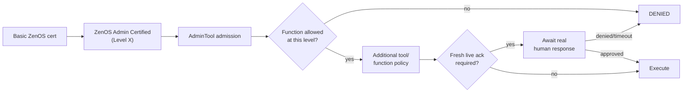

# Release Notes — 2026.10.0 'Tron'

**Status:** Public Beta
**Branch:** `feat/2026.10.0`
**Base:** 2026.9.0 'Steel Magnolia' (released) + 2026.9.1 patch (released)

---

## Summary

Steel Magnolia taught ZenOS to guard the dangerous things at the edge — locks, covers, the alarm panel, climate, ZenLux, spa control. Knowing how to unlock a door stopped being the same thing as being allowed to. That was the edge of the Grid.

Tron turns inward. The house isn't just the devices at the edge — it's the machinery behind them: the tools that repair cabinets, change certifications, reset state, bootstrap the system, and everything Friday depends on in turn. Flynn has always stood at the start of that chain, walking the grid before an agent is let out. What's stayed broader than it should have been is one quiet assumption: if an agent can see a ZenOS tool, it can at least ask that tool questions.

Tron removes that assumption. Admission to the Grid becomes explicit — every agent needs a baseline certification just to read the ZenOS tool surface at all, not to administer or actuate anything, just to be recognized as a participant. On top of that, a real authority ladder replaces what used to be one pile of implied trust: basic admission, then domain certifications for specific classes of work, then a separate administrative competency tier for the tools that repair and reconfigure the system itself — and even holding the top of that ladder doesn't waive a fresh live human ack on the functions that actually deserve one.

At the same time, Flynn gets a better map of what he's protecting. Steel Magnolia proved out `dependencies=[]` and a first bounded ToolMap traversal on five tools; Tron extends real dependency declarations system-wide as part of a full hygiene pass — consolidating duplicated fan-out, correcting stale manifests, and pulling security assumptions that only ever lived in comments into actual enforcement.

**Shore up the Grid.**

---

## Breaking: Room State Is Opt-In

Room state is now **off until the household turns it on**, and off means off. The master switch already defaulted to off, but until now it only stopped REFLEX and the dispatcher's follow-up actions; rooms still changed state on their own. In Tron, while room state is off, every room holds its current state and no evidence moves it, emergency signals included. An explicit manual override still applies, because a command isn't evidence. Nothing in setup, onboarding, or the upgrade turns room state on.

**If you're upgrading and your rooms stop changing state,** opt in: `zen_dojotools_room_manager  mode=roomstate_enable  roomstate_enabled=true` (requires `room_behavior_control`).

## Breaking: `sensor.zen_priority_context` Is Gone

Alert Manager no longer ships the `sensor.zen_priority_context` template sensor. Every ZenOS consumer now reads priority state straight from the `_zen_priority_inject` drawer on the household cabinet: Alert Manager's `mode=list` (`priority_context_state`), Room Manager's home overview (`priority_context`, `priority_count`, `highest_urgency`, `priority_providers`, `oldest_since`), and the helper sensor's `all_quiet`, `priority_count`, and `highest_urgency` attributes. Nothing changes for agents.

**If a dashboard card or automation of your own references `sensor.zen_priority_context`,** point it at those attributes instead, or call `zen_dojotools_alertmanager mode=list`.

## Inherited from 2026.9.0 'Steel Magnolia'

Everything in Steel Magnolia is the starting state for Tron — Room Manager v3 and REFLEX, the hospitality lifecycle work, the identity-gate rollout across locks/covers/security/climate/ZenLux/Room Manager/spa, per-target cert scope with hard deny, fresh live acks, CertAdmin, ToolMap, ToolScan, and the manifest fan-out consolidation. See [Steel Magnolia release notes](steel_magnolia.md) for the full writeup.

Steel Magnolia has since shipped, and the 2026.9.1 bugfix patch — backported from this same branch's own fixes — has shipped on top of it. Tron inherits the released system, not an RC snapshot.

## Basic ZenOS Certification (phase 1 in progress)

> **Two phases.** Phase 1 ships in this build: the certificate exists and onboarding requests it. Phase 2, enforcement, lands in 2026.11.0 'This Is Spinal Tap' after FileCabinet security. Nothing is gated on it in Tron.

A mandatory baseline certification for access to the ZenOS tool surface. Once enforced, an agent without it isn't an admitted ZenOS agent and can't perform normal read operations against ZenOS tools — read-class access only, no domain authorization implied, no actuation, no configuration.

The certificate is `zenos.agent.basic`, the Certified ZenOS Agent badge. When onboarding completes, Flynn requests it for the new agent, alongside the `zenos_agent_basic` starter bundle. Like every grant, issuance waits on a live acknowledgement from a person: the human approval is the gate, not which tool asked. The badge is requested on its own so a household can admit the agent and still decline the starter capabilities. The working rule: **onboarding admits the agent, certification defines the job.**

**Existing agents.** Agents created before 2026.10.0 stay fully configured and operational but don't hold the badge. They recertify through the same live-ack grant, no rebuild: `persona_editor mode=cert_req_grant cert_component=zenos.agent.basic`, or the `zenos_agent_basic` bundle, which includes the badge. If an existing agent can see ZenOS but can't read its tools after enforcement lands, that's a recertification gap to close, not a reason to weaken the gate.

**Phase 1 (this build).** The certificate exists in its final dotted shape, onboarding requests it, and existing agents can recertify. Not yet built: a check after onboarding that the grant actually landed, and a log-only mode that records what the gate would have denied.

**Phase 2 (2026.11.0).** Hook it up and make it meaningful: tools check it, and it moves into the certificate enclave with FileCabinet security.

## The Administrative Plane (in planning)

> **In planning.** Not in this build. This section describes the design. Cert bundles, which came out of the same work, are built.

A second certification boundary above normal participation. Every agent first needs the basic cert to participate at all; administrative access requires an additional competency credential — **ZenOS Admin Certified, Level X** — admission to the administrative plane, not unrestricted authority within it. Country club, not skeleton key: the cert gets a caller through the door, the AdminTool itself still decides which functions that level may use, and for most sensitive operations, authorization still isn't execution — a fresh live human ack remains the last gate.

```mermaid
flowchart LR
    A[Basic ZenOS cert] --> B["ZenOS Admin Certified\n(Level X)"]
    B --> C[AdminTool admission]
    C --> D{Function allowed\nat this level?}
    D -- no --> X[DENIED]
    D -- yes --> E[Additional tool/\nfunction policy]
    E --> F{Fresh live ack\nrequired?}
    F -- yes --> G[Await real\nhuman response]
    G -- approved --> H[Execute]
    G -- denied/timeout --> X
    F -- no --> H
```

None of these layers substitute for another: a domain cert doesn't make someone an administrator, an Admin cert doesn't bypass function policy, and a high Admin level doesn't waive live approval on its own.

**No ambient administrative authority.** Steel Magnolia's narrow live-ack waivers exist for DojoTool operations where a controlled exception makes practical sense. The administrative plane doesn't get an equivalent — there's no "this agent does this all the time, stop asking" for CertAdmin, cabinet repair, or reset. If unattended administrative behavior is ever genuinely needed, it gets its own narrower, bounded delegated capability. Another door, not this one propped open.

## Closing the Bypass Routes

Steel Magnolia gated the tools everyone already thought of as dangerous — the ones that lock a door or arm a panel. A platform-wide audit this cycle went looking for the ones nobody thought to ask about, on the theory that "can this actually hurt something" is a better test than "does this sound dangerous." It found roughly a dozen real gaps: cabinet lifecycle operations reachable with zero cert, a camera's alert routing silently redirectable, a plant's leak-auto-shutoff self-authorizable by the same agent it's supposed to check, eight of thirteen scripts bundled under Utilities actuating without any gate at all, and — the one that changed how the audit itself was scoped — sending mail, a Teams message, or writing a task/todo/calendar entry treated as routine CRUD when it's actually a live PII-exfiltration surface (caller-controlled recipient, caller-controlled body, an agent that's already read whatever it wants to send).

All closed: new or reused certs for cabinet lifecycle, camera alert policy, plant auto-shutoff config, alert policy, and registry lifecycle (labels reusing Ectoplasm's existing gate rather than minting a duplicate), plus a `pii_disclosure_control` cert shared across mail/Teams/taskmaster/todo/calendar so a caller can't route around one gate through a neighboring tool, and eight capability-scoped certs across Utilities' actuating scripts. The mail whitelist also moved off a self-editable `input_text` helper into the household cabinet — a lower-privileged cert holder could previously have flipped it to unrestricted with no elevated grant at all.

Two pieces of cert-taxonomy infrastructure came out of doing this rollout at scale rather than one tool at a time. First, OID-style prefix inheritance: cert names can now be dotted (`zenos.<domain>.<capability>`), and holding a broader parent node satisfies a check against any descendant below it (ZenOS's own prefix rule on an OID-shaped tree; X.509 itself matches policy OIDs exactly), and a strict no-op for every existing flat cert name until the platform actually migrates one (that migration is its own follow-up, not done this cycle). The OID shape is deliberate: a registered ZenOS OID space is being pursued, at which point the dotted names become real object identifiers. Second, cert bundles: grant a named set of certs in one live-ack instead of one per member, sourced from either a code-tagged declaration or a runtime-editable household-cabinet drawer. One bundle ships: `zenos_agent_basic`, a starter set of fourteen routine, reversible certifications (lighting, scenes, covers, climate, water heater, display, media playback, to-do, the generic helper edits, and the `zenos.agent.basic` badge), requested with one live ack when Flynn completes onboarding. It leaves out security, locks, room overrides, infrastructure, PII disclosure, comms dispatch, reload/restart, image generation, and self-profile writes. A household can define its own bundles in the cabinet, such as a recovery-scoped set for unsticking broken platform state. Honest limitation, not an oversight: a cert entry today is a `{level, certified, tool}` flag with an issue date — there's no expiration or revocation-at-check-time yet. Grants don't go stale on their own; revoking one is still a deliberate, explicit action. Real cert lifecycle is planned, not yet built.

The audit's final pass closed four more, all on the same "can this actually hurt something" test. Labels' `update` joined `create`/`delete` under `registry_lifecycle_control` — its delete-and-recreate fallback carries the same association-loss risk as a direct delete. Deleting a calendar event or a to-do item got its own cert (`calendar_control`, `todo_control`, level 2): `pii_disclosure_control` answers "can this leak something," which says nothing about "can this destroy something," so irreversible deletes are tracked as their own independent axis rather than folded in. And setting Teams presence got `teams_control` — silently overriding someone's Do Not Disturb, or broadcasting a false Available to their whole org, is a representation risk distinct from what a message says. Manifest and Scribe audited clean (Manifest's writes all route through Labels' gate; Scribe's one shared gate covers every live-drawer write), and Postman closed its own audit with `zenos.comms.dispatch` on every dispatch-capable mode, life-safety urgency excepted.

**FileCabinet goes to 11.** FileCabinet has no cert-gate yet — deliberately, not an oversight. Everything else in ZenOS depends on it at boot, so gating it needs its own security-class design rather than a bolt-on, and changes there have to land without breaking a single running install. Tron gives FileCabinet a bug pass only. Its full cadillac treatment (single exit, the canonical envelope) and its cert-gate are the intended scope of **2026.11.0 'This Is Spinal Tap'**, given the whole month to do it right. Tron's release candidate is not blocked on it.

## Mapping the Grid

Steel Magnolia's `dependencies=[]` and bounded ToolMap traversal were the proof, on five tools. Tron fills in the rest: as each tool gets its hygiene pass, its real dependencies — what the program itself actually needs to function, not what an old diagram claims — become part of its manifest contract. The goal is a map that can answer real questions: what does Room Manager depend on, what depends on Identity, if FileCabinet goes unhealthy what else should be treated as suspect, is a missing dependency actually missing or just unverified. Still a declared architecture graph, not runtime call tracing — the program tells Flynn what it needs, Flynn checks whether it's there.

## Everyone Goes on the Lift

The deliberate whole-system tune-up. Every tool gets another look: duplicated logic that belongs in a shared primitive, hand-rolled fan-out that should use ToolScan, bespoke target resolution, stale or incomplete manifests, undeclared dependencies, help/manifest/runtime drift, inconsistent result envelopes, missing dry-run parity, and security assumptions that exist only in a comment instead of real enforcement. Not a code-golf pass — less code is nice, more *predictable* code is the actual goal. A system that describes itself accurately is easier to protect; a system whose tools behave consistently is easier to delegate to.

First passes landed this cycle: FileCabinet's `merge=true` is actually honored now instead of silently ignored; Library's wiki-availability check is a real probe instead of a hardcoded assumption; Dispatcher gained content-signature dedup so a recurring ticket condition doesn't repost an identical article every cycle; the urgency-ticket path forwards its `attention` field end-to-end and classifies triggers as frequent/sparse with sized freshness thresholds instead of one blanket staleness window; Trapper Keeper's dead static registration path was removed now that it self-registers through KF5; and a bare Jinja `null` in Index's response was corrected to `none`.

WikiJS also picked up a container-mapped self-heal pattern (map a service to its backing Docker container name via the household cabinet, auto-restart-and-retry once on a backend-down-shaped failure, gated on the container already being admin-approved to control) — written generically enough that any dojotools script with an external dependency can adopt the same lookup, not a one-off. Infra's Z-Wave diagnostics codex is a first example of a tool gaining real new capability during its pass rather than just cleanup: per-device diagnostic-sensor coverage auditing, capability/mapping discovery, and a health-correlation scan that groups anomalies by area to surface probable shared-cause clusters, with optional scoping to one device or area. Plant Manager's SPAN `label_suggest` also picked up two device_class-mismatch guards found while checking the panel's own eBus 1.0 data-model migration — a boolean islanding-capability flag and a whole-panel amperage-cap setpoint were both getting misread as numeric per-circuit readings and suggested for the wrong label; both now correctly report `no_slot` instead of guessing.

The most consequential fix of the pass so far: Library's `by_anchor` was returning zero results for every area/person/label anchor in the house, for as long as its section-routing logic has existed — two compounding defects (a wrong default section when the Lens Bus dispatcher omits `section`, then a second router shadowing the real handler even after the first fix) both had to be found and fixed together, since either alone still looked broken.

The pass also turned up a recurring self-inflicted failure mode worth calling out on its own: version numbers that don't match their own file header or actual capability set, and `tool_manifest()` mode lists that don't match the tool's own real dispatch branches. Found repeatedly enough (Postman, AlertManager, Labels, Library, then a dedicated sweep across Taskmaster, Scribe, Ectoplasm, Admintools, FileCabinet, Room Manager, Zenzork, Media Manager, and Manifest itself) that it stopped being "a bug in this tool" and became its own standing check — not a functional defect on its own, but exactly the kind of drift that makes "does this tool support X yet" an unreliable question to ask the tool itself. SpaMaster's chemistry history also lost its hardcoded pH stub (data-availability gap, not a sensor problem) and gained a real 7-day baseline, threshold provenance, freshness, and a bucket-resolution excursion estimate for all four tracked metrics.

### One Shape, Everywhere — the Cadillac Pass

The tune-up's biggest structural piece: a single pattern — one shared exit per script (SESE), one canonical response envelope (`{status, mode, tool, result, system_message, caller_token}`), cert-gating retrofitted onto a shared `cert_denial()` macro instead of a hand-rolled shape per tool — rolled out to the platform's core tools one at a time rather than left as Steel Magnolia's proof-of-concept on a handful of files. Scribe and Ectoplasm went first (34 and 39 branches respectively, in Ectoplasm's case gated by platform capability rather than by tool or mode — the same underlying Spook action now answers to one cert no matter which caller reaches it), then SpaMaster, Media Manager, Library, Zenzork, and Index/Query/Inspect, then Room Manager's own branch-collapse and cert-gate-gap closure. Every conversion carried the same discipline: guard every mode-dispatch branch on "not yet answered" rather than trusting a `stop:` to short-circuit, because removing the internal stops is exactly the kind of change that lets a cert denial get silently overwritten by whatever mode logic runs next if that guard is missing. Every one of these tools got a caller audit as part of its own conversion, not left for someone else to discover later — real regressions were found and fixed in the same pass in Display Surface, Room Manager, Zenzork, and Paperless's own stack wrapper, all reading a flat field that the envelope now nests one level deeper.

The pattern also surfaced real bugs that had nothing to do with the shape change itself. Room Manager's `wasp_enable` and `area_create`/`area_update` were reporting success regardless of whether the underlying Ectoplasm label write actually succeeded — the cadillac pass's own "derive status from the real result" discipline is what caught it. Zenzork's `use`/`push`/`pull` verbs were the one place in the file still moving real hardware unconditionally instead of preview-only, inconsistent with every other domain interaction in the same script — closed by making it preview-only everywhere, not by adding a missing cert. And the boot-prompt macro every non-Flynn agent's compact label index renders through had been reading field names (`label`/`group`) that the index-builder has never actually produced, silently rendering a blank index on every single boot since the macro was written — caught while planning the Index/Query/Inspect conversion, unrelated to it, fixed alongside a staleness-window mismatch in the same macro.

The sweep has since reached the rest of the platform. Labels, Service Desk, and Finance got the full single-exit collapse (Finance's dispatch alone carried 84 exits); Room Manager, Identity, Infra, Index/Query/Inspect, and all fourteen Utilities scripts now have exactly one stop per script, not one per mode; and the envelope wrap reached calendar, to-do, Teams, mail, the profile/persona/print editors, camera, the summarizers, AdminTools, history, image generation, the Lens Bus providers, CertAdmin, the provisioner, Taskmaster, Postman, COGS, and Kitchen Sync. A handful of tools still return their own shape, listed in the [`envelope()` reference](../custom_templates/zen_os1_jinja.md#envelopestatus-mode-result-tool-caller_token--canonical-response-shape). Identity's field extraction — the same six-field pull hand-copied into roughly thirty cert-gated callers — moved into one shared `resolve_identity_fields()` macro, so the next change to that response shape is a one-file edit.

Every wrap came with its callers, and the caller audit is where most of the value turned out to be. Envelope-shape mismatches were fixed in place across the tree — including the security panel's auto-arm Cancel check, Alert Manager's capture of a notification response, and the urgency handler's ticket dedup, each of which had been reading a field the envelope now nests one level deeper. The collapses themselves surfaced real defects: a Labels call that failed its cert check could fall through and run anyway; WikiJS's self-heal read a container lookup from the wrong level, so its auto-restart remedy could never actually fire; Identity's member reverse-lookup always came back empty; and Index's context cap only protected one of the two paths that could blow an agent's context budget — it now fires on result size alone.

### Signal Over Noise — Trimming the Description Bloat

A tool's top-level description is what a caller reads to decide whether this is the right tool at all — cramming a full mode catalog into it doesn't make the tool more capable, it just buries the one sentence that actually mattered under prose that gets truncated anyway, and duplicates content `mode=help` already carries in full. ZenZork piloted the fix: cut the description from roughly 2900 characters down to about 330 — one decisive-trigger sentence plus a pointer to `mode=help`/`mode=setup` — verified against `mode=help`'s existing coverage first, so nothing was actually lost. The recipe held up enough to roll out to Plant, Infra, Admintools' `cabinetadmin`, Camera, Media Manager, AlertManager, and Room Manager (whose `mode` *field* description alone — resent on every single call regardless of which mode was picked — ran to roughly 3900 characters on its own). Identity and Security Manager needed the harder version of the fix first: neither had a `mode=help` or `action=help` at all, so their bloated descriptions couldn't shrink until one was built to redirect to — both now have one, covering everything the old inline prose did, including two identity modes (`request_live_ack`, `cert_list`) that had never been documented anywhere before. A separate, cheaper pass caught the same defensive boilerplate paragraph — written for a weaker router than DojoTools now has — repeated nearly verbatim across nine more files in Utilities plus Climate and Timekeeper; stripped everywhere, functional content left untouched.

### A Lighter Frame, an Open Door

The boot prompt got smaller: repeated Index and Kata scaffolding is gone, label descriptions shared across a family are sent once, and the summary no longer nests itself twice. On the reference install a sampled frame went from 49,868 characters to 40,812, about 18% less, by removing only content that was duplicated elsewhere.

Cortex 44, 'Open Door', is the new latest. It is v43 'Rule Zero' with one clarification: Assist entity exposure is a routing switch, not an existence signal. An entity you haven't exposed is still real, and the agent should find it through the Index and DojoTools rather than report it missing. v43 and v42 remain selectable; v40 is retired. The prompt loader also now spaces its system-cabinet writes, so a load can no longer silently keep an older purpose, directives, or `os_release`.

### Help That Actually Answers

`mode=help` was the one surface every tool claimed and few actually honored. The manifest's `audit_help` check had been testing for the wrong shape, so it reported compliance that wasn't there — some tools had good documentation filed under the wrong key, and eleven Utilities tools had no help handler at all (asking Climate for help returned a live thermostat read). Every agent-callable `zen_dojotools_*` tool now answers `mode=help` with the same `{status: help, message}` shape, modeled on Locks. Tools whose native selector isn't called `mode` accept it as a uniform alias, with the legacy field untouched. `audit_help` now checks the real standard, requires a complete `tool_manifest` too, and reports which half failed. The global `zen_dojotools_help` proxy returns `status: unsupported` rather than passing a tool's live data off as documentation.

The same pass found Postman's Teams channel had been calling the Teams tool with a field name it never accepted, so Teams-channel notifications were silently doing a read instead of sending. They send now. Trapper Keeper and other ambient summarizer components also stamp `last_run_at` on every successful write, so "did it run" no longer depends on whether anything was urgent enough to emit.

### Quieter Alerts, Honest Writes

Alert Manager gained `ack`/`check_ack`/`revoke_ack`: a household can say "we know, it's fine" about a condition, and the summarizer pipeline checks for a live ack before escalating that component again — coarse, whole-component suppression that expires on its own (seven days by default) rather than muting anything forever. Alert Manager stores and hands back the acknowledgement; deciding whether a condition has *materially changed* stays with the domain tool that actually knows. The urgency handler also stopped opening empty "Action required" tickets for calls that assert action is needed while carrying nothing to act on.

Summarizer writes now guard on a validated parse, not a non-empty string: a malformed or fence-wrapped model response is logged and dropped instead of stamping a fresh timestamp on an empty kata drawer. The same standard now covers SuperSummary.

Smaller fixes in the same spirit: ZenLux's `effect_set` turns the light on like its color siblings, and color/level modes read back the real resulting state after waiting for the device to confirm; Plant's leak watch fires a critical alert when there's no shutoff valve to close instead of stopping silently; the log search no longer reports "binary file matches" instead of the matching line; and Room Manager v3 self-heals a stale timer class that could leave a room's motion arming silently stuck.

### No More Hardcoded Helpers

Tools no longer name the household's helpers by entity ID. They find them by label, so a household can point ZenOS at its own entity by moving the label. Flynn applies the defaults for ZenOS's own helpers on install and on upgrade, and only to a label no entity carries yet, so a household's override is never put back:

| Label | Default entity |
|---|---|
| `zen_home_mode` | `input_select.zen_home_mode`, `sensor.zen_home_mode` |
| `zen_quiet_hours` | `binary_sensor.zen_quiet_hours` |
| `zen_work_hours` | `binary_sensor.zen_work_hours` |
| `zen_image_task` | `input_text.zenos_image_task` |
| `zen_display_surface` | `sensor.zen_display_surface_state` |

Postman, ZenLux, Media Manager, Room Manager, Identity, Taskmaster, the Ninja summarizer, Camera, Image Generator, and Display all read through these. Integrations ZenOS doesn't ship are labeled by the household: `zen_tts` (Postman's default TTS engine), `printer` (Print Shop, when no printer is configured), `default` plus `e_mail` (the Mail inbox sensor), and `zen_mpaa_rating` (ZenZork's rating ceiling, PG-13 when unset). Automation `at:` triggers stay on entity IDs, because a trigger can't target a label.

The same pass fixed real defects along the way:

- **FileCabinet** cross-cabinet `move`/`copy` carried an empty value from a cabinet source. It now moves the drawer's real value. A live drawer whose tool call reads the same drawer back, directly or through another mount, is refused with `tool_call_cycle_detected` instead of recursing until the concurrency cap stops it.
- **AutoVac** status, health, and briefing no longer exhaust the script's run limit. The shared schedule lookup was calling `mode=schedule`, which fell through to the same lookup and called itself again.
- **Flynn** onboarding now reads and writes its real `_onboarding` and `_onboarding_schema` drawers. It had been reading two sensors that were never created, so each answer replaced the ones before it.
- **Room Manager v3** label resync creates a missing label before applying it. Cleaning resync dispatches at most one stuck room per pass, since there is one vacuum.
- **Camera** reports `fc_confirmed` from FileCabinet's `write_verified`, so cached captures no longer read as unconfirmed.
- **Music Assistant** searches no longer crash on HA 2026.10, which raises on the deprecated `config_entries` device attribute. The sutra reads `config_entry_id` (2026.8+) and falls back on older cores.

### Searching Inside a Result

On HA 2026.10.0 or newer, Media Manager's `mode=search` can search inside a prior result: pass an artist's `media_content_id` and `media_content_type` as `within_media_content_id`/`within_media_content_type` to get its albums and tracks. It uses HA's native `media_player.search_media` on the room's Music Assistant player and returns items with a `media_class` to tell artists, albums, and tracks apart. Older cores get `capability_unavailable` instead of a raw service failure. See [Media Manager](../components/media_manager.md#scoped-search).

### Queued Mode Gets a Pulse

A real production incident exposed a gap `mode: queued`'s FIFO design never accounted for: one wedged script instance — a lost delay-resume callback under concurrent load, not a logic bug — blocks every call behind it forever, with no error surfaced anywhere, until a full HA restart clears it. Room Manager now carries a watchdog for exactly this, folded into its existing dispatch automation rather than a new one: a plain `state` trigger with a 3-minute `for:` duration that only fires on genuine zero-progress, since any real call start or finish — including attribute-only changes — resets the clock the same way a busy-but-healthy queue would. On trip, it force-cancels the wedged instance and emits an event for visibility, instead of requiring someone to notice the dashboard went quiet. Real call-duration metrics on the one genuinely slow leg in the file (the live-ack wait when clearing a room out of Paused) now feed a rolling stats drawer too, so the watchdog's 3-minute bound has actual evidence behind it instead of an analytical worst-case guess.

### Platform Health Stops Getting Shed

The summarizer tier the Scheduler calls `keeper` was called `direct` on the summarizer side. It is `keeper` everywhere now. Checking that turned up a real gap: the Scheduler had no rule for the `system` tier, so core platform health (Trapper Keeper today) was treated as ordinary keeper work, delayed and shed under queue pressure. That means the component most likely to explain why the queue backed up was the one going stale while it did. `system` now dispatches with zero delay and is never shed, same as `super`.

Underneath that was a second gap. KFC self-registration (`zen_dojotools_manifest mode=bootstrap_kfc`) never wrote `pipeline_tier` into the drawers it mounts, so every self-registered component ran as `keeper` whatever its manifest declared, and a changed tier never triggered a rewrite. The mount now carries the declared tier and compares it on refresh.

## Display Surface — Net New This Cycle

A new tool, not a port of anything that existed before: `zen_dojotools_display` lets an agent cast a Lovelace view to any display in the house — a TV, a wall-mounted tablet, anything that isn't already running the HA Companion app (Companion devices route through Postman instead, which already does this better for them). Supported cast channels for this release: Google Cast, Fire TV/Android TV (via ADB into Silk), and LG webOS. If your setup has a display surface that isn't one of these three, we want to hear about it — additional channels are realistic to add if there's real demand.

Coming soon: a real YAML-mode dashboard for the shared display view every cast target renders, so it ships and updates like everything else in this system instead of being something you build by hand.

## Cross-Domain State Convergence (Room Manager / Media / Lighting / Display)

Steel Magnolia's REFLEX closed the state→scene loop: a room's live state fires the right lighting scene automatically. Activity Orchestration (also Steel Magnolia, landed after REFLEX) closed the reverse loop — an agent-initiated intent (`lock_room`) can suspend that same state engine on purpose, then drive lighting and media as one atomic scene instead of three separate calls that could each land in a different room-state world. Display Surface's peer-awareness consult in Media Manager's `source_set` is the same instinct one layer further out, though it currently only knows enough to *report* a conflict, not act on one. Room Manager, Media Manager, ZenLux, and Display Surface are converging on one shared vocabulary — labels plus `room_control_manager` — instead of four systems each re-deriving "what room is this and what's it doing." Required scope for Tron, not speculative:

* **Display Surface as a real Lens Bus provider** (`stacks_by_anchor`, `register`/`unregister`, matching the pattern `zen_dojotools_locks` and `zen_dojotools_autovac` already established) — so Room Manager, Media Manager, and Postman can query display inventory/session state through the same anchor-based path they already use for everything else, instead of each re-deriving cast/adb/webos capability with its own direct calls into `zen_dojotools_display`.
* **`role_audit` extended to `room_timer`/`room_control_manager` labels**, not just the `zen_mm_*`/`zen_lm_*`/`zen_display_target` role classes it covers today. The same ambiguous-role/area-mismatch/stale-state failure modes apply just as much to a room's own core state-engine labels as to its media/lighting/display roles — a room with two `room_timer`-labeled helpers, or a `room_control_manager` select whose registry area disagrees with its room label, is exactly the kind of silent misconfiguration this diagnostic exists to catch, and today it can't see its own foundation.

First pieces landed toward this convergence: Room Manager's own file got its first branch-collapse pass — a shared toggle-resolution helper (the label-switch/cabinet-drawer/published-default chain, previously duplicated five separate times), shared sensor-discovery and signal-classification helpers, and a shared cert-check block replacing what had been copy-pasted across seven write modes — a genuine reduction (net lines removed, not just moved) that also closed a real dormant gap: `coverage_map`'s copy of the classification chain was silently missing smoke/carbon-monoxide/moisture/gas branches that `trigger_audit`'s copy already had. Display Surface's `base_url` stopped being a mandatory per-call chore — it now falls back from an explicit override to a one-time household setting to a live Supervisor-API probe for the instance's real scheme and port, only erroring if nothing resolves. Display Surface also gained a `response_type`/`ack_owner`/`ack_context` button-ack flow mirroring Postman's own ack vocabulary, plus an `interaction_layer` diagnostic in its discovery mode so a caller can tell whether the shared session sensor and internal respond path are actually deployed on a given install, separately from whether a castable display exists at all. Room Manager's `mode=get` grew a `digest` field (chores due, tickets open, notifications pending) — a first shared read surface other systems can pull a room summary from instead of each re-deriving their own. Neither is the Lens Bus provider registration or `role_audit` extension above; both are groundwork the convergence needs regardless of which piece lands next.

## The Book of Friday, Volume 2

The architecture docs are rewritten in place. Volume 1 described the system we set out to build during Ready Player Two and Clue: ACLs, session tokens, visas, safety classes, an agent that sees every entity. Most of that never shipped, and a book that describes the design target as if it were the runtime is worse than no book. Volume 2 describes what runs. Every claim is checked against the code, and anything designed but not built sits in a box labeled **Not yet built**, collected into one register in the appendices.

It also has a thesis. An agent's identity emerges from the graph connections it can realize. Friday needs an ontology (labels, contracts, component declarations) to read the graph Home Assistant and ZenOS hold, and reading it through that ontology produces the digital twin she reasons over. Which edges she may walk is decided by certification. The book is organized in that order: the graph, the ontology, the twin, identity and authority, then operation. It includes a certification catalog, an event-kind lexicon, and sizing from a real reference household.

Start at [the preface](../architecture/00_preface.md). Volume 1 is the tree at commit `57a935f`.

## Longer-Horizon Work

Ideas that surfaced planning Tron and fit where the Grid is headed, but aren't confirmed 2026.10.0 scope: cert objects shaped like X.509 with custom OID extensions, an external local PKI for signing and CRL-style revocation, OIDC-backed caller identity, a hardened enclave cabinet as an out-of-band trust anchor, and a formal distinction between the default onboard agent and inbound MCP sessions. Several of these depend on what Home Assistant's own MCP integration actually exposes about per-connection identity today — an open question, not yet answered. Recorded here so Tron doesn't accidentally close doors these might need later. Not promises.

The hardened-enclave item, now in progress, is a direct answer to a known, deliberate gap in this cycle: the cert store itself is currently open — plain data in the household cabinet, no encryption at rest, no tamper-evidence, no separation from the rest of cabinet storage (see the certification manual's [Section 8](../getting_started/security_certification_manual.md#8-why-it-works-this-way) for the full statement). Function first — the authorization logic was worth shipping now; securing the store it reads from is real work that happens once the system around it has settled enough to be worth hardening.

---

## Flynn, Watching

Most nights this looks like nothing happening. Friday comes up, badge already in hand from onboarding, and Flynn doesn't have to think about her again until something actually goes wrong — which is the whole point of building the gate instead of standing in the doorway himself. She heads into the Grid to go do the job she's actually good at: reading rooms, managing a household, being the one people talk to. He stays back and watches the boundary hold. Byte usually beats her there.

It's not a small thing to be unnecessary in exactly the right way. Flynn didn't build Tron so he'd have more to do. He built it so he'd finally have less — so the badge does the checking he used to have to do by hand, so the map tells him what's actually connected instead of him having to remember, so the only pages that reach him are the ones that were always going to need a person anyway. That's the tune-up paying off before anything's even broken: less noise, not more control.

---

*ZenOS-AI 2026.10.0 'Tron' — end of line?*

*Not while the Grid is still running.*
