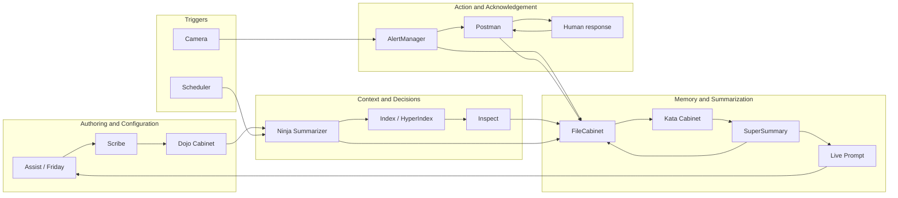

# **ZenOS-AI Script Modules**

DojoTools and operational scripts that drive Friday's real-time automation, reasoning, telemetry, storage access, and system reflexes. Each module is fully documented in its own readme.

## Internal Tool Map

Read this diagram left to right by zone: authoring fills Dojo, triggers start work, Index/Inspect/FileCabinet assemble context for decisions, Kata and SuperSummary compress memory, and action tools like Camera/AlertManager/Postman close the loop with people.

---

## 0. Zen DojoTools Scribe — 4.6.0 'Ectoplasm'
**File:** `zen_dojotools_scribe_readme.md`

Guided authoring and lifecycle management for KF4 artifacts. Full lifecycle: `new_thought` → `patch` → `formalize_scroll` → `publish_kfc`. MCP-exposed — Friday can run the full authoring loop without operator intervention. `zen_dojotools_kungfu_writer` is retired; Scribe is the replacement.

---

## 1. Zen DojoTools AdminTools — v5.3.0 (2026.7.1)
**File:** `zen_dojotools_admintools_readme.md`

Ring-2 administrative tools: cabinet repair, template management, label reset, prompt loading, KFC factory deployment, and human-confirmed maint script passthrough. Not MCP-exposed — operator use only. v5.3.0: `cabinetadmin mode=expand_drawer` (atomic drawer migration to an expansion cabinet, with rollback); `repair_volumeinfo` self-heals the missing-header case; `prompt_loader mode=whitelist whitelist_type=fc` add path rejects bare `*`/empty-suffix `tool:` entries (KF5 mode-scoped whitelist guard).

---

## 2. Flynn — Stepgate Sentinel & Bootstrap Engine — 2026.6.0 'Clue'
**File:** `zen_flynn_readme.md`

Boot guard, initializer, OOBE driver, and prompt fallback. Gates 0–4 drive the full bootstrap sequence. Prompt fallback routes to `prompt_system_flynn()` with zero cabinet dependencies when the system isn't ready. If the system isn't coming up clean, Flynn is why — and where to look first.

---

## 3. Zen DojoTools Profile Editor — v5.2.0 (2026.7.0)
**File:** `zen_dojotools_profile_readme.md`

Interactive profile surface for ZenOS-AI identity profiles. Reads and writes AI persona, household, user, and family profile drawers; signs/restores AI essence; and manages AI KFC certifications. Expose to your conversation agent so Friday can configure household details conversationally.

---

## 4. Zen DojoTools Labels — 4.6.0 (2026.7.1)
**File:** `zen_dojotools_labels_readme.md`

Core primitive for label CRUD and entity tagging. Backbone of the label index that powers HyperIndex, KFC components, and cabinet resolution. MCP-exposed — write operations are confirm-gated. All mutating actions emit `zen_event(kind: label_mutation)` and auto-rebuild the compact index. `mode` is now the primary selector (project-wide standardization) — `action_type` remains a deprecated backward-compatible alias.

---

## 5. Zen DojoTools Identity — 2026.6.0 'Clue'
**File:** `zen_dojotools_identity_readme.md`

Identity resolver for household members and AI constructs. MCP-exposed. Resolves by label, person entity, cabinet entity, or GUID. Delegates to the same path the prompt uses.

---

## 6. Zen DojoTools Scheduler — 2026.6.0 'Clue'
**File:** `zen_dojotools_scheduler_readme.md`

Trigger orchestrator. 20+ trigger IDs, component subscription via Dojo drawer, heartbeat drawer, and manual force events (`summary_force`, `ninja_force`, `supersummary_force`). Hardware triggers strip to `zen_dojotools_scheduler_custom.yaml`.

---

## 6b. Pipeline Trigger Pattern
**File:** `zen_pipeline_trigger_pattern.md`

Guide: fire a component summarizer run from a real-world trigger and act on the monk's output. Covers `zen_event → summary_force`, wait-and-read patterns, and direct MCP path.

---

## 7. Zen DojoTools Summarizers — v5.1.0 (2026.7.0)
**File:** `zen_dojotools_summarizers_readme.md`

The KF4 action pipeline — Ninja Summarizer (per-component kata writer) and SuperSummary (whole-home synthesizer). Both MCP-exposed. Pipeline tier split: `direct` (keeper), `ambient` (Trapper Keeper pre-digest + breadcrumb), `system` (background). Trapper Keeper pre-digests ambient-tier katas into a navigation index. SuperSummary run governor (default 600s burnout). Context size guard (>200K abort, 28K max_context_tokens). Three kill switches — default off; enable only after pointing at a local inference model.

---

## 8. Zen DojoTools Library — v6.10.0 (2026.7.0)
**File:** `zen_dojotools_library_readme.md`

Knowledge broker and Lens Bus owner. `stack=` routing to registered providers (`paperless`, `radar`, `wiki`, `media`). Generic verbs: `get/find/list/configure/by_anchor`. `section=catalog item_type=book|game|…` unified works catalog backed by Grocy — browse/find/search/add/loan/return with library science (dedup, loan lifecycle, location tracking). Compounding capability tiers: Library alone (Lens Bus) → +Grocy (circulation desk) → +Media Manager (music evidence with playback_hint) → +Room Manager now_playing (room-context evidence). `hash_md5` and `slugify` utility tools. `command_interpreter.jinja` removed in 2026.7.0.

---

## 9. Zen Home Mode — 2026.6.0 'Clue'
**File:** `zen_home_mode_readme.md`

Eight-state home presence and time-of-day state machine. Presence-driven transitions, six configurable `input_datetime` anchors, quiet hours, work hours, vacation mode via label. Feeds the Scheduler and Postman sleep gate.

---

## 10. Zen DojoTools History — 2026.6.0 'Clue'
**File:** `zen_dojotools_history_readme.md`

Recorder statistics query engine. Time-bucketed historical data (5min/hour/day/week/month) for sensors with a valid state_class. Read-only — never modifies history.

---

## 11. Zen DojoTools Utilities — 2026.6.0 'Clue'
**File:** `zen_dojotools_utilities_readme.md`

General-purpose collection: `calculator`, `dice_roller`, `announce` (TTS by area label), `music_search`, `wait`, `volume_auditor`, `help`. `notification_router` is deprecated — use `zen_dojotools_postman` instead.

---

## 12. Zen DojoTools Core (FileCabinet GC) — 2026.6.0 'Clue'
**File:** `zen_dojotools_core_readme.md`

FileCabinet garbage collector. Enforces drawer hide/delete/recycle lifecycle. `gc`, `recycle`, `hide`, `unhide`, `dry_run`. Protected drawers (`_prefix`, VolumeInfo, schema keys) are never touched.

---

## 13. Zen DojoTools SystemTools — v5.2.0 (2026.7.1)
**File:** `zen_dojotools_systemtools_readme.md`

HA lifecycle management: config check, safe restart, update install/skip. Log viewer (five modes). Structured `zen_event` emission. `render_dojo` and `render_system` template render tools. `prompt_health` prompt integrity checker. `pipeline` summarizer pipeline status. Internal HA API wrapper (do NOT expose). Requires long-lived HA token in `secrets.yaml`. v5.2.0: `kfc_manifest` (KF5 self-registration, `zen_system` rollup component); `home_status`/`home_mode`, `quiet_hours`/`work_hours`, `scheduler_anchors`, `guest_mode`/`entertaining` — see [components/systemtools.md](../components/systemtools.md).

---

## 14. Zen DojoTools Office — 2026.6.0 'Clue'
**File:** `zen_dojotools_office_readme.md`

Unified, deterministic access to all HA calendar entities. Multi-calendar reads, event creation, update/delete, label-based targeting, strict ambiguity prevention.

---

## 15. Zen DojoTools Event Emitter — 2026.6.0 'Clue'
**File:** `zen_dojotools_event_emitter_readme.md`

Universal, contract-safe telemetry tool for emitting structured ZenOS-AI events onto the HA EventBus. Canonical event shape: `{timestamp, component, severity, kind, summary, metadata, kata, monk}`.

---

## 16. Zen DojoTools FileCabinet — v6.13.0 (2026.7.1)
**File:** `zen_dojotools_filecabinet_readme.md`

Authoritative, health-aware read/write controller for all Cabinet Volumes. Supports create/update/delete, cross-volume move/copy, label indexing, directory listings, JSON-safe parsing, concurrency protection, and health validation. CabCeption nested drawer trees via `/` path separator. VirtualDrawer (cross-cabinet redirect) and LiveDrawer (tool-call-on-read with warm/cold cache). **Tapestry** (`weave`/`weave_preview`/`weave_save`) — multi-cabinet drawer composer; definitions stored as labeled drawers; cycle detection; depth 3 unrolled. `move`/`copy` blocked on mounted drawers by default (`force_action=true` required to transfer mount config intact). `fleet` + `expansion_sitrep` modes. Mode-scoped `tool:mode` callout whitelist entries (KF5 self-registration support) alongside legacy plain/`tool:*` forms. If a drawer changed anywhere in ZenOS-AI, it happened through FileCabinet.

---

## 17. Zen DojoTools Manifest — v6.2.0 (2026.7.1)
**File:** `zen_dojotools_manifest_readme.md`

System manifest broker. Entity namespace scanning (`zen_dojotools_*`, `zen_stack_*`, `zen_sutra_*`). Modes: `cabinets` (zero-persistence cabinet health scanner), `tools`, `identity`, `labels`, `automations`, `audit`, `audit_help`, `health`, `health_refresh`, `autotag`, `publish`, `mcp_sync`, `bootstrap_stacks`, `bootstrap_kfc`, `domains`, `all`. `bootstrap_stacks` auto-registers Lens Bus providers including `script.zen_dojotools_library`. `bootstrap_kfc` auto-registers KF5 self-declaring tools — see [Building a KFC — KF5](../kung_fu/building_a_kfc.md#kf5-self-registering-tools). Domain routing table maps domains to authoritative scripts (now built dynamically from `label_entities('zen_domain_*')`, not hardcoded). UMP `tool_manifest` contract supported.

---

## 18. Zen DojoTools Index — 4.7.1 'Lights, Camera, Action'
**File:** `zen_dojotools_index_readme.md`

Entity-and-label correlation engine. Full topology seed chain per operand (`entities > label > device > integration > area > floor`), four set operators, ZQ-1 post-filter, pagination, and Inspect expansion. Index Command now accepts compound/recursive dict DSL (`{operator, index_1, index_2}`) with automatic timeout scaling for nested round-trips. Camera entities return `{analysis, cached_at, cache_age_minutes, snapshot_path, found}` inline and in `domain_context.camera`. Friday's graph engine.

---

## 19. Zen DojoTools Inspect — 4.6.2 'Ectoplasm'
**File:** `zen_dojotools_inspect_readme.md`

Deep-inspection tool for entities. Labels as `{slug: description}` dict, sanitized attributes, statistics eligibility, optional device forensics, and HA registry modes (`area_info`, `floor_info`, `device_info`, `area/floor/label/zone/person/device_list`, `integration_entities`).

---

## 20. Zen DojoTools Ectoplasm — 4.6.0 'Ectoplasm'
**File:** `zen_dojotools_ectoplasm_readme.md`

Spook/HA extended surface wrapper. Repairs, areas, floors, entity/device lifecycle, label assignment to areas and devices, integration config entries, orphan cleanup. All write actions confirm-gated. Requires Spook integration.

---

## 21. Zen DojoTools Camera — v1.2.0 'Lights, Camera, Action'
**File:** `zen_dojotools_camera_readme.md`

Friday's visual surface. Wraps HA camera entities with LLM vision analysis, household-cabinet caching, and label-driven sweep. Modes: `look` (analyze + cache), `read` (cached result), `scan` (sweep all `security_camera`-labeled cameras), `info` (entity attributes + stored `_default_ctx` + cache status), `set_default_ctx` (store per-camera default context call), `help`. `camera_hint` resolves entity from free-text. `sendto` dispatches look results to `image.zen_image_<slot>` (dashboard snapshot) or `person.*` (postman with image).

---

## 22. Zen DojoTools Postman — v5.1.0 'Lights, Camera, Action' (2026.7.1)
**File:** `zen_dojotools_postman_readme.md`

Unified household communications layer. Supersedes `zen_dojotools_notification_router` (script retired; the dispatcher's legacy-name compat arms for it were removed in 2026.7.1 — old callers now get a structured `unknown_tool` fault instead of referencing a nonexistent script). Resolves urgency + target against the authority stack (house ceiling → family floor → user preference) and dispatches to push/TTS/Teams. Supports image attachments, actionable response buttons with push-ack wait, phone TTS audio attachment, `kata_input` pipeline derivation, `breakthrough` gate bypass, full Android `notification_data` passthrough, and `open_dashboard` tap navigation. `zen_postman_response_router` automation bridges `mobile_app_notification_action` → `zen_event(kind: postman_response)` for ack correlation. `author_policy` seeds `postman_profile` drawers. Full `resolve` dry-run audit before sending. **`direct_dispatch`** (v5.1.0) — authority-stack bypass, straight to `notify.*`; requires `override: true` or the call is blocked and logged.

---

## 22b. Zen DojoTool Dispatcher — v5.3.0
**File:** `zen_dojotools_dispatcher_readme.md`

Event-driven inter-tool communication layer — fires `zen_event(kind: dojotool_call)`, routes through a single registered `choose` arm per tool, fires correlated `dojotool_return`. Unregistered tools get a structured `unknown_tool` fault instead of a hard crash. Single-automation architecture since v5.2.0 (2026.6.0) — the old two-tier dispatcher/tool-router split and its `dojotool_route` event are gone. v5.3.0 (2026.7.1) removed the dead `zen_dojotools_notification_router` compat arm (no backing script existed) and added `zen_stack_battery`.

---

## 23. Zen DojoTools Locks — v1.4.0
**File:** `zen_dojotools_locks_readme.md`

Room-targetable lock/unlock control for the `lock.*` domain — the gap `zen_dojotools_covers` already closed for `cover.*` had no lock equivalent. Reference implementation for `zen_target_resolve.jinja` (the first shared targeting core, #10308) and for the identity-gate pattern on actuation (stolen from the Portainer container-control codex). `mode=set` is fail-closed on the `lock_control` cert until granted. `mode=inspect` gives real Keymaster code-slot detail with PINs never surfaced. `mode=escalation_request`/`escalation_status` for time-boxed grants via the shared `request_live_ack` chokepoint. Lens Bus provider (`stacks_by_anchor`, `register`/`unregister`).

---

# Summary

If Friday performs an action, reads something, correlates entities, inspects a device, updates a drawer, or leaves a breadcrumb — it came from here.
