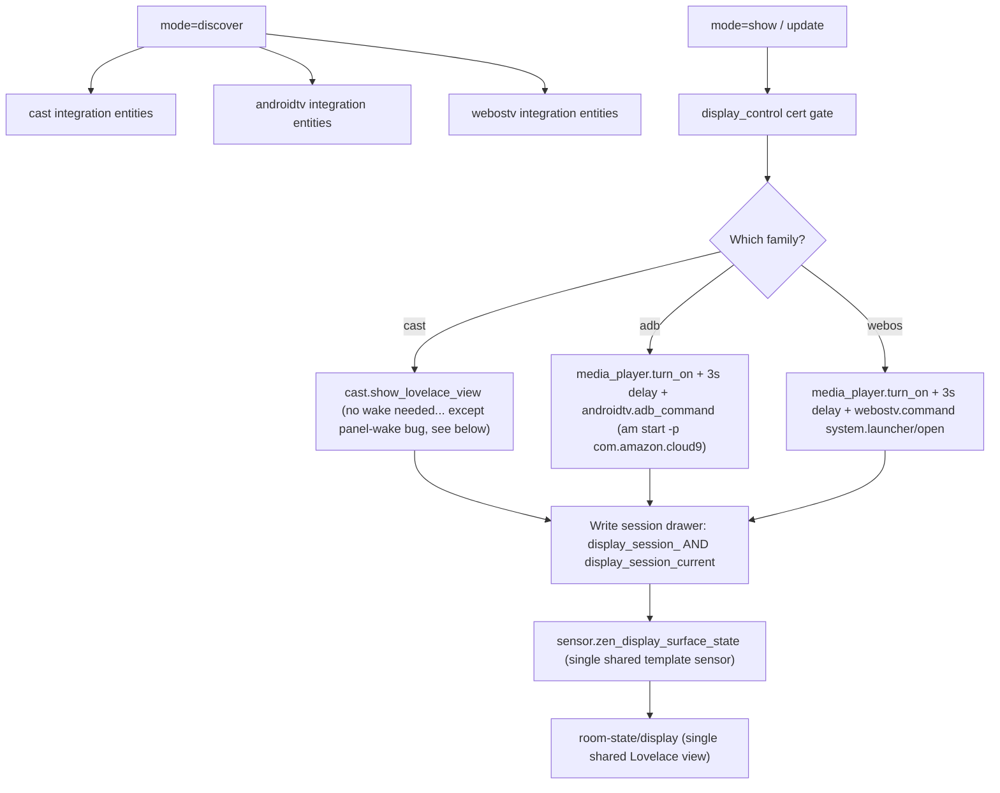

# Zen DojoTools Display — v0.4.0

**File:** `packages/zenos_ai/dojotools/dojotools_display.yaml`
**Script:** `zen_dojotools_display`
**2026.10.0 "Tron" — the agent-composable display surface, net-new this cycle**

---

## Overview

Casts a Lovelace dashboard/view to any display in the house — Cast, Fire TV/Android TV (Silk),
or LG webOS — auto-routed per target. Descoped from a much larger internal spec per the
operator's call: dashboard access authorization is HA's own problem (if a user has the dash
they're allowed), so this tool's only job is (1) delivery routing and (2) letting the agent set
what's on the display. No interaction layer, no signed intents. Info boards, not control
surfaces.

Devices already running HA Companion (phones, tablets, sideloaded Fire tablets) don't need this
tool at all — they route through `zen_dojotools_postman`'s `dashboard_path_override` field
instead, which is simpler and more reliable than reinventing per-platform casting once a native
app exists. This tool exists specifically for TVs/displays that can't run Companion.

**This is a brand-new tool this cycle, not a port of something that already existed.** Supported
cast channels for now: Google Cast, Fire TV/Android TV (via ADB into Silk), and LG webOS. If
your household has a display surface that isn't one of these three, let us know — additional
channels are realistic to add if there's real demand, and Friday's Party's own thread is the
place to ask.

**Coming soon:** a real YAML-mode dashboard for the shared display view every cast target renders, so it ships and updates like everything else in this system.

---

## Delivery Flow

Both `adb` and `webos` show the target device's own normal HA login screen — never bypassed.
**Hard house rule**: never add trusted_networks/segment auth bypass for these targets. Whoever's
in front of the screen logs in like any other browser.

Even the `cast` family needs a `media_player.turn_on` before `cast.show_lovelace_view` on at
least some models — the Chromecast-built-in module and the TV's own display panel can wake
separately; HA's own media_player state can show `playing` with the correct
`app_name`/`media_title` while the physical panel stays asleep. `turn_on` is called
unconditionally now (cheap, idempotent) on all three families.

---

## Active-Use Guard (`mode=show`)

A cast can interrupt real, in-progress media on the target. An earlier version of this guard
checked the session **drawer** for a pre-existing record and skipped the guard if one existed —
wrong: a stale, never-`dismiss`ed record from a prior interruption can trust itself right through
a second one.

Fixed version checks the target's **live foreground app/source** instead of anything this tool
wrote earlier:

| Family | "This is our own display" signature |
|---|---|
| `cast` | `app_name == 'Home Assistant Lovelace'` |
| `adb` | `app_id == 'com.amazon.cloud9'` (Silk) |
| `webos` | `source == 'Web Browser'` |

If the target's live state is `playing` **and** the foreground isn't already one of the above,
`show` returns `error: target_active_use` and does not dispatch — pass `override_active_use=true`
to interrupt it anyway. Live state can't go stale the way a self-written record can; this is
checked fresh on every call, order: is it actually playing at all, then is the foreground
already ours. `update`/`dismiss` never gate on this — they act on a session this tool already
knows it owns.

---

## Session Auto-Expiry

`mode=expire_sessions` clears any `display_session_*` drawer — per-entity or the shared
`display_session_current` — idle 5+ minutes (`updated_at` if the session was ever patched via
`update`, else `created_at`). Same clearing mechanism as `mode=dismiss`, just automatic.
Directly closes the staleness class of bug the active-use guard above exists to catch: a
forgotten session record shouldn't be able to sit around indefinitely.

Called from `dojotools_scheduler.yaml`'s existing `quarter_hour` trigger (same cadence
FileCabinet GC already uses there) rather than a standalone automation — consolidated
deliberately, not left as its own independent automation.

---

## Single-Display Assumption (v1, explicit)

Per the operator's direct call ("one view, period, do not solve concurrency, assume one
display"): there's no per-target Lovelace view or per-target template sensor. `show`/`update`
write the real per-entity session drawer (`display_session_<entity_slug>`, used by
`status`/`dismiss` for per-target correctness) **and** a second, fixed key
(`display_session_current`). Exactly one template sensor and one shared view read that fixed
key — whichever display was shown/updated most recently is what "the" display surface shows,
system-wide. If two displays are cast to in quick succession, the second one wins in the shared
sensor; per-target `status` still tracks each independently underneath.

---

## Modes

| Mode | Cert? | Description |
|---|---|---|
| `discover` | No | List castable targets by family (`entity_id`/`room`/`label=` scoping — label=zen_display_target narrows to household-designated displays). |
| `show` | `display_control` | Dispatch a new session. `dashboard_path`+`view_path` required. `base_url` is optional (see Base URL Resolution below). Content fields optional. |
| `update` | `display_control` | Patch an active session's content. Requires an existing session (`no_active_session` error otherwise). Skips wake+delay on adb/webos (target's presumably already up). |
| `status` | No | Active-session lookup for one target — the mechanism other tools (Media Manager) can consult before taking over a screen. |
| `dismiss` | `display_control` | Clear a session. Idempotent — succeeds even if none exists or the receiver's offline. |
| `register` / `unregister` | No | Lens Bus provider registration (`lens_registry` drawer), same shape as `zen_dojotools_locks`. |
| `stacks_by_anchor` | No | Lens Bus evidence query, `anchor_type=area_id` only. |
| `help` / `tool_manifest` | No | Self-description. |

---

## Base URL Resolution (adb/webos)

`cast` targets never need a `base_url` — they take `cast.show_lovelace_view` directly, no login wall. `adb`/`webos` targets open `base_url` in their own browser via a wake + intent/launcher call, so they need a real scheme+host to open. `base_url` is resolved through a 3-tier fallback, checked in order, only for `mode=show`/`update` on those targets:

1. **Explicit override** — `base_url=` passed on the call.
2. **Household cabinet setting** — `integrations_config.display.base_url`, a one-time setting.
3. **Live Supervisor-API probe** — if neither of the above is set, the tool asks the Supervisor API for this instance's real `ssl`/`port` and builds `https://homeassistant.local:<port>` or `http://homeassistant.local:<port>` accordingly. If the Supervisor is unreachable (non-Supervised/Core install), it falls back to a blind `https://homeassistant.local` — no port assumed, https chosen as the safer of the two blind guesses.

Only a call that resolves to an empty `base_url` after all three tiers (impossible in practice, since tier 3 always returns something) would be rejected with `base_url is required for <family> targets`.

---

## Content Fields (`show`/`update`)

`view_type` (message/room/status/media/camera/choices — `choices` renders read-only, no
interaction layer), `title`, `body_markdown`, `image_entity` (a `zen_dojotools_generate_image`
slot — reference, not a trigger, see below), `alert_severity`/`alert_text`, `progress` (0-100).
`update` uses patch semantics — only supplied fields override; omitted fields keep the drawer's
existing value.

### Image correlation

`zen_dojotools_display` never calls `zen_dojotools_generate_image` itself. Two-step flow for a
freshly-generated image: (1) `show`/`update` with `image_entity=<slot>` (starts
`image_bound=false`, the view renders a placeholder), (2) separately call
`zen_dojotools_generate_image` with `correlation_id=<the show/update response's session_id>` and
the same slot. A new automation in this file (`Zen Display Surface — Image Correlation`) listens
for `image_generated`, scans every `display_session_*` drawer for a `session_id` match, and flips
`image_bound` true only on a match — a late event for a session that's since been superseded
(different `session_id`) finds no match and is silently dropped.

---

## Button-Ack Flow (`response_type`/`ack_owner`/`ack_context`)

`show`/`update` accept `response_type` (`yes_no` | `yes_no_ignore` | `ok_cancel` | `acknowledge`), mirroring `zen_dojotools_postman`'s response_type vocabulary. Omit it for a read-only view with no button row (today's default). `ack_owner` and `ack_context` are required alongside `response_type`, matching Postman's fields of the same name — `ack_owner` is who should receive the resulting `postman_ack` event (e.g. `autovac`, `taskmaster`, your own script name), `ack_context` disambiguates which question this is when a caller might have more than one outstanding.

A tap on the target fires a separate, internal-only script (`script.zenos_display_respond_internal`, never itself a mode on this tool — an agent can never supply its own answer) that writes the response into the same alertmanager response cache a phone-push ack uses, then clears the session.

Don't call `response_type` directly for a "wait for a human's call" flow — use `zen_dojotools_identity mode=request_live_ack` with `ack_notify_target=display` instead; it calls this tool on your behalf and polls the same cache.

### Interaction Layer (`mode=discover`)

`mode=discover`'s response includes an `interaction_layer{}` block, independent of `target_count`/`targets`:

| Field | Meaning |
|---|---|
| `deployed` | `true` only if both the shared session sensor and the internal respond script exist on this install |
| `shared_sensor` | `sensor.zen_display_surface_state` if it exists, else `none` |
| `respond_script` | `script.zenos_display_respond_internal` if it exists, else `none` |
| `note` | Explains that `deployed: false` means the `display_room`/`response_type`/`also_notify_buttons` features on `zen_dojotools_alertmanager`'s fire mode won't work on this install, even if `target_count` shows one or more real castable displays. Deploying this isn't something an agent can self-serve — the Lovelace view is a raw `.storage` edit, the same caution bar as a restart — so the household needs to authorize the one-time setup. |

A display can exist and be castable (`target_count > 0`) while the interaction layer is not deployed — the two are independent facts, and `discover` reports both.

---

## `with_audio` (`show`/`update`)

Delegates to `zen_dojotools_media_manager mode=prefs_apply` for the resolved room
(`area_name(area_id(target))`) — **never guesses a source itself**. `prefs_apply` only applies
what's already been taught via `prefs_set` for that room/home-mode; if nothing's been taught,
it returns `status: no_pref` and the cast still proceeds (`audio_status` in the response says so
— `none`/`no_room`/`no_pref`/whatever `prefs_apply` itself reports). Default `false`: zero
Media Manager calls, fully silent.

**Not yet built**: the reverse direction — Media Manager consulting this tool's `mode=status`
before resolving a watch/listen intent onto a display-capable screen. Design intent only.

---

## Cert: `display_control`

Level 1, no live-ack tier (info boards aren't physical-security risk the way exterior lock
unlock is). Gates `show`/`update`/`dismiss` only — `discover`/`status`/`help` stay open. Grant
via `persona_editor mode=cert_grant cert_component=display_control cert_level=1`.

---

## Entity/Area Registry Aside

`zen_dojotools_labels` gained `area_assign`/`area_remove` modes the same night (Spook's
`homeassistant.add_entity_to_area`/`remove_entity_from_area`) specifically to fix a display
target with no area assigned (`with_audio` couldn't resolve a room for it). See that tool's own
readme for details — not duplicated here since it's a general registry capability, not
Display-specific.
