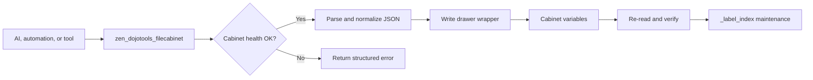

# Zen DojoTools FileCabinet — v4.7.1
**File:** `zen_dojotools_filecabinet_readme.md`  
**Type:** Technical Documentation  

---

## Overview

The **Zen DojoTools FileCabinet** is the primary read/write controller for  
**Cabinet Volumes** inside ZenOS-AI.  
Cabinet Volumes function as structured, drawer-based data stores that hold  
Friday’s operational state, context pockets, lookup tables, mappings,  
micro-memories, relationship links, and other structured data.

This module implements **100% health-aware** operations.
All writes — create, update, delete, move, copy — are blocked if a volume is
unhealthy unless explicitly overridden with `force_action`.

The FileCabinet script is the only sanctioned way for an LLM agent  
(Friday, Veronica, Kronk, High Priestess) to **mutate** Cabinet data.

It coordinates:

- drawer creation and updates
- drawer deletion
- cross-cabinet moves, copies, and clones
- label assignment + label-index maintenance
- directory listings
- label-based reads
- full volume reads
- manifest pass-through
- JSON parsing and coercion
- write verification
- concurrent-write protection
- health validation

If it writes, moves, or deletes a drawer, it came from here.



---

## Core Responsibilities

### 🗄 Drawer Operations
Implements the full CRUD+M model:

- `create` — create a new drawer with JSON value  
- `update` — update an existing drawer (full overwrite)  
- `delete` — remove a drawer  
- `move` — transfer a drawer to another cabinet + prune index  
- `copy` — copy a drawer to another cabinet  

All writes are re-read and verified for correctness.

### 🔍 Reads (Three Modes)
1. **Direct Read**  
   Read a specific drawer from a specific volume  
2. **Directory**  
   List all drawers (non-system) in a volume  
3. **Label Search**  
   Resolve drawers by label using the `_label_index`  

Each mode returns structured JSON envelopes.

### 🏷 Labeling & Label Index
FileCabinet maintains the volume’s `_label_index`, converting:

```

label → [drawer1, drawer2, ...]

```

Labels are:
- lowercased  
- slugified  
- deduplicated  
- validated against system label registry  

Broken `_label_index` formats (legacy Python-literal strings) are repaired  
in flight.

### 🩺 Health-Aware Write Pipeline
Before any write, FileCabinet checks:

- volume health status  
- GUID mismatch  
- read-only flag  
- schema compatibility  
- storage warnings  

If any red flags exist → write blocked unless `force_action: true`.

### 🔒 Protect-Write Mode (Default)
Blocks writes if the volume’s pre-write state changed during evaluation.

This prevents LLM concurrency glitches.

### 🎯 JSON Parsing & Coercion
All write values are parsed as JSON.

Accepted formats:

- raw JSON (`{}`, `[]`)  
- quoted strings  
- numeric scalars  
- booleans  
- null  

Malformed input produces safe structured error returns.

### 🧭 Manifest Pass-Through
Running:

```

action_type: manifest

```

or:

```

read + volume_entity: "", "*", None

```

redirects to `zen_dojotools_manifest`.

---

## Output Structure

All outputs follow a consistent envelope:

```

{
"status": "success|warning|error|info",
"message": "Human-readable summary",
"result": {...},            # For reads
"entry": {...},             # For writes
"verification": {...},      # For writes
"health_snapshot": {...},   # When blocked by health
"index_maintenance": {...}, # For delete/move index pruning
"warnings": "...",          # Dropped labels, etc.
}

```

---

## Valid Drawer Contract

FileCabinet treats a cabinet as valid only when the target cabinet passes the Cabinet Specification and the requested drawer can be represented as a wrapper with a `value` field.

```json
{
  "drawer_name": {
    "value": {},
    "timestamp": "2026-05-23T12:00:00-05:00",
    "meta": {
      "entity_labels": ["profile"]
    }
  }
}
```

The nested `value` may be an object, array, string, number, boolean, or null. Higher-level tools impose stricter shapes:

| Drawer Kind | Expected Payload |
|---|---|
| `_user_profile` | Mapping with person/profile fields |
| `_family_profile` | Mapping with family display metadata |
| `_household_profile` | Mapping with household name/address/timezone fields |
| `members` | Mapping with `users`, `ai_users`, and `families` lists |
| `zenai_essence` | AI persona essence in `core / jacket / companion` shape |

For the full cabinet validity rules, see [Cabinet Specification](../cabinets/cabinet_spec.md). For identity-specific drawer shapes, see [Profile Editor](zen_dojotools_profile_readme.md) and [Identity](zen_dojotools_identity_readme.md).

---

## Action Model

### `manifest`
Triggers the Manifest script and returns the full Cabinet manifest.

### `create`
- Requires `key` and `value`
- Parses JSON value
- Writes new drawer
- Updates label index
- Verifies write against state

### `read`
Multiple modes:

- Entire volume (`key` empty or `*`)
- Specific drawer
- By label (`label_targets`)
- Global manifest (`volume_entity` = blank)

### `update`
- Requires existing `key` or `force_action`
- Full overwrite only  
- Updates label index  
- Protect-write enforced  

### `delete`
- Removes drawer  
- Cleans `_label_index`  
- Verifies deletion  
- Verifies index pruning  

### `move` / `copy`
- Requires destination cabinet + drawer
- Moves or copies drawer value
- Updates target label index
- For `move`: deletes source drawer + prunes source index

### `clone`
Copies the full content of one cabinet into another. Operates in **Highlander mode** — one cabinet owns a GUID and that identity is immutable unless explicitly transferred.

- Copies all non-system drawers from source to destination
- Mount point drawers are copied through (noted in response as `mounts_copied`)
- Health checks run on both source and destination before any write
- Blocked if source and destination are the same cabinet

**GUID transfer** (optional, requires `transfer_guid: true` + `force_action: true`):
- Moves GUID ownership from source to destination
- Clears source drawers after transfer
- Marks source VolumeInfo with `needs_restamp: true` so the stamper assigns a new identity on next pass

> **Known limitation:** Large cabinets (10+ drawers) may exceed script timeout during a GUID transfer pass. The write chain is too long for a single execution. If Highlander returns `{}` or times out, use a standard clone to move the data, then manually stamp the destination to assign a new GUID. Data gets there intact — you lose single-step atomicity.

---

## Labeling Model

Drawer labels live under:

```

drawer.meta.entity_labels

```

Labels are:

- trimmed  
- lowercased  
- slugified  
- filtered to system-wide available labels  
- attached at drawer creation/update  

Label targets for reads support:

- comma-separated  
- newline separated  
- list format  
- slugified comparison  

---

## Safety Features

### Protect-Write
Prevents writes if state changed between beginning-of-script and pre-write check.

### Health Blocking
Prevent writes when:

- volume in `error`  
- GUID mismatch  
- storage warning (unless forced)  
- read_only flag  
- schema mismatch  

### JSON Validation
Malformed JSON always returns a structured error.

### Concurrent-Operation Awareness
Every write is re-read and compared against the intended value.

---

## Usage Examples

### Directory of a volume
```

action_type: read
volume_entity: sensor.household_cabinet
key: ""

```

### Read drawers by label
```

action_type: read
volume_entity: sensor.household_cabinet
label_targets: "profile, preferences"

```

### Create drawer
```

action_type: create
volume_entity: sensor.household_cabinet
key: favorite_color
value: "blue"
set_timestamp: true
labels: "preferences, profile"

```

### Move drawer
```
action_type: move
volume_entity: sensor.source_cabinet
key: settings
destination_cabinet: sensor.dest_cabinet
destination_drawer: settings_moved
force_action: true
```

### Clone cabinet (content copy)
```
action_type: clone
volume_entity: sensor.source_cabinet
destination_cabinet: sensor.dest_cabinet
```

### Clone with GUID transfer (Highlander mode)
Moves identity ownership. Source is cleared and marked for restamping.
```
action_type: clone
volume_entity: sensor.source_cabinet
destination_cabinet: sensor.dest_cabinet
transfer_guid: true
force_action: true
```

---

## Why FileCabinet Exists

The FileCabinet module is Friday’s **write-controller**,  
her filesystem driver, her data gatekeeper.

It enforces:

- health  
- safety  
- consistency  
- structure  
- label intelligence  
- schema boundaries  
- concurrent write protection  

Without FileCabinet:

- drawers could corrupt  
- labels could become inconsistent  
- manifests could desync  
- volumes could lose schema integrity  
- LLMs could overwrite each other  
- the system would drift  

This is the **authoritative, hardened interface** that lets Friday mutate state  
*without breaking her world.*

---

## Troubleshooting

### Cabinet data disappeared after restart
Data written to a cabinet is gone after an HA restart. This is most likely a recorder timing issue — new entities may not have completed a write cycle before the restart. Don’t write anything critical to a cabinet in the same session it was created. Let the install settle first.

### Cabinet appears unavailable / health sensors show errors that don’t match
Check for a `_2` duplicate in Settings → Entities. This happens when the canonical entity name was already in the registry from a previous install. Your package is wired to `sensor.zenos_dojo_cabinet` but HA is serving `sensor.zenos_dojo_cabinet_2`. You’ll spin forever with no obvious error.

Fix: confirm you have a backup, then Settings → Entities → find the `_2` entity → delete or reset via UI. Restart HA. The cabinet re-attaches to the correct entity ID and state restores from recorder.

> Back up before touching the entity registry. No backup, no recovery path.

---

## Summary

The Zen DojoTools FileCabinet provides:

- A unified read/write abstraction for Cabinet volumes
- Zero-trust health gating
- Strict JSON handling
- Drawer labeling + index management
- Volume directory + label search tools
- Cross-volume mutation operations including clone with Highlander GUID transfer
- Write verification + state consistency
- Manifest integration
- Full protection against concurrency, schema mismatches, and unhealthy volumes

If it reads like a filesystem, feels like a KV store, smells like a structured persistence layer, and behaves like a transactional controller?

---

## Version History

| Version | Change |
|---------|--------|
| v4.7.1 | **Write-lockout hotfix.** `mode: queued / max: 2` prevents single-slot deadlock. Event dispatch `\| tojson` on CREATE + UPDATE (`value` and `_label_index`). Verification comparison `\| tojson` on both sides — type-safe JSON string comparison. Root cause: v4.7.0 stored raw Python repr in cabinets; wait_template type mismatch caused 30s timeout → "Already running" floods → all writes dropped. v4.7.0 must not be deployed. |
| v4.7.0 | Global normalization. `set_timestamp` defaults to `true`. All writes produce `{value, timestamp, meta}` struct. `_` prefix reads no longer silently strip the underscore when `force_action` is omitted. |

Yeah. That’s FileCabinet.

---

## Cross-References

- [Cabinet Specification](../cabinets/cabinet_spec.md) — valid cabinet, drawer, person, family, household, and AI-user shapes
- [HyperIndex Overview](../zen_hyperindex/zen_hyperindex_overview.md) — how indexed entities and drawer blurbs feed graph reasoning
- [DojoTools Index](zen_dojotools_index_readme.md) — search/correlation layer that can request drawer blurbs through Inspect
- [DojoTools Inspect](zen_dojotools_inspect_readme.md) — expansion layer that asks FileCabinet for label-targeted drawer context
