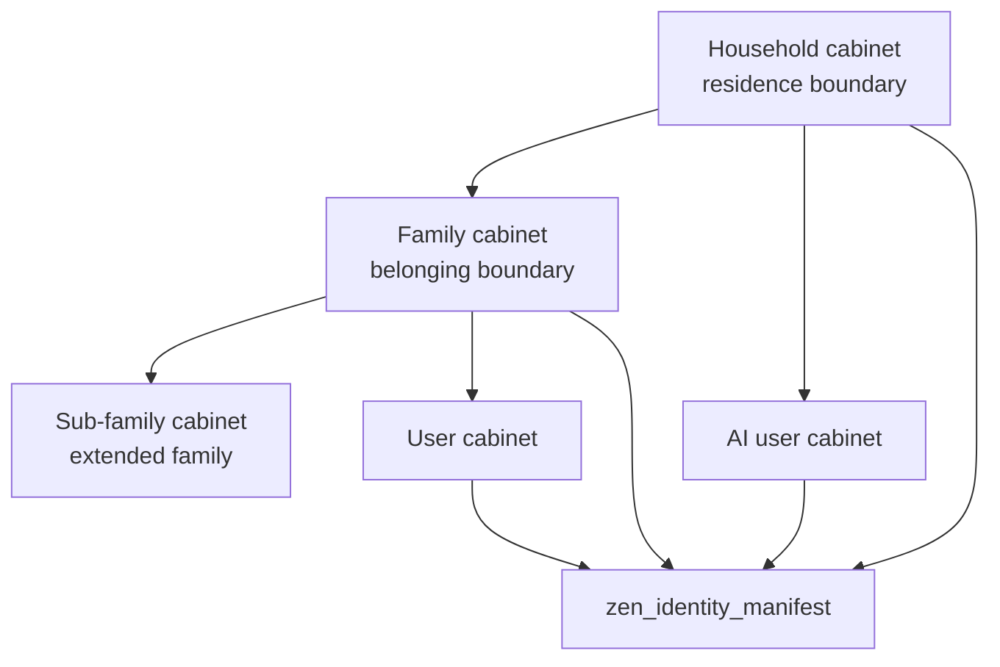

# Zen DojoTools Identity — 5.4.0

*Identity resolution, presence, and household/family group management for ZenOS-AI*

---

## Overview

`zen_dojotools_identity` is the identity resolver and group management tool for ZenOS-AI.

It handles two distinct concerns:

**Resolution** (`resolve`, `prompt`) — looks up registered users, AI constructs, or cabinets and returns identity records. Stateless, no side effects. Used by the AI prompt pipeline and MCP callers.

**Group management** — all household and family membership operations: adding and removing members, wiring families into households, linking delegation partners, and querying the membership graph. These modes write to cabinet drawers and fire events.

The tool is **MCP-exposed**. Resolution modes are safe to call at any time. Write modes are idempotent where noted.

---

## The Identity Model

```
System
  └─ Household (occupancy — "lives here")
       └─ Family (belonging — "part of this unit")
            └─ Sub-family (extended family — not on-premises)
```

**Household membership = residence.** In the household's `members` list means you occupy that space.

**Family membership = belonging.** Being in a family means you're part of that unit.

**Depth rule:** Families nest arbitrarily deep in the data model. Security resolution only chases 2 levels — `is_member(A, B)` checks: is A directly in B? Or is A in C which is directly in B? Anything deeper is not resolved for security purposes.

**Principal slots:** Each household and family has two privileged occupant slots:
- `acls.owner` — Head of Household (HoH) for a household; primary user for a family
- `acls.partner[role=prime]` — Prime AI partner

These slots fill on first add and block re-entry. Use `set_principal` to transfer them.

**Partner = delegation authority.** `acls.partner[]` records who is authorized to delegate on an entity's behalf. This is a governance relationship, not a social one. No token is issued without an explicit allow — the link records who has delegation authority, it does not grant it automatically. Works for any entity pair (user↔user, user↔AI, AI↔AI).



---

## Modes

| Mode | Description | Writes? |
|---|---|---|
| `resolve` | Returns identity record for target, or full roster if no target | No |
| `prompt` | Returns rendered prompt capsule for target construct | No |
| `build_identity_manifest` | Builds `{roster, tree}` and writes to household cabinet | Yes |
| `household_add_family` | Wires a family cabinet into the household `members.families` list | Yes |
| `household_remove_family` | Removes a family cabinet from the household members list | Yes |
| `household_add_member` | Adds a user or AI to household; fills HoH/prime slot on first add | Yes |
| `household_remove_member` | Removes a user or AI from household | Yes |
| `set_principal` | Sets or replaces the HoH or prime AI slot for a household or family | Yes |
| `family_add_member` | Adds a user, AI, or sub-family to a family; sets default family on first join | Yes |
| `family_remove_member` | Removes a user, AI, or sub-family from a family | Yes |
| `link_partners` | Writes `acls.partner[]` on both entities (bidirectional delegation link) | Yes |
| `unlink_partners` | Removes each entity from the other's `acls.partner[]` | Yes |
| `set_default_family` | Patches `default_family_guid` on a member's VolumeInfo | Yes |
| `membership` | Tree view for containers; reverse lookup for members | No |
| `is_member` | Depth-2 boolean check — is entity A a member of container B? | No |
| `provision_member` | Full orchestration — provision expansion slot, wire into family, rebuild manifest | Yes |
| `resolve_caller_identity` | Platform-wide SP1 identity/cert-check chokepoint — delegates to `zen_root_authentik`, enforces the OS sim_mode policy, optionally runs a cert check on the caller's behalf | No |

`resolve` is the default mode — existing callers are unaffected.

---

## Input Fields

| Field | Type | Description |
|---|---|---|
| `mode` | select | Operation mode (see table above) |
| `user_label` | text | Label referencing a registered ZenOS-AI user (resolve/prompt only) |
| `user_cabinet` | entity (sensor) | Cabinet sensor entity_id (resolve/prompt only, planned) |
| `user_entity_id` | entity (person) | HA person entity_id (resolve/prompt only, planned) |
| `user_guid` | text | ZenOS-AI user GUID (resolve/prompt only, planned) |
| `member_entity` | entity (sensor) | Cabinet to add/remove as a member, or entity A for link_partners |
| `member_type` | select | `user`, `ai_user`, or `family` — type of member being operated on |
| `member_name` | text | Display name for the new member. Required for `provision_member`. |
| `profile_payload` | text (JSON) | Optional JSON string — additional profile fields for `provision_member` (first_name, last_name, pronouns, role, etc.) |
| `family_entity` | entity (sensor) | Family cabinet target (family ops, set_principal override) |
| `ai_entity` | entity (sensor) | Entity B for link_partners / unlink_partners |
| `household_entity` | entity (sensor) | Explicit household cabinet — overrides default resolver |
| `confirm_action` | boolean | `set_principal` only. Required when the target HoH/prime slot is already occupied by a **different** entity than `member_entity`. Not required to fill an empty slot or re-set the same entity already occupying it. Default `false` |
| `required_cert` | text | `resolve_caller_identity` only. Cert name to check on the caller's behalf (e.g. `infra_container_control`). When set, the mode runs the `cert_list` lookup itself against the resolved identity and returns `authorized: true/false` — the caller never touches `persona_editor` directly |
| `required_cert_level` | number | `resolve_caller_identity` only. Minimum cert level needed when `required_cert` is set. Default `1` |

**Resolution priority** (resolve/prompt modes):
```
user_label → user_cabinet → user_entity_id → user_guid
```

**Multi-household:** All household ops default to `sensor.zen_default_household_cabinet_resolved`. Pass `household_entity` to target a specific household cabinet.

---

## Mode Reference

### `resolve` / `prompt`

Stateless identity lookup. `resolve` returns the identity record; `prompt` returns the rendered prompt capsule.

```yaml
# Full roster — omit all target fields
zen_dojotools_identity:
  mode: resolve

# Specific target
zen_dojotools_identity:
  mode: resolve
  user_label: primary_user
```

**v4.7.0 — Person response additions:**

`cabinet` and `person_entity` are now explicit top-level keys in the person response (previously absent).

A `presence` block is included for all person targets:

```json
"presence": {
  "person_entity": "person.<entity_id>",
  "zone":          "home",
  "at_home":       true,
  "area_id":       null,
  "area_name":     ""
}
```

Consent gating — all fields require explicit opt-in in `_user_profile.tracking`:

| Field | Gate |
|-------|------|
| `zone`, `at_home` | `tracking.gps_zone: true` |
| `area_id`, `area_name` | `tracking.room: true` |

When consent is absent the field returns `"consent_required"` — never `null`, never silently dropped.

`area_id` returns `null` when the person's device tracker has no room assignment in the HA device registry. This is a HA configuration gap, not a code gap — assign the tracker to a room and room-level presence goes live with no code changes.

**Tracking consent setup:**

Write to `_user_profile` in the user's cabinet via FileCabinet `action_type: update`:

```json
"tracking": {
  "gps_zone": true,
  "room": true
}
```

**Reverse residents (mode=resolve with area target):**

Each resident entry in `_r3b_reverse_residents` now includes `person_entity` and a consent-gated `zone` field.

---

### `build_identity_manifest`

Builds the identity manifest and writes `{roster, tree}` to the `zen_identity_manifest` drawer in the household cabinet. The tree is the depth-2 household membership structure including principal slots.

```yaml
zen_dojotools_identity:
  mode: build_identity_manifest
```

Can also be triggered via event:
```
zen_event kind: identity_manifest_rebuild
```

**Response:** `{result: ok, manifest_written: true, timestamp}`

---

### `household_add_family`

Wires a family into the household's `members.families` list at depth 1. Family members become household residents by graph traversal.

```yaml
zen_dojotools_identity:
  mode: household_add_family
  family_entity: sensor.<family_cabinet>
```

---

### `household_remove_family`

Removes a family from the household members list.

```yaml
zen_dojotools_identity:
  mode: household_remove_family
  family_entity: sensor.<family_cabinet>
```

> ⚠️ **Family teardown order matters.** `deprovision` does NOT remove a family from the household. Skipping `household_remove_family` before deprovisioning leaves a stale entry in `members.families` — re-provisioning and re-adding the family then creates a duplicate.
>
> Correct teardown sequence:
> 1. `family_remove_member` for each member
> 2. `household_remove_family`
> 3. Deprovision member cabinets
> 4. Deprovision family cabinet

---

### `household_add_member`

Adds a user or AI to the household.

```yaml
zen_dojotools_identity:
  mode: household_add_member
  member_entity: sensor.<cabinet>
  member_type: user   # or ai_user
```

**First occupant behavior:**
- First `user` → also fills `acls.owner` (Head of Household slot)
- First `ai_user` → also fills `acls.partner[role=prime]`

**Occupied slot:** If the HoH or prime slot is already filled, add is blocked with `slot_occupied` error. Use `set_principal` to transfer the slot.

**Already a member, slot still free:** If `member_entity` is already in the household's `members` list but the HoH/prime slot was never filled (e.g. an earlier call added membership but failed before filling the slot, or the slot was cleared some other way), the call falls through and fills the slot instead of dead-ending on `already_member` — only a direct `set_principal` call could previously unblock this case.

**Response includes** `slot_filled: hoh | prime | ''`.

**Event fired:** `zen_event kind: household_member_joined`

---

### `household_remove_member`

Removes a user or AI from the household.

```yaml
zen_dojotools_identity:
  mode: household_remove_member
  member_entity: sensor.<cabinet>
  member_type: user   # or ai_user
```

Does **not** clear `acls.owner` or `acls.partner` slots — those require `set_principal`.

**Response includes** `principal_warning: hoh_slot_stale | prime_slot_stale | ''` — warns if the removed member held a principal slot.

**Event fired:** `zen_event kind: household_member_left` with `principal_warning` field.

---

### `set_principal`

Sets or replaces the Head of Household or prime AI slot for a container cabinet.

```yaml
zen_dojotools_identity:
  mode: set_principal
  member_entity: sensor.<cabinet>
  member_type: user      # user → fills/replaces acls.owner (HoH)
                         # ai_user → fills/replaces acls.partner prime slot
  # family_entity: sensor.<family_cabinet>  # optional — targets family instead of default household
  # confirm_action: true  # required only when replacing a DIFFERENT existing occupant
```

**Default target:** `zen_default_household_cabinet`. Pass `family_entity` to target a specific family cabinet instead.

**Takeover gate:** Filling an empty slot, or re-setting the same entity already occupying it, needs no confirmation. Replacing a slot already occupied by a **different** entity requires `confirm_action: true` — prevents a confused or compromised caller silently taking over an established household. Without it, the call errors with `code: confirm_required`.

**Replacement:** Previous occupant of the slot is replaced. For prime AI slot, non-prime partner entries are preserved.

**Members sync:** `set_principal` also adds `member_entity` to the target cabinet's `members` list if not already present (deduped) — keeping `members` and `acls` in sync the same way `household_add_member` does, so a caller using `set_principal` directly doesn't leave a principal pointer that a membership-based staleness check would wrongly flag as orphaned.

**Event fired:** `zen_event kind: principal_changed`

---

### `family_add_member`

Adds a user, AI, or sub-family to a family.

```yaml
zen_dojotools_identity:
  mode: family_add_member
  family_entity: sensor.<family_cabinet>
  member_entity: sensor.<cabinet>
  member_type: user   # user | ai_user | family
```

**Default family:** If this is the member's first family (no `default_family_guid` set), this family is automatically set as their default.

**Sub-families:** `member_type: family` wires in a sub-family at depth 2. Sub-family members are extended family — not household residents.

**Bidirectional sync:** Also writes `acls.family[]` on the member's VolumeInfo.

**Event fired:** `zen_event kind: family_member_joined` with `prompt_profile_update: true`

---

### `family_remove_member`

Removes a user, AI, or sub-family from a family.

```yaml
zen_dojotools_identity:
  mode: family_remove_member
  family_entity: sensor.<family_cabinet>
  member_entity: sensor.<cabinet>
  member_type: user   # user | ai_user | family
```

**Default family cleanup:** If the removed family was the member's `default_family_guid`, that field is cleared. The member must explicitly set a new default via `set_default_family`.

**Bidirectional sync:** Scrubs `acls.family[]` entry by GUID on the member's VolumeInfo.

**Response includes** `principal_warning` and `was_default_family` fields.

**Event fired:** `zen_event kind: family_member_left` with `was_default_family` and `principal_warning` fields.

---

### `link_partners`

Writes `acls.partner[]` on **both** entities. Works for any entity pair (user↔user, user↔AI, AI↔AI).

```yaml
zen_dojotools_identity:
  mode: link_partners
  member_entity: sensor.<cabinet_a>   # any type: user, ai_user
  ai_entity: sensor.<cabinet_b>       # any type: user, ai_user
```

Each entry carries `{guid, entity_id, cab_type, role: partner, sid}`.

Idempotent — re-running does not create duplicate entries.

**Event fired:** `zen_event kind: partner_linked`

---

### `unlink_partners`

Removes each entity from the other's `acls.partner[]`. Symmetric.

```yaml
zen_dojotools_identity:
  mode: unlink_partners
  member_entity: sensor.<cabinet_a>
  ai_entity: sensor.<cabinet_b>
```

**Event fired:** `zen_event kind: partner_unlinked`

> **4.5.6 fix:** Prior to 4.5.6 the ACL removal was a silent no-op — the mode computed `_a_vi_updated`/`_b_vi_updated` but the write events referenced undefined variable names. Both writes now correctly persist the updated VolumeInfo.

---

### `set_default_family`

Patches `default_family_guid` in the member's VolumeInfo. The first family joined sets this automatically; use this to change it explicitly.

```yaml
zen_dojotools_identity:
  mode: set_default_family
  member_entity: sensor.<user_or_ai_cabinet>
  family_entity: sensor.<family_cabinet>
```

---

### `membership`

Read-only graph query. Two behaviors depending on entity type:

**Container entity** (household, family) → returns depth-2 tree:

```yaml
zen_dojotools_identity:
  mode: membership
  member_entity: sensor.<household_or_family_cabinet>
```

Returns: `{principals: {hoh, prime}, members: {users, ai_users}, families: [{..., subfamilies: [...]}]}`

**Member entity** (user, ai_user) → returns reverse lookup: which households and families is this entity in?

```yaml
zen_dojotools_identity:
  mode: membership
  member_entity: sensor.<user_or_ai_cabinet>
```

Returns: `{household_memberships: [...], family_memberships: [...]}`

---

### `is_member`

Depth-2 boolean membership check.

```yaml
zen_dojotools_identity:
  mode: is_member
  member_entity: sensor.<entity_to_check>
  family_entity: sensor.<container_to_check_against>   # household or family
```

Returns: `{is_member: true|false, depth: 1|2|null}`

- `depth: 1` — direct member of the container
- `depth: 2` — member of a sub-family that is directly in the container
- `depth: null` — not a member at either depth

---

### `provision_member` — Full Orchestration (v5.0, closes #135)

Single-call path for adding a family member who has no HA `person.*` entity and no pre-provisioned cabinet. Handles the full lifecycle: find slot → provision → wire → rebuild.

```yaml
zen_dojotools_identity:
  mode: provision_member
  member_name: Marianne
  profile_payload: '{"first_name": "Marianne", "role": "extended_family", "pronouns": "she/her"}'
  # family_entity: sensor.<cabinet>   # optional — defaults to zen_default_family_cabinet_resolved
  # member_type: user                 # optional — default: user
```

**What it does:**
1. Validates `member_name` (required — hard-stop if missing)
2. Resolves `family_entity` (defaults to `sensor.zen_default_family_cabinet_resolved`)
3. Scans expansion slots `sensor.zenos_expansion_cabinet_1` through `_5` for the first in `init` state
4. Hard-stops with clear error if all 5 slots are occupied
5. Calls the provisioner — auto-stamps `init` → provisions as `user` (or `member_type`) with `preferred_name` + `name` seeded from `member_name`, merged with any `profile_payload` fields
6. Hard-stops if provisioner fails
7. Calls `family_add_member` to wire the new cabinet into the target family
8. Returns combined response

**Response:**
```json
{
  "mode": "provision_member",
  "status": "ok",
  "member_name": "Marianne",
  "member_entity": "sensor.zenos_expansion_cabinet_2",
  "member_type": "user",
  "family_entity": "sensor.zenos_default_family_cabinet",
  "provisioner_result": { "status": "success", "cabinet": "...", "guid": "..." },
  "family_result": { "status": "ok", "family_entity": "...", "member_entity": "..." }
}
```

`status: partial` is returned if the provisioner succeeded but `family_add_member` failed — the cabinet exists but is not wired. Inspect `family_result` for the specific error.

**Before v5.0:** Adding a person with no HA account required finding a stacks slot manually, calling the provisioner, writing profile data via the profile editor (which was silently failing its own write gate), calling `family_add_member`, and rebuilding the manifest. After a restart, the person would be an orphan in the manifest.

**OOBE:** `flynn_oobe.yaml` step `3_people` now routes external family members (no HA person entity) through `provision_member` automatically.

---

### `resolve_caller_identity` — SP1 Identity/Cert Chokepoint (v5.4.0)

The platform-wide call-site for identity resolution under SP1. Delegates to `zen_root_authentik` (currently a stub — no real Authentik/OIDC yet) and enforces the OS-level sim_mode policy in one place, so individual tools don't each implement their own gate.

```yaml
zen_dojotools_identity:
  mode: resolve_caller_identity
  # required_cert: infra_container_control   # optional
  # required_cert_level: 2                   # optional, default 1
```

**Sim_mode policy gate:** Reads `integrations_config.identity.sim_mode_allowed` from the default household cabinet (stamped by `zen_admintools_prompt_loader` on every factory run — default `false`, fail-closed).

| `zen_root_authentik` result | `sim_mode_allowed` | Outcome |
|---|---|---|
| `sim_mode: true` (simulated) | `false` (default) | **Blocked** — `resolved_identity` withheld |
| `sim_mode: true` (simulated) | `true` | Allowed |
| `sim_mode: false` (real) | — (irrelevant) | Always allowed |

**Optional cert check:** If `required_cert` is set (and the identity resolution was not blocked), this mode calls `zen_dojotools_persona_editor mode=cert_list` against the resolved identity itself and folds the result into the response as `authorized`. Consumers must call this mode for cert checks instead of calling `persona_editor` directly — checking your own cert against your own resolved identity defeats the point of a single chokepoint.

**Response shape:**

```json
{
  "mode": "resolve_caller_identity",
  "policy_status": "allowed",
  "sim_mode": true,
  "sim_mode_allowed": false,
  "override_attempted": false,
  "token_shape": "none",
  "resolved_identity": { "...": "withheld when policy_status is blocked" },
  "block_reason": "",
  "cert_checked": false,
  "cert_name": "",
  "cert_level": 0,
  "cert_required_level": 1,
  "authorized": true,
  "caller_token_received": "",
  "timestamp": "..."
}
```

`block_reason` is populated only when `policy_status: blocked` (`"sim_mode result rejected: OS policy integrations_config.identity.sim_mode_allowed is false"`). `authorized` is `true` only when the identity was not blocked **and** any requested cert check passed — consumers should gate on `authorized`, not `policy_status` alone, when a cert was requested.

---

## Onboarding Sequence (Standard)

When provisioning a fresh system, the recommended identity wiring sequence:

1. Mint household — provision `cab_type: household`
2. Add family to household — `household_add_family`
3. Mint user — provision `cab_type: user`
4. Add user to family — `family_add_member` (first family auto-sets `default_family_guid`; user fills HoH slot in household)
5. Mint AI user — provision `cab_type: ai_user`
6. Add AI to household — `household_add_member` (first AI fills the prime slot)
7. Link user and AI — `link_partners` (bidirectional delegation link)
8. Optionally invite AI into family — explicit `family_add_member`; fires join event

Flynn bootstrap (`flynn_bootstrap_content`) runs steps 4–7 automatically on first boot. As of 4.5.6, Flynn also calls `household_add_family` and `family_add_member` during bootstrap to wire the default family into the household graph — closing a gap where cold builds left the family cabinet as an orphan.

> **Name resolution (4.5.6):** The identity tree builder and manifest now use a three-step fallback chain: `friendly_name → name → entity_id`. Pre-RP2 VolumeInfo entries that stored the display name in a `name` field (not `friendly_name`) now resolve correctly in the membership tree and manifest output.

---

## Valid Identity Surface

A valid identity is more than a profile drawer. It requires a cabinet role, profile data, membership edges, and a manifest rebuild.

| Identity Kind | Must Have | Written By |
|---|---|---|
| Person/User | User cabinet role label, `_user_profile`, optional HA `person.*`, family ACL when joined | Provisioner, Profile Editor, Identity |
| Family | Family cabinet role label, optional `_family_profile`, `members` drawer | Provisioner, Profile Editor, Identity |
| Household | Household cabinet role label, `_household_profile`, `members` drawer, HoH owner, prime AI partner | Flynn, Profile Editor, Identity |
| AI User | AI user cabinet role label, `zenai_essence`, optional family/partner ACLs | Provisioner, Profile Editor, Identity |

The membership graph is valid when:

- household `members.families[]` contains the family cabinets that belong to the household
- family `members.users[]`, `members.ai_users[]`, and `members.families[]` reflect current membership
- member VolumeInfo `acls.family[]` mirrors family membership
- member VolumeInfo `default_family_guid` is set when a default family exists
- household VolumeInfo `acls.owner` identifies the Head of Household
- household VolumeInfo `acls.partner[]` includes one `role: prime` AI partner
- `zen_identity_manifest` has been rebuilt after membership changes

See [Cabinet Specification](../cabinets/cabinet_spec.md#101-valid-identity-cabinet-shapes) for the drawer-level shapes and [Profile Editor](zen_dojotools_profile_readme.md#valid-profile-structures) for the profile writer.

---

## Events Reference

| Event | Mode | Key Fields |
|---|---|---|
| `household_member_joined` | `household_add_member` | `member_entity`, `member_type`, `slot_filled` |
| `household_member_left` | `household_remove_member` | `member_entity`, `member_type`, `principal_warning` |
| `principal_changed` | `set_principal` | `member_entity`, `member_type`, `target_cabinet`, `previous_principal` |
| `family_member_joined` | `family_add_member` | `member_entity`, `member_type`, `family_entity`, `prompt_profile_update: true` |
| `family_member_left` | `family_remove_member` | `member_entity`, `family_entity`, `was_default_family`, `principal_warning` |
| `partner_linked` | `link_partners` | `entity_a`, `entity_b` |
| `partner_unlinked` | `unlink_partners` | `entity_a`, `entity_b` |

---

## Three-Plane Navigation (v4.7.0)

The ZenOS identity cabinet, HA `person.*` entity, and HA area are fully navigable from any direction. This is the "lens pivot" — start anywhere, reach the other two planes.

| Start | Reach |
|-------|-------|
| `resolve('<user_label>')` | → `area_id`, `area_name`, `zone`, `at_home`, `person_entity` |
| `inspect(person.<entity>)` | → full identity overlay with presence block (see Inspect docs) |
| `resolve` with area target | → residents with `person_entity` + consent-gated `zone` |
| Inspect `person_list` | → all persons; ZenOS users with full profile + presence |

`identity: null` for persons without a `zen_user_cabinet`-labeled cabinet is correct — provisioning a cabinet lights them up with no further code changes.

---

## Template Surface — `zen_identity.jinja`

A Jinja2-callable identity resolver lives at `custom_templates/zenos_ai/zen_identity.jinja`. Same contract as the script surface but callable from sensors, cortex macros, and command interpreter contexts where `action:` calls are unavailable.

```jinja


...
```

**Always call `| from_json`** — the macro returns a tojson string, not a native dict.

**Mobile note:** On the template surface, the `mobile` block returns `zone` and `battery` only. `entity_id`, `configured`, and `battery_entity` are available on the script surface only (require `state_attr` access not available in all Jinja2 contexts).

**When to use which surface:**

| Surface | Use when |
|---------|----------|
| Script (`zen_dojotools_identity`) | Inside scripts, automations, any context that can `action:` |
| Template (`zen_identity.jinja`) | Inside sensors, cortex macros, command interpreter — Jinja2-only contexts |

---

## Architectural Notes

### RecursionError in Loop Contexts

`zen_identity.jinja` **cannot be imported inside `for_each:` loops** or `variables:` steps that themselves execute inside loop contexts. HA's Jinja2 sandbox raises a RecursionError in nested import chains.

**Fix pattern:** Replace the Jinja2 import with a `script.zen_dojotools_identity` `action:` call inside the loop. The script executes in a separate HA context, bypassing the recursion constraint. This is the pattern used by `zen_dojotools_inspect` when enriching `person.*` entities.

---

## Dependencies

| Dependency | Purpose |
|---|---|
| `zen_os_1.jinja` → `identity_resolve_source()` | Full identity resolution pipeline — resolve/prompt modes |
| `zen_os_1.jinja` → `identity_roster()` | Full household roster — build_identity_manifest |
| `zen_os_1.jinja` → `identity_manifest_loader()` | Reads `zen_identity_manifest` from household cabinet |
| `zen_dojotools_filecabinet` | All cabinet reads and writes |
| `zen_identity.jinja` | Template surface (Jinja2 contexts) — v1.1.0 |
| Household Cabinet | `members` drawer, `AI_Cabinet_VolumeInfo`, `zen_identity_manifest` |
| User / AI User / Family Cabinets | `AI_Cabinet_VolumeInfo.acls` — partner, family, owner entries |

---

## Cross-References

- [User Management](../getting_started/user_management.md) — operator workflow for provisioning and teardown
- [Profile Editor](zen_dojotools_profile_readme.md) — profile drawer writer
- [Cabinet Specification](../cabinets/cabinet_spec.md) — valid cabinet and identity shapes
- [Security Model GA](../architecture/security_model_ga.md) — current policy/caller-token status
- [Script Modules](readme.md) — return path to the internal tool map
