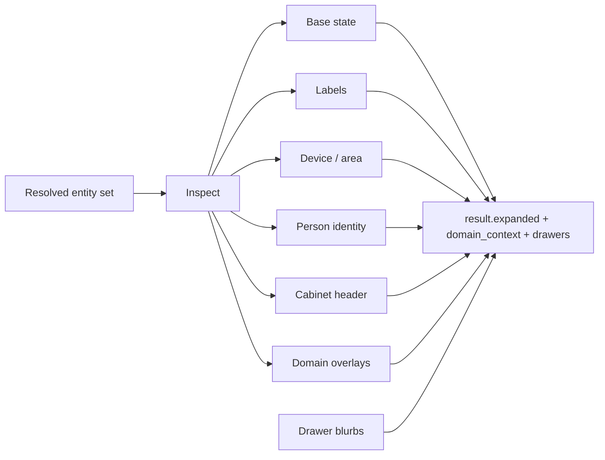

# Zen DojoTools Index — 5.1.0
**File:** `zen_dojotools_zen_index_readme.md`  
**Type:** Technical Documentation  

---

## Overview

The **Zen Index** is ZenOS-AI’s unified entity, label, and drawer correlation engine.  
Think of it as Friday’s *search cortex*:  
a high-level, safety-gated query system that can blend:

- entity sets  
- labels  
- drawers  
- adjacency relationships  
- set operations  
- optional deep expansion via Zen Inspect  

The Zen Index lets LLM agents ask flexible, multi-input questions like:

- *“Which entities match label X AND label Y?”*  
- *“What drawers belong to these entities?”*  
- *“What labels cluster near this selection?”*  
- *“Expand these entities through their ObjectGraph neighbors.”*  

It does all of this through a hardened, from_json-everywhere pipeline that  
**guarantees safety, no template injections, and consistent structured outputs.**

This is the module Friday and Veronica use when they need fast, safe correlation
across the ZenOS-AI entity graph.

---

## Core Capabilities

### 🔍 Entity & Label Set Logic
Each of two operand sets (`op1`, `op2`) resolves via a precedence chain:

```
entities_N  >  label_N  >  device_N  >  integration_N  >  area_N  >  floor_N
```

The first non-empty input in the chain wins. This means you can seed a set from a label, a device ID, an integration domain, an area, or an entire floor — without touching entity IDs directly.

Label inputs are resolved through Home Assistant’s `label_entities()` helper.  
Device inputs expand via `device_entities()`.  
Integration inputs expand via `integration_entities()`.  
Area inputs expand via `area_entities()`.  
Floor inputs expand via `floor_areas()` → `area_entities()` (full floor traversal).

Each pair is combined using a selectable set operator:

- **AND** — Intersection  
- **OR** — Union  
- **NOT** — Difference  
- **XOR** — Symmetric difference  

If no inputs are provided, it returns the **system label directory**.

### 📡 Index Command Mode (Expert Mode)
The field `index_command` overrides **all** other inputs and activates the
external Zen Indexer microservice.

Flow:

1. Emit `zen_indexer_request` event  
2. Wait for matching `zen_index_response`  
3. Capture response or timeout  
4. Fall back to local logic if needed

This supports high-intelligence, LLM-originated queries using a structured query DSL.

### 🔎 Optional Entity Expansion via Zen Inspect
When `expand_entities: true`, the Zen Index invokes `script.zen_dojotools_inspect`
with the resolved entity set, passing through `output_fields` and `label_targets`.

Inspect returns composed entity overlays plus `drawers` — a dict of label-targeted
blurbs from FileCabinet. Index surfaces both in the result.

This is how Friday walks the entity graph and reads Dojo context in one call. The expansion is layered:



For example:

- a `person.*` entity can gain a ZenOS identity/presence overlay
- a cabinet sensor gains a header-only cabinet overlay, while private drawers stay behind FileCabinet
- a camera entity can gain cached image-analysis context
- a room-aware entity can gain Room Manager context
- future domain tools can add their own "Foo" overlay without changing the base set logic

### 🏷 Label Aggregation & Adjacency
The Zen Index automatically computes which labels appear across:

- the resolved entities
- the expanded entities

Adjacency lists give Friday an understanding of **local label neighborhoods** —
useful for predictive associations, clustering, and similarity queries.

### 🗄 Drawer Blurbs
When `expand_entities: true` and `label_targets` resolves to matched drawers,
the result includes `drawers` — a dict of `{drawer_key: blurb_text}` entries.

These are brief summaries only (the index is an index, not a book).
For full drawer content, use FileCabinet directly.

### 📄 Pagination
`limit` and `offset` enable paged retrieval over large result sets.

- `limit: 0` = no limit (default)
- `dry_run: true` returns `total_count` so you can plan a paging loop before executing
- **Auto-cap:** when `expand_entities: true` and a topology/wildcard seed is used with no explicit `limit`, the result is automatically capped at **50 entities**. Set `limit` explicitly to override.
- **`+history` requires `limit`:** requesting recorder statistics without a limit on a topology/wildcard seed is a hard error. Always set an explicit limit when using `+history`.

Always `dry_run` first on topology seeds to check `total_count` before committing to `expand_entities: true`.

### 🛡 Fully Safe Parsing & Concurrency
The Zen Index uses:

- `from_json` on all inbound strings  
- strict timeout handling  
- correlation IDs for all event-based calls  
- fallback paths when the Indexer is unavailable  

The result is deterministic, drift-free, and LLM-safe.

---

## Output Structure

The Zen Index always returns a unified JSON envelope:

```
{
  "result": {
    "simple": [...],              # The core entity set
    "expanded": [...],            # Enriched via Zen Inspect (expand_entities=true)
    "adjacent_labels": [...],     # Labels near the result set
    "index": [...],               # [entity_id, [labels...]]
    "drawers": {                  # Label-targeted blurbs (expand_entities=true + label_targets)
      "drawer_key": "blurb text",
      ...
    },
    "domain_context": {           # Auto-enriched domain data (expand_entities=true)
      "todo": [...],              # To-do items
      "calendar": {...},          # Calendar reads
      "camera": {                 # Cache map keyed by entity_id
        "camera.front_doorbell_camera": {
          "analysis": "One adult approaching...",
          "cached_at": "2026-04-23T14:32:00",
          "cache_age_minutes": 12.4,
          "snapshot_path": "/config/www/tmp/snapshot/camera.front_doorbell_camera_20260423-143200.jpg",
          "found": true
        }
      }
    }
  },
  "operator": "AND|OR|NOT|XOR|*",
  "inputs": {
    "entities_1": [...],
    "label_1": "string",
    "entities_2": [...],
    "label_2": "string",
    "expand_entities": false,
    "output_fields": [...],
    "label_targets": [...]
  },
  "error": null | "Timeout …"
}
```

**Camera domain enrichment:** When any camera entity is in the resolved set and `expand_entities: true`, the camera's last-cached analysis is merged inline into each expanded entity result AND into `domain_context.camera`. The inline entry on each entity carries the same five fields: `{analysis, cached_at, cache_age_minutes, snapshot_path, found}`. Check `found: true` before using `analysis`. `cache_age_minutes` tells you how fresh the cached frame is — decide whether to call `zen_dojotools_camera tool=look` for a refresh.

The operator `' * '` is returned when no inputs are supplied
and the system falls back to the global label index.

---

## Input Modes & Behavior

### ▶️ Standard Mode (no index_command)
Uses the full precedence chain per operand:

1. Resolve op1 and op2 via `entities > label > device > integration > area > floor`
2. Apply set operator (AND / OR / NOT / XOR / *)
3. Apply ZQ-1 `filter_json` post-filter
4. Apply `limit` / `offset` pagination
5. Optionally expand via Inspect (passes `output_fields` + `label_targets` derived from `label_1`/`label_2`)
6. Read `drawers` from Inspect response
7. Compute adjacency
8. Render unified output

### ▶️ Index Command Mode
Designed for high-level, LLM-driven queries.

`index_command` accepts two forms:

**Flat string DSL** — passed directly to the Zen Indexer:
```
index_command: "entities(label:motion) AND label:critical"
```

**Compound/recursive dict** — a nested query DSL that the Indexer resolves recursively:
```yaml
index_command:
  operator: OR
  index_1:
    label_1: hot_tub_manager
    label_2: hot_tub_deck
    operator: OR
  index_2:
    entities_1: [weather.home]
```

When `index_command` is a compound dict (contains `index_1` or `index_2` keys), the event loop timeout is automatically scaled: `min(timeout × 3, 15)` seconds to accommodate the nested round-trips. Default timeout is 2s — recursive calls get 6s.

Timeouts are gracefully surfaced in the result (`index_timeout: true`).

### ▶️ Inspect Registry Modes (non-entity)
These modes bypass the entity set entirely and query the HA registry directly. Pass `mode: <mode_name>` with no entity inputs.

| Mode | Input | Returns |
|---|---|---|
| `area_info` | `area_id` | Single area: name, floor_id, labels, entity_ids, device_ids, counts |
| `floor_info` | `floor_id` | Single floor: name, area_ids, area_count |
| `device_info` | `device_id` | Single device: name, manufacturer, model, area_id, floor_id, labels, area_labels, config_entries, entity_ids |
| `area_list` | — | All areas: count, areas[]{area_id, name, floor_id, labels} |
| `floor_list` | — | All floors: count, floors[]{floor_id, name, area_ids, area_count} |
| `label_list` | — | All labels: count, labels[]{label_id, entity_count, area_count} |
| `zone_list` | — | All zones: count, zones[]{entity_id, name, lat, lon, radius, passive, icon} |
| `person_list` | — | All persons: count, persons[]{entity_id, name, state, user_id, device_trackers, source, lat, lon} |
| `device_list` | — | All devices (tooling primitive — large installs return very large responses). AI workflow: `floor_list` → `area_info` → `device_info` instead. |
| `integration_entities` | `integration` | Entities by integration domain: integration, entity_ids, entity_count |

> **`device_list` note:** iterates all states to find unique device IDs. Not intended for direct AI calls on large installs. Use `floor_list` → `area_info` → `device_info` drill-down instead.

---

## Example Queries

### Basic: Entities with label “kitchen”
```

entities_1: []
label_1: kitchen
operator: AND

```

### Intersection of two label groups
```

label_1: battery
label_2: critical
operator: AND

```

### Symmetric difference between two entity sets
```

entities_1:

* sensor.a
* sensor.b
  entities_2:
* sensor.b
* sensor.c
  operator: XOR

```

### Expand entity graph with device data
```
entities_1: group.master_suite
expand_entities: true
output_fields: "+attributes"
```

### Expand with Dojo context
```
label_1: kung_fu
expand_entities: true
output_fields: "-timestamps"
label_targets: "kung_fu,zen"
```

Returns enriched entity list plus `drawers: {drawer_key: blurb}` for matched labels.

### Topology seed — all entities on a floor
```yaml
floor_1: ground_floor
operator: AND
dry_run: true
```
Check `total_count` first. Then add `limit: 25` to page.

### Topology seed — device entity set
```yaml
device_1: <device_id>
operator: AND
expand_entities: true
output_fields: "+attributes"
limit: 10
```

### Pagination loop
```yaml
label_1: water
operator: AND
limit: 20
offset: 0   # page 1; increment by 20 for subsequent pages
dry_run: true  # first: get total_count
```

### Registry lookup — all areas on a floor
```yaml
mode: floor_info
floor_id: ground_floor
```

### Registry lookup — area drill-down
```yaml
mode: area_info
area_id: living_room
```

### Advanced: DSL-driven query
```

index_command: entities(label:motion) AND label:critical

```

---

## Why the Zen Index Exists

Agents in ZenOS-AI need a way to:

- correlate sensors  
- cluster entities  
- reason about labels  
- navigate drawers  
- traverse local context graphs  
- answer natural-language queries about “what belongs with what”

The Zen Index is the abstraction layer that takes raw HA state  
and turns it into **correlated, reasoned, structured data** —  
the very thing LLMs are good at interpreting.

Without the Zen Index:

- label_sets would be opaque  
- entity correlations wouldn’t exist  
- adjacent context discovery would be impossible  
- Zen Inspect would have no frontend  
- the Zen Indexer would have no runtime wrapper  
- agents would mix up labels, drawers, and entity sets  

This is the *search brainstem* of ZenOS-AI.

---

## Summary

The Zen Index 5.1.0 provides:

- A fully featured, label/entity correlation engine
- Full topology seed chain per operand: entities > label > device > integration > area > floor
- Integrated set logic with four operators (AND / OR / NOT / XOR / *)
- Zen Indexer DSL support — flat string or compound/recursive dict (`{operator, index_1, index_2}`)
- Recursive index_command timeout scaling: `min(timeout × 3, 15)` seconds when compound dict detected
- Pagination via `limit` / `offset`; `dry_run` returns `total_count` for paging loops
- Auto-cap of 50 on topology/wildcard seeds with `expand_entities: true` and no limit
- `+history` flag for 24h recorder stats (requires explicit limit)
- `+rm` output field: Room Manager spatial + live state snapshot per entity area — `topo`, `light`, `climate`, `covers`, `media` slices injected as `room_context` per entity and in `domain_context.room_manager[area_id]`
- `+chores` output field: Grocy chores per entity area via `chores_by_area`. Each chore includes `chore_actions{execute, edit, add}` — pre-built call shapes. Chores with `product_id` also include `replace_action{step_1: chores_execute, step_2: stock_open_item}`.
- `+tasks` output field: HA todo tasks per entity area via RM `+tasks` slice. Each list includes `task_actions{complete, edit, add}`.
- `+inventory` output field: Grocy `object_lens` place lens per entity area — tagged products, chores, expanded operational objects. **Slim pattern:** per-entity `room_context` carries `inventory_summary{tagged_products, chores, status}` + `room_area_id` pointer only. Full payload lives in `domain_context.room_manager[area_id].context.inventory` — fetched once per unique area, not duplicated per entity.
- Inspect registry modes: `area_info`, `floor_info`, `device_info`, `area_list`, `floor_list`, `label_list`, `zone_list`, `person_list`, `device_list`, `integration_entities`
- Optional Zen Inspect expansion with `output_fields` passthrough
- Label-targeted drawer blurbs via `label_targets` → Inspect → FileCabinet
- `result.drawers` is a dict of blurbs, not a list of key names
- Camera domain enrichment: `{analysis, cached_at, cache_age_minutes, snapshot_path, found}` merged inline per camera entity and in `domain_context.camera`
- Label adjacency
- Strict JSON safety
- Hardened event-driven execution
- Deterministic and LLM-stable outputs

If the Manifest is the MRI
and FileCabinet is the filesystem driver
then the Zen Index is Friday’s **graph engine** —
the way she understands where everything is and how it connects.
