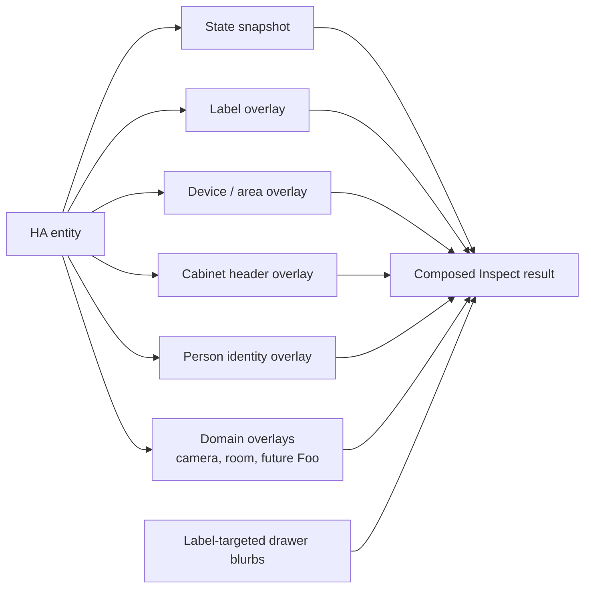

# Zen DojoTools Inspect — 5.0.1
**File:** `zen_dojotools_inspect_readme.md`  
**Type:** Technical Documentation  

---

## Overview

The **Zen DojoTools Inspect** module is ZenOS-AI’s structured introspection engine.  
It performs a safe, deterministic deep dive on one or more Home Assistant entities,
returning a sanitized, LLM-safe snapshot of everything an agent is allowed to see.

Its mission is simple and strict:

> **Show everything that is safe to show.  
> Never reveal anything that could break the system.  
> Never mutate anything.  
> Never touch Cabinet internals.**

Cabinet volumes are identified and surfaced via **header-only metadata**,  
ensuring agents like Friday or Veronica can *recognize* cabinets  
without being able to tamper with them (that stays the job of FileCabinet).

Inspect is the **eyes** of ZenOS-AI, but it is more than a state reader. It composes safe overlays onto an entity so higher-level tools can reason about what the entity means:



That is why Inspect is the COMPOSE stage behind Index/HyperIndex. It turns "this entity exists" into a layered, LLM-safe object: raw state, labels, device/area context, identity context when the entity is a person, cabinet header context when the entity is a cabinet, and domain-specific overlays when a tool knows more.

---

## Core Capabilities

### 🔍 Entity Snapshot (Safe-Mode)
For each entity inspected, the module returns:

- entity_id
- friendly_name
- state
- domain
- timestamps (suppressible via `-timestamps`)
- labels (as `{slug: description}` dict — description is empty string if unset)
- device block (suppressible via `-device`)
- sanitized attributes (opt-in via `+attributes`)
- cabinet header metadata (if applicable)
- Home Assistant statistics eligibility (opt-in via `+statistics`)
- optional extended device tree (`extended: true`)
- drawer blurbs keyed by label (`label_targets`)

Unsafe or unserializable values (objects, unsupported types, HA stringified dicts)
are automatically normalized into JSON-compatible equivalents.

This guarantees *all* Inspect results are future-safe for LLM consumption.

---

### 🗄 Cabinet Sensor Recognition (Header-Only)
Inspect can detect Cabinet entities by signature:

```

AI_Cabinet_VolumeInfo -> validation == "ALLYOURBASEAREBELONGTOUS"

```

When identified, Inspect returns ONLY:

```

{
"is_cabinet": true,
"id": "...",
"version": "...",
"friendly_name": "...",
"name": "...",
"description": "...",
"flags": {...},
"uninitialized": true|false
}

```

No drawers  
No volumes  
No internal storage  
No Cabinet contents  
No label indexes

Cabinet internals remain hidden by design —  
LLMs must use FileCabinet or Manifest for that.

A cabinet sensor is effectively a synthetic Home Assistant entity: the entity exists so HA can store and expose the cabinet, but its real semantic payload lives in structured drawers. Inspect exposes only the cabinet's header overlay. FileCabinet is the safe path for drawer reads/writes, and Manifest is the safe path for whole-cabinet inventory.

---

### 🏷 Attribute Sanitization (String-Safe)
Inspect implements two safety layers:

1. **Normal Mode:**  
   Attributes already in JSON-safe format pass through untouched.

2. **Fallback Mode:**  
   If Home Assistant stringified the attribute block (common for large or exotic integrations),  
   Inspect safely rebuilds a JSON-compatible dict by individually extracting attributes via state_attr.

This means the output is always:

- safe  
- predictable  
- consistent  
- valid JSON  

Perfect for Friday’s consumption.

---

### 📊 Statistics Eligibility Engine
Each entity is evaluated for HA long-term statistics:

- measurement  
- total  
- total_increasing  

Eligibility is determined by evaluating:

- state_class  
- unit_of_measurement  
- presence of state object  
- supported or unsupported stat classes

Results include:

- eligibility flag  
- machine-readable reason  

Friday uses this in analytics, trend analysis, and future forecasting modules.

---

### 🔧 Device Block (Always-On)
When an entity has an associated device, Inspect always includes a `device` block:

```
{
  "device_id": "...",
  "name": "...",
  "manufacturer": "...",
  "model": "...",
  "area_id": "...",
  "integration": "..."
}
```

Suppress with `-device` in `output_fields`. When no device is associated, the field is omitted.

### 🌲 Device Tree (Extended Mode)
When `extended: true`, entities with a device also include a `device_tree` block:

```
{
  "via_device_id": "..." | null,
  "parent_name": "..." | null,
  "siblings": [...],
  "config_entries": [...]
}
```

This is useful for:

- mapping parent/child device relationships
- resolving integration config entries
- discovering sibling entities on the same device

### 🎛 Output Fields (Caller-Controlled)
The `output_fields` parameter controls which optional fields appear in each entity result.

Defaults-on (suppress with `-`):

| Token | Effect |
|---|---|
| `-timestamps` | Omit `last_changed` / `last_updated` |
| `-device` | Omit `device` block |
| `-volume` | Omit `volume` block (cabinet sensors only) |

Opt-in (add with `+`):

| Token | Effect |
|---|---|
| `+attributes` | Include sanitized `attributes` dict |
| `+statistics` | Include `statistics` eligibility block |

`output_fields` may be passed as a list or comma-separated string.
Parsed once at init — zero overhead per entity.

### 🏷 Label-Targeted Drawer Blurbs
When `label_targets` is provided, Inspect calls FileCabinet after the entity loop
and returns a `drawers` dict in the response — one blurb per matched drawer key.

This is the bridge between entity context and Dojo knowledge.
The blurbs are brief summaries only; full drawer content requires FileCabinet directly.

---

### 🗺 Non-Entity Registry Modes
When `mode` is set to a registry mode, Inspect bypasses the entity loop entirely and queries the HA registry. These are read-only, no entity input required (except where noted).

| Mode | Input | Returns |
|---|---|---|
| `area_info` | `area_id` (required) | name, floor_id, labels, entity_ids, entity_count, device_ids, device_count |
| `floor_info` | `floor_id` (required) | name, area_ids, area_count |
| `device_info` | `device_id` (required) | name, manufacturer, model, area_id, floor_id, labels, area_labels, config_entries, entity_ids, entity_count |
| `area_list` | — | All areas: count, areas[]{area_id, name, floor_id, labels} |
| `floor_list` | — | All floors: count, floors[]{floor_id, name, area_ids, area_count} |
| `label_list` | — | All labels: count, labels[]{label_id, entity_count, area_count} |
| `zone_list` | — | All zones: count, zones[]{entity_id, name, lat, lon, radius, passive, icon} |
| `person_list` | — | All persons: count, persons[]{entity_id, name, state, user_id, device_trackers, source, lat, lon, identity} — `identity` is populated for persons with a `zen_user_cabinet`-labeled cabinet; null otherwise |
| `device_list` | — | All devices (large installs: very large responses — use floor_list → area_info → device_info drill-down for AI workflows) |
| `integration_entities` | `integration` domain slug (required) | integration, entity_ids, entity_count |
| `help` | — | Full schema, contract, and examples |

Default mode is `inspect` (entity loop).

> `aliases` and `level` are not surfaced — no HA Jinja read path exists for them. `config_entry_list` is also blocked (config entries are not in Jinja; use REST API `/api/config/config_entries/entry` if needed).

---

### 🧠 Infer Mode (Reserved)
Field: `infer`

Currently reserved for future local inference modules (O3/O1 sidecar work).  
The field is parsed and surfaced but does not activate behavior yet.

---

### ⏱ Timeout Behavior
The script itself performs no long-running operations,  
but the field is included to maintain compatibility with future multi-device or  
multi-integration deep-walk inspection flows.

Default: `60s`  
Valid range: 30–300 seconds

---

## Overlay Model

Inspect composes overlays in a fixed, safe order:

| Overlay | Applies To | What It Adds |
|---|---|---|
| Base entity | Every entity | `entity_id`, friendly name, domain, state, timestamps |
| Label overlay | Every entity | `{label_slug: description}` semantic tags |
| Device/area overlay | Entities with device metadata | Device ID, area, integration, optional device tree |
| Cabinet overlay | Cabinet sensor entities | Header-only VolumeInfo metadata; no drawers |
| Person overlay | `person.*` entities | ZenOS identity/presence block via `zen_dojotools_identity` |
| Drawer blurbs | Calls with `label_targets` | Brief FileCabinet context snippets keyed by drawer |
| Domain overlays | Supported domains | Camera cache, Room Manager context, and future tool-specific overlays |

Domain overlays are deliberately extensible. Camera cache and Room Manager context already follow the pattern: build a domain map, inject per-entity context, and also expose a `domain_context.<domain>` map for batch consumers. A future "Foo" tool can use the same shape without changing the base entity contract.

---

## Output Structure

Inspect outputs a unified, LLM-safe envelope:

```
{
  "results": [
    {
      "entity_id": "...",
      "friendly_name": "...",
      "domain": "...",
      "state": "...",
      "last_changed": "ISO-8601",    # present unless -timestamps
      "last_updated": "ISO-8601",    # present unless -timestamps
      "labels": {                    # {slug: description} — description '' if unset
        "water": "Domain label for all water entities; label:water.",
        "spa": ""
      },
      "device": {                    # present unless -device or no device
        "device_id": "...",
        "name": "...",
        "manufacturer": "...",
        "model": "...",
        "area_id": "...",
        "integration": "..."
      },
      "volume": {...},               # cabinet sensors only, unless -volume
      "attributes": {...},           # opt-in: +attributes
      "statistics": {                # opt-in: +statistics
        "eligible": true|false,
        "reason": "..."
      },
      "device_tree": {               # extended=true only
        "via_device_id": "..." | null,
        "parent_name": "..." | null,
        "siblings": [...],
        "config_entries": [...]
      },
      "drawer": {...}                # per-entity drawer data (when matched)
    },
    ...
  ],
  "drawers": {                       # label-targeted blurbs (when label_targets set)
    "drawer_key": "blurb text",
    ...
  },
  "inputs": {
    "entity_id": [...],
    "extended": false,
    "output_fields": [...],
    "label_targets": [...],
    "infer": false,
    "timeout": 60
  },
  "error": null
}
```

All entities appear in the order provided.

---

## Identity Overlay for `person.*` Entities (v5.0.1)

When inspecting a `person.*` entity, Inspect automatically enriches the result with a full ZenOS identity block.

**How it works:**

1. Detect `person.*` entity_id prefix
2. Walk the entity's non-zen labels; find the one whose entities intersect `zen_user_cabinet`
3. Call `script.zen_dojotools_identity` (separate HA execution context — avoids RecursionError from nested Jinja2 imports)
4. Inject the full identity response as `entity.identity`

`entity.identity` is `null` when no `zen_user_cabinet`-labeled cabinet is found for the person — correct behavior, not an error.

**Why a script call, not a Jinja2 import:** `zen_identity.jinja` raises a RecursionError when imported inside the `for_each:` loop that Inspect uses for entity iteration. The script call runs in a separate HA execution context, bypassing this constraint.

**`person_list` identity enrichment:**

`person_list` reads each person's cabinet and extracts `_user_profile` / `_family_profile`. FileCabinet stores drawer `value` as a **JSON-encoded string** — a `| from_json` guard is applied after `.get('value')` (FG-38). Without this guard, the profile silently evaluates as `{}` and all identity fields fall back to empty / `consent_required`.

---

## Behavioral Notes

### 1. Multi-Entity Safe Iteration
Input entities may be a single value or list.  
Inspect normalizes internally:

```

entity_list = [ ... ]

```

### 2. Labels Are Always Safe
Labels are always returned as a `{slug: description}` dict. If a label has no description set, its value is an empty string. String edge cases are normalized. This dict is the primary semantic token for label-driven reasoning — the description travels inline so the agent does not need a separate lookup.

### 3. Cabinet Sensors Are Protected
Agents cannot read drawers or Cabinet contents through Inspect.  
Volume module signatures are exposed so agents don’t “guess.”

### 4. Unknown Entities Return Clean Placeholder Data
If an entity does not exist, Inspect still returns a well-formed entry.

### 5. Every Attribute Is Key-Scanned
Every value is inspected for:

- type  
- safety  
- serializability  

Then normalized accordingly.

### 6. No Mutations Ever
Inspect is a read-only module—  
never writes, never emits events, never alters global state.

---

## Example Calls

### Inspect a single entity
```

entity_id: sensor.living_room_temperature
extended: false

```

### Inspect with device tree (extended)
```
entity_id:
  - sensor.office_climate
extended: true
```

### Multiple entities with selected fields
```
entity_id:
  - sensor.a
  - switch.kitchen_lights
output_fields: "+attributes,-timestamps"
```

### With label-targeted drawer blurbs
```
entity_id:
  - sensor.zenos_dojo_cabinet
label_targets: "zen"
```

Returns entity results plus `drawers: {kfc_template: "...blurb..."}` in the response.

### Cabinet sensor recognition
```
entity_id: sensor.family_cabinet
```

Inspect returns Cabinet header metadata only.

### Registry — all floors
```yaml
mode: floor_list
```

### Registry — area drill-down
```yaml
mode: area_info
area_id: living_room
```

### Registry — device drill-down
```yaml
mode: device_info
device_id: <device_id>
```

---

## Why Inspect Exists

The ZenOS-AI runtime needs a **safe, guaranteed-clean introspection layer**  
that agents can rely on without ever risking:

- cabinet corruption  
- unsafe attribute access  
- mis-typed values  
- weird HA internals  
- stringified dict hazards  
- recursive/unserializable objects  
- cabinet drawer leakage  
- inconsistent entity metadata  

Inspect ensures *every agent sees the same world, the same way.*

Friday depends on Inspect during:

- reflex scans  
- entity correlation  
- Zen Index expansion  
- FileCabinet preflight checks  
- security policy evaluation  
- anomaly detection  
- user command explanation  
- self-awareness and internal narration  

If she says “I understand this entity,”  
it's because Inspect told her what it is — safely.

---

## Summary

The Zen DojoTools Inspect 5.0.1 provides:

- multi-entity snapshot (default `mode: inspect`)
- caller-controlled output fields (`output_fields`)
- always-on device block with integration resolution
- extended device tree with sibling + config entry mapping
- fully sanitized attributes (opt-in)
- safe cabinet identification
- statistics eligibility detection (opt-in)
- label-targeted drawer blurbs via FileCabinet (`label_targets`)
- inline label descriptions via `{slug: description}` dict on every entity
- HA registry modes: `area_info`, `floor_info`, `device_info`, `area_list`, `floor_list`, `label_list`, `zone_list`, `person_list`, `device_list`, `integration_entities`
- `person.*` entity identity overlay — full ZenOS presence block injected via script call
- `person_list` identity enrichment — profile + presence for ZenOS-provisioned persons
- JSON-compatible, LLM-stable outputs
- strict no-write behavior
- guaranteed safety against HA quirks

Inspect is Friday’s **safe x-ray machine**.
It shows everything she needs —
and nothing she shouldn’t see.
