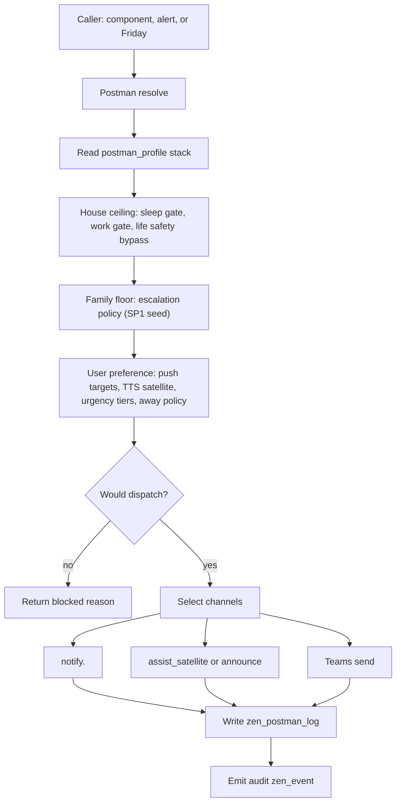
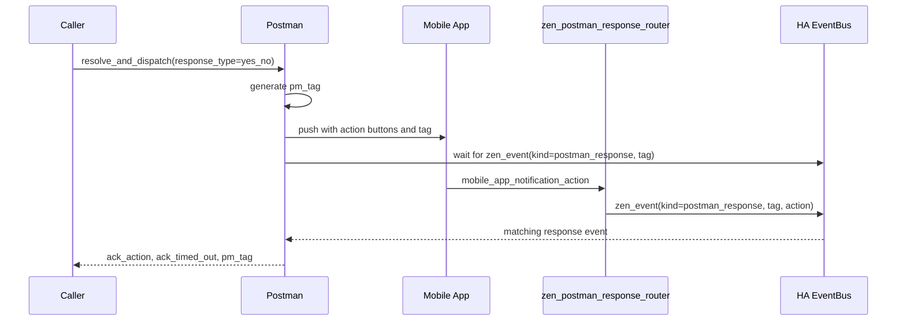

# Zen DojoTools Postman — v1.6.2

**File:** `packages/zenos_ai/dojotools/dojotools_postman.yaml`
**Script:** `zen_dojotools_postman`
**CANONICAL COMMS TOOL — unified household notifications**

---

## Overview

Postman is the canonical household communications layer and supersedes `zen_dojotools_notification_router` (deprecated). It resolves notification intent against the authority stack (house ceiling → family floor → user preference) and dispatches to the appropriate channel(s) with full gate enforcement.

Every send goes through the same pipeline: sleep gate check → urgency tier → channel selection → away policy → dispatch. `resolve` mode runs the whole evaluation read-only so Friday can predict what would happen before committing to a send. `zen_postman_response_router` automation bridges push notification taps into `zen_event(kind: postman_response)` for ack correlation.

---

## Dispatch Flow



`resolve` stops at the decision and returns the audit. `resolve_and_dispatch` continues through channels, log, and event emission.

---

## Action Button Ack Flow



AlertManager uses this same path when `notify_target: postman` and `response_type` is set. Other tools can either wait on Postman's return value or subscribe independently to `zen_event(kind: postman_response)`.

---

## Modes

| Mode | Dispatches | Logs | Description |
|---|---|---|---|
| `resolve` | no | no | Evaluate authority stack, return would-dispatch result. Browse and debug. |
| `resolve_and_dispatch` | yes | yes | Full send — resolve + dispatch + kata log + audit event. |
| `author_policy` | no (policy write) | no | Write or update a `postman_profile` drawer in any cabinet. |
| `clear_tag` | no | yes (removes) | Remove a log entry from `zen_postman_log` by `pm_tag`. Requires `tag=<pm_tag>`. Returns `{removed: true/false}`. |
| `direct_dispatch` | yes | yes | Bypass the entire authority stack — no cabinet reads, no quiet/work-hours tier mapping — and dispatch straight to `notify.*` against a caller-supplied `notification_targets` list. Requires `override: true` or it logs a blocked attempt and returns an error coaching the caller to ask the operator instead. See [direct_dispatch](#direct_dispatch) below. |
| `help` | no | no | Return full schema, drawer seeds, and example calls. |

---

## `direct_dispatch`

Backwards-compat replacement for the retired `zen_dojotools_notification_router` script — if you're migrating an old caller that used to hit `notification_router` directly, this is the equivalent path, now inside Postman.

**This is an escape hatch, not the normal path.** `resolve_and_dispatch` (the authority-stack-aware mode above) is almost always what you want — `direct_dispatch` exists for callers that need to hit a `notify.*` target directly and don't want the ceiling/floor/preference resolution in the way.

```yaml
zen_dojotools_postman:
  mode: direct_dispatch
  notification_targets: "Admin Devices"
  title: "..."
  message: "..."
  override: true   # required — omit or false and the call is blocked
```

**Fields:** `notification_targets` (one or more of the 5 named groups: `Admin Devices`, `Family Devices`, `Family Devices (Verbose)`, `Default User Phone`, `Secondary User Phone`), `override` (boolean, default `false` — the "I know what I'm doing" switch).

**Gates:**
- **`override: true` is required.** Without it, the call is refused, logged to `zen_postman_log` as `direct_dispatch_blocked`, and the error response coaches the caller to ask the operator rather than retry with `override`.
- **Non-Admin targets are still quiet/work-hours gated** unless `breakthrough: true` is also passed. `Admin Devices` always fires regardless of hours.
- A successful dispatch logs a `direct_dispatch` entry to `zen_postman_log` (targets, override, caller_token) — same audit trail as `resolve_and_dispatch`.

---

## Authority Stack

Three policy layers are evaluated in order. Each narrows what the next layer can do.

```
house cabinet  → postman_profile  (ceiling: sleep gate, life_safety_bypass, work_gate)
family cabinet → postman_profile  (floor: escalation — SP1, not yet active)
user cabinet   → postman_profile  (preference: urgency_tiers, push_targets, away_policy)
```

**Life safety bypass:** urgency >= `life_safety_bypass` (default 9) bypasses all gates including sleep. Use for fire/smoke/CO notifications. Setting `breakthrough: true` has the same effect for gate evaluation without requiring a high urgency level.

**Sleep gate:** When `input_select.zen_home_mode == 'sleep'` or hour >= 23 or < 7, notifications below `block_below_urgency` (default 9) are blocked. Bypassed by life_safety threshold.

**Work gate:** `block_tts: true` in `house.work_gate` suppresses TTS during work mode (does not block push).

---

## Urgency Tiers

| Tier | Urgency | Default channels |
|---|---|---|
| low | 1–3 | push |
| medium | 4–6 | push |
| high | 7–8 | push, tts |
| critical | 9–10 | push, tts (bypasses all gates if >= life_safety_bypass) |

Channels are defined per-tier in the user's `postman_profile.urgency_tiers`. These are overridden by house gates and away policy.

---

## Channels

### `push`

Dispatches to `notify.<slug>` where slug is derived from the user's `push_targets` list (default: `Admin Devices`). Push bypasses `notification_router` to preserve native dict types required for action buttons and image data.

**Push target name → notify slug mapping:**

| Name | Slug |
|---|---|
| Admin Devices | admin_devices |
| Family Devices | family_devices |
| Family Devices (Verbose) | family_devices_verbose |
| Default User Phone | default_user |
| Secondary User Phone | secondary_user |

### `tts`

Routes to `assist_satellite.announce` or `assist_satellite.ask_question` (when `response_type` is set and `tts_satellite` is configured in the user profile). Falls back to `script.zen_dojotools_announce` if no satellite is configured.

**Phone TTS (audio attachment):** When `urgency >= 9` or `force_audio: true` and push is active, Postman calls `tts_get_url` to generate audio from the configured TTS engine, then attaches it to the push notification as an `audio` data field so the handset speaks the message as an alert sound.

### `teams`

Dispatches to `script.zen_dojotools_teams action=send`.

---

## Image Attachments

Use `image_entity` (preferred) or `image_url` for push notification images. `image_entity` takes precedence if both are set.

| `image_entity` type | Resolved URL |
|---|---|
| `image.zen_image_<slot>` | `/local/zen_<slot>.jpg` |
| `image.<other>` | `state_attr(entity, 'entity_picture')` |
| `camera.<entity>` | `/api/camera_proxy/<entity_id>` |

The companion app fetches `data.image` lazily on notification open — camera and generated images do not need to be pre-fetched before dispatch.

**Two-step pattern for generated images:** Call `zen_dojotools_generate_image` first → get slot back → pass `image.zen_image_<slot>` as `image_entity`. Both calls complete fast with no timeout risk.

---

## Actionable Notifications (Response Buttons)

Set `response_type` to add action buttons. Postman auto-generates a `pm_tag`, attaches buttons to the notification, and waits for a tap (or voice response via satellite) up to `response_timeout_s` (default 60s).

| `response_type` | Buttons |
|---|---|
| `yes_no` | Yes / No |
| `yes_no_ignore` | Yes / No / Ignore |
| `ok_cancel` | Ok / Cancel |
| `acknowledge` | Got it |
| `none` | No buttons (default) |

**How it works:**
1. Postman auto-generates `pm_tag` (format: `pm_<epoch_s>`) and injects it into the notification
2. If TTS + satellite: `ask_question` blocks until voice response or timeout
3. If push only: waits for `zen_event(kind: postman_response, tag: pm_tag)` up to `response_timeout_s`
4. `zen_postman_response_router` automation converts `mobile_app_notification_action` → `zen_event`
5. Response fields in return: `pm_tag`, `ack_action` (YES/NO/etc or '' on timeout), `ack_timed_out`

Other automations can also listen for `zen_event(kind: postman_response)` filtered by tag without blocking the Postman caller.

---

## Field Reference

| Field | Mode(s) | Default | Description |
|---|---|---|---|
| `mode` | all | — | Required. Operation mode selector. |
| `target` | resolve, resolve_and_dispatch | — | `person.*` entity for notification target. |
| `urgency` | resolve, resolve_and_dispatch | `1` | 1–10. Maps to tier. |
| `message` | resolve_and_dispatch | — | Text to deliver. |
| `title` | resolve_and_dispatch | — | Optional notification title. |
| `channel_hint` | resolve, resolve_and_dispatch | — | Preferred channel (push, tts, teams). Prepended to tier channel list, still subject to gates. |
| `image_entity` | resolve_and_dispatch | — | HA image or camera entity. Takes precedence over `image_url`. |
| `image_url` | resolve_and_dispatch | — | URL or local path for push image. |
| `audio_url` | resolve_and_dispatch | — | Audio file URL. AIFF/WAV/MP3/MPEG4, max 5 MB. Companion app only. |
| `tag` | resolve_and_dispatch | — | Notification tag for replace/update/clear patterns. Auto-generated when `response_type` is set. |
| `response_type` | resolve_and_dispatch | `none` | Actionable button preset. |
| `response_timeout_s` | resolve_and_dispatch | `60` | Seconds to wait for button tap. Range 10–300. |
| `force_audio` | resolve_and_dispatch | `false` | Bypass urgency >= 9 gate for phone TTS audio attachment. |
| `open_dashboard` | resolve_and_dispatch | `false` | On tap, navigate to `assist_path` from user profile. Injects `clickAction` and `url` as `homeassistant://navigate/<assist_path>` into the notification data — companion app opens the dashboard directly. Has no effect if `assist_path` is unset in the user profile. |
| `notification_data` | resolve_and_dispatch | — | Raw dict passed to notification data field. See Android fields below. |
| `kata_input` | resolve_and_dispatch | — | Kata payload dict from ninja pipeline. Derives `title`/`message` from `component`, `period`, `attention`, `suggested_act_desc` when explicit values are not set. |
| `breakthrough` | resolve_and_dispatch | `false` | If true, bypasses house sleep gate regardless of urgency. Equivalent to urgency >= life_safety_bypass for gate evaluation only. |
| `response_required` | resolve_and_dispatch | `false` | Flag delivery record for ack. SP1: ack watch not yet implemented. |
| `scope_id` | author_policy | — | Resolver sensor or cabinet entity to write policy into. |
| `policy_key` | author_policy | `postman_profile` | Drawer key to write. |
| `policy_type` | author_policy | — | `new_channel` or `update_existing`. |
| `channel_definition` | author_policy | — | Policy dict to write or merge. |
| `caller_token` | all | — | Opaque token echoed in all responses. |

### `notification_data` passthrough — Android fields

These replace the per-field parameters from the deprecated `notification_router`. Pass them as a dict to `notification_data`.

| Field | Description |
|---|---|
| `channel` | Android notification channel name — configure sound/vibration in app settings |
| `importance` | `min` / `low` / `default` / `high` / `max` |
| `color` | Hex color e.g. `#f44336` |
| `notification_icon` | MDI icon e.g. `mdi:cctv` |
| `sticky` | bool — stays after tap |
| `persistent` | bool — non-dismissible (requires tag) |
| `alert_once` | bool — alert on first delivery only (requires tag) |
| `vibrationPattern` | e.g. `100, 1000, 100, 1000` |
| `ledColor` | RGB LED color (Android only) |
| `visibility` | `public` / `private` / `secret` |
| `timeout` | int seconds — auto-dismiss |
| `clickAction` | URL or Lovelace path to open on tap |
| `group` | Notification group key for override/update |
| `tts_text` | Handset TTS text (Android system voice fallback) |
| `media_stream` | Media stream to start with notification |
| `car_ui` | bool — Android Auto / CarPlay visibility |
| `ttl` | `0` for high-priority delivery |

Merge order: `notification_data` < `image_url` < `audio_url` < `tag` < `response_type` actions (later wins).

---

## Cabinet Drawers

### `postman_profile` — household cabinet (ceiling)

```json
{
  "life_safety_bypass": 9,
  "sleep_gate": { "block_below_urgency": 9 },
  "work_gate": { "block_tts": false }
}
```

### `postman_profile` — user cabinet (preference)

```json
{
  "push_targets": ["Default User Phone"],
  "tts_satellite": { "preferred": "assist_satellite.living_room" },
  "tts_engine": "tts.home_assistant_cloud",
  "tts_engine_label": "",
  "assist_path": "/lovelace/main",
  "urgency_tiers": {
    "low":      { "channels": ["push"] },
    "medium":   { "channels": ["push"] },
    "high":     { "channels": ["push", "tts"] },
    "critical": { "channels": ["push", "tts"] }
  },
  "away_policy": { "push": "allow", "tts": "block" }
}
```

`tts_engine_label`: when set, resolves the TTS engine from the first `tts.*` entity carrying that label. Falls back to `tts_engine` string if no match.

### `postman_profile` — family cabinet (floor)

```json
{}
```

SP1: escalation loop fields (`response_required_at`, `escalation_window_minutes`, `escalation_targets`). Seed with empty dict for now.

### `zen_postman_log` — kata cabinet

Written after every `resolve_and_dispatch`. Contains `timestamp`, `target`, `urgency`, `tier`, `channels`, `pm_tag`, `ack_action`, `ack_timed_out`. Last-write-wins (SP1: log capping).

---

## `resolve` Return

```yaml
status: resolved
would_dispatch: true          # false if blocked
blocked_by: null              # or "house_sleep_gate"
urgency: 5
tier: medium
target: person.resident
person_state: home
is_away: false
channel_hint: ""
channels: [push]
notification_data: {}
gates:
  bypass_all_gates: false
  sleep_blocked: false
  is_sleep: false
  work_block_tts: false
  life_safety_bypass: 9
  sleep_block_below: 9
policy_sources:
  house_profile_present: true
  user_profile_present: true
  family_policy_present: false
caller_token: ""
```

## `resolve_and_dispatch` Return

```yaml
status: dispatched            # or "blocked_sleep"
tier: medium
channels: [push]
pm_tag: pm_1744000000         # set if response_type used
ack_action: YES               # or "" on timeout
ack_timed_out: false
audio_url: ""
caller_token: ""
```

---

## `author_policy` — Setup

Run three calls on first install to seed the authority stack. Safe to re-run with `update_existing` at any time. `scope_id` must be the **resolver sensor** state (which holds the active cabinet entity_id), not a cabinet entity directly.

```yaml
# 1. House ceiling
- action: script.zen_dojotools_postman
  data:
    mode: author_policy
    scope_id: sensor.zen_default_household_cabinet_resolved
    policy_key: postman_profile
    policy_type: update_existing
    channel_definition:
      life_safety_bypass: 9
      sleep_gate: { block_below_urgency: 9 }
      work_gate: { block_tts: false }

# 2. User preference
- action: script.zen_dojotools_postman
  data:
    mode: author_policy
    scope_id: sensor.zen_default_user_cabinet_resolved
    policy_key: postman_profile
    policy_type: update_existing
    channel_definition:
      push_targets: [Default User Phone]
      urgency_tiers:
        low:      { channels: [push] }
        medium:   { channels: [push] }
        high:     { channels: [push, tts] }
        critical: { channels: [push, tts] }
      away_policy: { push: allow, tts: block }

# 3. Family floor (empty for alpha)
- action: script.zen_dojotools_postman
  data:
    mode: author_policy
    scope_id: sensor.zen_default_family_cabinet_resolved
    policy_key: postman_profile
    policy_type: update_existing
    channel_definition: {}
```

---

## `zen_postman_response_router` Automation

Bridges `mobile_app_notification_action` events (push notification button taps) into `zen_event(kind: postman_response)` so Postman's push-ack wait and any independent subscriber can correlate by tag.

**What it fires:**
```yaml
event_type: zen_event
event_data:
  event:
    kind: postman_response
    tag: "{{ tag from notification }}"
    action: "YES"       # or NO, OK, CANCEL, ACK, IGNORE, etc.
    device_id: "{{ source device }}"
    severity: info
```

Ships in `dojotools_postman.yaml`. Runs `mode: parallel, max: 10` — concurrent taps from multiple household members are handled independently.

---

## `kata_input` Pipeline Integration

When the ninja summarizer pipeline emits a component, it can call Postman directly by passing the kata dict as `kata_input`. Postman derives `title` and `message` from the kata payload automatically if explicit values are not provided.

**Derivation logic:**
- `title` → `{component | title} — {period | title}` (e.g. `Security Manager — Morning`)
- `message` → `attention` field, falling back to `suggested_act_desc`, then `'Action required.'`

**Example — pipeline emission:**
```yaml
- action: script.zen_dojotools_postman
  data:
    mode: resolve_and_dispatch
    target: person.resident
    urgency: 6
    kata_input: "{{ monk.data }}"   # full kata dict from ninja output
    notification_data:
      channel: ZenOS
```

---

## Migration from `notification_router`

`zen_dojotools_notification_router` is deprecated. Map its fields to Postman as follows:

| `notification_router` field | Postman equivalent |
|---|---|
| `title` / `message` | `title` / `message` (unchanged) |
| `notification_targets` | `notification_data` → `push_targets` in user `postman_profile` |
| `breakthrough` | `breakthrough: true` field |
| `kata_input` | `kata_input` field (same dict shape) |
| `importance` | `notification_data: {importance: high}` |
| `color` / `sticky` / `channel` / etc. | `notification_data: {color: ..., sticky: ..., ...}` |
| `quiet_hours` / `work_hours` gates | Replaced by postman authority stack (house `sleep_gate`, `work_gate`) |

---

## Examples

```yaml
# 1. Audit before sending
- action: script.zen_dojotools_postman
  data:
    mode: resolve
    target: person.resident
    urgency: 5
  response_variable: check
# check.would_dispatch → proceed or skip

# 2. Simple dispatch
- action: script.zen_dojotools_postman
  data:
    mode: resolve_and_dispatch
    target: person.resident
    urgency: 5
    message: "Front door unlocked."
    title: "Security"

# 3. Camera frame with yes/no question
- action: script.zen_dojotools_postman
  data:
    mode: resolve_and_dispatch
    target: person.resident
    urgency: 7
    title: "Motion at front door"
    message: "Someone is at the door. Let them in?"
    image_entity: camera.front_doorbell_camera
    response_type: yes_no
    response_timeout_s: 60
    notification_data:
      channel: Security
      color: "#f44336"
  response_variable: result
# result.ack_action → YES or NO or ''

# 4. Generated image with question
- action: script.zen_dojotools_generate_image
  data: { image_prompt: "Hot tub status visualization", slot: canvas }
- action: script.zen_dojotools_postman
  data:
    mode: resolve_and_dispatch
    target: person.resident
    urgency: 5
    message: "Hot tub ready. Open it?"
    image_entity: image.zen_image_canvas
    response_type: yes_no

# 5. Security alert with sticky notification
- action: script.zen_dojotools_postman
  data:
    mode: resolve_and_dispatch
    target: person.resident
    urgency: 8
    title: "Security Alert"
    message: "Motion in back yard."
    image_entity: camera.back_yard_camera_high_resolution_channel
    tag: security_backyard
    notification_data:
      sticky: true
      channel: Security
      color: "#f44336"
      alert_once: true

# 6. Kata pipeline — title/message derived from ninja output
- action: script.zen_dojotools_postman
  data:
    mode: resolve_and_dispatch
    target: person.resident
    urgency: 6
    kata_input: "{{ monk.data }}"
    notification_data:
      channel: ZenOS

# 7. Breakthrough gate bypass — send during sleep regardless of urgency
- action: script.zen_dojotools_postman
  data:
    mode: resolve_and_dispatch
    target: person.resident
    urgency: 5
    breakthrough: true
    title: "Package delivered"
    message: "UPS left a package at the front door."
```

---

## SP1 — Not Yet Implemented

- Per-target user cabinet resolution (all targets currently use default user cabinet)
- Family escalation loop
- `zen_postman_log` capping (currently last-write-wins)
- Work gate activation condition
- Content policy per channel
- Ack watch / `response_required` escalation

## SP2 — Planned

- Label-based push routing: set `push_device_labels: true` in user profile to use `zen_postman + zen_channel_push + person` label intersection on `device_tracker.*` entities instead of the `push_targets` name list.
