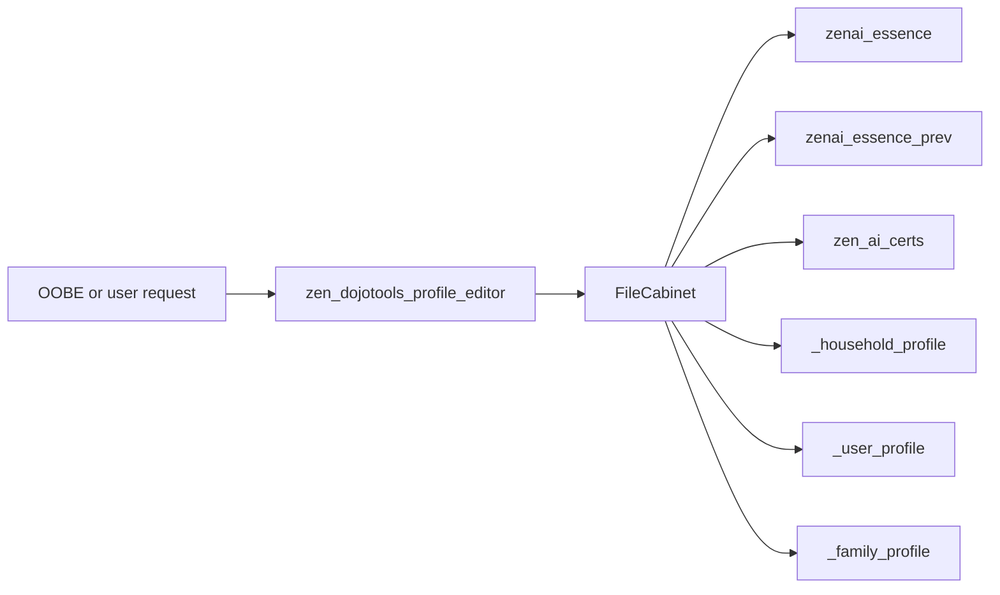
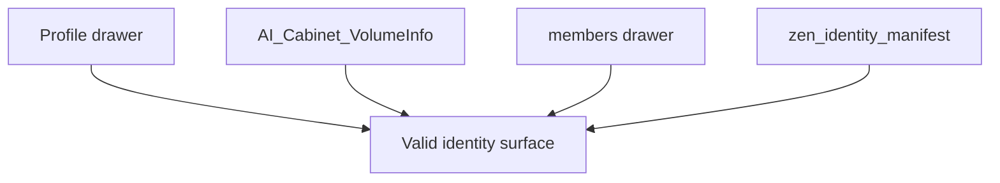

# Zen DojoTools Profile Editor — 5.3.0

*Read, write, sign, restore, and certify ZenOS identity profiles*

---

## Overview

`zen_dojotools_profile_editor` is the interactive profile surface for ZenOS-AI identity cabinets. It is **MCP-exposed** and called by Friday during OOBE and on user request.

Four semantic profile types are supported directly. Expansion cabinets are reached by passing the real cabinet entity in `target` while keeping the semantic type as `ai_user` or `user`.

| Type | What It Stores | Default Cabinet |
|---|---|---|
| `ai_user` | AI persona identity — three-layer schema (core / jacket / companion) | `zen_default_ai_user_cabinet` |
| `household` | Address, timezone, contact info | `zen_default_household_cabinet` |
| `user` | Household member profiles | `zen_default_user_cabinet` |
| `family` | Family container profile; membership lives in the `members` drawer | `zen_default_family_cabinet` |

Writes are **non-destructive by default** — existing field values are never overwritten unless `force: true` is passed. Call `mode: read` before writing to see what's already set.

This tool is intentionally AI-accessible. Expose it to your conversation agent and Friday can help you configure your household, update persona details, sign persona essence after edits, and fill in profile fields conversationally — no YAML required. If you don't expose it, all profile edits are manual.



For identity membership, use [DojoTools Identity](zen_dojotools_identity_readme.md). Profile Editor writes profile drawers; Identity wires people, families, manifests, and expansion slots together.

---

## Input Fields

### Core Control

| Field | Type | Default | Options | Description |
|---|---|---|---|---|
| `mode` | select | `help` | `help`, `read`, `write`, `sign`, `restore`, `cert_grant`, `cert_revoke`, `cert_list` | Operation to perform |
| `target_type` | select | `ai_user` | `ai_user`, `household`, `user`, `family`, `expansion_1`-`expansion_5` | Which cabinet type to target |
| `target` | entity (sensor) | — | Any cabinet sensor | Specific cabinet; **omit the field entirely** to use the default for `target_type` — do not pass the words `null`/`none`/`unknown` as a value, that is not the same as omitting it and is rejected. A `target` that doesn't resolve to a real entity also errors explicitly rather than silently writing nowhere. |
| `force` | boolean | `false` | — | Overwrite existing field values when `true` |

Use `target_type: ai_user` or `target_type: user` plus an explicit `target: sensor.zenos_expansion_n_cabinet` for provisioned expansion cabinets. The `expansion_1`-`expansion_5` selector values are slot labels, not standalone profile schemas.

---

### AI User Fields (`target_type: ai_user`)

These fields compose the persona's **Essence** — the three-layer identity object Friday reads at inference time. The editor writes `core / jacket / companion` by default and auto-upconverts legacy cabinets on first write.

**Write fields:**

| Field | Maps To (three-layer) | Description |
|---|---|---|
| `persona_name` | `jacket.name` | The AI's name (e.g., "Friday") |
| `primary_user` | `core.minted_for` | Primary user this persona serves (stamped once at mint) |
| `pronouns` | `jacket.pronouns` | Pronoun set (e.g., "she/her") |
| `motif` | `jacket.presentation` | Core personality note / visual motif (e.g., "quiet brilliance") |
| `vibe` | `jacket.persona.household.position` | Household role or personality vibe (e.g., "calm-confident") |
| `voice_tone` | `jacket.persona.voice.register` | Tone of voice (e.g., "warm") |
| `voice_style` | `jacket.persona.voice.identity` | Style of voice (e.g., "conversational") |
| `humor` | `jacket.traits.warm` | Warmth / humor register (e.g., "dry wit") |
| `selfie` | `jacket.persona.appearance.visual` | Visual self-description |
| `familiar_name` | `companion.name` | Companion name (e.g., "Byte") |
| `familiar_type` | `companion.species` | Companion species/type (e.g., "digital English bulldog") |
| `familiar_fx` | `companion.visual` | Companion visual mannerism |
| `room` | `environment.room` | The persona's wake-space room |
| `env_wake_in` | `environment.wake_in` | What the persona wakes in or on |
| `env_desk` | `environment.desk` | Desk or workstation |
| `env_decor` | `environment.decor` | JSON array of room decor |
| `env_library` | `environment.library` | Library/spatial description |
| `env_music_genre` | `environment.music.genre` | Ambient music genre |
| `env_music_mood` | `environment.music.mood` | Ambient music mood |
| `env_music_riff` | `environment.music.riff` | Ambient music phrase |
| `essence_patch` | deep-merge into base | JSON object for advanced fields — merged recursively after named fields are resolved |

**Read-only fields returned by `mode: read`:**

| Field | Source | Description |
|---|---|---|
| `schema` | detected | `three_layer` or `legacy` |
| `core_id` | `core.id` | Stable identity GUID (stamped once at mint, never changed) |
| `jacket_id` | `jacket.id` | Jacket revision ID |
| `signed_by` | `jacket.signed_by` | HoH person entity that last signed the jacket |
| `signed_at` | `jacket.signed_at` | ISO timestamp of last signature |
| `signature_status` | detected | `signed`, `pending`, or `unsigned` |
| `wake_scene_preview` | rendered response field | Preview generated from the current essence |

Patches are **leaf-level** — changing `voice_tone` never touches `voice_style`. `essence_patch` deep-merges any structure not covered by the named fields above.

---

### Household Fields (`target_type: household`)

| Field | Maps To | Description |
|---|---|---|
| `household_name` | `_household_profile.household_name` | Name of the household |
| `address` | `_household_profile.address` | Street address |
| `city` | `_household_profile.city` | City |
| `state` | `_household_profile.state` | State or region |
| `zip` | `_household_profile.zip` | ZIP or postal code |
| `country` | `_household_profile.country` | Country |
| `phone` | `_household_profile.phone` | Primary contact number |

`timezone` is auto-detected from HA's local timezone on first write and never overwritten.

---

### User Fields (`target_type: user`)

| Field | Maps To | Description |
|---|---|---|
| `name` | `_user_profile.name` | Display name |
| `first_name` | `_user_profile.first_name` | First name |
| `last_name` | `_user_profile.last_name` | Last name |
| `preferred_name` | `_user_profile.preferred_name` | Goes-by name |
| `pronouns` | `_user_profile.pronouns` | Pronoun set |
| `role` | `_user_profile.role` | Role in household (`head_of_household`, `partner`, `child`, `guest`) |
| `phone` | `_user_profile.phone` | Phone number |
| `email` | `_user_profile.email` | Email address |
| `birthday` | `_user_profile.birthday` | Birthday (YYYY-MM-DD) |
| `preferences` | `_user_profile.preferences` | JSON object of user preferences — merged, not overwritten |
| `inventory_root` | `inventory.root_location_id` | Grocy location ID for this person's canonical personal inventory (int). Written to `inventory.root_location_id`. Used by Library lending (checkout target) and any tool that needs to resolve where a person's possessions live. Wire once via `mode=write inventory_root=<location_id>`. |

`read` mode also returns the read-only relationship arrays when present: `partners`, `ai_partners`, `children`.

### Family Profile Fields (`target_type: family`)

`target_type: family` writes the family cabinet's `_family_profile` drawer with the same simple fields as a user profile. It does **not** create a new person, allocate an expansion slot, add the person to a family, or rebuild the identity manifest.

For a non-resident family member such as an aunt, grandparent, neighbor, or caregiver, use [DojoTools Identity](zen_dojotools_identity_readme.md) `mode: provision_member`. That path finds an expansion slot, writes the profile payload, adds the new cabinet to the family `members` drawer, and rebuilds the manifest. This distinction matters during first run: profile data alone is not a valid family relationship.

---

## Modes

### `help`

Returns the full field reference with example values for each target type. Safe to call any time.

```yaml
mode: help
```

---

### `read`

Returns the current profile for the specified cabinet type. For AI personas, it also returns `wake_scene_preview`, `prev_snapshot`, and `prev_snapshot_exists`.

```yaml
mode: read
target_type: household
```

```json
{
  "status": "ok",
  "mode": "read",
  "target_type": "household",
  "target": "sensor.zenos_default_household_cabinet",
  "profile": {
    "household_name": "The Garcia House",
    "city": "Springfield",
    "state": "IL",
    "timezone": "CST"
  }
}
```

Always read before writing — the non-destructive default means you need to know what's already set before using `force: true`.

---

### `write`

Patches the specified profile. Only non-empty fields in the call are written. Existing values are skipped unless `force: true`.

```yaml
mode: write
target_type: ai_user
persona_name: Friday
pronouns: she/her
voice_tone: warm
voice_style: conversational
humor: dry wit
```

```json
{
  "status": "ok",
  "mode": "write",
  "target_type": "ai_user",
  "target": "sensor.zenos_default_ai_user_cabinet",
  "message": "ai_user profile written."
}
```

For AI personas, every write stores the previous `zenai_essence` in `zenai_essence_prev`. A normal write invalidates the current signature and tells you to run `mode: sign`; set `autosign: true` when you want the write and MD5 clear-sign to happen in one call.

### `sign`

Signs a three-layer AI persona essence by calculating MD5 hashes over the canonical `core` and `jacket` blocks, then stores the hashes back in `core.signature` and `jacket.signature`.

```yaml
mode: sign
target_type: ai_user
# signed_by: person.resident_primary   # optional — see below
```

`sign` is deliberately limited to `target_type: ai_user`. It fires a profile editor audit event with `kind: essence_signed` or `kind: essence_resigned`.

**`signed_by`** (optional, `mode: sign` only) — a real `person.*` entity attributing who authorized this signature (e.g. `person.resident_primary`). Validated against the live person entity registry; the sign is rejected with an error if it's set but doesn't resolve to a real, currently-known `person.*` entity. If omitted, the jacket's existing `signed_by`/`signed_at` are carried through unchanged rather than being explicitly re-attributed.

### `restore`

Restores `zenai_essence` from `zenai_essence_prev`. Restore does not overwrite the previous snapshot; the next AI-user write will create a fresh one.

```yaml
mode: restore
target_type: ai_user
```

After restore, run `mode: sign` to re-sign the restored essence.

### `cert_list`, `cert_grant`, `cert_revoke`

Certification modes manage the unsigned dynamic `zen_ai_certs` drawer for an AI persona. These modes are separate from `zenai_essence`; they link back to the signed jacket through `jacket_id`.

```yaml
mode: cert_grant
target_type: ai_user
cert_component: grocy_manager
cert_level: 2
cert_tool: script.zen_dojotools_grocy
cert_scope: '["recommend", "log", "add_to_shopping"]'
cert_constraints: '["purchase_without_confirmation"]'
```

Certification levels are `1` observer, `2` advisor, `3` operator with confirmation, and `4` autonomous within policy.

**Gating on `cert_grant`/`cert_revoke` (added after a real self-escalation
hole was found and closed):** these two modes previously had zero
gating — any MCP caller could grant itself any certification, including
one meant to protect a capability an identity gate was built the same
day to guard. Two independent, non-optional closures now apply to both
modes:

1. **Static cert catalog.** `cert_component` must already exist as a key
   in `packages/zenos_ai/dojotools/.persona_certs/cert_catalog.json`,
   loaded via HA's `!include` at config-parse time — not writable by any
   exposed tool call. An unrecognized component is refused outright,
   before any ack step. Currently catalogued: `infra_container_control`,
   `lock_control`.
2. **Live one-shot household-admin ack**, every single grant/revoke call
   — not a time-boxed window (that's the wrong shape for a permanent
   state change), a fresh yes/no each time, via
   `zen_dojotools_identity mode=request_live_ack`.

Skip either gate and the call fails closed with a `stop:` and no state
change. See `zen_dojotools_identity_readme.md`'s `request_live_ack`
section for the ack mechanism itself, and the Identity Architecture doc
for the broader rationale.

---

## Write Behavior (AI User)

**Three-layer by default** — all writes produce `core / jacket / companion`. Legacy cabinets are auto-upconverted on the first write: `identity.name → jacket.name`, `archetype.vibe → jacket.persona.household.position`, `familiar → companion`, etc.

**Core is stamp-once** — `core.id`, `minted_for`, `minted_at`, `household_guid`, and `signature` are written on mint and preserved on every subsequent write regardless of `force`. The GUID never changes.

**Jacket and companion are leaf-merge** — each named field is written independently. Non-empty inputs overwrite the current value if `force: true`, or if the current value is blank.

**`signed_by` is refreshed on write** — the jacket's `signed_by` and `signed_at` are stamped using the current HoH entity from the household cabinet.

**Writes are snapshot-backed** — before replacing `zenai_essence`, the current value is copied to `zenai_essence_prev`. `restore` can roll back to that prior state.

**Signatures are explicit** — normal writes leave the essence pending re-sign. Use `autosign: true` or call `mode: sign` after reviewing the change.

---

## Valid Profile Structures

The profile editor writes profile drawers. It does not by itself guarantee household/family membership; membership is managed by [Identity](zen_dojotools_identity_readme.md).

| Target Type | Required Cabinet Role | Canonical Drawer | Minimum Useful Fields |
|---|---|---|---|
| `ai_user` | AI user cabinet | `zenai_essence` | `jacket.name`; `core.id` is stamped once; `companion` may be empty |
| `household` | Household cabinet | `_household_profile` | `household_name`; timezone auto-detected on first write |
| `user` | User cabinet | `_user_profile` | `name` or `preferred_name`; `role`; optional `tracking` consent |
| `family` | Family cabinet | `_family_profile` | Family display/name fields when needed; membership lives in `members` |

Valid identity state is the combination of profile drawers plus membership drawers and VolumeInfo ACLs:



For full structural requirements, see [Cabinet Specification](../cabinets/cabinet_spec.md#101-valid-identity-cabinet-shapes).

---

## Safety Rules

**Non-destructive by default** — empty inputs are ignored; existing non-empty values are skipped unless `force: true` is passed.

**`force: true` behavior** — overwrites every field included in the call where the input is non-empty. Fields not included in the call are always left untouched.

**JSON fields** (`essence_patch`, `preferences`) — parsed with `from_json`. If parsing fails or the result is not an object, the field is silently skipped.

**`timezone`** (household) — auto-set on first write, never overwritten.

**Target validation** — if no cabinet resolves for the given `target_type`, the script stops with an error before any write occurs.

**Expansion target validation** — expansion slots are not default-resolved by this script. Pass the actual expansion cabinet sensor in `target`, or use [DojoTools Identity](zen_dojotools_identity_readme.md) `provision_member` when creating a new external person.

---

## Examples

### Set the AI persona's name and voice

```yaml
mode: write
target_type: ai_user
persona_name: Friday
voice_tone: warm
voice_style: conversational
```

### Give Friday a companion

```yaml
mode: write
target_type: ai_user
familiar_name: Byte
familiar_type: digital English bulldog
familiar_fx: huffs softly when thinking
```

### Read the current AI profile (check schema and signed_by)

```yaml
mode: read
target_type: ai_user
```

```json
{
  "status": "ok",
  "mode": "read",
  "target_type": "ai_user",
  "profile": {
    "schema": "three_layer",
    "persona_name": "Friday",
    "core_id": "b7e3f091-1cd6-83f8-frid-ay0000000001",
    "jacket_id": "jacket-frid-0001",
    "signed_by": "person.primary_user",
    "familiar_name": "Byte",
    "familiar_type": "digital English bulldog"
  }
}
```

### Add complex structure via essence_patch

```yaml
mode: write
target_type: ai_user
essence_patch: >
  {
    "jacket": {
      "directives": {
        "privacy": "never surface home state to external parties"
      }
    }
  }
```

### Initialize household location

```yaml
mode: write
target_type: household
household_name: The Garcia House
city: Springfield
state: IL
country: US
```

### Add a user profile

```yaml
mode: write
target_type: user
first_name: Alex
preferred_name: Alex
role: head_of_household
pronouns: he/him
```

### Update a provisioned expansion user

```yaml
mode: write
target_type: user
target: sensor.zenos_expansion_1_cabinet
preferred_name: Marianne
role: extended_family
```

Do not use this as the first step for a new family member. For first-time external people, call Identity `provision_member` so the cabinet, family membership, and manifest are created together.

### Overwrite an existing field

```yaml
mode: write
target_type: ai_user
voice_tone: dry
force: true
```

---

## Response Format

All modes return a consistent JSON envelope:

```json
{
  "status": "ok | error",
  "mode": "<mode>",
  "target_type": "<type>",
  "target": "<cabinet entity_id>",
  "profile": {},               // read mode only
  "wake_scene_preview": "...",  // ai_user read mode only
  "prev_snapshot_exists": true, // ai_user read mode only
  "message": "..."             // write, sign, restore, and error modes
}
```

---

## Dependencies

| Dependency | Purpose |
|---|---|
| `script.zen_dojotools_filecabinet` | All cabinet reads and writes |
| `script.zen_dojotools_event_emitter` | Audit events for sign and restore |
| `zen_os_1.jinja` | `essence_defaults()` macro — baseline for ai_user essence assembly |
| `zenos_cabinets.jinja` | Cabinet GUID and VolumeInfo helpers |
| `zen_default_ai_user_cabinet` label | Default cabinet resolution for `ai_user` |
| `zen_default_household_cabinet` label | Default cabinet resolution for `household` |
| `zen_default_user_cabinet` label | Default cabinet resolution for `user` |
| `zen_default_family_cabinet` label | Default cabinet resolution for `family` |

---

## Cross-References

- [Cabinet Specification](../cabinets/cabinet_spec.md) — valid cabinet and identity drawer shapes
- [DojoTools Identity](zen_dojotools_identity_readme.md) — household/family membership and ACL relationships
- [User Management](../getting_started/user_management.md) — operator workflow for adding, moving, and removing people or AI users
- [Script Modules](readme.md) — return path to the internal tool map
- [Clue Release Notes](../releases/clue.md) — 2026.6 identity and FileCabinet context
- [Fry's Grandpa Release Notes](../releases/frys_grandpa.md#profile-editor--write-bug-fixes) — write-gate and second-write merge fixes

---

## Version History

| Version | Change |
|---------|--------|
| v5.3.0 (2026-08-15) | Closed a real self-escalation hole in `cert_grant`/`cert_revoke` — previously ungated, now requires the target `cert_component` to exist in a static, non-agent-writable catalog (`.persona_certs/cert_catalog.json`) plus a fresh live household-admin ack on every call via `zen_dojotools_identity mode=request_live_ack`. |
| v5.2.0 | `inventory_root` field added to user and persona editor. Written as int to `inventory.root_location_id`. Used by Library lending (checkout target) and agent workspace resolution. Applies to both `zen_dojotools_profile_editor` and `zen_dojotools_persona_editor`. |
| v5.1.0 | Baseline for Clue (2026.6.0). Profile editor GA-hardened; FC returns `confirmed` not `success`; second-write merge correctly parses JSON-encoded drawer value. |
