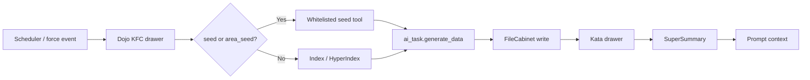

# Zen DojoTools Summarizers — v4.3.0

*Ninja Summarizer + SuperSummary — the KF4 action pipeline — MCP-exposed*

---

## Overview

The summarizer package is the KF4 action pipeline. It runs continuously on a schedule, reads each component's context via HyperIndex, writes structured kata to the Kata cabinet, and synthesizes that knowledge into the `zen_summary` drawer that loads Friday's prompt context. Where a component's kata calls for action — a notification, an event, a dispatch — the pipeline fires it.

Two scripts ship in this package:

| Script | Role |
|---|---|
| `zen_dojotools_ninja_summarizer` | Per-component kata writer — reads one KFC component's context and writes its kata drawer |
| `zen_dojotools_supersummary` | Whole-home synthesizer — reads all active kata drawers and writes `zen_summary` |

**Pipeline order:** Ninja Summarizer → per-component kata drawers → SuperSummary → `zen_summary` → Friday's prompt

Both scripts are **MCP-exposed** for on-demand runs. The Scheduler drives them automatically.



---

## Kill Switches

Three `input_boolean` entities control the pipeline. Fresh installs default the master switch **off** so a new user does not accidentally run continuous background inference before choosing a local/background AI task.

| Entity | Default | Purpose |
|---|---|---|
| `input_boolean.zen_summarizers_enabled` | off on fresh install | Master gate — turns off both summarizers immediately |
| `input_boolean.zen_ninja_summarizer_enabled` | on | Ninja Summarizer individual kill switch |
| `input_boolean.zen_supersummarizer_enabled` | on | SuperSummary individual kill switch |

Master is checked first. If the master is off, both summarizers exit regardless of their individual switches. Turning any switch off is non-destructive — no schedules, automations, or cabinet data are touched.

**Auto-refire on re-enable:** `automation.zen_pipeline_autofire_on_enable` fires the appropriate force event within seconds of any switch being turned back on — no waiting for the next scheduled run. See [Scheduler readme](zen_dojotools_scheduler_readme.md) for trigger IDs.

> **Warning:** Do not point `input_text.zenos_ai_task_entity` at a paid inference API. The Ninja Summarizer fires multiple times per hour; the SuperSummary fires a minimum of 4 times per hour. Use a locally-hosted model for background summarization. Your frontline conversation agent (demand-only) does not carry this risk.

---

## Ninja Summarizer

**Script:** `zen_dojotools_ninja_summarizer`

Summarizes a single Kung Fu Component. Called by the Scheduler for each component that subscribes to the current trigger ID.

### Input Fields

| Field | Required | Description |
|---|---|---|
| `kung_fu_component_id` | Yes | KFC component ID (will be slugified). Matches the drawer key in the Dojo cabinet. |
| `query` | No | Override the default summarization query. Use with caution. |
| `post_to_kata_cabinet` | No | Write result to Kata cabinet? Default: `false`. |
| `supplemental_prompt` | No | Extra data or instructions appended to the monk prompt. |
| `force` | No | Bypass the run governor (dedup burnout window). For admin overrides or emergency on-demand runs. Default `false`. |
| `area_id` | No | HA area ID. When set and the KFC defines `area_seed`, the `{{area_id}}` slot in `area_seed.params` is filled at runtime. Used for per-area rollup patterns. |
| `caller_token` | No | Opaque pass-through token for correlation. |

### What It Does

1. **Kill switch check** — exits immediately if master or ninja switch is off
2. **AI task guard** — exits with error if `input_text.zenos_ai_task_entity` is unset or unavailable
3. **Resolve cabinets** — reads Dojo, Kata, and household cabinet entity IDs from resolver sensors
4. **Read Dojo drawer** — loads the component's KFC metadata (friendly name, label, command, tool, kata_key)
5. **`meta.enabled` check** — exits with `reason: meta_disabled` if the component's `meta.enabled` is `false`
6. **Run governor** — dedup burnout window check (see below). Exits with `reason: dedup_window` if blocked.
7. **Step 3c — Seed tool call (v4.3.0+)** — if the KFC defines `seed` or `area_seed`:
   - Resolves `_seed_tool`: `area_seed` takes priority when `area_id` input is set; falls back to `seed`.
   - **Whitelist check**: reads `zen_summarizer_seed_whitelist` from syscab (`allowed_tools` list). Default if drawer missing: `['zen_dojotools_index']`.
     - Whitelisted → fires `script.{{ _seed_tool }}`, sets `_seed_used: true`, step 8 skipped.
     - Not whitelisted → emits `seed_tool_blocked` zen_event (warn), falls through to step 8 (HyperIndex runs normally).
   - If neither `seed` nor `area_seed` is defined: step 3c is skipped, step 8 runs normally.
8. **Run HyperIndex** — queries the index using the component's configured index call. Skipped if `_seed_used`. Routing:
   - If the Dojo drawer has an `index_command` dict field: emits compound/recursive index call via `zen_indexer_request` event. Supports the full nested DSL: `{operator, index_1: {...}, index_2: {...}}`. Use for components whose context spans multiple independent label sets.
   - If the drawer has a `label` field: standard label-based index call in hypergraph mode.
   - If neither is present: HyperIndex step is skipped.
9. **Run library command** — if the component has a `command` field, dispatches it through `command_interpreter.jinja`
10. **Build monk prompt** — assembles query, kata template (structure), example, review data (index + library output + dojo drawer), and supplemental instructions
11. **Call ai_task.generate_data** — sends prompt to the configured AI task entity (the local LLM monk)
12. **Post to Kata cabinet** — if `post_to_kata_cabinet` is true and monk returned data, writes result to `kata_cabinet[component_slug]`
13. **Emit event** — fires `zen_dojotools_event_emitter` with kata/monk excerpt fields

### Response

```json
{
  "status": "success",
  "monk": { "data": { ... } },
  "post": false,
  "dojo_drawer": { ... },
  "filecabinet_write": {},
  "caller_token": ""
}
```

---

## Ninja Run Governor

The run governor prevents duplicate runs within a configurable burnout window. It fires between the `meta.enabled` check and the HyperIndex call.

**How it works:**

- Reads `burnout_seconds` from the `zen_ninja_config` drawer in the household cabinet. Default: **300 seconds (5 min)**.
- Reads `zen_ninja_last_run_<component_slug>` from the Kata cabinet — a timestamp drawer written at each successful run.
- If elapsed time since last run is less than `burnout_seconds`, the script stops and fires a `summarizer_run_blocked` event with `reason: dedup_window`.
- Set `force: true` to bypass the governor for admin overrides or emergency on-demand runs.

**Why it exists:** The Scheduler can fire multiple triggers in a short window (e.g., `ha_start` + `force_summary` near-simultaneously, or rapid home mode changes). Without the governor, a component could run 4–5 times in under a minute, burning through LLM capacity and producing stale-input summaries before state settles.

**Configuring `burnout_seconds`:** Write to the `zen_ninja_config` drawer in the household cabinet via FileCabinet:
```yaml
action: script.zen_dojotools_filecabinet
data:
  action_type: update
  volume_entity_id: sensor.<household_cabinet>
  key: zen_ninja_config
  value:
    burnout_seconds: 180
```

**Event on block:**
```json
{
  "kind": "summarizer_run_blocked",
  "component": "<component_slug>",
  "reason": "dedup_window",
  "elapsed_secs": 42,
  "burnout_secs": 300,
  "severity": "info"
}
```

---

## SuperSummary

**Script:** `zen_dojotools_supersummary`

Synthesizes all active component kata drawers into a single `zen_summary` — the canonical home state that loads into Friday's prompt every session.

### Input Fields

| Field | Required | Description |
|---|---|---|
| `query` | No | Override the default summarization query. |
| `post_to_kata_cabinet` | No | Write `zen_summary` to Kata cabinet? Default: `false`. |
| `supplemental_prompt` | No | Extra instructions appended to the prompt. |
| `caller_token` | No | Opaque pass-through token for correlation. |

### What It Does

1. **Kill switch check** — exits immediately if master or supersummarizer switch is off
2. **AI task guard** — exits with error if `input_text.zenos_ai_task_entity` is unset
3. **Resolve cabinets** — reads Dojo and Kata cabinet entity IDs from resolver sensors
4. **Load schema** — reads `zen_template.value.structure` from Kata cabinet (the output schema the monk must fill)
5. **Build prompt context** — assembles identity card, manifest, capsule, home overview, and last `zen_summary`
6. **Collect active components** — iterates all Dojo drawers, selects those where `meta.enabled` is true (or absent) and whose `kata_key` exists in the Kata cabinet
7. **Load per-component kata values** — reads each active component's kata drawer value
8. **Build monk prompt** — assembles query, schema (zen_template structure), example, and review data (all component kata values + prompt context)
9. **Call ai_task.generate_data** — sends prompt to the AI task entity
10. **Write `zen_supersummary_status`** — records run status + component count to Kata cabinet
11. **Post `zen_summary`** — if `post_to_kata_cabinet` is true and monk returned data, writes to Kata cabinet as `ZEN_SUMMARY`
12. **Emit event** — fires `zen_dojotools_event_emitter`

### Active Component Selection

A component is included in SuperSummary if:
- Its Dojo drawer has a `kata_key` field (non-empty)
- `meta.enabled` is `true` or absent (switchless KFCs are always included)
- Its `kata_key` exists as a drawer in the Kata cabinet

Components with `meta.enabled: false` are excluded. Components with no `meta` block are included.

### Response

```json
{
  "active_component_ids": ["security_manager", "media_manager"],
  "monk": { "data": { ... } },
  "post": true,
  "filecabinet_write": { "status": "ok" },
  "caller_token": ""
}
```

---

## Forcing Runs

Use Scheduler force events to trigger on demand. See [Scheduler readme](zen_dojotools_scheduler_readme.md) for full syntax.

| Event kind | What runs |
|---|---|
| `summary_force` | Both Ninja dispatch + SuperSummary (delay skipped) |
| `ninja_force` | Ninja dispatch only (ha_start scope, delay skipped) |
| `supersummary_force` | SuperSummary only |

---

## Scheduler Integration

The Scheduler drives the summarizers automatically. Default trigger wiring:

| Trigger | What fires |
|---|---|
| `every_10_minutes` | SuperSummary |
| `quarter_hour` | Ninja dispatch (per component subscriber) |
| `ha_start` + `daily_midnight` | Both |
| `force_summary` | Both (delay skipped) |

Components subscribe to triggers via `trigger_subscriptions` in their Dojo drawer. See [Scheduler readme](zen_dojotools_scheduler_readme.md) and [KFC docs](../../kung_fu/readme.md).

---

## Troubleshooting

| Symptom | Check |
|---|---|
| Summaries stale | `sensor.zen_supersummary_health` → `monk_status` |
| Ninja not firing | `sensor.zen_summarizer_health` → `last_timestamp` and `ai_task_entity` |
| Kill switch `disabled` state | One of the three kill switches is off — intentional. Turn back on; pipeline auto-restarts. |
| Empty or malformed output | Check inference server logs for context length errors. Models under ~4B parameters are not reliable as summarization backends. |
| Component not included in SuperSummary | Check `meta.enabled` in its Dojo drawer. Also verify `kata_key` is set and a matching drawer exists in Kata cabinet. |
| Seed always falls through to HyperIndex / `seed_tool_blocked` events | `zen_summarizer_seed_whitelist` drawer is missing from syscab, or the tool is not in `allowed_tools`. Run `zen_admintools_reset_template` to seed the default whitelist, then add tools via `zen_admintools_summarizer_seed action_type: add tool: <script_name>`. |

---

## Dependencies

| Dependency | Purpose |
|---|---|
| `sensor.zen_dojo_cabinet_resolved` | Canonical Dojo cabinet entity |
| `sensor.zen_kata_cabinet_resolved` | Canonical Kata cabinet entity |
| `sensor.zen_default_household_cabinet_resolved` | Household cabinet (Ninja — household prefs) |
| `input_text.zenos_ai_task_entity` | LLM monk entity for ai_task.generate_data |
| `input_boolean.zen_summarizers_enabled` | Master kill switch |
| `input_boolean.zen_ninja_summarizer_enabled` | Ninja kill switch |
| `input_boolean.zen_supersummarizer_enabled` | SuperSummary kill switch |
| `script.zen_dojotools_filecabinet` | Kata cabinet writes |
| `script.zen_dojotools_index` | HyperIndex queries (Ninja) |
| `command_interpreter.jinja` | Library command dispatch (Ninja) |
| `zen_os_1.jinja` | `zen_cabinets()`, `manifest_loader()`, `ai_capsule()` (SuperSummary prompt context) |
| `script.zen_dojotools_event_emitter` | Post-run event emission |
| `automation.zen_dojotools_scheduler` | Scheduled dispatch |

---

## Cross-References

- [Zen Summarizer Overview](../zen_summarizer/readme.md) — conceptual pipeline from Dojo to prompt
- [DojoTools Scheduler](zen_dojotools_scheduler_readme.md) — trigger IDs, component subscriptions, and force events
- [DojoTools Index](zen_dojotools_index_readme.md) — default Ninja context resolver
- [HyperIndex Overview](../zen_hyperindex/zen_hyperindex_overview.md) — SELECT -> FILTER -> COMPOSE graph model
- [DojoTools FileCabinet](zen_dojotools_filecabinet_readme.md) — Kata and status drawer writes
- [Script Modules](readme.md) — return path to the internal tool map

---

## Version History

| Version | Change |
|---------|--------|
| v4.3.0 | Dual-seed architecture: new step 3c, `area_id` input field, `_seed_used` gate on HyperIndex, seed whitelist gate (`zen_summarizer_seed_whitelist`). Backward compatible — no seed = old behavior. |
