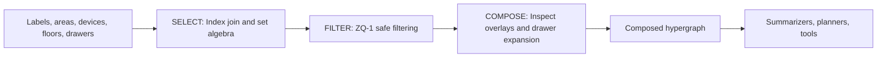
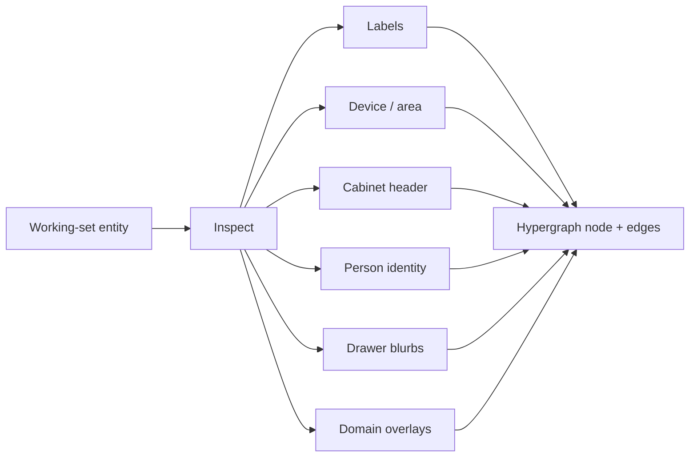
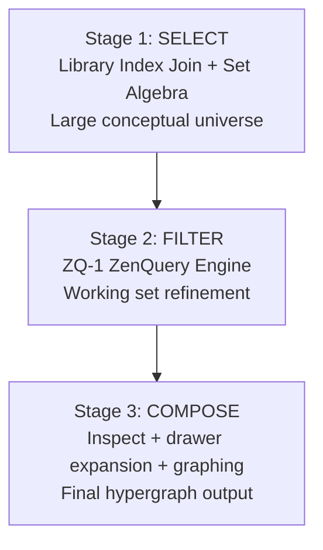

# Zen HyperIndex: Unified Selection, Filtering, and Composition Engine

The core structural reasoning substrate of ZenOS-AI.

The Zen HyperIndex (formal name: Zen DojoTools Index 4.x) transforms Home Assistant entities into structured hypergraphs used for contextual reasoning, planning, summarization, anomaly detection, and higher-order DojoTools.

Instead of treating entity selection as a flat list lookup, HyperIndex uses a three-stage pipeline:

1. SELECT — Library Index Join + Set Algebra

2. FILTER — ZQ-1 (ZenQuery Engine)

3. COMPOSE — Inspect + Metadata/Drawer Expansion

This architecture supports expressive targeting, deterministic outputs, and graph-aware reasoning within ZenOS-AI.

---

1. Stage One — SELECT

Library Index Join + Set Algebra (Graph-Surface Expansion)

The pipeline begins with broad, structured selection, intentionally performed before any filtering or metadata extraction.
This design allows HyperIndex to pull forward implicit relationships from the Library Index—relationships that do not yet exist as explicit graph edges until the final composition stage.

Because the hypergraph has not yet been constructed:

metadata relationships are unknown

drawer structures haven’t been read

adjacency and clusters do not yet exist

devices and entities have not been normalized

The selection stage compensates by enabling large, expressive set construction using:

AND

OR

NOT

XOR

nested expressions

drawer-based set expansion

label intersections

area intersections

multi-domain unions

This is sometimes referred to as the Index Join.

The purpose of constructing large initial sets is to give the system:

> a full conceptual surface from which the later hypergraph will emerge.

By assembling broad sets up front, the system can select based on intersections of conceptual edges—such as “all entities related to HVAC except sensors without metadata,” or “all motion-related devices on the security surface.”

The result of Stage One is the Selected Set, often intentionally large and rich with implicit structure.

---

2. Stage Two — FILTER

ZQ-1 (ZenQuery Engine): The WHERE Clause

Once Stage One has established the conceptual universe, the system applies ZQ-1, the schema-safe filtering layer.

ZQ-1 performs:

state filtering

numeric threshold filtering

regex matching

domain refinement

label refinement

area refinement

attribute validation

type inference

strict schema handling

guaranteed error-free execution

This step reduces the Selected Set to a Working Set, answering:

Which entities meet the numeric criteria?

Which entities are in the required state?

Which entities satisfy the label/domain constraints?

Which entities remain relevant based on context?

In SQL terms:

SELECT (Stage One)
WHERE  (Stage Two)

ZQ-1 guarantees deterministic, JSON-safe results regardless of malformed inputs.

---

3. Stage Three — COMPOSE

Inspect Overlay Composition + Drawer Traversal

After filtering, the Working Set flows into the Composition Layer, powered by `script.zen_dojotools_inspect`.

This stage extracts truth from Home Assistant and turns each entity into a layered object. Inspect is not just "metadata." It composes overlays:

| Overlay | What It Contributes |
|---|---|
| Base entity | Entity ID, domain, state, friendly name, timestamps |
| Label overlay | Semantic labels and label descriptions |
| Device/area overlay | Device ID, area, integration, optional device tree |
| Cabinet overlay | Header-only cabinet identity for cabinet sensor entities |
| Person overlay | ZenOS identity/presence block for `person.*` entities |
| Drawer blurbs | Label-targeted FileCabinet context snippets |
| Domain overlays | Tool-specific context such as camera cache or Room Manager room context |

Composition performs:

- entity attribute extraction
- device metadata extraction
- registry lookups
- domain and type mapping
- area and label resolution
- attribute normalization
- cabinet header recognition
- person identity overlay injection
- label-targeted drawer blurb retrieval
- domain overlay injection
- semantic relationship expansion
- adjacency list generation
- cluster formation
- final graph assembly

A cabinet sensor is a useful example. It is a real HA entity, but also a synthetic storage surface. Inspect treats it as an entity with a cabinet header overlay; FileCabinet remains the path for drawer contents. That lets HyperIndex reason that "this is a cabinet" without leaking the cabinet's private drawers into every graph expansion.

This stage transforms raw entities into a structured Hypergraph containing:

nodes

edges

clusters

metadata

surface relationships

This format is consumed by:

summarizers

planners

anomaly detectors

DojoTools

room-state interpreters

kata generators

the Monastery reasoning layer

The output of Stage Three is the Composed Hypergraph, ready for downstream reasoning.

---

Pipeline Overview

---

Component Summary

| Layer | File | Role |
|---|---|---|
| Selection Layer | `zen_dojotools_index` / HyperIndex inputs | Large-scale selection using labels, topology seeds, and set algebra |
| Filtering Layer | `custom_templates/zenos_ai/zen_query.jinja` | ZQ-1 safe filtering engine |
| Composition Layer | `script.zen_dojotools_inspect` | Overlay composition: labels, devices, person identity, cabinet headers, drawer blurbs, domain context |
| Cabinet Read Path | `script.zen_dojotools_filecabinet` | Drawer reads and label-targeted context snippets |
| Pipeline Orchestrator | `script.zen_dojotools_index` / `script.zen_dojotools_hyperindex` | Executes SELECT -> FILTER -> COMPOSE |

---

Future Development Plan

Several enhancements are planned to increase expressive power and unify complex behaviors into simpler, declarative operations.

1. Complete the Recursion Loop

Implement full recursive evaluation through:

nested SELECT blocks

nested set operations

per-level filtering

deep drawer hierarchical expansion

recursion until no additional set growth occurs

This will allow deeply structured entity selection based on multi-layered logic.

---

2. Add Inline ZQ Filtering to the Index Block

Integrate ZQ-1 directly into the Index command structure, enabling:

index:
  and:
    - label: hvac
    - area: living_room
  zq:
    numeric_above: 72
compose: true

This integrates Stage One and Stage Two into a single declarative block.

Benefits:

fewer tool calls

more natural agent prompting

simplified automation flows

unified Select → Filter → Compose semantics

---

3. Unified Single-Command Execution Pattern

Enable fully standalone HyperIndex calls such as:

index:
  xor:
    - area: office
    - area: garage
  zq:
    state_equals: "on"
compose: true

This produces:

a complete Selected Set

refined Working Set

and the final Composed Hypergraph

…in a single operation.

---

4. Inline Composition Controls

Allow callers to tune the composition stage:

compose:
  adjacency: true
  metadata: true
  drawers: false

This offers flexible graph outputs depending on downstream requirements.

---

5. Scoped Recursion Depth

Add support for controlling recursion depth:

max_depth: 3

Useful for controlling expansion in very large installations.

---

Conclusion

The Zen HyperIndex is a multi-stage reasoning engine that begins by constructing large, expressive conceptual sets, refines them through schema-safe filtering, and composes them into a structured hypergraph.

This architecture gives ZenOS-AI the ability to:

reason across domains

understand structural relationships

generate contextual plans

detect anomalies

summarize intelligently

and operate as a true agent within Home Assistant

The future evolution of HyperIndex focuses on recursion, inline filtering, single-command composition, and configurability—pushing ZenOS-AI toward increasingly powerful and expressive graph-driven reasoning.

---

## Cross-References

- [DojoTools Index](../scripts/zen_dojotools_index_readme.md) — current operational tool surface for index queries, topology seeds, pagination, camera context, and registry modes
- [DojoTools HyperIndex](../scripts/zen_dojotools_hyperindex_readme.md) — script-level input/output contract
- [ZQ-1 Query Patterns](zq1_patterns.md) — filter patterns used in the FILTER stage
- [DojoTools FileCabinet](../scripts/zen_dojotools_filecabinet_readme.md) — return path for drawer storage and valid drawer structure
- [Summarizer Overview](../zen_summarizer/readme.md) — primary consumer of composed graph context
